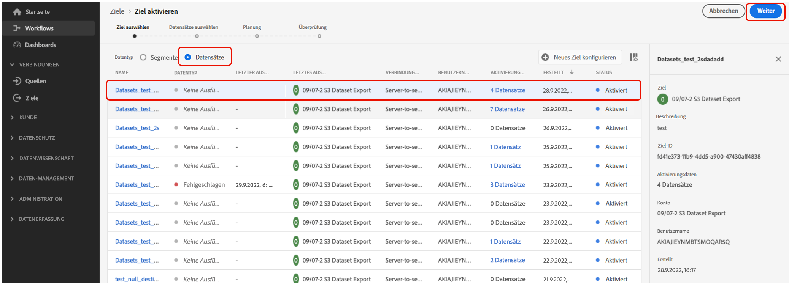
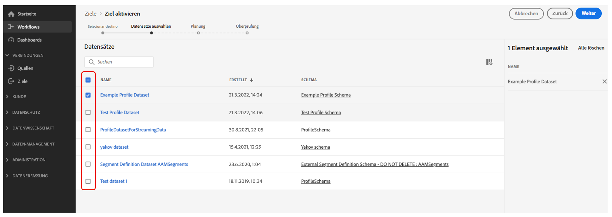

# Exportieren von Datensätzen zu Orten im Cloud-Speicher {#export-datasets}

>[!AVAILABILITY]
>
>Die Funktion zum Exportieren von Datensätzen befindet sich derzeit in der Beta-Phase und ist für alle Benutzenden von Adobe Journey Optimizer verfügbar. Bitte wenden Sie sich an den Adobe-Support, um Zugang zu Zielen zu erhalten, falls Sie noch keinen Zugang haben.

Journey Optimizer ermöglicht es Ihnen, eine Live-Verbindung mit Zielen im Cloud-Speicher herzustellen, um den Inhalt Ihrer Datensätze zu exportieren.

Indem Sie Ihre Daten regelmäßig exportieren, können Sie sicherstellen, dass Sie über eine vollständige und aktuelle Aufzeichnung Ihrer Kundeninteraktionen verfügen, diese Informationen zu Berichts- oder Analysezwecken verwenden und die gesetzlichen Bestimmungen einhalten.

## Unterstützte Cloud-Speicher-Ziele {#destinations}

Sie können Datensätze in 6 Cloud-Speicher-Ziele exportieren, auf die Sie über das Menü **[!UICONTROL Ziele]** auf der Registerkarte **[!UICONTROL Katalog]** zugreifen können.

>[!AVAILABILITY]
>
>Diese Ziele sind alle in der Beta-Version verfügbar und können möglicherweise geändert werden.

Detaillierte Informationen zu den einzelnen Zielen finden Sie in der Adobe Experience Platform-Dokumentation:

* [Amazon S3](https://experienceleague.adobe.com/docs/experience-platform/destinations/catalog/cloud-storage/amazon-s3.html?lang=de)
* [Azure Blob](https://experienceleague.adobe.com/docs/experience-platform/destinations/catalog/cloud-storage/azure-blob.html?lang=de)
* [Azure Data Lake Gen2](https://experienceleague.adobe.com/docs/experience-platform/destinations/catalog/cloud-storage/adls-gen2.html?lang=de)
* [Data Landing Zone](https://experienceleague.adobe.com/docs/experience-platform/destinations/catalog/cloud-storage/data-landing-zone.html?lang=de)
* [Google Cloud Storage](https://experienceleague.adobe.com/docs/experience-platform/destinations/catalog/cloud-storage/google-cloud-storage.html?lang=de)
* [SFTP](https://experienceleague.adobe.com/docs/experience-platform/destinations/catalog/cloud-storage/sftp.html?lang=de)

## Voraussetzungen {#prerequisites}

Überprüfen Sie die folgenden Voraussetzungen, bevor Sie mit dem Exportieren Ihrer Datensätze beginnen:

* Zum Exportieren von Datensätzen benötigen Sie die [Zugriffssteuerungsberechtigungen](https://experienceleague.adobe.com/docs/experience-platform/access-control/home.html?lang=de#permissions) **Ziele verwalten**, **Ziele anzeigen**, **Ziele aktivieren** und **Datensatzziele verwalten und aktivieren** Lesen Sie die [Übersicht über die Zugriffskontrolle](https://experienceleague.adobe.com/docs/experience-platform/access-control/ui/overview.html?lang=de) oder wenden Sie sich an Ihren Produktadministrator, um die erforderlichen Berechtigungen zu erhalten.

* Diese Funktion unterstützt nur den Export von Daten der ersten Generation, d. h. von Rohdaten, wie in der [Produktbeschreibung der Real-Time Customer Data Platform](https://helpx.adobe.com/de/legal/product-descriptions/real-time-customer-data-platform-b2c-edition-prime-and-ultimate-packages.html) definiert. Stellen Sie sicher, dass der Datensatz, den Sie exportieren möchten, keine Daten der zweiten Generation enthält.

## Die wichtigsten Schritte zum Exportieren von Datensätzen {#main-steps}

Die wichtigsten Schritte zum Exportieren eines Datensatzes in einen Cloud-Speicherort sind:

Detaillierte Informationen zu den einzelnen Schritten finden Sie in der Adobe Experience Platform-Dokumentation [Exportieren von Datensätzen zu Cloud-Speicher-Zielen](https://experienceleague.adobe.com/docs/experience-platform/destinations/ui/activate/export-datasets.html?lang=de).

1. **Einrichten des Cloud-Speicher-Ziels**. Falls Sie dies noch nicht getan haben, stellen Sie eine Verbindung zu einem Cloud-Speicher-Ziel aus dem Zielkatalog her. [Erfahren Sie, wie Sie eine neue Zielverbindung erstellen](https://experienceleague.adobe.com/docs/experience-platform/destinations/ui/connect-destination.html?lang=de#setup)

   <!---->

1. **Wählen Sie das Cloud-Speicher-Ziel aus**, wohin Sie Ihre Datensätze exportieren möchten. Klicken Sie im Zielkatalog auf die Schaltfläche **[!UICONTROL Datensätze exportieren]** auf der gewünschten Karte und wählen Sie die zu verwendende Verbindung.

   <!---->

   >[!NOTE]
   >
   >Wenn Sie Adobe Journey Optimizer zusammen mit Echtzeit-Kundenprofilen verwenden, wird auf den Zielkarten eine Schaltfläche „Aktivieren“ angezeigt, mit der Sie sowohl Datensätze exportieren als auch Segmente für dieses Ziel aktivieren können, je nachdem, welche Berechtigungen Sie aktiviert haben.

1. **Wählen Sie die Datensätze aus**, die Sie an das ausgewählte Ziel exportieren möchten.

   <!---->

1. **Planen Sie den Export** Ihres Datensatzes. Geben Sie an, wann der Export beginnen soll und mit welcher Häufigkeit er erfolgen soll.

   <!---->

1. **Überprüfen und bestätigen Sie den Export**, indem Sie die Zusammenfassung durchgehen, die am Ende der Konfiguration angezeigt wird.

   <!---->

Sobald der Export abgeschlossen ist, wird der Inhalt des Datensatzes gemäß dem konfigurierten Zeitplan am Cloud-Speicherort abgelegt. [Informationen zum erfolgreichen Überprüfen eines Datensatzexports](https://experienceleague.adobe.com/docs/experience-platform/destinations/ui/activate/export-datasets.html?lang=de#verify)
