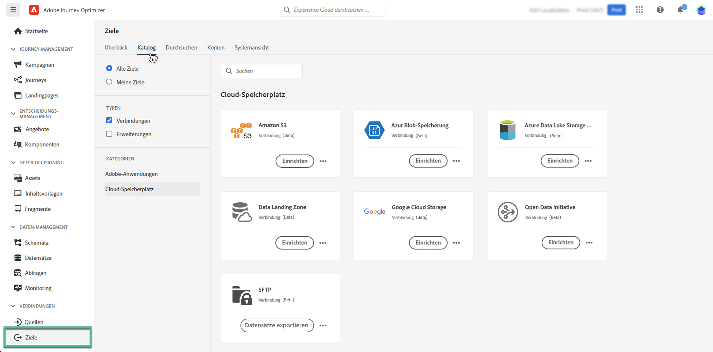

# Exportieren von Datensätzen zu Orten im Cloud-Speicher {#export-datasets}

Journey Optimizer ermöglicht es Ihnen, eine Live-Verbindung mit Zielen im Cloud-Speicher herzustellen, um den Inhalt Ihrer Datensätze zu exportieren.

Durch den periodischen Export Ihrer Daten können Sie sicherstellen, dass Sie über einen vollständigen und aktuellen Datensatz Ihrer Kundeninteraktionen verfügen, sodass diese jederzeit für Berichte, Archivierungen oder Datenanalysen verfügbar sind.

## Unterstützte Cloud-Speicher-Ziele {#destinations}

Sie können Datensätze in 6 Cloud-Speicher-Ziele exportieren, auf die Sie über das Menü **[!UICONTROL Ziele]** auf der Registerkarte **[!UICONTROL Katalog]** zugreifen können.

>[!AVAILABILITY]
>
>Diese Ziele sind alle in der Beta-Version verfügbar und können möglicherweise geändert werden.

Detaillierte Informationen zu den einzelnen Zielen finden Sie in der Adobe Experience Platform-Dokumentation:

* [Amazon S3](https://experienceleague.adobe.com/docs/experience-platform/destinations/catalog/cloud-storage/amazon-s3.html?lang=de)
* [Azure Blob](https://experienceleague.adobe.com/docs/experience-platform/destinations/catalog/cloud-storage/azure-blob.html?lang=de)
* [Azure Data Lake Gen2](https://experienceleague.adobe.com/docs/experience-platform/destinations/catalog/cloud-storage/adls-gen2.html?lang=de)
* [Data Landing Zone](https://experienceleague.adobe.com/docs/experience-platform/destinations/catalog/cloud-storage/data-landing-zone.html?lang=de)
* [Google Cloud Storage](https://experienceleague.adobe.com/docs/experience-platform/destinations/catalog/cloud-storage/google-cloud-storage.html?lang=de)
* [SFTP](https://experienceleague.adobe.com/docs/experience-platform/destinations/catalog/cloud-storage/sftp.html?lang=de)

## Für den Export verfügbare Journey Optimizer-Datensätze {#datasets}

Verstehen Sie anhand der Tabelle, unter welcher Journey Optimizer-Datensätze Sie je nach Produktstufe exportieren können (siehe [Journey Optimizer-Produktbeschreibung](https://helpx.adobe.com/de/legal/product-descriptions/adobe-journey-optimizer.html){target="_blank"}) |Datensatz|Beschreibung|Tier| | — | — | — | | AJO BCC Feedback Event Datensatz | AJO BCC Feedback Event Datensatz | Prime | | AJO-Klassifizierungsdatensatz | Datensatz für die Aufnahme von E-Mail- und Push-App-Feedback-Ereignissen aus Journey Optimizer. Erstellt über SDK. | Prime | | Datensatz des AJO-Einverständnisdienstes | Speichert Einverständnisinformationen eines Profils. | Prime | | AJO-E-Mail-Tracking-Erlebnis-Datensatz | Interaktionsprotokolle für den E-Mail-Kanal, die für Berichte- und Zielgruppenerstellungszwecke verwendet werden.  | Prime | | AJO-Entitätsdatensatz | Datensatz zum Speichern von Entitätsmetadaten für Nachrichten, die an den Endbenutzer gesendet werden.  | Prime | | Ereignisdatensatz für eingehende AJO-Aktivitäten | Datensatz für Journey Optimizer-Web- und In-App-Kanäle für Versand- und Interaktionsereignisse. | Prime | | AJO Interactive Messaging Profile Datensatz | Speichert Profile, die erstellt wurden, um API-gesteuerte Kampagnen zu unterstützen. | Prime | | AJO-Nachrichten-Feedback-Ereignis-Datensatz | Versandlogs der Nachrichten. Informationen über den gesamten Nachrichtenversand von Journey Optimizer zu Zwecken des Reportings und der Zielgruppenerstellung. In diesem Datensatz wird auch das Feedback von E-Mail-ISPs zu Bounces aufgezeichnet. | Prime | | AJO Profile Counters-Erweiterung | Enthält eine Zuordnung von Objekten, die &quot;counter_value&quot;und &quot;iryDate&quot;enthalten, die von &quot;counter_id&quot;eingegeben wurden | Prime | | AJO Push Profile DataSet | Speichert Push-Token eines Profils. | Prime | | AJO Push Tracking Experience Event Datensatz | Interaktionsprotokolle für den Push-Kanal, die für Berichte und die Erstellung von Zielgruppen verwendet werden.  | Prime | | AJO-Oberflächen-Datensatz | Leerer Datensatz im Zusammenhang mit dem Schema &quot;Eingehende Journey Optimizer-Oberflächen&quot; | Prime | | AOOutputForUPSDataset | Enthält alle AO-Zielgruppenmitgliedschaften, die in UPS zurückgeschrieben werden sollen | Prime | | Datensatz des Zielgruppen-Orchestrierungsprofils | Wird durch die Zielgruppenkomposition für Zielgruppen der Zielgruppenkomposition generiert. Enthält alle Audience COmposition-Zielgruppen, ihre Attribute und Anreicherungsdaten | Prime | | Decision Object Repository - Aktivitäten | auch als Entscheidungen in der Benutzeroberfläche bezeichnet. Dies sind jedoch die Objekte, die ein Benutzer erstellt, die alle Bausteine zusammenführen, einschließlich der Entscheidungslogik. Beispielsweise für eine bestimmte Platzierung (Position), welche Angebote (Angebotskollektion) berücksichtigt werden sollen und welche Rangmethode für diese Angebote verwendet werden soll. | Ultimate | | Decision Object Repository - Fallback-Angebote | Dies ist das Repository für den anderen Angebotstyp, den ein Benutzer erstellt. Insbesondere wenn sie nicht berechtigt sind, ein personalisiertes Angebot zu sehen, und etwas sehen müssen, sehen sie zumindest das Fallback-Angebot. Dieser Datensatz enthält die Attribute für diesen Angebotstyp | Ultimate | | Decision Object Repository - Personalisierte Angebote | Dies ist das Repository für einen Angebotstyp, den ein Benutzer erstellt. Dieser Datensatz enthält also die Attribute zu diesem Angebotstyp | Ultimate | | Decision Object Repository - Platzierungen | Dies ist das Repository von Objekten, die den Speicherort definieren, an dem ein Angebot angezeigt werden soll. | Ultimate | | Journey-Schrittereignisse | Erfasst alle von Journey Optimizer generierten Journey-Schritt-Erlebnisereignisse, die von Diensten wie Berichten genutzt werden können. | Prime | | JOURNEY | Informationen zum Metadaten-Datensatzgehäuse für jeden Schritt in einer Journey | Prime | | ODE DecisionEvents - prod decisioning | Jedes Mal, wenn wir eine auf einer Anfrage basierende Entscheidung treffen, zählen wir dies als Entscheidungsereignis | Ultimate |

## Voraussetzungen {#prerequisites}

Zum Exportieren von Datensätzen benötigen Sie die [Zugriffssteuerungsberechtigungen](https://experienceleague.adobe.com/docs/experience-platform/access-control/home.html?lang=de#permissions) unten aufgeführt. Lesen Sie die [Übersicht über die Zugriffskontrolle](https://experienceleague.adobe.com/docs/experience-platform/access-control/ui/overview.html?lang=de) oder wenden Sie sich an Ihren Produktadministrator, um die erforderlichen Berechtigungen zu erhalten.

| Kategorie | Berechtigung |
|--|--|
| Ziele | Verwalten und Aktivieren von Datensatzzielen |
| Data Management | Anzeigen von Datensätzen |
| Ziele | Anzeigen von Zielen |

## Die wichtigsten Schritte zum Exportieren von Datensätzen {#main-steps}

Die wichtigsten Schritte zum Exportieren eines Datensatzes in einen Cloud-Speicherort sind:

Detaillierte Informationen zu den einzelnen Schritten finden Sie in der Adobe Experience Platform-Dokumentation [Exportieren von Datensätzen zu Cloud-Speicher-Zielen](https://experienceleague.adobe.com/docs/experience-platform/destinations/ui/activate/export-datasets.html?lang=de).

1. **Einrichten des Cloud-Speicher-Ziels**. Falls Sie dies noch nicht getan haben, stellen Sie eine Verbindung zu einem Cloud-Speicher-Ziel aus dem Zielkatalog her. [Erfahren Sie, wie Sie eine neue Zielverbindung erstellen](https://experienceleague.adobe.com/docs/experience-platform/destinations/ui/connect-destination.html?lang=de#setup)

   <!---->

1. **Wählen Sie das Cloud-Speicher-Ziel aus**, wohin Sie Ihre Datensätze exportieren möchten. Klicken Sie im Zielkatalog auf die Schaltfläche **[!UICONTROL Datensätze exportieren]** auf der gewünschten Karte und wählen Sie die zu verwendende Verbindung.

   <!---->

   >[!NOTE]
   >
   >Wenn Sie Adobe Journey Optimizer zusammen mit Echtzeit-Kundenprofilen verwenden, wird auf den Zielkarten die Schaltfläche „Aktivieren“ angezeigt, mit der Sie abhängig von den aktivierten Berechtigungen sowohl Datensätze exportieren als auch Zielgruppen für dieses Ziel aktivieren können.

1. **Wählen Sie die Datensätze aus**, die Sie an das ausgewählte Ziel exportieren möchten. [Weitere Informationen zu zum Exportieren verfügbaren Journey Optimizer-Datensätzen](#datasets)

   <!---->

1. **Planen Sie den Export** Ihres Datensatzes. Geben Sie an, wann der Export beginnen soll und mit welcher Häufigkeit er erfolgen soll.

   <!---->

1. **Überprüfen und bestätigen Sie den Export**, indem Sie die Zusammenfassung durchgehen, die am Ende der Konfiguration angezeigt wird.

   <!---->

Sobald der Export abgeschlossen ist, wird der Inhalt des Datensatzes gemäß dem konfigurierten Zeitplan am Cloud-Speicherort abgelegt. [Informationen zum erfolgreichen Überprüfen eines Datensatzexports](https://experienceleague.adobe.com/docs/experience-platform/destinations/ui/activate/export-datasets.html?lang=de#verify)
