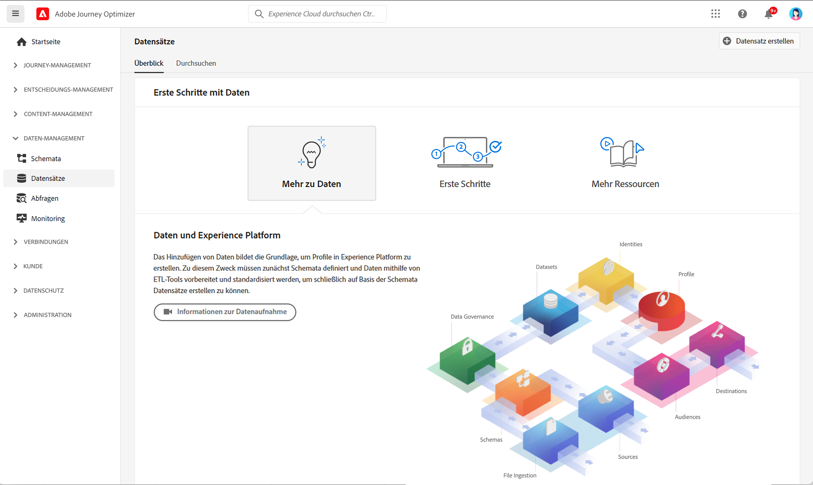
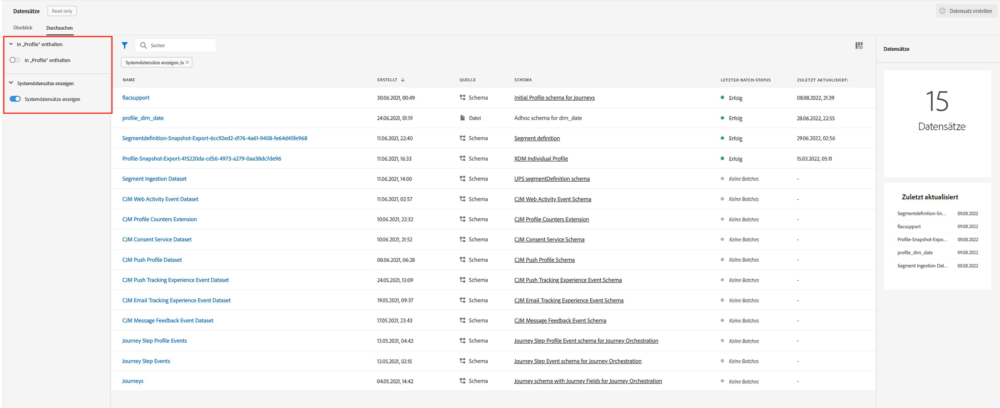
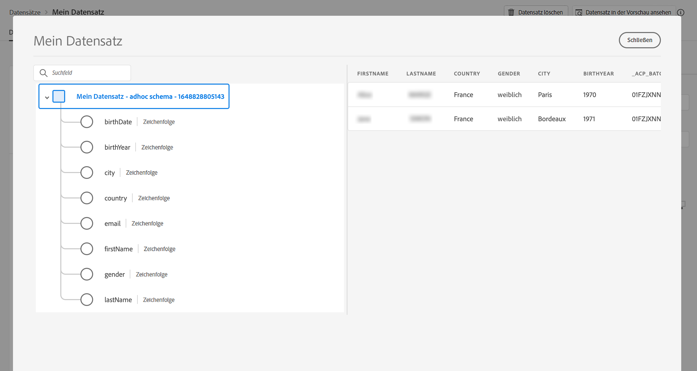

# Erste Schritte mit Datensätzen {#datasets-gs}

Alle Daten, die in Adobe Experience Platform aufgenommen werden, bleiben als Datensätze im Data Lake erhalten. Ein Datensatz ist ein Konstrukt zur Datenspeicherung und -verwaltung, in dem Daten (in der Regel) in einer Tabelle erfasst werden, die ein Schema (Spalten) und Felder (Zeilen) beinhaltet.

## Zugriff auf Datensätze{#access-datasets}

Der Arbeitsbereich **Datensätze** in der [!DNL Adobe Journey Optimizer]-Benutzeroberfläche ermöglicht es Ihnen, Daten zu durchsuchen und Datensätze zu erstellen.

Wählen Sie **Datensätze** im linken Navigationsbereich aus, um das Dashboard „Datensätze“ zu öffnen.

Das Hinzufügen von Daten zu [!DNL Adobe Experience Platform] bildet die Grundlage für die Erstellung eines Profils. Anschließend können Sie Profile in [!DNL Adobe Journey Optimizer] nutzen. Definieren Sie zunächst Schemas, verwenden Sie ETL-Tools, um Ihre Daten vorzubereiten und zu standardisieren, und erstellen Sie dann Datensätze basierend auf Ihren Schemas.

Wählen Sie die Registerkarte **Durchsuchen**, um die Liste aller für Ihr Unternehmen verfügbaren Datensätze anzuzeigen. Zu jedem aufgelisteten Datensatz werden Details angezeigt, einschließlich seines Namens, des Schemas, dem der Datensatz entspricht, und des Status des letzten Aufnahmelaufs.

Standardmäßig werden nur die Datensätze angezeigt, die Sie aufgenommen haben. Wenn Sie die systemgenerierten Datensätze anzeigen möchten, aktivieren Sie im Filter den Umschalter **Systemdatensätze zeigen**.

Wählen Sie den Namen eines Datensatzes aus, um auf seinen Datensatzaktivitäts-Bildschirm zuzugreifen und Details zum ausgewählten Datensatz anzuzeigen. Die Registerkarte „Aktivität“ enthält ein Diagramm, das die Rate der konsumierten Nachrichten sowie eine Liste erfolgreicher und fehlgeschlagener Batches visuell darstellt.

Im Folgenden finden Sie die verschiedenen verfügbaren Datensätze:

**Reporting**

* _Reporting – Datensatz mit Nachrichten-Feedback-Ereignissen_: Versand-Logs der Nachrichten. Informationen über den gesamten Nachrichtenversand von Journey Optimizer zu Zwecken des Reportings und der Segmenterstellung. In diesem Datensatz wird auch das Feedback von E-Mail-ISPs zu Bounces aufgezeichnet.
* _Reporting – E-Mail-Tracking-Erlebnis-Ereignisdatensatz_: Interaktionsprotokolle für den E-Mail-Kanal, der zu Zwecken des Reportings und der Segmenterstellung genutzt wird. Die gespeicherten Informationen geben Aufschluss über die von Endbenutzenden durchgeführten Aktionen in Bezug auf E-Mails (Öffnungen, Klicks usw.).
* _Reporting – Push-Tracking-Erlebnis-Ereignisdatensatz_: Interaktionsprotokolle für den Push-Kanal, der zu Zwecken des Reportings und der Segmenterstellung genutzt wird. Die gespeicherten Informationen geben Aufschluss über die von Endbenutzenden durchgeführten Aktionen bei Push-Benachrichtigungen.
* _Reporting – Journey-Schrittereignis_: Erfasst alle von Journey Optimizer generierten Journey-Schritt-Erlebnisereignisse, die von Services wie Reporting genutzt werden können. Auch wichtig für die Erstellung von Berichten in Customer Journey Analytics für die Jahresanalyse. An Journey-Metadaten gebunden.
* _Reporting – Journeys_: Metadaten-Datensatz, der Informationen zu jedem Schritt in einer Journey enthält.
* _Reporting – BCC_: Feedback-Ereignis-Datensatz, in dem die Versand-Logs für BCC-E-Mails gespeichert werden. Wird zu Reporting-Zwecken verwendet.

**Einverständnis**

* _Einverständnis-Service-Datensatz_: speichert die Einverständnisinformationen eines Profils.

**Intelligent Services**

* _Sendezeit-Optimierungsbewertungen/Interaktionswerte_: Ausgabebewertungen der Journey-KI.

## Vorschau von Datensätzen{#preview-datasets}

Wählen Sie im Datensatzaktivitäts-Bildschirm rechts oben die Option **Vorschau des Datensatzes anzeigen** aus, um eine Vorschau des zuletzt erfolgreichen Batches in diesem Datensatz anzuzeigen. Wenn ein Datensatz leer ist, wird der Vorschau-Link deaktiviert.

## Erstellen von Datensätzen{#create-datasets}

Um einen neuen Datensatz zu erstellen, klicken Sie im Dashboard „Datensätze“ auf die Option **Datensatz erstellen**.

Sie haben folgende Möglichkeiten:

* Datensatz aus Schema erstellen. [Weitere Informationen finden Sie in dieser Dokumentation](https://experienceleague.adobe.com/docs/experience-platform/catalog/datasets/user-guide.html?lang=de#schema){target="_blank"}
* Datensatz aus CSV-Datei erstellen. [Weitere Informationen finden Sie in dieser Dokumentation](https://experienceleague.adobe.com/docs/experience-platform/ingestion/tutorials/map-a-csv-file.html?lang=de){target="_blank"}

In diesem Video erfahren Sie, wie Sie einen Datensatz erstellen, ihn einem Schema zuordnen, ihm Daten hinzufügen und bestätigen, dass die Daten aufgenommen wurden.

>[!VIDEO](https://video.tv.adobe.com/v/334293?quality=12)

## Data Governance

Sie können in einem Datensatz die Registerkarte **Data Governance** durchsuchen, um Kennzeichnungen auf Datensatz- und Feldebene zu überprüfen. Mit Data Governance werden Daten entsprechend dem anzuwendenden Richtlinientyp kategorisiert.

Eine der Kernfunktionen von [!DNL Adobe Experience Platform] ist es, Daten aus verschiedenen Unternehmenssystemen zusammenzuführen, damit Marketing-Experten Kunden besser identifizieren, verstehen und ansprechen können. Diese Daten können Nutzungsbeschränkungen unterliegen, die von Ihrem Unternehmen oder durch gesetzliche Bestimmungen festgelegt werden. Daher müssen Sie dafür sorgen, dass Ihre Datenoperationen die entsprechenden Datennutzungsrichtlinien einhalten.

Mit [!DNL Adobe Experience Platform Data Governance] können Sie Kundendaten verwalten und bei der Verwendung von Daten die Einhaltung von relevanten Vorschriften, Einschränkungen und Richtlinien sicherstellen. Die Funktion spielt in Experience Platform auf verschiedenen Ebenen eine wichtige Rolle, wie z. B. bei Katalogisierung, Ermittlung der Datenherkunft, Datennutzungsbezeichnung, Datennutzungsrichtlinien und Steuerung der Nutzung von Daten für Marketing-Aktionen.

Weitere Informationen zu Data Governance und Datennutzungskennzeichnungen finden Sie in der Dokumentation zu [Data Governance](https://experienceleague.adobe.com/docs/experience-platform/data-governance/labels/user-guide.html?lang=de){target="_blank"}

## Beispiele und Anwendungsfälle{#uc-datasets}

In diesem [vollständigen Beispiel](../segment/creating-test-profiles.md) erfahren Sie, wie Sie ein Schema und einen Datensatz erstellen und Daten aufnehmen, um Testprofile in Adobe Journey Optimizer hinzuzufügen.

Weitere Informationen zur Erstellung von Datensätzen finden Sie in der [Dokumentation zu Adobe Experience Platform](https://experienceleague.adobe.com/docs/experience-platform/catalog/datasets/overview.html?lang=de){target="_blank"}.

Erfahren Sie, wie Sie die Benutzeroberfläche &quot;Datensätze&quot;im [Dokumentation zur Datenerfassung - Übersicht](https://experienceleague.adobe.com/docs/experience-platform/ingestion/home.html?lang=de){target="_blank"}.

Eine Liste der Anwendungsfälle mit Abfragebeispielen ist [hier](../data/datasets-query-examples.md) verfügbar.

**Siehe auch**

* [Streaming-Erfassung – Übersicht](https://experienceleague.adobe.com/docs/experience-platform/ingestion/streaming/overview.html?lang=de){target="_blank"}
* [Daten in Adobe Experience Platform erfassen](https://experienceleague.adobe.com/docs/experience-platform/ingestion/tutorials/ingest-batch-data.html?lang=de){target="_blank"}
