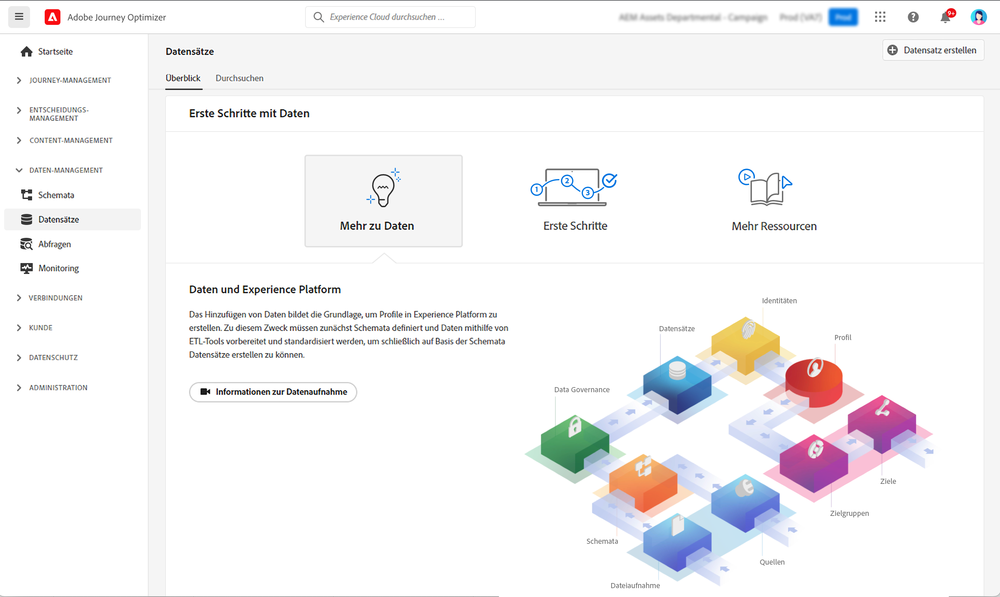

# Erste Schritte mit Datensätzen {#datasets-gs}

Alle Daten, die in Adobe Experience Platform aufgenommen werden, bleiben als Datensätze im Data Lake erhalten. Ein Datensatz ist ein Konstrukt zur Datenspeicherung und -verwaltung, in dem Daten (in der Regel) in einer Tabelle erfasst werden, die ein Schema (Spalten) und Felder (Zeilen) beinhaltet.

## Leitlinien und Einschränkungen

* Seit dem 1. November 2024 werden Senden- und Öffnen-Ereignisse aus Tracking- und Feedback-[!DNL Journey Optimizer]Datensätzen nicht mehr durch die Streaming-Segmentierung unterstützt. Verwenden Sie stattdessen Geschäftsregeln, um die Frequenzbegrenzung oder die Ermüdungsverwaltung zu implementieren. Weitere Informationen finden Sie in [diesem Abschnitt](../conflict-prioritization/rule-sets.md), eine Erklärung zu Anwendungsfällen für die tägliche Begrenzung finden Sie [hier](https://experienceleaguecommunities.adobe.com/t5/journey-optimizer-blogs/elevate-customer-experience-with-daily-frequency-capping-in-ajo/ba-p/761510?profile.language=de){target="_blank"}.

* Ab Februar 2025 wird für systemgenerierte Journey Optimizer-Datensätze ein Time-to-Live-Schutzmechanismus (TTL) eingeführt. [Weitere Informationen](datasets-ttl.md)

## Zugriff auf Datensätze {#access}

Der Arbeitsbereich **Datensätze** in der [!DNL Adobe Journey Optimizer]-Benutzeroberfläche ermöglicht es Ihnen, Daten zu erkunden und Datensätze zu erstellen. Um das Dashboard „Datensätze“ zu öffnen, wählen Sie im linken Navigationsbereich die Option **Datensätze** aus.

Wählen Sie die Registerkarte **Durchsuchen**, um die Liste aller für Ihr Unternehmen verfügbaren Datensätze anzuzeigen. Für jeden aufgeführten Datensatz werden Details angezeigt, einschließlich seines Namens, des Schemas, dem der Datensatz entspricht, und des Status der letzten Aufnahmeausführung. Standardmäßig werden nur die Datensätze angezeigt, die Sie aufgenommen haben. Wenn Sie die systemgenerierten Datensätze anzeigen möchten, aktivieren Sie im Filter den Umschalter **Systemdatensätze zeigen**.

Wählen Sie den Namen eines Datensatzes aus, um auf seinen Datensatzaktivitäts-Bildschirm zuzugreifen und Details zum ausgewählten Datensatz anzuzeigen. Die Registerkarte „Aktivität“ enthält ein Diagramm, das die Rate der konsumierten Nachrichten sowie eine Liste erfolgreicher und fehlgeschlagener Batches visuell darstellt.

Um eine Vorschau eines Datensatzes anzuzeigen, wählen Sie die Option **Datensatz in der Vorschau ansehen** in der rechten oberen Ecke Ihres Bildschirms aus, um die Vorschau des letzten erfolgreichen Batches in diesem Datensatz anzuzeigen. Wenn ein Datensatz leer ist, ist der Vorschau-Link nicht aktiv.

## Systemdatensätze in [!DNL Journey Optimizer] {#system-datasets}

In diesem Abschnitt werden die von [!DNL Journey Optimizer] verwendeten Systemdatensätze aufgelistet. Die vollständige Liste der Felder und Attribute für jedes Schema finden Sie im [Journey Optimizer-Schemawörterbuch](https://experienceleague.adobe.com/tools/ajo-schemas/schema-dictionary.html?lang=de){target="_blank"}.

>[!CAUTION]
>
> Systemdatensätze **dürfen nicht geändert werden**. Jede Änderung wird bei jeder Produktaktualisierung automatisch rückgängig gemacht.

* Reporting

   * _Reporting – Datensatz mit Nachrichten-Feedback-Ereignissen_: Versand-Logs der Nachrichten. Informationen über den gesamten Nachrichtenversand von Journey Optimizer zu Zwecken des Reportings und der Zielgruppenerstellung. In diesem Datensatz wird auch das Feedback von E-Mail-ISPs zu Bounces aufgezeichnet.
   * _Reporting – E-Mail-Tracking-Erlebnisereignis-Datensatz_: Interaktionsprotokolle für den E-Mail-Kanal, der zu Zwecken des Reportings und der Zielgruppenerstellung genutzt wird. Die gespeicherten Informationen geben Aufschluss über die von Endbenutzenden durchgeführten Aktionen in Bezug auf E-Mails (Öffnungen, Klicks usw.).
   * _Reporting – Push-Tracking-Erlebnisereignis-Datensatz_: Interaktionsprotokolle für den Push-Kanal, der zu Zwecken des Reportings und der Zielgruppenerstellung genutzt wird. Die gespeicherten Informationen geben Aufschluss über die von Endbenutzenden durchgeführten Aktionen bei Push-Benachrichtigungen.
   * _Reporting – Journey-Schrittereignis_: Erfasst alle von Journey Optimizer generierten Journey-Schritt-Erlebnisereignisse, die von Services wie Reporting genutzt werden können. Auch wichtig für die Erstellung von Berichten in Customer Journey Analytics für die Jahresanalyse. An Journey-Metadaten gebunden.
   * _Reporting – Journeys_: Metadaten-Datensatz, der Informationen zu jedem Schritt in einer Journey enthält.
   * _Reporting – BCC_: Feedback-Ereignis-Datensatz, in dem die Versand-Logs für BCC-E-Mails gespeichert werden. Wird zu Reporting-Zwecken verwendet.

* Einverständnis

  _Einverständnis-Service-Datensatz_: speichert die Einverständnisinformationen eines Profils.

* Nachrichtenexport

  _Exportdatensatz für AJO-Nachrichten_: Speichert den Inhalt gesendeter E-Mails und SMS-Nachrichten zu Exportzwecken. Datensätze werden 7 Kalendertage nach der Aufnahme aufbewahrt. Nur für Organisationen verfügbar, die das Add-on „Nachrichtenexport“ erworben haben. [Weitere Informationen](../configuration/message-export.md)

* Intelligent Services

  _Sendezeit-Optimierungsbewertungen/Interaktionswerte_: Ausgabebewertungen der Journey-KI.

## Erstellen von Datensätzen{#create-datasets}

Das Hinzufügen von Daten zu [!DNL Adobe Experience Platform] bildet die Grundlage für die Erstellung eines Profils. Anschließend können Sie Profile in [!DNL Adobe Journey Optimizer] nutzen. Definieren Sie zunächst Schemata, verwenden Sie ETL-Tools, um Ihre Daten vorzubereiten und zu standardisieren, und erstellen Sie dann Datensätze basierend auf Ihren Schemata.

Sie können einen Datensatz aus einem Schema oder einer CSV-Datei erstellen. Ausführliche Informationen zum Erstellen von Datensätzen finden Sie in der Dokumentation zu [!DNL Adobe Experience Platform]:

* [Erstellen eines Datensatzes mit einem vorhandenen Schema](https://experienceleague.adobe.com/de/docs/experience-platform/catalog/datasets/user-guide#schema){target="_blank"}
* [Zuordnen einer CSV-Datei zu einem vorhandenen XDM-Schema](https://experienceleague.adobe.com/de/docs/experience-platform/ingestion/tutorials/map-csv/existing-schema){target="_blank"}

In diesem Video erfahren Sie, wie Sie einen Datensatz erstellen, ihn einem Schema zuordnen, ihm Daten hinzufügen und bestätigen, dass die Daten aufgenommen wurden.

>[!VIDEO](https://video.tv.adobe.com/v/334293?quality=12)

## Data Governance

Sie können in einem Datensatz die Registerkarte **Data Governance** durchsuchen, um Kennzeichnungen auf Datensatz- und Feldebene zu überprüfen. Mit Data Governance werden Daten entsprechend dem anzuwendenden Richtlinientyp kategorisiert.

Eine der Kernfunktionen von [!DNL Adobe Experience Platform] ist es, Daten aus verschiedenen Unternehmenssystemen zusammenzuführen, damit Marketing-Experten Kunden besser identifizieren, verstehen und ansprechen können. Diese Daten können Nutzungsbeschränkungen unterliegen, die von Ihrem Unternehmen oder durch gesetzliche Bestimmungen festgelegt werden. Daher müssen Sie dafür sorgen, dass Ihre Datenoperationen die entsprechenden Datennutzungsrichtlinien einhalten.

Mit [!DNL Adobe Experience Platform Data Governance] können Sie Kundendaten verwalten und bei der Verwendung von Daten die Einhaltung von relevanten Vorschriften, Einschränkungen und Richtlinien sicherstellen. Die Funktion spielt in Experience Platform auf verschiedenen Ebenen eine wichtige Rolle, wie z. B. bei Katalogisierung, Ermittlung der Datenherkunft, Datennutzungsbezeichnung, Datennutzungsrichtlinien und Steuerung der Nutzung von Daten für Marketing-Aktionen.

Weitere Informationen zu Data Governance und Datennutzungskennzeichnungen finden Sie in der [Dokumentation zur Data Governance](https://experienceleague.adobe.com/docs/experience-platform/data-governance/labels/user-guide.html?lang=de){target="_blank"}.

## Beispiele und Anwendungsfälle {#samples}

* [Tutorial – Aufnehmen von Daten in Adobe Experience Platform](https://experienceleague.adobe.com/docs/experience-platform/ingestion/tutorials/ingest-batch-data.html?lang=de){target="_blank"}
* [End-to-End-Anwendungsfall](../audience/creating-test-profiles.md) – Erstellen eines Schemas oder eines Datensatzes und Aufnehmen von Daten zum Hinzufügen von Testprofilen in [!DNL Adobe Journey Optimizer]
* [Abfragebeispiele](../data/datasets-query-examples.md) – [!DNL Adobe Journey Optimizer]-Datensätze und zugehörige Anwendungsfälle.

>[!MORELIKETHIS]
>
>* [Dokumentation zu Datensätzen](https://experienceleague.adobe.com/docs/experience-platform/catalog/datasets/overview.html?lang=de){target="_blank"}
>* [Dokumentation zur Datenaufnahme](https://experienceleague.adobe.com/docs/experience-platform/ingestion/home.html?lang=de){target="_blank"}.
>* [Best Practices für die Verwaltung von Daten im Rahmen von Lizenzberechtigungen](https://experienceleague.adobe.com/de/docs/experience-platform/landing/license/data-management-best-practices#data-management-best-practices){target="_blank"}
