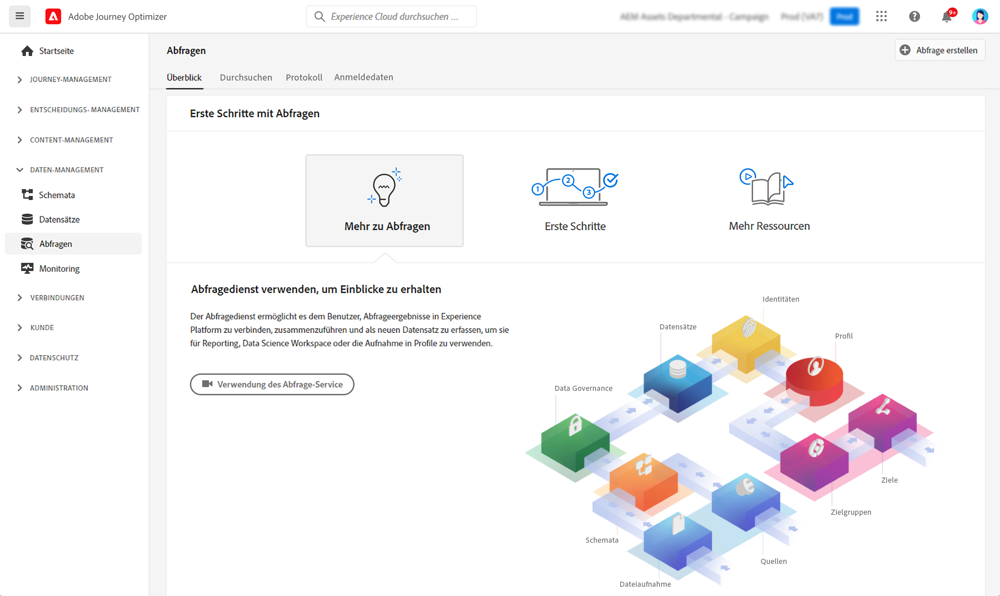

# Erste Schritte mit Abfragen {#queries-gs}

Abfrage-Editor ist ein interaktives Tool von Adobe Experience Platform Query Service, mit dem Sie in der [!DNL Adobe Journey Optimizer]-Benutzeroberfläche Abfragen für Kundenerlebnisdaten schreiben, validieren und ausführen können.

Der Abfrage-Editor unterstützt die Entwicklung von Abfragen für die Analyse und Datenexploration und ermöglicht Ihnen das Ausführen interaktiver Abfragen für Entwicklungszwecke sowie nicht interaktiver Abfragen zum Auffüllen von [Datensätzen](get-started-datasets.md).

[In dieser Dokumentation](https://experienceleague.adobe.com/docs/experience-platform/query/ui/user-guide.html?lang=de){target="_blank"} finden sich Hinweise zur Verwendung vom Abfrage-Editor.

**Siehe auch**

* [Dokumentation zum Abfrage-Service](https://experienceleague.adobe.com/docs/experience-platform/query/home.html?lang=de){target="_blank"}
* [Übersichtsvideo zum Abfrage-Service](https://experienceleague.adobe.com/docs/platform-learn/tutorials/queries/understanding-query-service.html?lang=de){target="_blank"}
