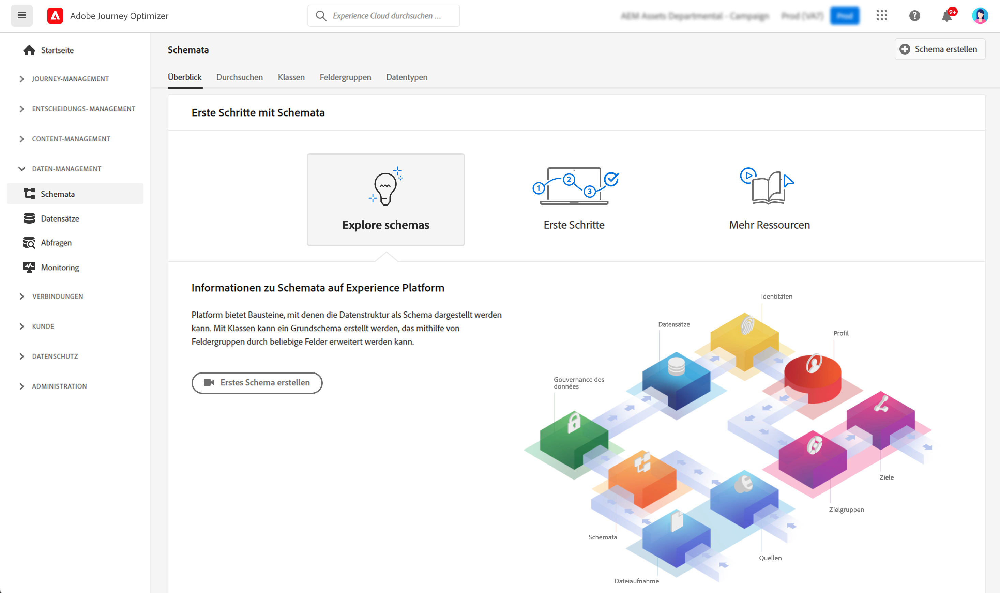

# Erste Schritte mit Schemata {#schemas-gs}

Schemata sind die Standardmethode zur Beschreibung von Daten in Experience Platform. Dadurch können alle Daten, die mit Schemata konform sind, innerhalb einer Organisation ohne Konflikte wiederverwendet oder sogar von mehreren Organisationen gemeinsam genutzt werden.

➡️ [In diesem Video erfahren Sie, wie Sie ein Schema erstellen und konfigurieren](#video-schema) (Video)

Ein Schema ist ein Regelsatz, der die Datenstruktur und das Datenformat darstellt und überprüft. Auf hoher Ebene bieten Schemata eine abstrakte Definition eines realen Objekts (z. B. einer Person) und legen dar, welche Daten in jeder Instanz dieses Objekts enthalten sein sollen (z. B. Vorname, Nachname, Geburtsdatum usw.).

Erfahren Sie in [dieser Dokumentation](https://experienceleague.adobe.com/docs/experience-platform/xdm/schema/composition.html?lang=de){target="_blank"}, wie Sie Schemata erstellen

Der Arbeitsbereich **Schemata** in der [!DNL Adobe Journey Optimizer]-Benutzeroberfläche ermöglicht Ihnen die Verwaltung von XDM-Ressourcen (Experience-Datenmodell), einschließlich Schemata, Klassen, Schemafeldern und Datentypen. Sie können die von Adobe bereitgestellten Kernressourcen anzeigen und untersuchen sowie benutzerdefinierte Ressourcen und Schemata für Ihr Unternehmen erstellen.

Erfahren Sie in [dieser Dokumentation](https://experienceleague.adobe.com/docs/experience-platform/xdm/ui/overview.html?lang=de){target="_blank"}, wie Sie die Benutzeroberfläche für Schemata verwenden

Eine schrittweise Dokumentation zum Erstellen eines Schemata mit dem Schema-Editor finden Sie auf [dieser Seite](https://experienceleague.adobe.com/docs/experience-platform/xdm/tutorials/create-schema-ui.html?lang=de){target="_blank"}

Die vollständige Liste der Felder und Attribute für jedes Schema finden Sie im [Journey Optimizer-Schemawörterbuch](https://experienceleague.adobe.com/tools/ajo-schemas/schema-dictionary.html?lang=de){target="_blank"}.

## Anleitungsvideo{#video-schema}

Erfahren Sie, wie Sie ein Schema erstellen, Feldergruppen hinzufügen, benutzerdefinierte Feldergruppen erstellen und konfigurieren.

>[!VIDEO](https://video.tv.adobe.com/v/334461?quality=12)

**Siehe auch**

* [Erstellen eines Schemata und eines Datensatzes und Aufnehmen von Daten zum Hinzufügen von Testprofilen in Journey Optimizer](../audience/creating-test-profiles.md)
* [XDM-System – Übersicht](https://experienceleague.adobe.com/docs/experience-platform/xdm/home.html?lang=de){target="_blank"}
* [Best Practices für die Datenmodellierung](https://experienceleague.adobe.com/docs/experience-platform/xdm/schema/best-practices.html?lang=de){target="_blank"}
* [Erstellen eines Schemata mithilfe der Schema Registry-API](https://experienceleague.adobe.com/docs/experience-platform/xdm/tutorials/create-schema-api.html?lang=de){target="_blank"}
* [Definieren einer Beziehung zwischen zwei Schemata mithilfe des Schema-Editors](https://experienceleague.adobe.com/docs/experience-platform/xdm/tutorials/relationship-ui.html?lang=de){target="_blank"}
