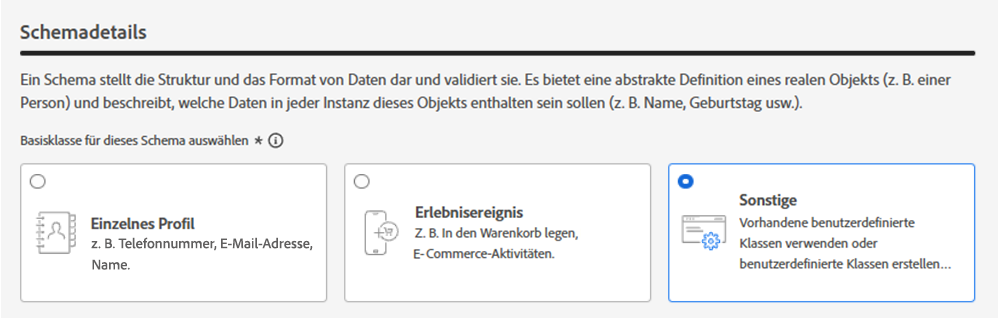
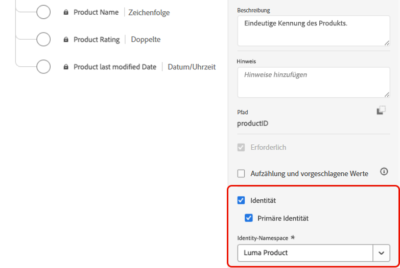
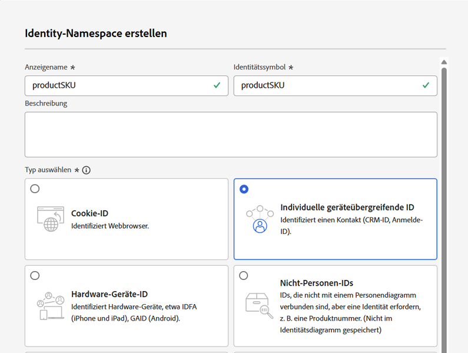
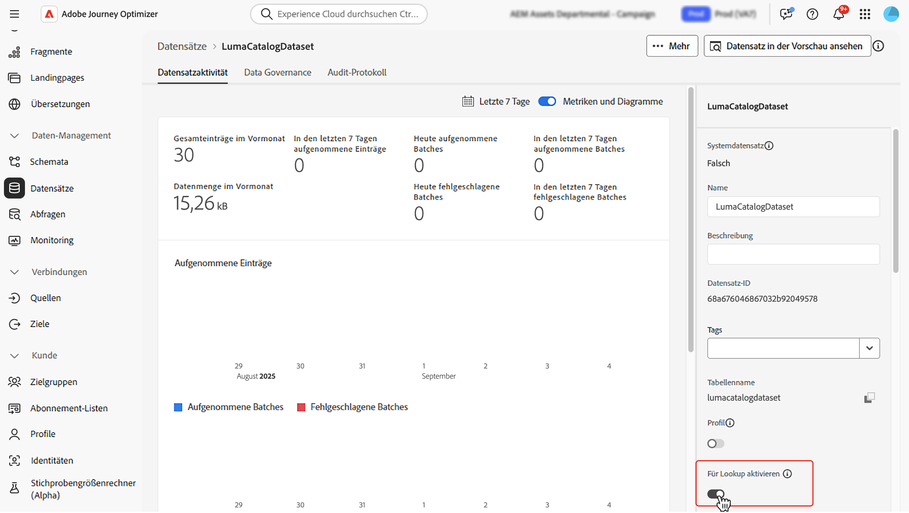
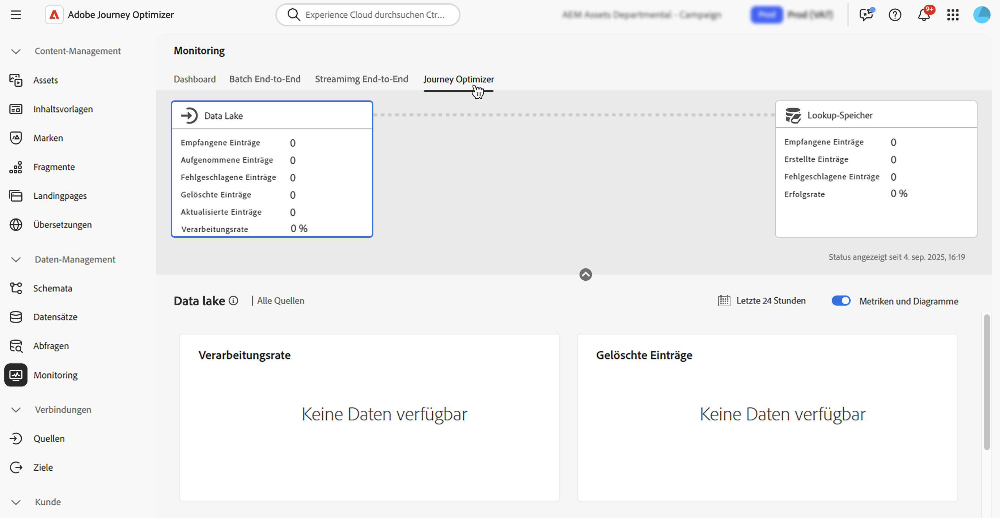

# Verwenden von Adobe Experience Platform-Daten {#aep-data}

>[!CONTEXTUALHELP]
>id="lookup-aep-data"
>title="Für Lookup aktivieren"
>abstract="Durch die Aktivierung eines Datensatzes für die Suche können Sie dessen Daten mit den Funktionen für Personalisierung, Entscheidungsfindung und Journey-Orchestrierung von Journey Optimizer nutzen."

Mit [!DNL Journey Optimizer] können Sie Daten aus [!DNL Adobe Experience Platform] mit Funktionen für Personalisierung, Entscheidungsfindung und Journey-Orchestrierung nutzen. Hierzu müssen auf Einträgen basierende Datensätze, die für die Personalisierung der Suche erforderlich sind, zunächst wie nachfolgend beschrieben für den Suchdienst aktiviert werden. 

>[!NOTE]
>
>Die Datensuchfunktion ist nur für ausgewählte Organisationen verfügbar (eingeschränkte Verfügbarkeit). Um Zugriff zu erhalten, wenden Sie sich an den Adobe-Support. Weitere Informationen zu [Verfügbarkeitskennzeichnungen](../rn/releases.md#availability-labels).

Weitere Informationen darüber, wie Sie auf Datensätze zugreifen und damit arbeiten, finden Sie in diesem Abschnitt: [Erste Schritte mit Datensätzen](../data/get-started-datasets.md)

## Wichtige Informationen

### Leitlinien und Richtlinien {#guidelines}

Bevor Sie beginnen, lesen Sie sich die folgenden Einschränkungen und Richtlinien durch:

* **Keine personenbezogenen Daten in Datensätzen**: Für die Suche aktivierte Datensätze sollten keine personenbezogenen Daten (PII) enthalten.

* **Löschrisiko**: In der Personalisierung verwendete Datensätze sind nicht vor dem Löschen geschützt. Sie müssen verfolgen, welche Datensätze verwendet werden, um sicherzustellen, dass sie nicht entfernt werden.

* **Schematyp**: Datensätze müssen mit einem Schema verknüpft sein, das **NICHT** vom Typ „Profil“ oder „Ereignis“ ist.

* **Ständig aktivierte Suchoption**: Vermeiden Sie die wiederholte Aktivierung und Deaktivierung von Datensätzen. Dies kann zu unerwartetem Indizierungsverhalten führen. Es empfiehlt sich, den Datensatz so lange aktiviert zu lassen, wie Sie ihn für Suchen verwenden möchten.

* **Edge-Aktivierungsregion** - Datensätze, die für die Suche aktiviert sind, sind nur für die eingehende Edge-basierte Aktivierung in der Region verfügbar, in der sich die Sandbox des Datensatzes befindet (z. B. NLD2 oder VA7). Der Sandbox-Bereich wird in der Benutzeroberfläche neben dem Sandbox-Namen angezeigt.

* **Löschen eines Daten-Batches**: Wenn Sie einen Batch von Daten aus Ihrem Datensatz entfernen, werden alle übereinstimmenden Schlüssel vollständig aus dem Suchdienst entfernt. Beispiel:

  **Batch 1**: Sku1, Sku2, Sku3\
  **Batch 2**: Sku1, Sku2, Sku3, Sku4, Sku5, Sku6\
  **Batch 3**: Sku7, Sku8, Sku9, Sku10

  Wenn Sie **Batch 1** löschen, werden Sku1, Sku2 und Sku3 aus dem Suchspeicher entfernt. Die resultierenden Suchdaten enthalten dann: Sku4, Sku5, Sku6, Sku7, Sku8, Sku9, Sku10.

* **Keine verketteten Suchen**: Datensatzsuchen können nicht verkettet werden. Anders ausgedrückt können Sie das Ergebnis einer Suche nicht als Variable verwenden, die dann zum Schlüssel für eine zweite Suche wird.

### Berechtigung für den Suchdienst

| Funktionskomponente | Beschränkungen | Anmerkungen |
| ------- | ------- | ------- |
| Datensätze für die Suche aktiviert | Max. 10 pro Organisation | Maximale Anzahl von Datensätzen, die zu einem Zeitpunkt für die Suche konfiguriert werden können. Diese Begrenzung gilt für die Gesamtzahl der kombinierten Suchdatensätze in Produktions- und Entwicklungs-Sandboxes innerhalb der Kundeninstanz. |
| Anzahl der Datensatzeinträge | Bis zu 2 Millionen Einträge pro Datensatz | Maximal zulässige Anzahl von Einträgen in einem einzelnen Datensatz, berechnet als Gesamtanzahl aller Batches innerhalb dieses Datensatzes. |
| Eintragsgröße | Bis zu 2 KB pro Eintrag | Standardmäßig unterstützte maximale Eintragsgröße. |
| Datensatzgröße | Bis zu 4 GB | Maximale Größe eines einzelnen Datensatzes, nicht die kombinierte Größe aller Datensätze in einer Sandbox. Die Begrenzung der Eintragsanzahl und der Datensatzgröße sind unabhängige Schutzmechanismen – beide müssen erfüllt sein. |
| Aktualisierungen der Datensatzfrequenz | Bis zu 5 Aktualisierungen pro Tag und Datensatz | Maximal zulässige Häufigkeit von Aktualisierungsvorgängen für einen einzelnen Datensatz pro Tag. |

>[!NOTE]
>
>Wenn über die oben aufgeführten Schutzmechanismen hinaus zusätzliche Volumen benötigt werden, wenden Sie sich an den Adobe-Support.

## Aktivieren eines Datensatzes für Datensuchen {#enable}

Um Daten aus Ihrem Datensatz für die Personalisierung nutzen zu können, müssen Sie den Datensatz für die Suche aktivieren.

### Voraussetzungen {#prerequisites-enable}

Das mit Ihrem Datensatz verknüpfte Schema, das Sie für die Suche aktivieren möchten, muss vom Typ „Eintrag“ sein. Das Schema darf NICHT der Profil- oder Ereignisklasse angehören.

+++Beispiel



+++

Für das Schema muss eine primäre Identität definiert sein.

+++Beispiel



+++

Wenn noch kein benutzerdefinierter Namespace definiert wurde, stellen Sie sicher, dass die Identität eine Nicht-Personen-Kennung ist.

+++Beispiel



+++

### Aktivieren des Datensatzes für die Suche in der Oberfläche zur Datensatzverwaltung

Verwenden Sie in der Benutzeroberfläche zur Datensatzverwaltung den Umschalter, um den Datensatz für die Suche zu aktivieren.



### API-Methode

Befolgen Sie die Anweisungen in [dieser Dokumentation](https://developer.adobe.com/journey-optimizer-apis/references/authentication/), um Ihre Umgebung für das Senden von API-Befehlen zu konfigurieren.

#### Voraussetzungen

* Für das Entwicklerprojekt müssen die Adobe Journey Optimizer- und Adobe Experience Platform-APIs zum Projekt hinzugefügt werden.

  

* Sie müssen über die Berechtigung zum Verwalten von Datensätzen als Teil Ihrer Rolle verfügen.

* Das Schema, auf dem der Datensatz basiert, muss eine primäre Identität enthalten, die als Suchschlüssel fungieren kann.

#### API-Aufrufstruktur

```shell
curl -s -XPATCH "https://platform.adobe.io/data/core/entity/lookup/dataSets/${DATASET_ID}/${ACTION}" \ -H "Authorization: Bearer ${ACCESS_TOKEN}" \ -H "x-api-key: ${API_KEY}" \ -H "x-gw-ims-org-id: ${IMS_ORG}" \ -H "x-sandbox-name: ${SANDBOX_NAME}" 
```

Dabei gilt:

* Die URL lautet `https://platform.adobe.io/data/core/entity/lookup/dataSets/${DATASET_ID}/${ACTION}`
* „Dataset ID“ ist der Datensatz, den Sie aktivieren möchten.
* „Action“ ist „Aktivieren“ ODER „Deaktivieren“.
* „Access token“ kann aus der Developer Console abgerufen werden.
* „API Key“ kann aus der Developer Console abgerufen werden.
* „IMS Org ID“ ist Ihre Adobe-Organisation.
* „Sandbox Name“ ist der Name der Sandbox, in der sich der Datensatz befindet (d. h. prod, dev usw.).

>[!NOTE]
>
>Wenn beim Durchführen eines API-Aufrufs zum Aktivieren von Datensätzen der folgende Fehler auftritt, versuchen Sie, die Adobe Journey Optimizer-APIs aus Ihrem Developer Console-Projekt zu entfernen und sie dann erneut hinzuzufügen.
>
>`"error_code": "403003",`
>`"message": "Api Key is invalid"`

## Datensatz-Monitoring

Sobald ein Datensatz für die Suche aktiviert wurde, können Sie den Status der Aufnahme in den Suchdienst überprüfen, indem Sie das Menü **[!UICONTROL Monitoring]** aufrufen und die Registerkarte **[!UICONTROL Journey Optimizer]** auswählen.

Diese Prozessanzeige hilft zu verstehen, wenn neue Daten-Batches im Suchdienst verfügbar sind.



## Nächste Schritte

Nachdem ein Datensatz mithilfe eines API-Aufrufs für die Suche aktiviert wurde, können Sie seine Daten mit [!DNL Journey Optimizer]-Funktionen zur Personalisierung und Entscheidungsfindung verwenden. Weitere Informationen finden Sie in den folgenden Abschnitten:

* [Verwenden von Adobe Experience Platform-Daten für die Personalisierung](../personalization/aep-data-perso.md)
* [Verwenden von Adobe Experience Platform-Daten für die Entscheidungsfindung](../experience-decisioning/aep-data-exd.md)
* [Verwenden von Adobe Experience Platform-Daten für die Journey-Orchestrierung](../building-journeys/dataset-lookup.md)
