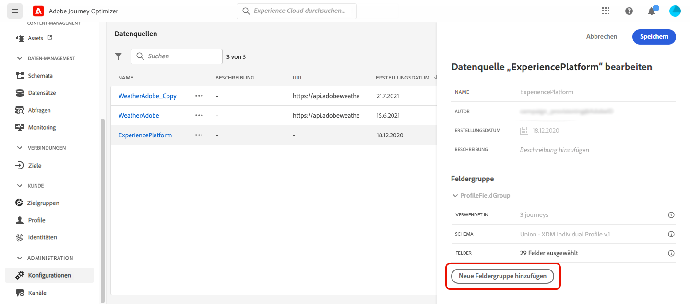

# Datenquelle von Adobe Experience Platform {#adobe-experience-platform-data-source}

>[!BEGINSHADEBOX]

**Auf dieser Seite:** Sie Feldergruppen in der integrierten Adobe Experience Platform-Datenquelle ein, damit Sie Echtzeit-Kundenprofildaten in Ihren Journey abrufen und verwenden können.

>[!ENDSHADEBOX]

>[!CONTEXTUALHELP]
>id="ajo_journey_data_source_built_in"
>title="Datenquelle von Adobe Experience Platform"
>abstract="Die Adobe Experience Platform-Datenquelle definiert die Verbindung zum Echtzeit-Kundenprofil von Adobe. Diese Datenquelle ist integriert und vorkonfiguriert und kann nicht gelöscht werden. Sie dient zum Abrufen und Verwenden von Daten aus dem Echtzeit-Kundenprofil-Service (Sie können damit beispielsweise überprüfen, ob es sich bei einer Person, die in eine Journey eingetreten ist, um eine Frau handelt)."

Die Adobe Experience Platform-Datenquelle definiert die Verbindung zum Echtzeit-Kundenprofil von Adobe. Diese Datenquelle ist integriert und vorkonfiguriert und kann nicht gelöscht werden. Diese Datenquelle dient zum Abrufen und Verwenden von Daten aus dem Echtzeit-Kundenprofildienst (überprüfen Sie beispielsweise, ob es sich bei der Person, die in eine Journey eingetreten ist, um eine Frau handelt). Weitere Informationen zum Adobe Echtzeit-Kundenprofil finden Sie in der [Dokumentation zu Adobe Experience Platform](https://experienceleague.adobe.com/docs/experience-platform/profile/home.html?lang=de){target="_blank"}.

Um die Verbindung zum Echtzeit-Kundenprofildienst zu ermöglichen, müssen wir einen Schlüssel zur Identifizierung einer Person und einen Namespace verwenden, der den Schlüssel kontextualisiert. Daher können Sie diese Datenquelle nur verwenden, wenn Ihre Journeys mit einem Ereignis beginnen, das einen Schlüssel und einen Namespace enthält. [Weitere Informationen](../building-journeys/journey.md).

Sie können die vorkonfigurierte Feldergruppe mit dem Namen „ProfileFieldGroup“ bearbeiten, neue hinzufügen und diejenigen entfernen, die nicht in Entwurfs- oder Live-Journeys verwendet werden. [Weitere Informationen](../datasource/configure-data-sources.md#define-field-groups).

>[!CAUTION]
>
>Die Verwendung von Erlebnisereignissen in Journey-Ausdrücken/-Bedingungen wird nicht unterstützt. Wenn Ihr Anwendungsfall die Verwendung von Erlebnisereignissen erfordert, sollten Sie alternative Methoden in Betracht ziehen. [Weitere Informationen](../building-journeys/exp-event-lookup.md)

Im Folgenden finden Sie die wichtigsten Schritte, um der integrierten Datenquelle Feldergruppen hinzuzufügen:

1. Wählen Sie in der Liste der Datenquellen die integrierte Datenquelle von **Adobe Experience Platform** aus.

   Dadurch wird der Konfigurationsbereich für die Datenquelle auf der rechten Seite des Bildschirms geöffnet.

   

1. Wählen Sie **[!UICONTROL Neue Feldergruppe hinzufügen]** aus, um eine [neue Reihe von Feldern zum Abrufen](../datasource/configure-data-sources.md#define-field-groups) zu definieren.

   

1. Wählen Sie ein Schema aus der Dropdown-Liste **[!UICONTROL Schema]** aus. Die Schemaerstellung erfolgt in Adobe Experience Platform, nicht in Adobe Journey Optimizer.

   >[!NOTE]
   >
   >In der [!DNL Journey Optimizer] Data Source-Konfiguration werden nur XDM Individual Profile-basierte Schemata unterstützt. Weitere Informationen finden Sie unter [Klasse „XDM Individual Profile](https://experienceleague.adobe.com/en/docs/experience-platform/xdm/classes/individual-profile){target="_blank"}.

1. Wählen Sie die zu verwendenden Felder aus und speichern Sie Ihre Änderungen.

>[!TIP]
>
>Bewegen Sie den Mauszeiger über den Namen einer Feldergruppe, um zwei Symbole auf der rechten Seite anzuzeigen. Verwenden Sie diese zum **Duplizieren** oder **Löschen** der Feldergruppe. Beachten Sie, dass das Symbol **[!UICONTROL Löschen]** nur verfügbar ist, wenn die Feldergruppe in keiner **Live**- oder **Entwurfs**-Journey und in keiner **abgeschlossenen** Journey verwendet wird. Überprüfen Sie im Feld **[!UICONTROL Verwendet in]**, ob dies der Fall ist.
