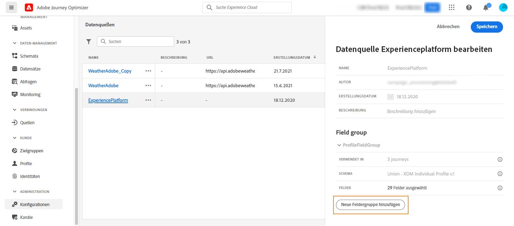

# Datenquelle von Adobe Experience Platform {#adobe-experience-platform-data-source}

>[!CONTEXTUALHELP]
>id="ajo_journey_data_source_built_in"
>title="Datenquelle von Adobe Experience Platform"
>abstract="Die Datenquelle von Adobe Experience Platform definiert die Verbindung zum Echtzeit-Kundenprofil-Service. Diese Datenquelle ist integriert und vorkonfiguriert. Sie kann nicht gelöscht werden. Diese Datenquelle dient zum Abrufen und Verwenden von Daten aus dem Echtzeit-Kundenprofildienst (überprüfen Sie beispielsweise, ob es sich bei der Person, die an einer Journey teilnimmt, um eine Frau handelt). Sie ermöglicht Ihnen die Verwendung von Profildaten und Erlebnisereignisdaten."

Die Datenquelle von Adobe Experience Platform definiert die Verbindung zum Echtzeit-Kundenprofil-Service. Diese Datenquelle ist integriert und vorkonfiguriert. Sie kann nicht gelöscht werden. Diese Datenquelle dient zum Abrufen und Verwenden von Daten aus dem Echtzeit-Kundenprofildienst (überprüfen Sie beispielsweise, ob es sich bei der Person, die an einer Journey teilnimmt, um eine Frau handelt). Sie ermöglicht Ihnen die Verwendung von Profildaten und Erlebnisereignisdaten. Weitere Informationen zum Echtzeit-Kundenprofil-Service finden Sie in der [Dokumentation zu Adobe Experience Platform](https://experienceleague.adobe.com/docs/experience-platform/profile/home.html?lang=de){target=&quot;_blank&quot;}.

>[!NOTE]
>
>Sie können die 1.000 neuesten Erlebnisereignisse abrufen, die vor weniger als einem Jahr erstellt wurden.

Um die Verbindung zum Echtzeit-Kundenprofildienst zu ermöglichen, müssen wir einen Schlüssel zur Identifizierung einer Person und einen Namespace verwenden, der den Schlüssel kontextualisiert. Daher können Sie diese Datenquelle nur verwenden, wenn Ihre Journeys mit einem Ereignis beginnen, das einen Schlüssel und einen Namespace enthält. Weitere Informationen finden Sie auf [dieser Seite](../building-journeys/journey.md).

Sie können die vorkonfigurierte Feldergruppe mit dem Namen „ProfileFieldGroup“ bearbeiten, neue hinzufügen und diejenigen entfernen, die nicht in Entwurfs- oder Live-Journeys verwendet werden. Weitere Informationen finden Sie auf [dieser Seite](../datasource/configure-data-sources.md#define-field-groups).

Im Folgenden finden Sie die wichtigsten Schritte, um der integrierten Datenquelle Feldergruppen hinzuzufügen.

1. Wählen Sie in der Liste der Datenquellen die integrierte Datenquelle von Adobe Experience Platform aus.

   Dadurch wird der Konfigurationsbereich für die Datenquellen auf der rechten Seite des Bildschirms geöffnet.

   

1. Klicken Sie auf **[!UICONTROL Neue Feldergruppe hinzufügen]**, um eine neue Reihe von Feldern zum Abrufen zu definieren. Weitere Informationen finden Sie auf [dieser Seite](../datasource/configure-data-sources.md#define-field-groups).

   

1. Wählen Sie ein Schema aus der Dropdown-Liste **[!UICONTROL Schema]** aus. In diesem Feld werden die in Adobe Experience Platform verfügbaren Profil- und Erlebnisereignisschemas aufgelistet. Die Schemaerstellung wird nicht in [!DNL Journey Optimizer] durchgeführt. Sie wird in Adobe Experience Platform durchgeführt.
1. Wählen Sie die Felder aus, die Sie verwenden möchten.
1. Klicken Sie auf **[!UICONTROL Speichern]**.

Wenn Sie den Cursor auf dem Namen einer Feldergruppe platzieren, werden rechts zwei Symbole angezeigt. Damit können Sie die Feldergruppe löschen und duplizieren. Beachten Sie, dass das Symbol **[!UICONTROL Löschen]** nur verfügbar ist, wenn die Feldergruppe in keiner Live- oder Entwurfs-Journey verwendet wird (die Information wird im Feld **[!UICONTROL Verwendet in]** angezeigt).
