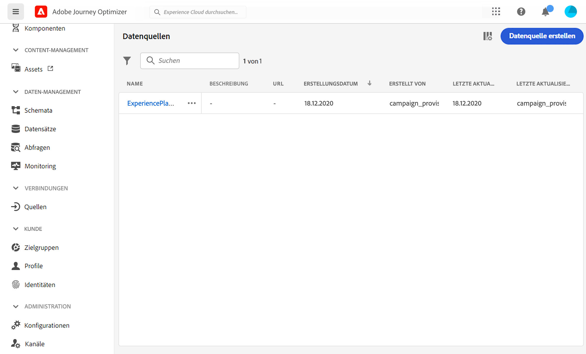
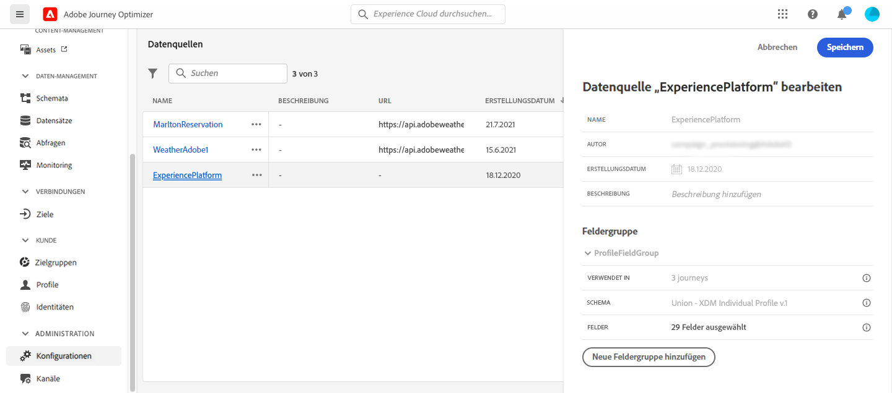
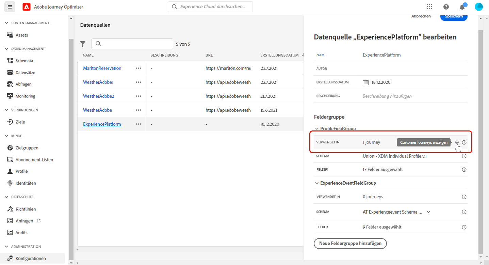

# Konfigurieren einer Datenquelle {#configure-data-source}

>[!NOTE]
>
>Die Konfiguration von Datenquellen wird immer von einem **technischen Benutzer“**.

Gehen Sie wie folgt vor, um eine Datenquelle zu konfigurieren:

1. Wählen Sie im Menüabschnitt ADMINISTRATION die Option **[!UICONTROL Konfigurationen]** aus. Klicken Sie **[!UICONTROL Abschnitt &quot;]**&quot; auf **[!UICONTROL Verwalten]**. Die Liste der Datenquellen wird angezeigt. Weitere [ zur Benutzeroberfläche finden ](../start/user-interface.md) auf dieser Seite .

   

1. Anschließend können Sie entweder Feldergruppen zur integrierten Datenquelle hinzufügen (siehe [diese Seite](../datasource/adobe-experience-platform-data-source.md) oder eine neue externe Datenquelle erstellen (siehe [diese Seite](../datasource/external-data-sources.md)) und zugehörige Feldergruppen (siehe [diese Seite](../datasource/configure-data-sources.md#define-field-groups)).

   

1. Klicken Sie **[!UICONTROL Speichern]**.

   Die Datenquelle ist jetzt konfiguriert und kann in Ihren Journey verwendet werden.

## Feldergruppen definieren {#define-field-groups}

Feldergruppen sind Gruppen von Feldern, die Sie aus einer Datenquelle abrufen und auf einer Journey verwenden können.

Für jede Datenquelle können Sie mehrere Feldergruppen definieren.

Sie können beispielsweise eine Feldergruppe mit der Telefonnummer, der E-Mail-Adresse, dem Vornamen und der Adresse des Profils erstellen. Anschließend können Sie diese Daten auf Ihrem Journey verwenden, um Bedingungen zu erstellen. Beispielsweise können Sie entscheiden, eine Push-Benachrichtigung nur dann zu senden, wenn der Kunde die Mobile App installiert hat. Wenn es leer ist, können Sie eine E-Mail senden.

Auch wenn automatisch ein Standardname hinzugefügt wird, empfehlen wir, Ihrer Feldergruppe einen Namen zu geben. Tatsächlich ist der Name der Feldergruppe für andere Benutzende in [!DNL Journey Optimizer] sichtbar. Es empfiehlt sich, den Feldergruppen einen relevanten Namen zu geben.

Wenn ein Datenquellenfeld auf einer Journey verwendet wird, ruft das System alle für diese Feldergruppe definierten Felder ab. Es empfiehlt sich daher, nur die Felder auszuwählen, die für die Journey benötigt werden. Dadurch wird die Anfragelatenz in Ihren Journey reduziert und somit die Leistung gesteigert. Beachten Sie, dass Sie später einfach weitere Felder in Feldergruppen hinzufügen können.

Die Anzahl der Journey, die eine Feldergruppe verwenden, wird im Feld **[!UICONTROL Verwendet in]** angezeigt. Sie können auf die Schaltfläche **[!UICONTROL Journey anzeigen]** klicken, um die Liste der Journey mit dieser Feldergruppe anzuzeigen.

>[!NOTE]
>
>Beachten Sie, dass Feldergruppen ohne Felder nicht im Ausdruckseditor angezeigt werden.

## Lebenszyklus von Feldergruppen {#field-group-lifecycle}

Sie können Felder zu einer Feldergruppe hinzufügen oder daraus entfernen, die nicht auf Entwurfs- oder Live-Journey verwendet wird.

Wenn die Feldergruppe in einem oder mehreren Entwurfs- oder Live-Journey verwendet wird, können Sie inkrementell neue Felder aus dem ausgewählten Schema hinzufügen, aber nicht die Auswahl bereits ausgewählter Felder aufheben/entfernen/ändern. Aktualisierungen einer Feldergruppe sind nicht zulässig, wenn vorhandene Schemafelder, die bereits von Entwurfs- oder Live-Journey verwendet werden, geändert werden - z. B. durch Ändern des Datentyps eines Felds. Dadurch wird verhindert, dass Journey zerstört werden

Gehen Sie wie folgt vor, um ein Feld aus einer Feldergruppe zu löschen, die in einem oder mehreren Journey verwendet wird. Nehmen wir als Beispiel eine Feldergruppe mit dem Namen „Feldergruppe A“.

1. Platzieren Sie den Cursor in der Liste der Feldergruppen auf „Feldergruppe A“ und klicken Sie auf **[!UICONTROL Symbol „Duplizieren]** auf der rechten Seite. Benennen Sie die duplizierte Feldergruppe mit „Feldergruppe B“, z. B. .
1. Entfernen Sie in „Feldergruppe B“ die nicht mehr gewünschten Felder.
1. Überprüfen Sie unter „Feldergruppe A“, wo diese Feldergruppe verwendet wird. Diese Informationen werden im Feld **[!UICONTROL Verwendet in]** angezeigt.
1. Öffnen Sie alle Journey, die „Feldergruppe A“ verwenden.
1. Erstellen Sie neue Versionen für jede dieser Journey. Bearbeiten Sie alle Aktivitäten mit „Feldergruppe A“ und wählen Sie „Feldergruppe B“ aus.
1. Beenden Sie alte Versionen von Journey, die „Feldergruppe A“ verwenden. Sie sollten dann keine Journey mit „Feldergruppe A“ haben.
1. Entfernen Sie „Feldergruppe A“, da sie nicht mehr verwendet wird.
