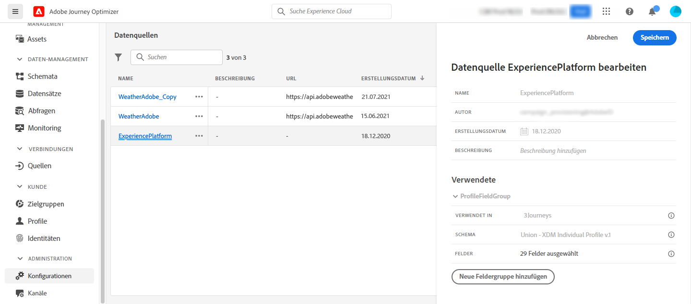

# Konfigurieren einer Datenquelle {#configure-data-source}

>[!NOTE]
>
>Die Konfiguration von Datenquellen wird immer von einem **technischen Anwender** durchgeführt.

Gehen Sie wie folgt vor, um eine neue Datenquelle zu konfigurieren:

1. Wählen Sie im Menü ADMINISTRATION die Option **[!UICONTROL Konfigurationen]**. Klicken Sie im Abschnitt **[!UICONTROL Datenquellen]** auf **[!UICONTROL Verwalten]**. Die Liste der Datenquellen wird angezeigt. Weitere Informationen zur Benutzeroberfläche finden Sie auf [dieser Seite](../start/user-interface.md).

   

1. Anschließend können Sie der integrierten Datenquelle entweder Feldergruppen hinzufügen (siehe [diese Seite](../datasource/adobe-experience-platform-data-source.md)) oder eine neue Datenquelle (siehe [diese Seite](../datasource/external-data-sources.md)) und die assoziierten Feldergruppen (siehe [diese Seite](../datasource/configure-data-sources.md#define-field-groups)) hinzufügen.

   

1. Klicken Sie auf **[!UICONTROL Speichern]**.

   Die Datenquelle ist jetzt konfiguriert und kann in Ihren Journeys verwendet werden.

## Feldergruppen definieren {#define-field-groups}

Feldergruppen sind Gruppen von Feldern, die Sie aus einer Datenquelle abrufen und in einer Journey verwenden können.

Für jede Datenquelle können Sie mehrere Feldergruppen definieren.

Sie können beispielsweise eine Feldergruppe mit der Telefonnummer, der E-Mail-Adresse, dem Vornamen und der Adresse des Profils erstellen. Anschließend können Sie diese Daten in Ihrer Journey verwenden, um Bedingungen zu schaffen. Beispielsweise können Sie entscheiden, eine Push-Benachrichtigung nur dann zu senden, wenn der Kunde die Mobile App installiert hat. Wenn sie leer ist, können Sie eine E-Mail senden.

Obwohl automatisch ein Standardname hinzugefügt wird, sollten Sie Ihrer Feldergruppe einen Namen geben. Der Feldergruppenname ist für andere Anwender in [!DNL Journey Optimizer] sichtbar. Es empfiehlt sich, Feldergruppen einen relevanten Namen zu geben.

Wenn ein Datenquellenfeld in einer Journey verwendet wird, ruft das System alle für diese Feldergruppe definierten Felder ab. Es empfiehlt sich daher, nur die Felder auszuwählen, die Sie für Ihre Journeys benötigen. Dadurch wird die Anfragelatenz in Ihren Journeys verringert und die Performance verbessert. Beachten Sie, dass Sie später problemlos weitere Felder in Feldergruppen hinzufügen können.

Die Anzahl der Journeys, die eine Feldergruppe verwendet, wird im Feld **[!UICONTROL Verwendet in]** angezeigt. Sie können auf die Schaltfläche **[!UICONTROL Customer Journeys anzeigen]** klicken, um die Liste der Journeys mit dieser Feldergruppe anzuzeigen.

>[!NOTE]
>
>Beachten Sie, dass Feldergruppen ohne Felder nicht im Ausdruckseditor angezeigt werden.

## Lebenszyklus von Feldergruppen {#field-group-lifecycle}

Sie können Felder zu einer Feldergruppe hinzufügen oder daraus entfernen, die in keiner Entwurfs- oder Live-Journey verwendet wird.

Einer Feldergruppe, die in einer oder mehreren Entwurfs- oder Live-Journeys verwendet wird, können Sie ein Feld hinzufügen. Sie können jedoch kein Feld daraus entfernen. Dadurch wird verhindert, dass Journeys unterbrochen werden.

Gehen Sie wie folgt vor, um ein Feld aus einer Feldergruppe zu löschen, die für eine oder mehrere Journeys verwendet wird. Verwenden wir ein Beispiel für eine Feldergruppe namens „Feldergruppe A“.

1. Platzieren Sie den Cursor in der Liste der Feldergruppen auf „Feldergruppe A“ und klicken Sie auf der rechten Seite auf das Symbol **[!UICONTROL Duplizieren]**. Benennen Sie die duplizierte Feldergruppe beispielsweise „Feldergruppe B“.
1. Entfernen Sie die nicht mehr benötigten Felder aus „Feldergruppe B“.
1. Überprüfen Sie in „Feldergruppe A“, wo diese Feldergruppe verwendet wird. Diese Informationen werden im Feld **[!UICONTROL Verwendet in]** angezeigt.
1. Öffnen Sie alle Journeys, die „Feldergruppe A“ verwenden.
1. Erstellen Sie neue Versionen jeder dieser Journeys. Bearbeiten Sie alle Aktivitäten mit „Feldergruppe A“ und wählen Sie „Feldergruppe B“ aus.
1. Stoppen Sie alte Versionen von Journeys, die „Feldergruppe A“ verwenden. Sie sollten dann keine Journey mit „Feldergruppe A“ haben.
1. Entfernen Sie „Feldergruppe A“, da sie nicht mehr verwendet wird.
