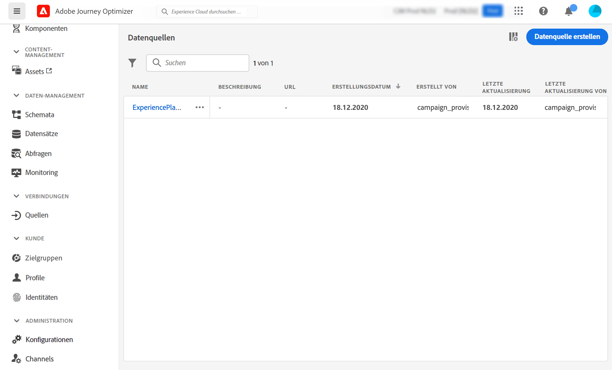

# Datenquelle konfigurieren {#configure-data-source}

>[!NOTE]
>
>Die Konfiguration der Datenquelle wird immer von einem **technischer Anwender**.

Gehen Sie wie folgt vor, um eine Datenquelle zu konfigurieren:

1. Wählen Sie im Menü ADMINISTRATION die Option **[!UICONTROL Configurations]**. Im  **[!UICONTROL Data Sources]** Abschnitt, klicken Sie auf **[!UICONTROL Manage]**. Die Liste der Datenquellen wird angezeigt. Siehe [diese Seite](../start/user-interface.md) für weitere Informationen zur Benutzeroberfläche.

   

1. Anschließend können Sie der integrierten Datenquelle entweder Feldergruppen hinzufügen (siehe [diese Seite](../datasource/adobe-experience-platform-data-source.md)) oder erstellen Sie eine neue externe Datenquelle (siehe [diese Seite](../datasource/external-data-sources.md)) und zugehörigen Feldergruppen (siehe [diese Seite](../datasource/configure-data-sources.md#define-field-groups)).

   

1. Klicken **[!UICONTROL Save]**.

   Die Datenquelle ist jetzt konfiguriert und kann in Ihren Journeys verwendet werden.

## Definieren von Feldgruppen {#define-field-groups}

Feldergruppen sind Gruppen von Feldern, die Sie aus einer Datenquelle abrufen und in einer Journey verwenden können.

Für jede Datenquelle können Sie mehrere Feldergruppen definieren.

Sie können beispielsweise eine Feldergruppe mit der Telefonnummer, der E-Mail-Adresse, dem Vornamen und der Adresse des Profils erstellen. Anschließend können Sie diese Daten in Ihrer Journey verwenden, um Bedingungen zu erstellen. Beispielsweise können Sie eine Push-Benachrichtigung nur dann senden, wenn der Kunde die Mobile App installiert hat. Wenn sie leer ist, können Sie eine E-Mail senden.

Obwohl automatisch ein Standardname hinzugefügt wird, empfehlen wir, Ihrer Feldergruppe einen Namen zu geben. Der Feldergruppenname ist für andere Benutzer in der [!DNL Journey Optimizer]. Es empfiehlt sich, Feldergruppen einen relevanten Namen zu geben.

Wenn ein Datenquellenfeld in einer Journey verwendet wird, ruft das System alle für diese Feldergruppe definierten Felder ab. Daher empfiehlt es sich, nur die Felder auszuwählen, die Sie für Ihre Journeys benötigen. Dadurch wird die Anforderungslatenz in Ihren Journeys reduziert und die Leistung erhöht. Beachten Sie, dass Sie später problemlos weitere Felder in Feldergruppen hinzufügen können.

Die Anzahl der Journeys, die eine Feldergruppe verwenden, wird im **[!UICONTROL Used in]** -Feld. Sie können auf die **[!UICONTROL View journeys]** -Schaltfläche, um die Liste der Journeys anzuzeigen, die diese Feldergruppe verwenden.

>[!NOTE]
>
>Beachten Sie, dass Feldergruppen, die kein Feld haben, nicht im Ausdruckseditor angezeigt werden.

## Lebenszyklus von Feldergruppen {#field-group-lifecycle}

Sie können Felder zu einer Feldergruppe hinzufügen oder daraus entfernen, die in keiner Entwurfs- oder Live-Journey verwendet wird.

Sie können ein Feld hinzufügen, es aber nicht aus einer Feldergruppe entfernen, die in einer oder mehreren Entwurfs- oder Live-Journeys verwendet wird. Dadurch wird verhindert, dass Journeys unterbrochen werden.

Gehen Sie wie folgt vor, um ein Feld aus einer Feldergruppe zu löschen, die in einer oder mehreren Journeys verwendet wird. Verwenden wir ein Beispiel für eine Feldergruppe mit dem Namen &quot;Feldergruppe A&quot;.

1. Platzieren Sie den Cursor in der Liste der Feldergruppen auf &quot;Feldergruppe A&quot;und klicken Sie auf die **[!UICONTROL Duplicate]** rechts. Benennen Sie die duplizierte Feldergruppe beispielsweise &quot;Feldergruppe B&quot;.
1. Entfernen Sie in &quot;Feldergruppe B&quot;die Felder, die Sie nicht mehr benötigen.
1. Überprüfen Sie in &quot;Feldergruppe A&quot;, wo diese Feldergruppe verwendet wird. Diese Informationen werden im **[!UICONTROL Used in]** -Feld.
1. Öffnen Sie alle Journeys, die &quot;Feldergruppe A&quot;verwenden.
1. Erstellen Sie neue Versionen jeder dieser Journeys. Bearbeiten Sie alle Aktivitäten mit &quot;Feldergruppe A&quot;und wählen Sie &quot;Feldergruppe B&quot;aus.
1. Beenden Sie alte Versionen von Journeys, die &quot;Feldergruppe A&quot;verwenden. Sie sollten dann keine Journey mit &quot;Feldergruppe A&quot;haben.
1. Entfernen Sie &quot;Feldergruppe A&quot;, da sie nicht mehr verwendet wird.
