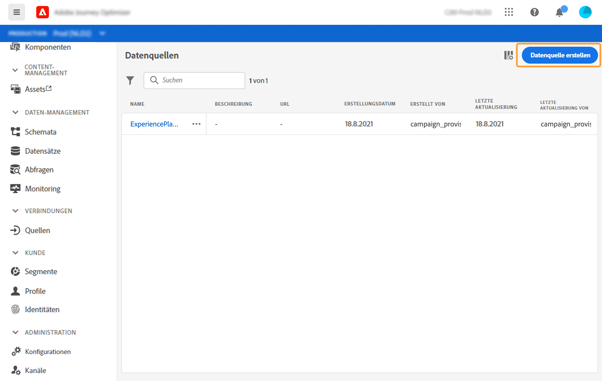
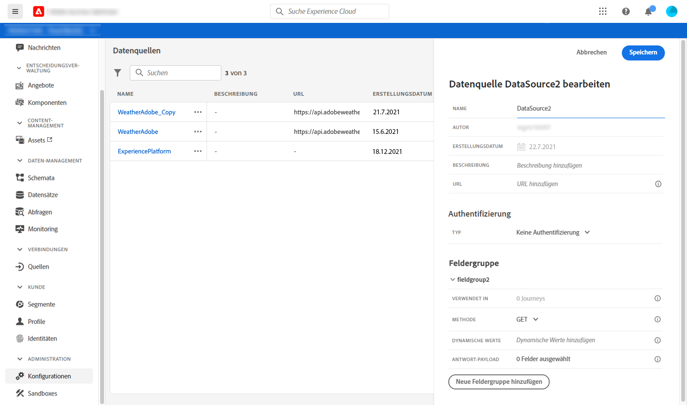
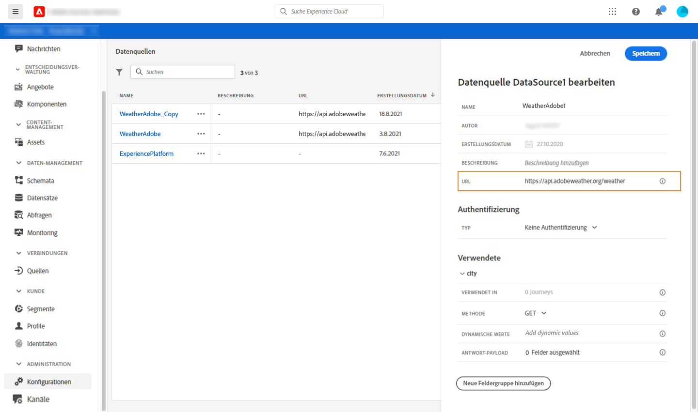
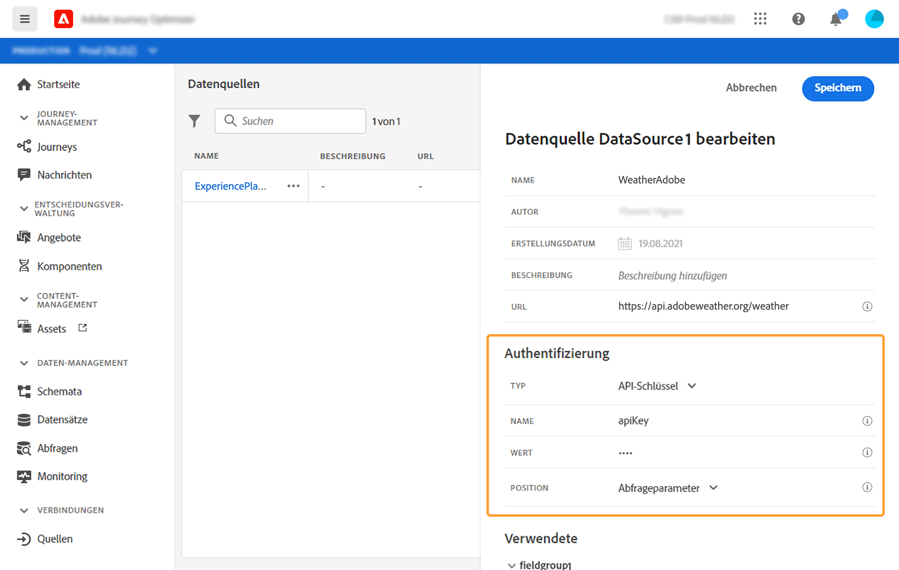
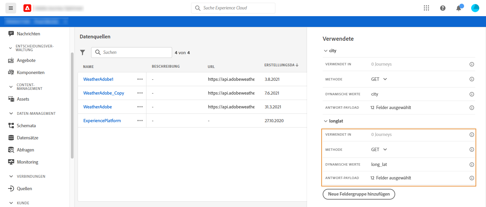
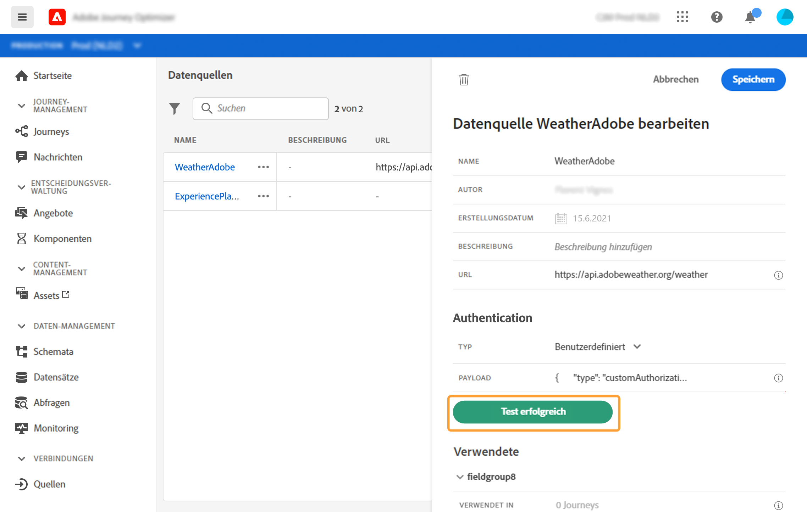

# Externe Datenquellen {#concept_t2s_kqt_52b}


Mit externen Datenquellen können Sie eine Verbindung zu Drittanbietersystemen herstellen, z. B. wenn Sie ein Hotelbuchungssystem verwenden, um zu überprüfen, ob die Person ein Zimmer registriert hat. Im Gegensatz zur integrierten Adobe Experience Platform-Datenquelle können Sie so viele externe Datenquellen wie nötig erstellen.

REST-APIs, die POST oder GET verwenden und JSON zurückgeben, werden unterstützt. API-Schlüssel, einfache und benutzerdefinierte Authentifizierungsmodi werden unterstützt.

Nehmen wir das Beispiel eines Wetter-API-Dienstes, den ich verwenden möchte, um mein Journey anhand von Echtzeit-Wetterdaten anzupassen.

Im Folgenden finden Sie zwei Beispiele für den API-Aufruf:

* _https://api.adobeweather.org/weather?city=London,uk&amp;appid=1234_
* _https://api.adobeweather.org/weather?lat=35&amp;lon=139&amp;appid=1234_

Der Aufruf besteht aus einer Haupt-URL (_https://api.adobeweather.org/weather_), zwei Parametersätzen (&quot;city&quot;für die Stadt und &quot;lat/long&quot;für Breiten- und Längengrad) und dem API-Schlüssel (appid).

Im Folgenden werden die wichtigsten Schritte zum Erstellen und Konfigurieren einer neuen externen Datenquelle beschrieben:

1. Klicken Sie in der Liste der Datenquellen auf **[!UICONTROL Hinzufügen]**, um eine neue externe Datenquelle zu erstellen.

   

   Dadurch wird der Bereich für die Datenquellenkonfiguration auf der rechten Seite des Bildschirms geöffnet.

   

1. Geben Sie einen Namen für Ihre Datenquelle ein.

   >[!NOTE]
   >
   >Verwenden Sie keine Leerzeichen oder Sonderzeichen. Verwenden Sie nicht mehr als 30 Zeichen.

1. hinzufügen Sie eine Beschreibung für Ihre Datenquelle. Dieser Schritt ist optional.
1. hinzufügen die URL des externen Dienstes. In unserem Beispiel: _https://api.adobeweather.org/weather_.

   >[!CAUTION]
   >
   >Aus Sicherheitsgründen wird die Verwendung von HTTPS dringend empfohlen. Beachten Sie auch, dass wir die Verwendung nicht öffentlich zugänglicher Adoben und die Verwendung von IP-Adressen nicht zulassen.

   

1. Konfigurieren Sie die Authentifizierung je nach Konfiguration des externen Dienstes: **[!UICONTROL Keine Authentifizierung]**, **[!UICONTROL Basic]**, **[!UICONTROL Benutzerdefiniert]** oder **[!UICONTROL API-Schlüssel]**. Weitere Informationen zum benutzerdefinierten Authentifizierungsmodus finden Sie in [diesem Abschnitt](../datasource/external-data-sources.md#section_wjp_nl5_nhb). In unserem Beispiel wählen wir:


   * **[!UICONTROL Typ]**: &quot;API-Schlüssel&quot;
   * **[!UICONTROL Wert]**: &quot;1234&quot;(dies ist der Wert unseres API-Schlüssels)
   * **[!UICONTROL Name]**: &quot;appid&quot;(dies ist der Parametername des API-Schlüssels)
   * **[!UICONTROL Ort]**: &quot;Abfrage parameter&quot;(der API-Schlüssel befindet sich in der URL)

   

1. hinzufügen Sie für jeden API-Parameter eine neue Feldgruppe, indem Sie auf **[!UICONTROL Hinzufügen eine neue Feldgruppe]** klicken. Verwenden Sie keine Leerzeichen oder Sonderzeichen im Namen der Feldgruppe. In unserem Beispiel müssen wir zwei Feldgruppen erstellen, eine für jeden Parametersatz (Stadt und lang/lang).

Für den Parametersatz &quot;long/lat&quot;erstellen wir eine Feldgruppe mit den folgenden Informationen:

* **[!UICONTROL Verwendet in]**: zeigt die Anzahl der Journey, die eine Feldgruppe verwenden. Sie können auf das Symbol **[!UICONTROL Ansicht Journey]** klicken, um die Liste der Journey anzuzeigen, die diese Feldgruppe verwenden.
* **[!UICONTROL Methode]**: Wählen Sie die POST oder GET aus. In unserem Fall wählen wir die GET.
* **[!UICONTROL Cachedauer]**: in unserem Fall möchten wir, dass das Wetter 10 Minuten lang zwischengespeichert wird.
* **[!UICONTROL Antwortnutzlast]**: Klicken Sie in das Feld  **** Payloadfield und fügen Sie ein Beispiel der vom Aufruf zurückgegebenen Nutzlast ein. Für unser Beispiel haben wir eine Nutzlast verwendet, die auf einer Wetter-API-Website gefunden wurde. Überprüfen Sie, ob die Feldtypen korrekt sind. Jedes Mal, wenn die API aufgerufen wird, ruft das System alle im Payload-Beispiel enthaltenen Felder ab. Beachten Sie, dass Sie auf **[!UICONTROL Neue Payload]** einfügen klicken können, wenn Sie die aktuell übergebene Payload ändern möchten.
* **[!UICONTROL Dynamische Werte]**: Geben Sie die verschiedenen Parameter getrennt durch ein Koma ein, &quot;long,lat&quot; in unserem Beispiel. Da die Parameterwerte vom Ausführungskontext abhängen, werden sie in den Journey definiert. Siehe [diese Seite](https://experienceleague.adobe.com/docs/journeys/using/building-advanced-conditions-journeys/expressionadvanced.html).
* **[!UICONTROL Gesendete Nutzlast]**: Dieses Feld wird nicht in unserem Beispiel angezeigt. Er ist nur verfügbar, wenn Sie die POST wählen. Fügen Sie die Nutzlast ein, die an das Drittanbietersystem gesendet wird.

Bei einem GET-Aufruf, der Parameter erfordert, geben Sie die Parameter in das Feld **[!UICONTROL Dynamische Werte]** ein und sie werden automatisch am Ende des Aufrufs hinzugefügt. Bei einem POST-Aufruf müssen Sie:

* Liste der Parameter, die zur Anrufzeit im Feld **[!UICONTROL Dynamische Werte]** übergeben werden sollen (Beispiel: &quot;Identifikator&quot;).
* sie auch mit der exakt gleichen Syntax im Hauptteil der gesendeten Nutzlast angeben. Dazu müssen Sie Folgendes hinzufügen: &quot;param&quot;: &quot;Name Ihres Parameters&quot;(im folgenden Beispiel: &quot;Identifikator&quot;). Führen Sie die folgende Syntax aus:

   ```
   {"id":{"param":"identifier"}}
   ```



Klicken Sie auf **[!UICONTROL Speichern]**.

Die Datenquelle ist jetzt konfiguriert und kann in Ihren Journey verwendet werden, z. B. in Ihren Bedingungen oder um eine E-Mail zu personalisieren. Wenn die Temperatur über 30°C liegt, können Sie sich entscheiden, eine bestimmte Mitteilung zu senden.

## Benutzerdefinierter Authentifizierungsmodus{#section_wjp_nl5_nhb}

>[!CONTEXTUALHELP]
>id="jo_authentication_payload"
>title="Informationen zur benutzerdefinierten Authentifizierung"
>abstract="Der benutzerdefinierte Authentifizierungsmodus wird für die komplexe Authentifizierung verwendet, um API-Umbruchprotokolle wie OAuth2 aufzurufen. Die Aktionsausführung erfolgt in zwei Schritten. Zunächst wird ein Aufruf an den Endpunkt ausgeführt, um das Zugriffstoken zu generieren. Anschließend wird das Zugriffstoken in die HTTP-Anforderung der Aktion eingefügt."

Dieser Authentifizierungsmodus wird für die komplexe Authentifizierung verwendet, die häufig zum Aufrufen von API-Umbruchprotokollen wie OAuth2 verwendet wird, um ein Zugriffstoken abzurufen, das in die eigentliche HTTP-Anforderung für die Aktion eingefügt werden soll.

Wenn Sie die benutzerdefinierte Authentifizierung konfigurieren, können Sie auf die Schaltfläche unten klicken, um zu prüfen, ob die benutzerdefinierte Authentifizierungsnutzlast korrekt konfiguriert ist.


Ist der Test erfolgreich, wird die Schaltfläche grün.



Bei dieser Authentifizierung erfolgt die Aktionsausführung in zwei Schritten:

1. Rufen Sie den Endpunkt auf, um das Zugriffstoken zu generieren.
1. Rufen Sie die REST-API auf, indem Sie das Zugriffstoken ordnungsgemäß injizieren.

Diese Authentifizierung besteht aus zwei Teilen.

Die Definition des Endpunkts, der zum Generieren des Zugriffstokens aufgerufen werden soll:

* endpoint: URL zum Generieren des Endpunkts
* Methode der HTTP-Anforderung am Endpunkt (GET oder POST)
* Kopfzeilen: Schlüssel/Wert-Paare, die bei Bedarf als Header in diesen Aufruf eingefügt werden sollen
* body: beschreibt den Hauptteil des Aufrufs, wenn es sich bei der Methode um POST handelt. Wir unterstützen eine begrenzte Körperstruktur, die in bodyParams definiert ist (Schlüssel/Wert Paare). Der bodyType beschreibt Format und Kodierung des Textkörpers im Aufruf:
   * &quot;form&quot;: Das bedeutet, dass der Inhaltstyp application/x-www-form-urlencoded (Zeichensatz UTF-8) lautet und die Schlüssel/Wert-Paare wie folgt serialisiert werden: key1=value1&amp;key2=value2&amp;...
   * &quot;json&quot;: Das bedeutet, dass der Inhaltstyp application/json (Zeichensatz UTF-8) ist und die Schlüsselwertpaare wie folgt als JSON-Objekt serialisiert werden: _{ &quot;key1&quot;: &quot;value1&quot;, &quot;key2&quot;: &quot;value2&quot;, ...}_

Die Art und Weise, wie das Zugriffstoken in die HTTP-Anforderung der Aktion eingefügt werden muss:

* authorizedType: definiert, wie das generierte Zugriffstoken in den HTTP-Aufruf für die Aktion eingefügt werden muss. Mögliche Werte sind:

   * Träger: gibt an, dass das Zugriffstoken in den Autorisierungsheader injiziert werden muss, z. B.: _Autorisierung: Träger &lt;Zugriffstoken>_
   * header: gibt an, dass das Zugriffstoken als Kopfzeile eingefügt werden muss, der von der Eigenschaft tokenTarget definierte Kopfzeilenname. Wenn tokenTarget beispielsweise myHeader ist, wird das Zugriffstoken als Kopfzeile wie folgt eingefügt: _myHeader: &lt;Zugriffstoken>_
   * queryParam: gibt an, dass das Zugriffstoken als queryParam eingefügt werden muss, der von der Eigenschaft tokenTarget definierte Parametername für die Abfrage. Wenn das tokenTarget beispielsweise myQueryParam ist, lautet die URL des Aktionsaufrufs wie folgt: _&lt;url>?myQueryParam=&lt;Zugriffstoken>_

* tokenInResponse: zeigt an, wie das Zugriffstoken aus dem Authentifizierungsaufruf extrahiert wird. Diese Eigenschaft kann:
   * &quot;response&quot;: gibt an, dass die HTTP-Antwort das Zugriffstoken ist
   * einen Selektor in einer JSON (vorausgesetzt, dass die Antwort ein JSON ist, werden andere Formate wie XML nicht unterstützt). Das Format dieser Auswahl ist _json://&lt;Pfad zur Zugriffstoken-Eigenschaft>_. Beispiel: _{ &quot;access_token&quot;: &quot;theToken&quot;, &quot;timestamp&quot;: 12323445656 }_, tokenInResponse lautet: _json: //access_token_

Das Format dieser Authentifizierung ist:

```
{
    "type": "customAuthorization",
    "authorizationType": "<value in 'bearer', 'header' or 'queryParam'>",
    (optional, mandatory if authorizationType is 'header' or 'queryParam') "tokenTarget": "<name of the header or queryParam if the authorizationType is 'header' or 'queryParam'>",
    "endpoint": "<URL of the authentication endpoint>",
    "method": "<HTTP method to call the authentication endpoint, in 'GET' or 'POST'>",
    (optional) "headers": {
        "<header name>": "<header value>",
        ...
    },
    (optional, mandatory if method is 'POST') "body": {
        "bodyType": "<'form'or 'json'>,
        "bodyParams": {
            "param1": value1,
            ...

        }
    },
    "tokenInResponse": "<'response' or json selector in format 'json://<field path to access token>'"
}
```

Sie können die Cachedauer des Tokens für eine benutzerdefinierte Authentifizierungsdatenquelle ändern. Nachstehend finden Sie ein Beispiel für eine benutzerdefinierte Nutzlast für die Authentifizierung. Die Cachedauer wird im Parameter &quot;cacheDuration&quot;definiert. Es gibt die Speicherungsdauer des generierten Tokens im Cache an. Die Einheit kann Millisekunden, Sekunden, Minuten, Stunden, Tage, Monate, Jahre sein.

```
"authentication": {
    "type":"customAuthorization",
    "authorizationType":"Bearer",
    "endpoint":"http://localhost:${port}/epsilon/oauth2/access_token",
    "method":"POST",
    "headers": {
        "Authorization":"Basic EncodeBase64(${epsilonClientId}:${epsilonClientSecret})"
        },
    "body": {
        "bodyType":"form",
        "bodyParams": {
             "scope":"cn mail givenname uid employeeNumber",
             "grant_type":"password",
             "username":"${epsilonUserName}",
             "password":"${epsilonUserPassword}"
             }
        },
    "tokenInResponse":"json://access_token",
    "cacheDuration":
             { "duration":5, "timeUnit":"seconds" }
    }
```
