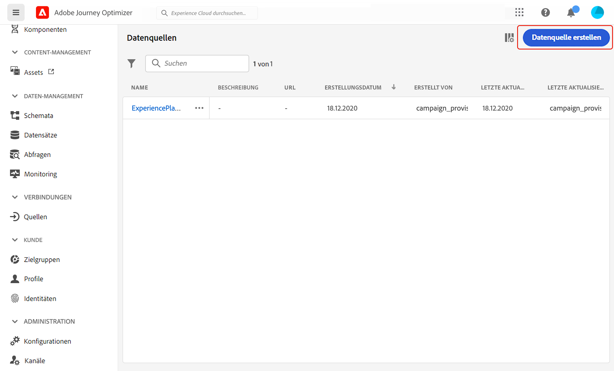
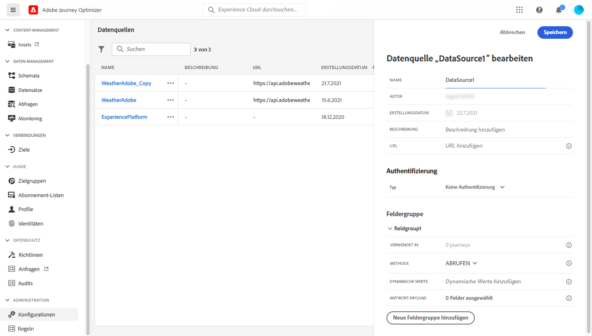
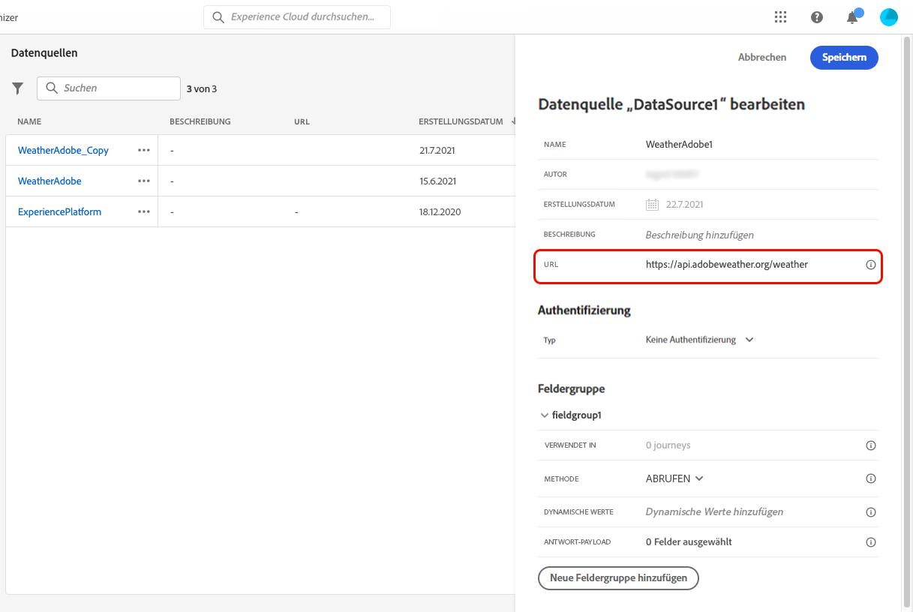
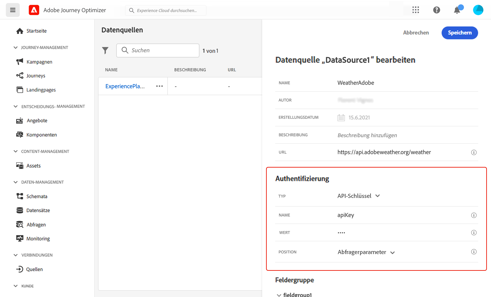
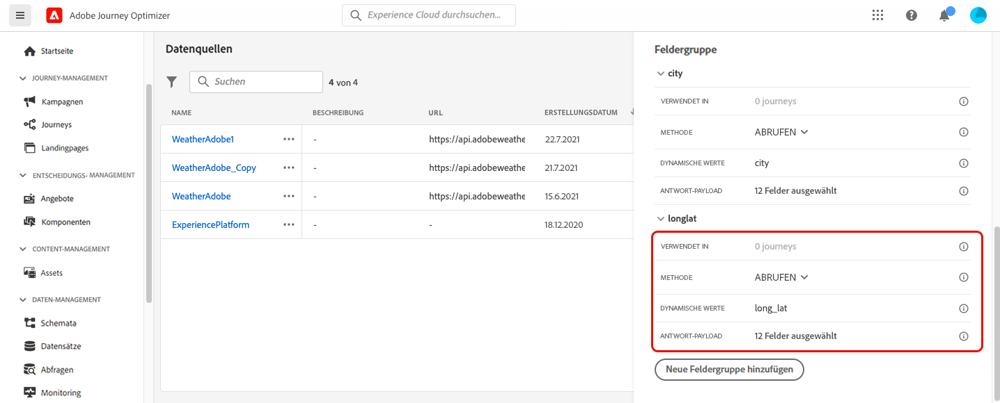
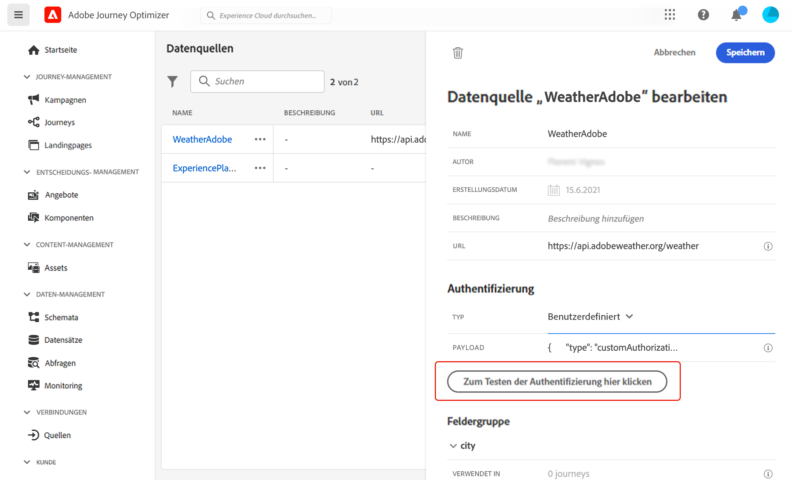
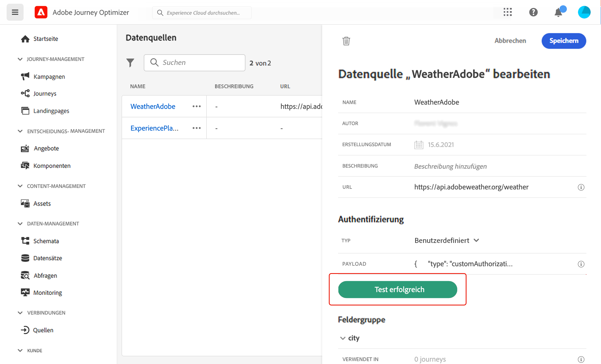

# Externe Datenquellen {#external-data-sources}

>[!CONTEXTUALHELP]
>id="ajo_journey_data_source_custom"
>title="Externe Datenquellen"
>abstract="Mit externen Datenquellen können Sie eine Verbindung zu Drittanbietersystemen herstellen, z. B. um bei der Verwendung eines Hotelbuchungssystems zu überprüfen, ob die Person ein Zimmer gebucht hat. Im Gegensatz zur integrierten Adobe Experience Platform-Datenquelle können Sie beliebig viele externe Datenquellen erstellen."

## Arbeiten mit externen Datenquellen {#gs-ext-data-sources}

Mit externen Datenquellen können Sie eine Verbindung zu Drittanbietersystemen herstellen, z. B. um bei der Verwendung eines Hotelbuchungssystems zu überprüfen, ob die Person ein Zimmer gebucht hat. Im Gegensatz zur integrierten [!DNL Adobe Experience Platform] Datenquelle können Sie so viele externe Datenquellen erstellen, wie Sie benötigen.

>[!NOTE]
>
>* Leitlinien für die Arbeit mit externen Systemen werden auf [dieser Seite](../configuration/external-systems.md) aufgeführt.
>
>* Da die Antworten jetzt unterstützt werden, sollten Sie für Anwendungsfälle mit externen Datenquellen benutzerdefinierte Aktionen anstelle von Datenquellen verwenden. Weitere Informationen zu Antworten finden Sie unter [Benutzerdefinierte Aktionsantworten](../action/action-response.md). Benutzerdefinierte Aktionen ohne Data Lake-Persistenz sind die richtige Wahl, wenn die Daten nur innerhalb der Journey nützlich sind und das externe System über einen API-Endpunkt zugänglich ist. Einen Vergleich aller Datenzugriffsoptionen finden Sie unter [Wählen Sie Ihre Datenzugriffsstrategie](../datasource/about-data-sources.md#data-access-strategy).

REST-APIs, die POST oder GET verwenden und JSON zurückgeben, werden unterstützt. API-Schlüssel sowie einfache und benutzerdefinierte Authentifizierungsmodi werden unterstützt.

Nehmen wir als Beispiel einen Wetter-API-Dienst, mit dem ich das Verhalten meiner Journey an Echtzeit-Wetterdaten anpassen möchte.

Im Folgenden finden Sie zwei Beispiele für den API-Aufruf:

* _https://api.adobeweather.org/weather?city=London,uk&amp;appid=1234_
* _https://api.adobeweather.org/weather?lat=35&amp;lon=139&amp;appid=1234_

Der Aufruf besteht aus einer Haupt-URL (_https://api.adobeweather.org/weather_), zwei Parametersätzen („city“ für die Stadt und „lat/long“ für den Breiten- und Längengrad) und dem API-Schlüssel (appid).

>[!TIP]
>
>Wir empfehlen einen Puffer von mindestens einer Minute zwischen dem Gültigkeitszeitraum des externen API-Tokens und Ihrer [`cacheDuration`-Einstellung in Journey Optimizer](#custom-authentication-access-token). Die gilt insbesondere bei einer hohen Arbeitsauslastung, um Gültigkeitskonflikte und 401-Fehler zu vermeiden.

## Erstellen und Konfigurieren einer externen Datenquelle {#create-ext-data-sources}

Im Folgenden finden Sie die wichtigsten Schritte zum Erstellen und Konfigurieren einer neuen externen Datenquelle:

1. Klicken Sie in der Liste der Datenquellen auf **[!UICONTROL Daten-Source erstellen]**, um eine neue externe Datenquelle zu erstellen.

   

   Dadurch wird der Konfigurationsbereich für die Datenquelle auf der rechten Seite des Bildschirms geöffnet.

   

1. Geben Sie einen Namen für Ihre Datenquelle ein.

Es sind nur alphanumerische Zeichen und Unterstriche zulässig. Die maximale Länge beträgt 30 Zeichen.

1. Fügen Sie Ihrer Datenquelle eine Beschreibung hinzu. Dieser Schritt ist optional.
1. Fügen Sie die URL des externen Dienstes hinzu. In unserem Beispiel: _https://api.adobeweather.org/weather_.

   >[!CAUTION]
   >
   >Aus Sicherheitsgründen wird die Verwendung von HTTPS dringend empfohlen. Beachten Sie außerdem, dass die Verwendung nicht öffentlich zugänglicher Adobe-Adressen und die Verwendung von IP-Adressen nicht zulässig sind.

   

1. Konfigurieren Sie die Authentifizierung je nach Konfiguration des externen Dienstes: **[!UICONTROL Keine Authentifizierung]**, **[!UICONTROL Einfach]**, **[!UICONTROL Benutzerdefiniert]** oder **[!UICONTROL API-Schlüssel]**.

   Für den einfachen Authentifizierungsmodus müssen Sie einen Benutzernamen und ein Kennwort eingeben.

   >[!NOTE]
   >
   >* Wenn der Authentifizierungsaufruf erfolgt, wird die in base64 kodierte Zeichenfolge `<username>:<password>` in den Authentifizierungs-Header eingefügt.
   >
   >* [!DNL Adobe Journey Optimizer] verschlüsselt in benutzerdefinierten Aktionen definierte geheime Daten automatisch. Die Verschlüsselungsschlüssel jeder Organisation werden sicher in einem dedizierten Vault verwaltet, der mit dem Unternehmen verknüpft ist. Wenn Anmeldeinformationen auf der Benutzeroberfläche angezeigt werden, werden sie standardmäßig maskiert, um versehentliches Offenlegen zu verhindern.


   Weitere Informationen zum benutzerdefinierten Authentifizierungsmodus finden Sie [Abschnitt Benutzerdefinierter Authentifizierungsmodus](../datasource/external-data-sources.md#custom-authentication-mode). In unserem Beispiel wählen wir den Authentifizierungsmodus „API-Schlüssel“ wie folgt:

   * **[!UICONTROL Typ]**: „API-Schlüssel“
   * **[!UICONTROL Name]**: „appid“ (dies ist der Name des API-Schlüsselparameters)
   * **[!UICONTROL Wert]**: „1234“ (dies ist der Wert unseres API-Schlüssels)
   * **[!UICONTROL Standort]**: „Abfrageparameter“ (der API-Schlüssel befindet sich in der URL)

     

1. Fügen Sie für jeden festgelegten API-Parameter eine neue Feldergruppe hinzu, indem Sie auf **[!UICONTROL Neue Feldergruppe hinzufügen]** klicken. Im Namen der Feldergruppe sind nur alphanumerische Zeichen und Unterstriche zulässig. Die maximale Länge beträgt 30 Zeichen. In unserem Beispiel müssen wir zwei Feldergruppen erstellen, eine für jeden Parametersatz (city und long/lat).

Für den Parametersatz „long/lat“ erstellen wir eine Feldergruppe mit folgenden Informationen:

* **[!UICONTROL Verwendet in]**: zeigt die Anzahl der Journeys an, die eine Feldergruppe verwenden. Sie können auf das Symbol **[!UICONTROL Journeys anzeigen]** klicken, um die Liste der Journeys anzuzeigen, die diese Feldergruppe verwenden.
* **[!UICONTROL Methode]**: Wählen Sie die POST- oder GET-Methode aus. In unserem Beispiel wählen wir die GET-Methode aus.
* **[!UICONTROL Dynamische Werte]**: Geben Sie in unserem Beispiel die verschiedenen Parameter getrennt durch ein Komma „long,lat“ ein. Da die Parameterwerte vom Ausführungskontext abhängen, werden sie in den Journeys definiert. [Erfahren Sie mehr über Ausdrücke](../building-journeys/expression/expressionadvanced.md)
* **[!UICONTROL Antwort-Payload]**: Klicken Sie in das Feld **[!UICONTROL Payload]** und fügen Sie ein Beispiel für die Payload ein, die vom Aufruf zurückgegeben wird. Für unser Beispiel haben wir eine Payload verwendet, die auf einer Wetter-API-Website gefunden wurde. Überprüfen Sie, ob die Feldtypen korrekt sind. Jedes Mal, wenn die API aufgerufen wird, ruft das System alle im Payload-Beispiel enthaltenen Felder ab. Beachten Sie, dass Sie auf **[!UICONTROL Neue Payload einfügen]** klicken können, wenn Sie die aktuell übergebene Payload ändern möchten.
* **[!UICONTROL Gesendete Payload]**: Dieses Feld wird in unserem Beispiel nicht angezeigt. Es ist nur verfügbar, wenn Sie die POST-Methode auswählen. Fügen Sie die Payload ein, die an das Drittanbietersystem gesendet wird.

Bei einem GET-Aufruf, der Parameter erfordert, geben Sie die Parameter in das Feld **[!UICONTROL Dynamische Werte]** ein und sie werden automatisch am Ende des Aufrufs hinzugefügt. Bei einem POST-Aufruf müssen Sie:

* die beim Zeitpunkt des Aufrufs zu übergebenden Parameter im Feld **[!UICONTROL Dynamische Werte]** auflisten (im Beispiel unten: „identifier“).
* diese auch mit exakt derselben Syntax im Hauptteil der gesendeten Payload angeben. Dazu müssen Sie Folgendes hinzufügen: „param“: „Name Ihres Parameters“ (im folgenden Beispiel: „identifier“). Folgen Sie der unten stehenden Syntax:

```json
{"id":{"param":"identifier"}}
```




Nach dem Speichern Ihrer Änderungen ist die Datenquelle konfiguriert und kann in Ihren Journeys verwendet werden, z. B. in Ihren Bedingungen oder zur Personalisierung einer E-Mail. Wenn die Temperatur über 30 °C liegt, können Sie eine bestimmte Mitteilung versenden.

## Benutzerdefinierter Authentifizierungsmodus {#custom-authentication-mode}

>[!CONTEXTUALHELP]
>id="jo_authentication_payload"
>title="Über benutzerdefinierte Authentifizierung"
>abstract="Der benutzerdefinierte Authentifizierungsmodus wird für die komplexe Authentifizierung verwendet, um API-Wrapping-Protokolle wie OAuth2 aufzurufen. Die Aktionsausführung erfolgt in zwei Schritten. Zunächst wird der Endpunkt aufgerufen, um das Zugriffstoken zu generieren. Anschließend wird das Zugriffstoken in die HTTP-Anfrage der Aktion eingefügt."

Der benutzerdefinierte Authentifizierungsmodus wird für die komplexe Authentifizierung verwendet, die häufig zum Aufrufen von API-Wrapping-Protokollen wie OAuth2 verwendet wird, um ein Zugriffs-Token abzurufen, das in die eigentliche HTTP-Anfrage für die Aktion eingefügt werden soll.

Wenn Sie die benutzerdefinierte Authentifizierung konfigurieren, verwenden Sie die Schaltfläche **[!UICONTROL Zum Überprüfen der Authentifizierung klicken]**, um zu überprüfen, ob die Payload der benutzerdefinierten Authentifizierung korrekt konfiguriert ist.



Wenn der Test erfolgreich ist, wird die Schaltfläche grün.



Bei diesem Authentifizierungsmodus erfolgt die Aktionsausführung in zwei Schritten:

1. Rufen Sie den Endpunkt auf, um das Zugriffstoken zu generieren.
1. Rufen Sie die REST-API auf, indem Sie das Zugriffstoken ordnungsgemäß einfügen.


>[!NOTE]
>
>**Diese Authentifizierung besteht aus zwei Teilen.**

### Die Definition des Endpunkts, der aufgerufen werden soll, um das Zugriffs-Token zu generieren{#custom-authentication-endpoint}

* `endpoint`: URL zum Generieren des Endpunkts
* Methode der HTTP-Anfrage am Endpunkt (`GET` oder `POST`)
* `headers`: Schlüssel-Wert-Paare, die bei Bedarf als Kopfzeilen in diesen Aufruf eingefügt werden sollen
* `body`: beschreibt den Haupttextteil des Aufrufs, wenn die Methode POST ist. Für den Haupttextteil unterstützen wir eine begrenzte Struktur, die in bodyParams definiert ist (Schlüssel-Wert-Paare). Der bodyType beschreibt Format und Codierung des Haupttextteils (body) im Aufruf:
   * `form`: bedeutet, dass der Inhaltstyp application/x-www-form-urlencoded (Zeichensatz UTF-8) lautet und die Schlüssel-Wert-Paare wie folgt serialisiert werden: Schlüssel1=Wert1&amp;Schlüssel2=Wert2&amp; …
   * `json`: bedeutet, dass der Inhaltstyp application/json (Zeichensatz UTF-8) ist und die Schlüssel-Wert-Paare wie folgt als JSON-Objekt serialisiert werden: _{ &quot;Schlüssel1&quot;: &quot;Wert1&quot;, &quot;Schlüssel2&quot;: &quot;Wert2&quot;, …}_

### Die Definition der Art und Weise, wie das Zugriffs-Token in die HTTP-Anfrage der Aktion eingefügt werden muss{#custom-authentication-access-token}

* **authorizationType**: definiert, wie das generierte Zugriffstoken in den HTTP-Aufruf für die Aktion eingefügt werden muss. Die möglichen Werte sind:

   * `bearer`: gibt an, dass das Zugriffstoken in die Autorisierungskopfzeile eingefügt werden muss, z. B.: _Autorisierung: Bearer &lt;Zugriffstoken>_
   * `header`: gibt an, dass das Zugriffstoken als Kopfzeile eingefügt werden muss, der Kopfzeilenname wird von der Eigenschaft `tokenTarget` definiert. Wenn `tokenTarget` beispielsweise `myHeader` ist, wird das Zugriffstoken als Header wie folgt eingefügt: _myHeader: &lt;Zugriffstoken>_
   * `queryParam`: gibt an, dass das Zugriffstoken als queryParam eingefügt werden muss, der queryParam-Name wird von der Eigenschaft tokenTarget definiert. Wenn das tokenTarget beispielsweise myQueryParam ist, lautet die URL des Aktionsaufrufs: _&lt;url>?myQueryParam=&lt;access token>_

* **tokenInResponse**: zeigt an, wie das Zugriffstoken aus dem Authentifizierungsaufruf extrahiert wird. Diese Eigenschaft kann Folgendes sein:
   * `response`: gibt an, dass die HTTP-Antwort das Zugriffstoken
   * einer Auswahl in einer JSON-Datei ist (es wird vorausgesetzt, dass die Antwort eine JSON-Datei ist. Andere Formate wie XML werden nicht unterstützt). Das Format dieser Auswahl ist _json://&lt;Pfad zur Zugriffstoken-Eigenschaft>_. Wenn die Antwort des Aufrufs zum Beispiel folgendermaßen lautet: _{ &quot;access_ token&quot;: &quot;theToken&quot;, &quot;timestamp&quot;: 12323445656 }_, wird die tokenInResponse Folgendes sein:_ json: //access_token_

Das Format dieser Authentifizierung lautet:

```json
{
    "type": "customAuthorization",
    "endpoint": "<URL of the authentication endpoint>",
    "method": "<HTTP method to call the authentication endpoint, in 'GET' or 'POST'>",
    (optional) "headers": {
        "<header name>": "<header value>",
        ...
    },
    (optional, mandatory if method is 'POST') "body": {
        "bodyType": "<'form'or 'json'>,
        "bodyParams": {
            "param1": value1,
            ...
        }
    },
    "tokenInResponse": "<'response' or json selector in format 'json://<field path to access token>'",
    "cacheDuration": {
        (optional, mutually exclusive with 'duration') "expiryInResponse": "<json selector in format 'json://<field path to expiry>'",
        (optional, mutually exclusive with 'expiryInResponse') "duration": <integer value>,
        "timeUnit": "<unit in 'milliseconds', 'seconds', 'minutes', 'hours', 'days', 'months', 'years'>"
    },
    "authorizationType": "<value in 'bearer', 'header' or 'queryParam'>",
    (optional, mandatory if authorizationType is 'header' or 'queryParam') "tokenTarget": "<name of the header or queryParam if the authorizationType is 'header' or 'queryParam'>",
}
```

>[!NOTE]
>
>Encode64 ist die einzige Funktion, die in der Authentifizierungs-Payload verfügbar ist.

Sie können die Aufbewahrungsfrist im Cache des Tokens für eine benutzerdefinierte Authentifizierungsdatenquelle ändern. Nachstehend finden Sie ein Beispiel für eine benutzerdefinierte Authentifizierungs-Payload. Die Aufbewahrungsfrist im Cache wird im Parameter `cacheDuration` definiert. Sie gibt die Aufbewahrungsdauer des generierten Tokens im Cache an. Die Einheit kann Millisekunden, Sekunden, Minuten, Stunden, Tage, Monate oder Jahre sein.

Im Folgenden finden Sie ein Beispiel für den Bearer-Authentifizierungstyp:

```json
{
    "type": "customAuthorization",
    "endpoint": "https://<your_auth_endpoint>/epsilon/oauth2/access_token",
    "method": "POST",
    "headers": {
      "Authorization": "Basic EncodeBase64(<epsilon Client Id>:<epsilon Client Secret>)"
    },
    "body": {
      "bodyType": "form",
      "bodyParams": {
        "scope": "cn mail givenname uid employeeNumber",
        "grant_type": "password",
        "username": "<epsilon User Name>",
        "password": "<epsilon User Password>"
      }
    },
    "tokenInResponse": "json://access_token",
    "cacheDuration": {
      "duration": 5,
      "timeUnit": "minutes"
    },
  },
```

>[!NOTE]
>
>* Das Authentifizierungstoken wird pro Journey zwischengespeichert: Wenn zwei Journey dieselbe benutzerdefinierte Aktion verwenden, verfügt jede Journey über ein eigenes Token im Cache. Dieses Token wird zwischen diesen Journeys nicht geteilt.
>
>* Die Aufbewahrungsfrist im Cache hilft, zu viele Aufrufe an die Authentifizierungsendpunkte zu vermeiden. Die Aufbewahrung des Authentifizierungs-Tokens erfolgt im Cache des entsprechenden Service. Er wird also nicht dauerhaft gespeichert. Wenn ein Service neu gestartet wird, beginnt er mit einem leeren Cache. Die Aufbewahrungsfrist im Cache beträgt standardmäßig 1 Stunde. Sie kann in der benutzerdefinierten Authentifizierungs-Payload angepasst werden, indem eine andere Aufbewahrungsfrist angegeben wird.
>

### Zertifikatbasierte benutzerdefinierte Authentifizierung {#certificate-credential}

Für Unternehmens-APIs, die eine zertifikatbasierte Identitätsüberprüfung erzwingen, z. B. die Microsoft Entra ID, können Sie die zertifikatbasierte benutzerdefinierte Authentifizierung konfigurieren, indem Sie `"subType": "certificateCredential"` zu Ihrer benutzerdefinierten Autorisierungs-Payload hinzufügen. Journey Optimizer verwendet das verwaltete Zertifikat von Adobe, um eine JWT-Client-Bestätigung zu signieren und sie gegen ein Zugriffstoken einzutauschen. Es ist kein Client-Geheimnis erforderlich.

Mit dieser Option werden dem `customAuthorization` zwei Pflichtfelder hinzugefügt: `subType` und `aud`. Alle anderen Felder (`endpoint`, `method`, Hauptteilparameter, `tokenInResponse`) bleiben unverändert. Wenn `subType` fehlt, ist das Verhalten mit der standardmäßigen benutzerdefinierten Authentifizierung identisch - vorhandene Konfigurationen sind davon nicht betroffen.

* **`subType`**: Legen Sie die Einstellung auf `"certificateCredential"` fest, um die zertifikatbasierte Authentifizierung zu aktivieren.
* **`aud`**: Der in der JWT-Client-Bestätigung enthaltene Zielgruppenwert. Bei der Microsoft-Eintrags-ID ist dies dasselbe wie bei der `endpoint`-URL, es muss jedoch immer explizit festgelegt werden.

Die Felder `client_assertion` und `client_assertion_type` werden nie vom Benutzer verfasst. Sie werden zur Laufzeit automatisch von der Plattform eingefügt, unmittelbar vor dem Token-Endpunkt-Aufruf.

Im Folgenden finden Sie ein Beispiel für den Authentifizierungstyp der Zertifikatberechtigung:

```json
{
  "type": "customAuthorization",
  "subType": "certificateCredential",
  "aud": "https://login.microsoftonline.com/{tenantId}/oauth2/v2.0/token",
  "authorizationType": "Bearer",
  "endpoint": "https://login.microsoftonline.com/{tenantId}/oauth2/v2.0/token",
  "method": "POST",
  "body": {
    "bodyType": "form",
    "bodyParams": {
      "client_id": "<your-client-id>",
      "grant_type": "client_credentials",
      "scope": "https://api.example.com/.default"
    }
  },
  "tokenInResponse": "json://access_token"
}
```

>[!CAUTION]
>
>Beachten Sie die folgenden Leitplanken beim Konfigurieren der zertifikatbasierten benutzerdefinierten Authentifizierung:
>
>* **Token-Endpunkt-URL**: Muss HTTPS sein. Vermeiden Sie URLs, die `?` enthalten - dies ist ein Zeichen, bei dem der Autorisierungsendpunkt anstelle des Token-Endpunkts eingefügt wurde.
>* **`method`**: Muss `POST` sein. OAuth-Token-Endpunkte akzeptieren nur POST-Anfragen.
>* **`client_id`**: Darf nicht leer sein und darf keine führenden oder nachfolgenden Leerzeichen enthalten. Ein leerer Wert erzeugt einen gültig aussehenden JWT, den der Identitätsanbieter mit einem deckenden Fehler zurückweist.
>* **`scope`**: Wird in `bodyParams` als einzelne, durch Leerzeichen getrennte Zeichenfolge ausgedrückt. Insgesamt maximal 1000 Zeichen.
>* **Zertifikat**: Adobe verwaltet das Zertifikat und den privaten Schlüssel - Sie laden nie ein Zertifikat hoch oder geben es ein. Bevor Sie die benutzerdefinierte Aktion auf einer Live-Journey verwenden können, müssen Sie das Blattzertifikat von **Adobe** (nicht die Stamm-CA) bei Ihrem Identitätsanbieter registrieren.

Im Folgenden finden Sie ein Beispiel für den Kopfzeilen-Authentifizierungstyp:

```json
{
  "type": "customAuthorization",
  "endpoint": "https://myapidomain.com/v2/user/login",
  "method": "POST",
  "headers": {
    "x-retailer": "any value"
  },
  "body": {
    "bodyType": "form",
    "bodyParams": {
      "secret": "any value",
      "username": "any value"
    }
  },
  "tokenInResponse": "json://token",
  "cacheDuration": {
    "expiryInResponse": "json://expiryDuration",
    "timeUnit": "minutes"
  },
  "authorizationType": "header",
  "tokenTarget": "x-auth-token"
} 
```

Im Folgenden finden Sie ein Beispiel für die Antwort des Anmeldungs-API-Aufrufs:

```json
{
  "token": "xDIUssuYE9beucIE_TFOmpdheTqwzzISNKeysjeODSHUibdzN87S",
  "expiryDuration" : 5
}
```

>[!CAUTION]
>
>Beachten Sie beim Konfigurieren der benutzerdefinierten Authentifizierung für eine benutzerdefinierte Aktion, dass verschachtelte JSON-Objekte (z. B. Unterobjekte innerhalb von `bodyParams`) **unterstützt** werden.