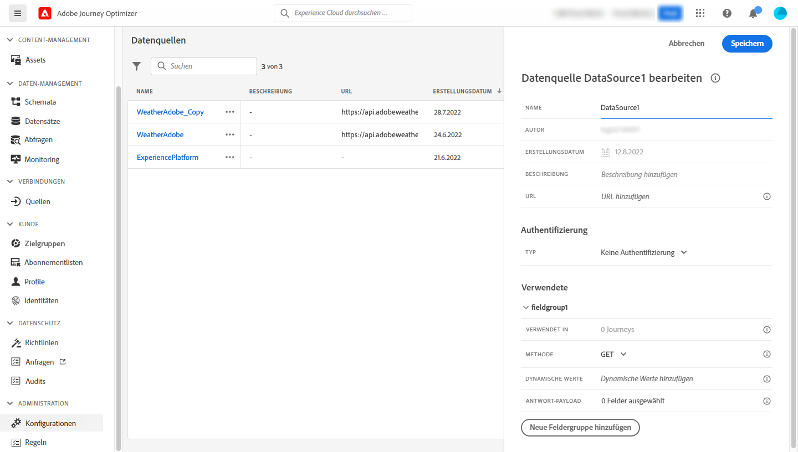
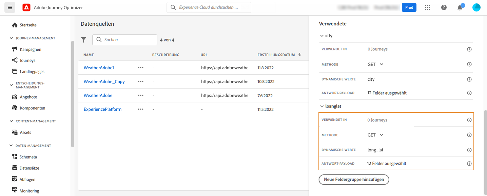
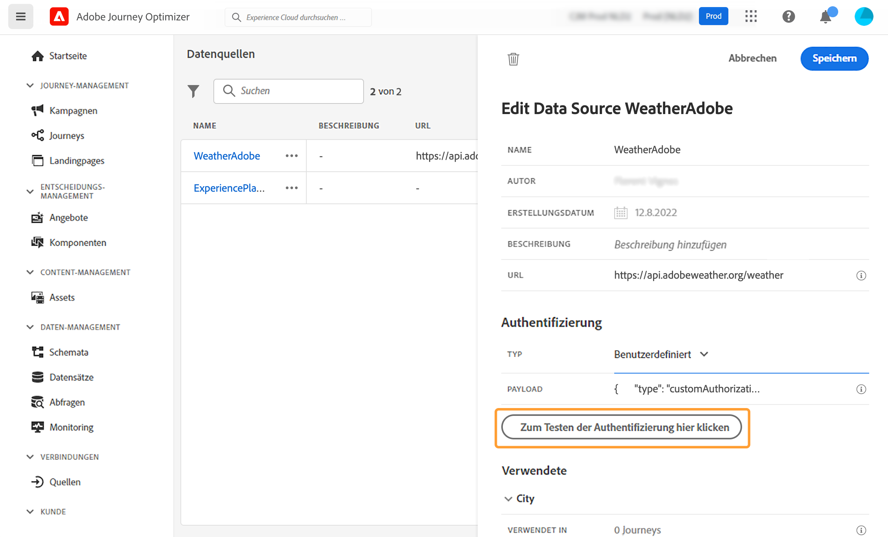
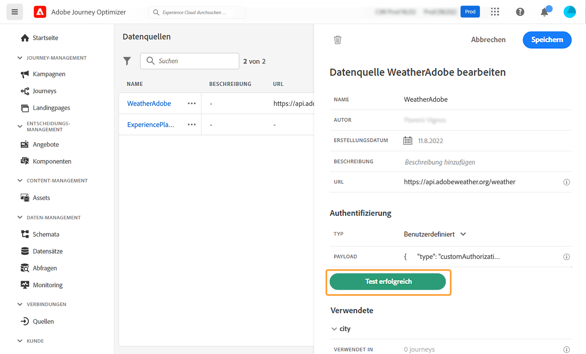

# Externe Datenquellen {#external-data-sources}

>[!CONTEXTUALHELP]
>id="ajo_journey_data_source_custom"
>title="Externe Datenquellen"
>abstract="Externe Datenquellen ermöglichen es Ihnen, eine Verbindung zu Drittanbietersystemen herzustellen, z. B. wenn Sie ein Hotelbuchungssystem verwenden, um zu überprüfen, ob die Person ein Zimmer registriert hat. Im Gegensatz zur integrierten Adobe Experience Platform-Datenquelle können Sie beliebig viele externe Datenquellen erstellen."

Externe Datenquellen ermöglichen es Ihnen, eine Verbindung zu Drittanbietersystemen herzustellen, z. B. wenn Sie ein Hotelbuchungssystem verwenden, um zu überprüfen, ob die Person ein Zimmer registriert hat. Im Gegensatz zur integrierten Adobe Experience Platform-Datenquelle können Sie beliebig viele externe Datenquellen erstellen.

>[!NOTE]
>
>Die Limits bei der Arbeit mit externen Systemen finden Sie unter [diese Seite](../configuration/external-systems.md).

REST-APIs, die POST oder GET verwenden und JSON zurückgeben, werden unterstützt. API-Schlüssel, einfache und benutzerdefinierte Authentifizierungsmodi werden unterstützt.

Nehmen wir als Beispiel einen Wetter-API-Dienst, mit dem ich das Verhalten meiner Journey anhand von Echtzeit-Wetterdaten anpassen möchte.

Im Folgenden finden Sie zwei Beispiele für den API-Aufruf:

* _https://api.adobeweather.org/weather?city=London,uk&amp;appid=1234_
* _https://api.adobeweather.org/weather?lat=35&amp;lon=139&amp;appid=1234_

Der Aufruf besteht aus einer Haupt-URL (_https://api.adobeweather.org/weather_), zwei Parametersätze (&quot;city&quot;für die Stadt und &quot;lat/long&quot;für Breiten- und Längengrad) und den API-Schlüssel (appid).

Im Folgenden finden Sie die wichtigsten Schritte zum Erstellen und Konfigurieren einer neuen externen Datenquelle:

1. Klicken Sie in der Liste der Datenquellen auf **[!UICONTROL Create Data Source]** , um eine neue externe Datenquelle zu erstellen.

   

   Dadurch wird der Konfigurationsbereich für die Datenquelle auf der rechten Seite des Bildschirms geöffnet.

   

1. Geben Sie einen Namen für Ihre Datenquelle ein.

   >[!NOTE]
   >
   >Verwenden Sie keine Leerzeichen oder Sonderzeichen. Verwenden Sie nicht mehr als 30 Zeichen.

1. Fügen Sie Ihrer Datenquelle eine Beschreibung hinzu. Dieser Schritt ist optional.
1. Fügen Sie die URL des externen Dienstes hinzu. In unserem Beispiel: _https://api.adobeweather.org/weather_.

   >[!CAUTION]
   >
   >Aus Sicherheitsgründen wird die Verwendung von HTTPS dringend empfohlen. Beachten Sie außerdem, dass wir die Verwendung nicht öffentlich zugänglicher Adobe-Adressen und die Verwendung von IP-Adressen nicht zulassen.

   

1. Konfigurieren Sie die Authentifizierung entsprechend der Konfiguration des externen Dienstes: **[!UICONTROL No authentication]**, **[!UICONTROL Basic]**, **[!UICONTROL Custom]** oder **[!UICONTROL API key]**. Weitere Informationen zum benutzerdefinierten Authentifizierungsmodus finden Sie unter [diesem Abschnitt](../datasource/external-data-sources.md#custom-authentication-mode). In unserem Beispiel wählen wir:

   * **[!UICONTROL Type]**: &quot;API-Schlüssel&quot;
   * **[!UICONTROL Name]**: &quot;appid&quot;(dies ist der Name des API-Schlüsselparameters)
   * **[!UICONTROL Value]**: &quot;1234&quot;(dies ist der Wert unseres API-Schlüssels)
   * **[!UICONTROL Location]**: &quot;Abfrageparameter&quot;(der API-Schlüssel befindet sich in der URL)

   

1. Fügen Sie für jeden API-Parametersatz eine neue Feldergruppe hinzu, indem Sie auf **[!UICONTROL Add a New Field Group]**. Verwenden Sie keine Leerzeichen oder Sonderzeichen im Feldergruppennamen. In unserem Beispiel müssen wir zwei Feldergruppen erstellen, eine für jeden Parametersatz (Stadt und lang/lat).

Für den Parametersatz &quot;long/lat&quot;erstellen wir eine Feldergruppe mit folgenden Informationen:

* **[!UICONTROL Used in]**: zeigt die Anzahl der Journeys an, die eine Feldergruppe verwenden. Sie können auf die **[!UICONTROL View journeys]** -Symbol, um die Liste der Journeys anzuzeigen, die diese Feldergruppe verwenden.
* **[!UICONTROL Method]**: Wählen Sie die POST- oder GET-Methode aus. In unserem Fall wählen wir die GET-Methode aus.
* **[!UICONTROL Dynamic Values]**: Geben Sie die verschiedenen Parameter getrennt durch ein Komma ein, in unserem Beispiel &quot;long,lat&quot;. Da die Parameterwerte vom Ausführungskontext abhängen, werden sie in den Journeys definiert. [Weitere Infos](../building-journeys/expression/expressionadvanced.md)
* **[!UICONTROL Response Payload]**: Klicken Sie in die **[!UICONTROL Payload]** und fügen Sie ein Beispiel der vom Aufruf zurückgegebenen Payload ein. Für unser Beispiel haben wir eine Payload verwendet, die auf einer Wetter-API-Website gefunden wurde. Überprüfen Sie, ob die Feldtypen korrekt sind. Jedes Mal, wenn die API aufgerufen wird, ruft das System alle im Payload-Beispiel enthaltenen Felder ab. Beachten Sie, dass Sie auf **[!UICONTROL Paste a new payload]** , wenn Sie die aktuell übergebene Payload ändern möchten.
* **[!UICONTROL Sent Payload]**: Dieses Feld wird in unserem Beispiel nicht angezeigt. Sie ist nur verfügbar, wenn Sie die POST-Methode auswählen. Fügen Sie die Payload ein, die an das Drittanbietersystem gesendet wird.

Im Falle eines GET-Aufrufs, der Parameter erfordert, geben Sie die Parameter in die **[!UICONTROL Dynamic Values]** und sie werden automatisch am Ende des Aufrufs hinzugefügt. Bei einem POST-Aufruf müssen Sie:

* die Parameter auflisten, die beim Aufruf der **[!UICONTROL Dynamic Values]** -Feld (im folgenden Beispiel: &quot;identifier&quot;).
* geben Sie sie auch mit exakt derselben Syntax im Text der gesendeten Payload an. Dazu müssen Sie Folgendes hinzufügen: &quot;param&quot;: &quot;Name Ihres Parameters&quot;(im folgenden Beispiel: &quot;identifier&quot;). Befolgen Sie die folgende Syntax:

   ```
   {"id":{"param":"identifier"}}
   ```



Klicken **[!UICONTROL Save]**.

Die Datenquelle ist jetzt konfiguriert und kann in Ihren Journeys verwendet werden, z. B. in Ihren Bedingungen oder zur Personalisierung einer E-Mail. Wenn die Temperatur über 30°C liegt, können Sie eine bestimmte Mitteilung versenden.

## Benutzerdefinierter Authentifizierungsmodus{#custom-authentication-mode}

>[!CONTEXTUALHELP]
>id="jo_authentication_payload"
>title="Über benutzerdefinierte Authentifizierung"
>abstract="Der benutzerdefinierte Authentifizierungsmodus wird für die komplexe Authentifizierung verwendet, um API-Wrapping-Protokolle wie OAuth2 aufzurufen. Die Aktionsausführung erfolgt in zwei Schritten. Zunächst wird der Endpunkt aufgerufen, um das Zugriffstoken zu generieren. Anschließend wird das Zugriffstoken in die HTTP-Anfrage der Aktion eingefügt."

Dieser Authentifizierungsmodus wird für die komplexe Authentifizierung verwendet, die häufig zum Aufrufen von API-Wrapping-Protokollen wie OAuth2 verwendet wird, um ein Zugriffstoken abzurufen, das in die eigentliche HTTP-Anfrage für die Aktion eingefügt werden soll.

Wenn Sie die benutzerdefinierte Authentifizierung konfigurieren, können Sie auf die Schaltfläche unten klicken, um zu überprüfen, ob die Payload der benutzerdefinierten Authentifizierung korrekt konfiguriert ist.



Wenn der Test erfolgreich ist, wird die Schaltfläche grün.



Bei dieser Authentifizierung erfolgt die Aktionsausführung in zwei Schritten:

1. Rufen Sie den -Endpunkt auf, um das Zugriffstoken zu generieren.
1. Rufen Sie die REST-API auf, indem Sie das Zugriffstoken ordnungsgemäß einfügen.

Diese Authentifizierung besteht aus zwei Teilen.

Die Definition des Endpunkts, der aufgerufen werden soll, um das Zugriffstoken zu generieren:

* Endpunkt: URL zum Generieren des Endpunkts
* -Methode der HTTP-Anforderung am -Endpunkt (GET oder POST)
* Kopfzeilen: Schlüssel-Wert-Paare, die bei Bedarf als Kopfzeilen in diesen Aufruf eingefügt werden sollen
* body: beschreibt den Hauptteil des Aufrufs, wenn die Methode POST ist. Wir unterstützen eine begrenzte Körperstruktur, die in bodyParams definiert ist (Schlüssel-Wert-Paare). Der bodyType beschreibt das Format und die Kodierung des Hauptteils im Aufruf:
   * &quot;form&quot;: bedeutet, dass der Inhaltstyp application/x-www-form-urlencoded (Zeichensatz UTF-8) ist und die Schlüssel-Wert-Paare wie folgt serialisiert werden: key1=value1&amp;key2=value2&amp;...
   * &quot;json&quot;: bedeutet, dass der Inhaltstyp application/json (Zeichensatz UTF-8) ist und die Schlüssel-Wert-Paare wie folgt als JSON-Objekt serialisiert werden: _{ &quot;key1&quot;: &quot;value1&quot;, &quot;key2&quot;: &quot;value2&quot;, ...}_

Die Definition der Art und Weise, wie das Zugriffstoken in die HTTP-Anfrage der Aktion eingefügt werden muss:

* authorizationType: definiert, wie das generierte Zugriffstoken in den HTTP-Aufruf für die Aktion eingefügt werden muss. Mögliche Werte sind:

   * bearer: gibt an, dass das Zugriffstoken in die Autorisierungskopfzeile eingefügt werden muss, z. B.: _Autorisierung: Bearer &lt;access token=&quot;&quot;>_
   * header: gibt an, dass das Zugriffstoken als Kopfzeile eingefügt werden muss, der Kopfzeilenname, der durch die Eigenschaft tokenTarget definiert wird. Wenn tokenTarget beispielsweise myHeader ist, wird das Zugriffstoken als Kopfzeile wie folgt eingefügt: _myHeader: &lt;access token=&quot;&quot;>_
   * queryParam: gibt an, dass das Zugriffstoken als queryParam eingefügt werden muss, der Abfrageparametername, der durch die Eigenschaft tokenTarget definiert wird. Wenn tokenTarget beispielsweise myQueryParam ist, lautet die URL des Aktionsaufrufs: _&lt;url>?myQueryParam=&lt;access token=&quot;&quot;>_

* tokenInResponse: gibt an, wie das Zugriffstoken aus dem Authentifizierungsaufruf extrahiert wird. Diese Eigenschaft kann Folgendes sein:
   * &#39;response&#39;: gibt an, dass die HTTP-Antwort das Zugriffstoken ist
   * einen Selektor in einer JSON-Datei (vorausgesetzt, die Antwort ist eine JSON-Datei, werden andere Formate wie XML nicht unterstützt). Das Format dieses Selektors ist _json://&lt;path to=&quot;&quot; the=&quot;&quot; access=&quot;&quot; token=&quot;&quot; property=&quot;&quot;>_. Wenn die Antwort des Aufrufs beispielsweise: _{ &quot;access_token&quot;: &quot;theToken&quot;, &quot;timestamp&quot;: 12323445656 }_, lautet tokenInResponse: _json: //access_token_

Das Format dieser Authentifizierung lautet:

```
{
    "type": "customAuthorization",
    "authorizationType": "<value in 'bearer', 'header' or 'queryParam'>",
    (optional, mandatory if authorizationType is 'header' or 'queryParam') "tokenTarget": "<name of the header or queryParam if the authorizationType is 'header' or 'queryParam'>",
    "endpoint": "<URL of the authentication endpoint>",
    "method": "<HTTP method to call the authentication endpoint, in 'GET' or 'POST'>",
    (optional) "headers": {
        "<header name>": "<header value>",
        ...
    },
    (optional, mandatory if method is 'POST') "body": {
        "bodyType": "<'form'or 'json'>,
        "bodyParams": {
            "param1": value1,
            ...

        }
    },
    "tokenInResponse": "<'response' or json selector in format 'json://<field path to access token>'"
}
```

Sie können die Cache-Dauer des Tokens für eine benutzerdefinierte Authentifizierungsdatenquelle ändern. Nachstehend finden Sie ein Beispiel für eine benutzerdefinierte Authentifizierungs-Payload. Die Aufbewahrungsfrist im Cache wird im Parameter &quot;cacheDuration&quot;definiert. Sie gibt die Aufbewahrungsdauer des generierten Tokens im Cache an. Die Einheit kann Millisekunden, Sekunden, Minuten, Stunden, Tage, Monate oder Jahre sein.

```
"authentication": {
    "type":"customAuthorization",
    "authorizationType":"Bearer",
    "endpoint":"http://localhost:${port}/epsilon/oauth2/access_token",
    "method":"POST",
    "headers": {
        "Authorization":"Basic EncodeBase64(${epsilonClientId}:${epsilonClientSecret})"
        },
    "body": {
        "bodyType":"form",
        "bodyParams": {
             "scope":"cn mail givenname uid employeeNumber",
             "grant_type":"password",
             "username":"${epsilonUserName}",
             "password":"${epsilonUserPassword}"
             }
        },
    "tokenInResponse":"json://access_token",
    "cacheDuration":
             { "duration":5, "timeUnit":"seconds" }
    }
```

>[!NOTE]
>
>Die Aufbewahrungsfrist im Cache hilft, zu viele Aufrufe an die Authentifizierungsendpunkte zu vermeiden. Die Aufbewahrung des Authentifizierungstokens wird in Diensten zwischengespeichert. Es gibt keine Persistenz. Wenn ein Dienst neu gestartet wird, beginnt er mit einem leeren Cache. Die Aufbewahrungsfrist im Cache beträgt standardmäßig 1 Stunde. In der benutzerdefinierten Authentifizierungs-Payload kann sie durch Angabe einer anderen Aufbewahrungsdauer angepasst werden.
