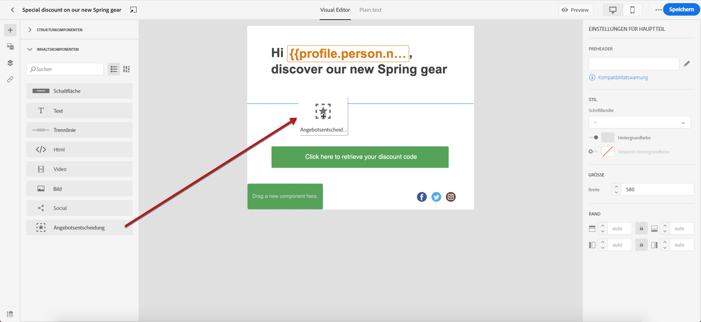
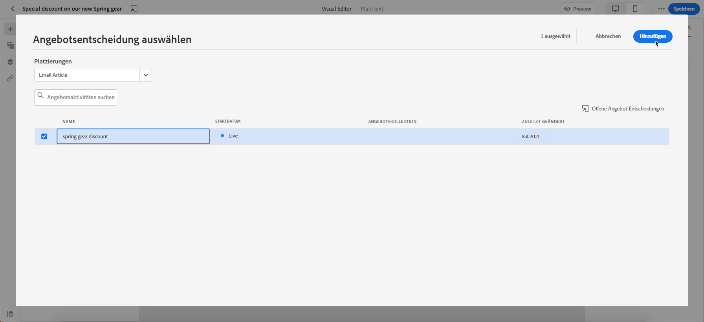
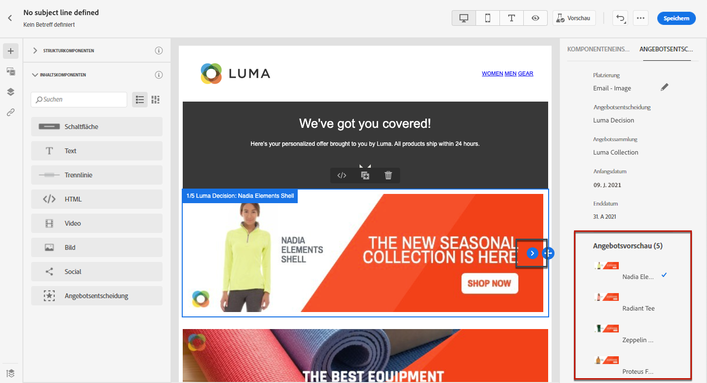
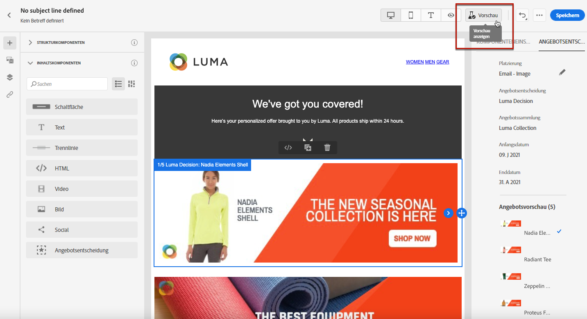
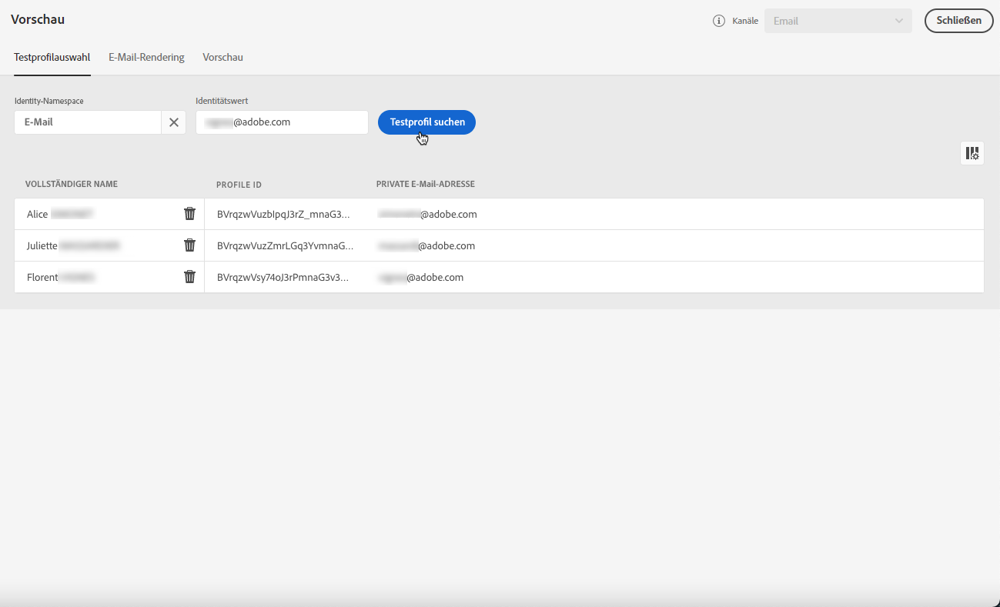
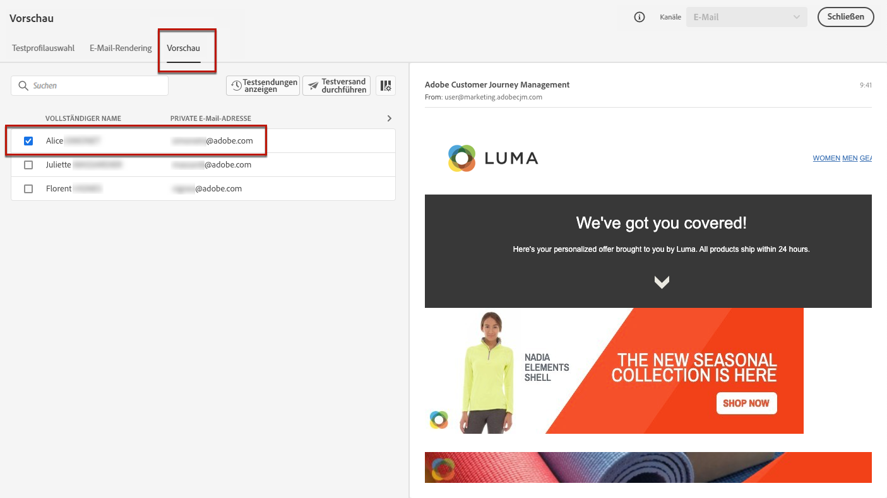
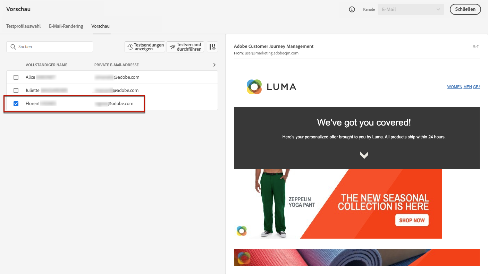

# Hinzufügen personalisierter Angebote {#deliver-personalized-offers}

In E-Mail-Nachrichten vom Typ [!DNL Journey Optimizer] können Sie Entscheidungen (ehemals &quot;Angebotsaktivitäten&quot;) einfügen, die die Offer Decisioning-Engine nutzen, um das beste Angebot für Ihre Kunden auszuwählen.

Sie können beispielsweise eine Entscheidung hinzufügen, die in Ihrer E-Mail ein besonderes Angebot mit Rabatten anzeigt, das je nach Treuestufe des Empfängers variiert.

Weiterführende Informationen zur Erstellung und Verwaltung von Angeboten finden Sie in [diesem Abschnitt](offers/get-started/starting-offer-decisioning.md).

Ein **vollständiges Beispiel von End-to-End**, das die Konfiguration von Angeboten zeigt, sie in einer Entscheidung verwendet und diese Entscheidung in einer E-Mail nutzt, finden Sie in [diesem Abschnitt](offers/offers-e2e.md#insert-decision-in-email).

➡️ [Erfahren Sie, wie Sie Angebote als Personalisierung hinzufügen](#video-offers) (Video)

## Einfügen einer Entscheidung in eine E-Mail {#insert-offers}

>[!CAUTION]
>
>Bevor Sie beginnen, müssen Sie [eine Angebotsentscheidung](offers/offer-activities/create-offer-activities.md) definieren.

Gehen Sie wie folgt vor, um eine Entscheidung in eine E-Mail-Nachricht einzufügen:

1. Erstellen Sie Ihre E-Mail und öffnen Sie dann Email Designer, um den Inhalt zu konfigurieren.

1. Fügen Sie eine Inhaltskomponente **[!UICONTROL Angebotsentscheidung]** hinzu.

   

   Erfahren Sie, wie Sie Inhaltskomponenten in [diesem Abschnitt](content-components.md) verwenden.

1. Die Registerkarte **[!UICONTROL Angebotsentscheidung]** wird in der rechten Palette angezeigt. Klicken Sie auf **[!UICONTROL Wählen Sie Angebotsentscheidung]**.

   

1. Wählen Sie im sich öffnenden Fenster die Platzierung aus, die den anzuzeigenden Angeboten entspricht.

   [Platzierungen sind Container, mit denen Ihre Angebote präsentiert werden. ](offers/offer-library/creating-placements.md) In diesem Beispiel verwenden wir die Platzierung „E-Mail-Top-Bild“. Diese Platzierung wurde in der Angebotsbibliothek erstellt, um Angebote des Typs Bild oben am Anfang von Nachrichten anzuzeigen.

1. Wählen Sie die in der Inhaltskomponente zu verwendende Angebotsaktivität aus und klicken Sie dann auf **[!UICONTROL Hinzufügen]**.

   >[!NOTE]
   >
   >In der Liste werden nur Entscheidungen angezeigt, die mit der ausgewählten Platzierung kompatibel sind. In diesem Beispiel stimmt nur eine Angebotsaktivität mit der Platzierung „E-Mail-Top-Bild“ überein.

   

Die Angebotsaktivität wird nun der Komponente hinzugefügt.

## Angebotsvorschau in einer E-Mail {#preview-offers-in-email}

Sie können die verschiedenen Angebote, die Teil der Entscheidung sind, die der E-Mail hinzugefügt wird, mit dem Abschnitt **[!UICONTROL Angebote]** oder den Pfeilen der Inhaltskomponenten in der Vorschau anzeigen.

Gehen Sie wie folgt vor, um die verschiedenen Angebote anzuzeigen, die Teil der Entscheidung mit einem Kundenprofil sind.

1. Klicken Sie auf **[!UICONTROL Vorschau]**.  

   

   >[!NOTE]
   >
   >Sie benötigen Testprofile, um eine Vorschau Ihrer Nachrichten anzeigen zu können. Erfahren Sie, wie Sie [Testprofile](building-journeys/creating-test-profiles.md) erstellen.

1. Um den Namespace auszuwählen, der zur Identifizierung von Testprofilen verwendet werden soll, wählen Sie **[!UICONTROL Email]** aus dem Feld **[!UICONTROL Identitäts-Namespace]** aus.

   >[!NOTE]
   >
   >In diesem Beispiel verwenden wir den Namespace **Email**. Weitere Informationen zu Identitäts-Namespaces von Adobe Experience Platform finden Sie [in diesem Abschnitt](https://experienceleague.adobe.com/docs/experience-platform/identity/namespaces.html?lang=de#getting-started).

1. Wählen Sie in der Liste der Identitäts-Namespaces **[!UICONTROL E-Mail]** aus und klicken Sie auf **[!UICONTROL Auswählen]**.

1. Geben Sie im Feld **[!UICONTROL Identitätswert]** den Wert ein, um das Testprofil zu identifizieren. Geben Sie in diesem Beispiel die E-Mail-Adresse eines Testprofils ein.

   <!--For example enter smith@adobe.com and click the **[!UICONTROL Add profile]** button.-->

1. Fügen Sie weitere Profile hinzu, damit Sie je nach den Profildaten verschiedene Varianten der Nachricht testen können.

   

1. Klicken Sie auf die Registerkarte **[!UICONTROL Vorschau]**, um Ihre Nachricht zu prüfen.

1. Wählen Sie ein Testprofil aus. Das Angebot, das dem ausgewählten Profil (Frau) entspricht, wird angezeigt.

   

1. Wählen Sie weitere Testprofile aus, um den E-Mail-Inhalt für jede Variante Ihrer Nachricht in der Vorschau anzuzeigen. Im Nachrichteninhalt wird nun das Angebot angezeigt, das dem ausgewählten Testprofil (jetzt ein Mann) entspricht.

   

Weitere Informationen zu den detaillierten Schritten zur Überprüfung der Nachrichtenvorschau finden Sie in [diesem Abschnitt](#preview-your-messages).

## Anleitungsvideo{#video-offers}

Erfahren Sie, wie Sie in [!DNL Journey Optimizer] eine offer decisioning-Komponente zu Nachrichten hinzufügen.

>[!VIDEO](https://video.tv.adobe.com/v/334088?quality=12)
