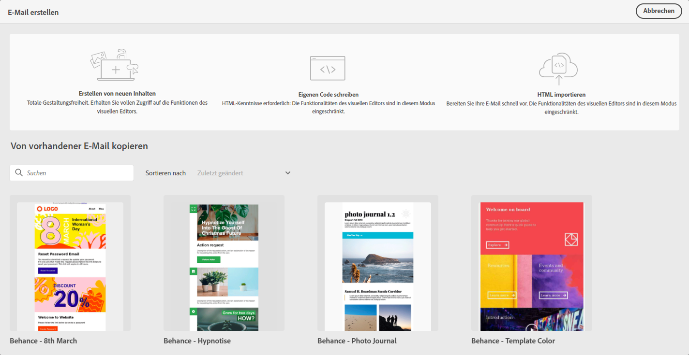

# Erste Schritte mit E-Mail-Design {#get-started-content-design}

Beim Erstellen von E-Mail-Inhalten mit [!DNL Journey Optimizer] können Sie:

* **Entwerfen Sie Ihre E-Mail von** Grund auf über die Benutzeroberfläche des E-Mail-Designers und nutzen Sie Bilder aus  [Adobe Experience Manager Assets Essentials](assets-essentials.md). Erfahren Sie, wie Sie E-Mail-Inhalte entwerfen oder integrierte Vorlagen [in diesem Abschnitt ](create-email-content.md) verwenden.

* **Code oder fügen Sie rohe** HTML direkt im E-Mail-Designer ein. Erfahren Sie, wie Sie Ihren eigenen Inhalt [in diesem Abschnitt](existing-content.md#import-raw-html-code) kodieren.

* **Importieren Sie vorhandene HTML-** Inhalte aus einer Datei oder einem ZIP-Ordner. Erfahren Sie, wie Sie einen E-Mail-Inhalt [in diesem Abschnitt](existing-content.md#import-html-content-from-file) importieren.

Diese Funktionen stehen beim Zugriff auf den E-Mail-Designer über den Anzeigebereich &quot;Nachrichtenerstellung&quot;zur Verfügung. [Erfahren Sie mehr über die Nachrichtenerstellung](create-message.md).

>[!NOTE]
>
>Beachten Sie, dass die Vorlagen im unteren Bereich statisch sind und nicht bearbeitet werden können. Diese sind nur zur Veranschaulichung verfügbar.
