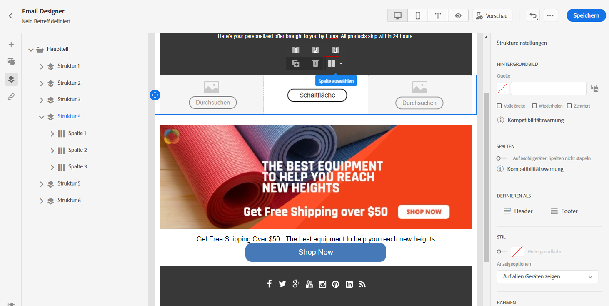
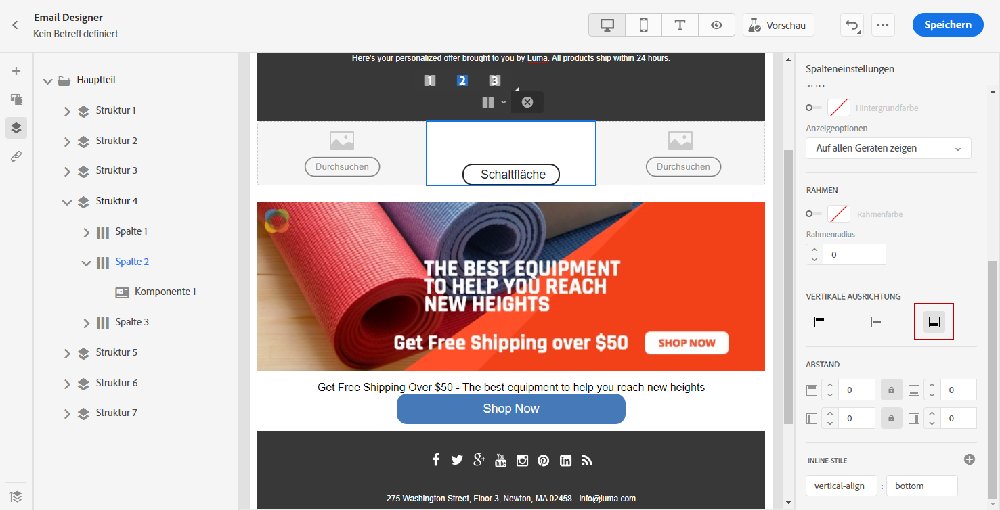
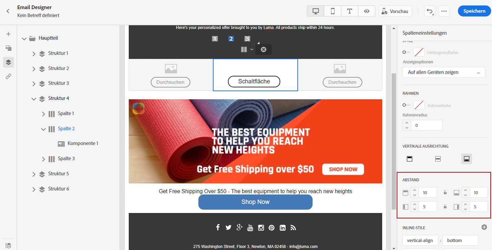

# Anpassen der senkrechten Ausrichtung und des Abstands {#adjusting-vertical-alignment-and-padding}

In diesem Beispiel passen wir den Abstand und die senkrechte Ausrichtung innerhalb einer Strukturkomponente an, die aus drei Spalten besteht.

1. Wählen Sie eine Strukturkomponente direkt in der E-Mail oder über den **[!UICONTROL Navigationsbaum]** im linken Menü aus.

   

1. Wählen Sie in der Symbolleiste mit der Option **[!UICONTROL Spalte auswählen]** die gewünschte Spalte aus. Sie können sie auch im Strukturbaum auswählen.

   Die bearbeitbaren Parameter für diese Spalte werden im Menü **[!UICONTROL Spalteneinstellungen]** angezeigt.

   

1. Wählen Sie unter **[!UICONTROL Vertikale Ausrichtung]** die Option **[!UICONTROL Unten]** aus.

   Die Inhaltskomponente wird an den unteren Rand der Spalte verschoben.

   

1. Definieren Sie unter **[!UICONTROL Abstand]** den Abstand der Spalte vom oberen Rand. Wählen Sie das Schlosssymbol aus, um die Synchronisation mit dem Abstand vom unteren Rand aufzuheben.

   Definieren Sie den linken und rechten Abstand für diese Spalte.

   

1. Gehen Sie analog mit den anderen Ausrichtungs- und Abstandseinstellungen der Spalten vor.

1. Speichern Sie Ihre Änderungen.