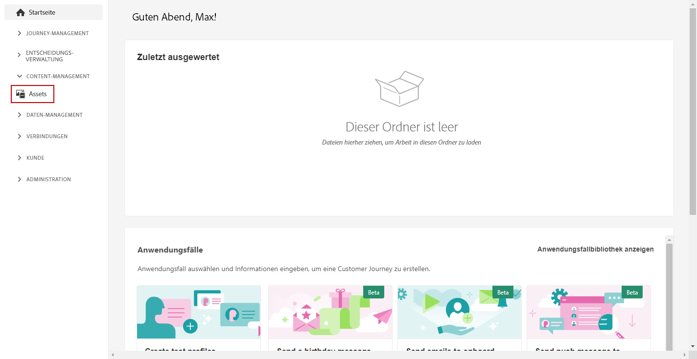
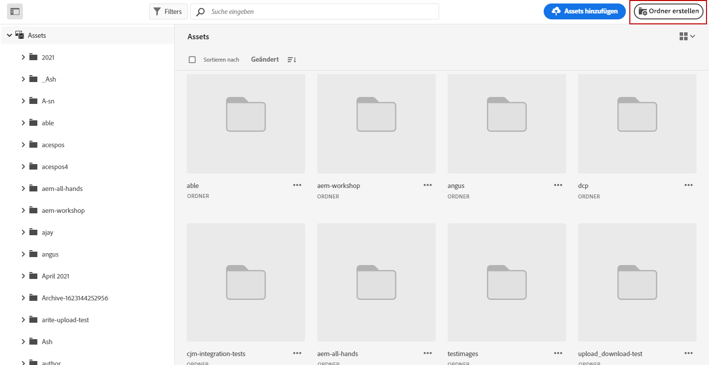
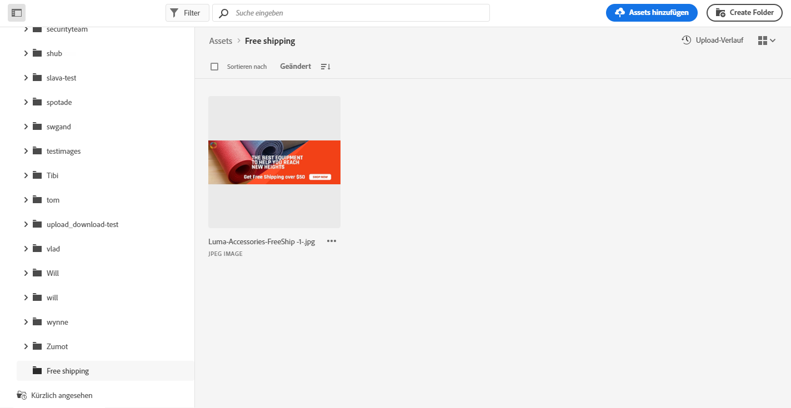
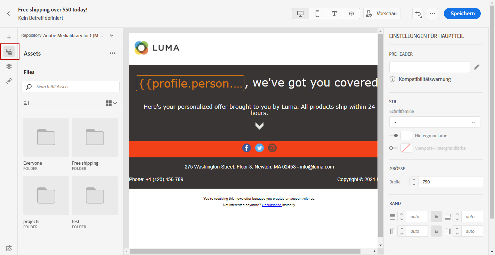

# Erstellen und Verwalten von Assets {#experience-manager-assets}

## Erste Schritte mit [!DNL Assets Essentials] {#get-started-assets-essentials}

[!DNL Adobe Experience Manager Assets Essentials] bietet ein zentrales Repository mit Assets, die Sie für Ihre Nachrichten verwenden können. Sie können darauf direkt in [!DNL Adobe Journey Optimizer] über den Abschnitt **[!UICONTROL Assets]** zugreifen. Sie können beim Entwerfen eines E-Mail-Inhalts auch auf Assets und Ordner zugreifen. [Weitere Informationen zum Entwerfen von E-Mails](design-emails.md).

Bevor Sie [!DNL Adobe Experience Manager Assets Essentials] verwenden können, müssen Sie Benutzer zu den Produktprofilen **Assets Essentials Consumer Users** oder/und **Assets Essentials Users** hinzufügen. [Weitere Informationen finden Sie in der Dokumentation zu Assets Essentials](https://experienceleague.adobe.com/docs/experience-manager-assets-essentials/help/deploy-administer.html?lang=de){target=&quot;_blank&quot;}.

>[!NOTE]
>Für Journey Optimizer-Produkte, die vor dem 6. Januar 2022 erworben wurden, müssen Sie [!DNL Adobe Experience Manager Assets Essentials] für Ihre Organisation bereitstellen. Weitere Informationen finden Sie im Abschnitt [Bereitstellen von Assets Essentials](https://experienceleague.adobe.com/docs/experience-manager-assets-essentials/help/deploy-administer.html?lang=de){target=&quot;_blank&quot;}.

## Hochladen und Hinzufügen von Assets{#add-asset}

Zum Importieren von Dateien in [!DNL Assets Essentials] müssen Sie zunächst den Ordner suchen oder erstellen, in dem sie gespeichert werden. Danach können Sie diese Dateien in Ihren E-Mail-Inhalt einfügen.

Weitere Informationen zum Hochladen von Assets finden Sie in der [Dokumentation zu Adobe Experience Manager Assets Essentials](https://experienceleague.adobe.com/docs/experience-manager-assets-essentials/help/add-delete.html?lang=de){target=&quot;_blank&quot;}.

1. Wählen Sie auf der [!DNL Adobe Journey Optimizer] Startseite unter dem Menü **[!UICONTROL Content-Management]** die Registerkarte **[!UICONTROL Assets]**, um auf [!DNL Assets Essentials] zuzugreifen.

   

1. Doppelklicken Sie im mittleren Bereich oder in der Baumansicht auf einen Ordner, um ihn zu öffnen.

   Sie können auch auf **[!UICONTROL Ordner erstellen]** klicken, um einen neuen Ordner zu erstellen.

   

1. Klicken Sie im ausgewählten oder erstellten Ordner auf **[!UICONTROL Assets hinzufügen]**, um ein neues Asset in Ihren Ordner hochzuladen.

   

1. Von **[!UICONTROL Dateien hochladen]** aus klicken Sie auf **[!UICONTROL Durchsuchen]** und wählen Sie aus, ob Sie **[!UICONTROL Dateien durchsuchen]** oder **[!UICONTROL Ordner durchsuchen]** möchten.

   

1. Wählen Sie die Datei aus, die Sie hochladen möchten. Wenn Sie fertig sind, klicken Sie auf **[!UICONTROL Hochladen]**.

   Weitere Informationen zum Verwalten von Assets finden Sie auf [dieser Seite](https://experienceleague.adobe.com/docs/experience-manager-assets-essentials/help/manage-organize.html?lang=de).

1. Nach dem Hochladen des Assets können Sie Ihre Assets jetzt über Email Designer in eine Ihrer Nachrichten einfügen.

   Ihr Asset kann auch mit dem Modus **Bearbeiten** von [!DNL Assets Essentials] weiter bearbeitet werden. [Weitere Informationen](https://experienceleague.adobe.com/docs/experience-manager-assets-essentials/help/edit-images.html?lang=de){target=&quot;_blank&quot;}.

   

1. Wählen Sie in [!DNL Adobe Journey Optimizer] im linken Bereich von E-Mail-Designer die Option **[!UICONTROL Asset-Auswahl]**.

   

1. Wählen Sie Ihren Assets-Ordner aus. Sie können auch in der Suchleiste nach Ihrem Asset oder Ordner suchen.

1. Ziehen Sie Ihr Asset in den E-Mail-Inhalt.

   

1. Sie können Ihre Assets weiter anpassen, z. B. indem Sie einen externen Link oder einen Text mit den **[!UICONTROL Komponenteneinstellungen]** hinzufügen. [Weitere Informationen zu Komponenteneinstellungen](content-components.md)

   

Nachdem die Nachricht erstellt und personalisiert wurde, können Sie diese veröffentlichen, um sie für die Ausführung verfügbar zu machen. [Weitere Informationen](../messages/publish-manage-message.md)
