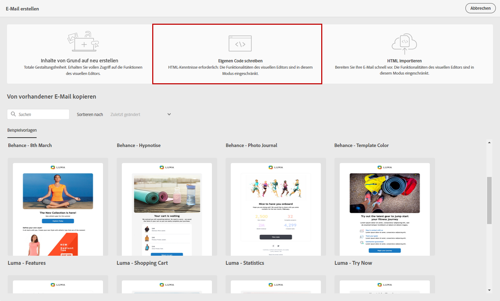
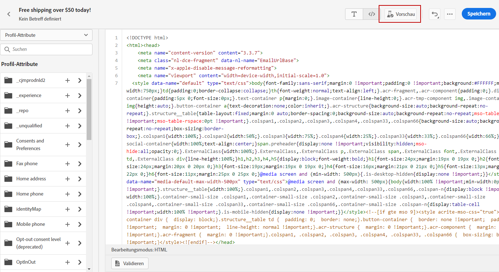
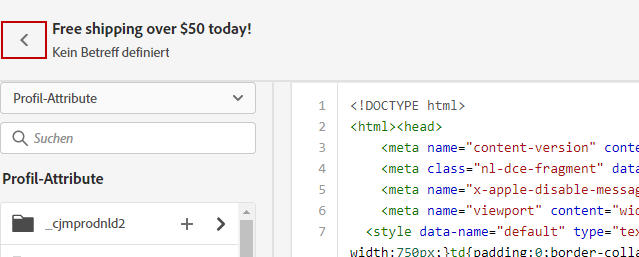

# Code Ihres eigenen Inhalts {#code-content}

Verwenden Sie den Modus **[!UICONTROL Eigenen Code erstellen]**, um HTML-Roh-Code zu importieren und/oder Ihren E-Mail-Inhalt zu kodieren. Diese Methode setzt HTML-Kenntnisse voraus.

➡️ [Entdecken Sie diese Funktion im Video](#video).

>[!CAUTION]
>
> Bilder von [Adobe Experience Manager Assets Essentials](assets-essentials.md) können bei dieser Methode nicht referenziert werden. Die Bilder, auf die im HTML-Code verwiesen wird, müssen an einem öffentlichen Speicherort abrufbar sein.

1. Wählen Sie in der Startseite von Email Designer die Option **[!UICONTROL Eigenen Code erstellen]**.

   

1. Geben Sie Ihren HTML-Roh-Code ein oder fügen Sie ihn ein.

1. Verwenden Sie den linken Bereich, um die Personalisierungsfunktionen von [!DNL Journey Optimizer] anzuwenden. Weiterführende Informationen hierzu finden Sie in [diesem Abschnitt](../personalization/personalize.md).

   

1. Wenn Sie Email Designer öffnen möchten, um Ihre E-Mail auf der Basis eines neuen Entwurfs zu gestalten, wählen Sie **[!UICONTROL Entwurf ändern]** aus dem Menü „Optionen“.

   

1. Klicken Sie auf die Schaltfläche **[!UICONTROL Vorschau]**, um den Nachrichtenentwurf und die Personalisierung mithilfe von Testprofilen zu überprüfen. Weiterführende Informationen hierzu finden Sie in [diesem Abschnitt](preview.md).

   

1. Wenn Ihr Code fertig ist, klicken Sie auf **[!UICONTROL Speichern]** und kehren Sie dann zurück zum Bildschirm „Nachrichtenerstellung“, um die Nachricht fertigzustellen.

   
