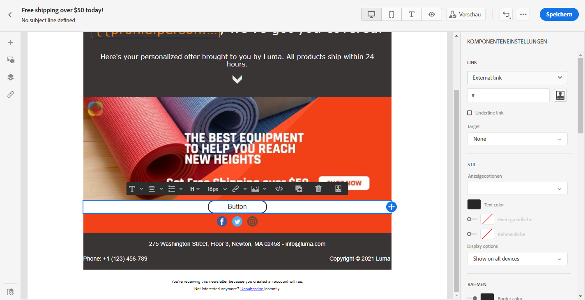
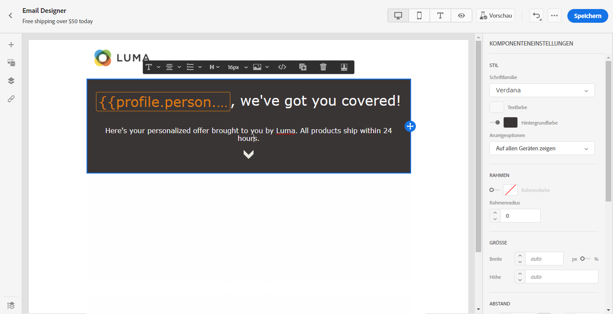
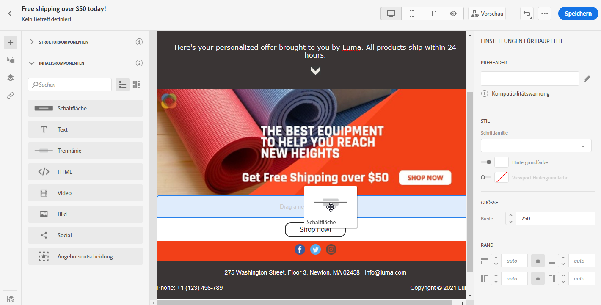
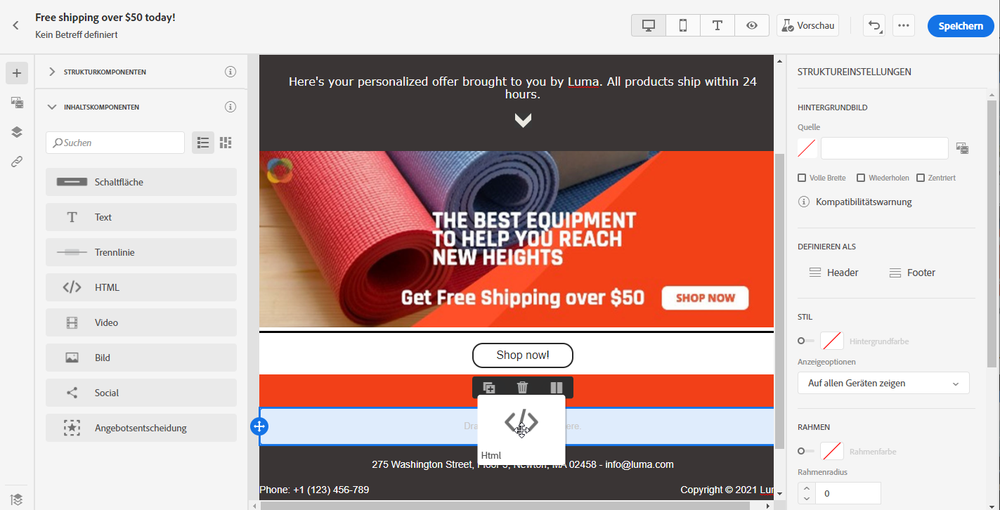
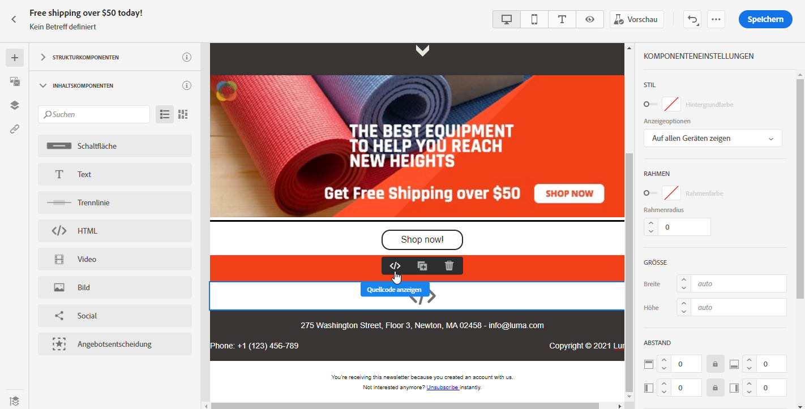
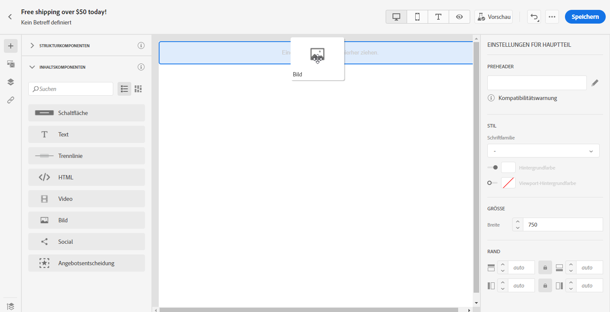
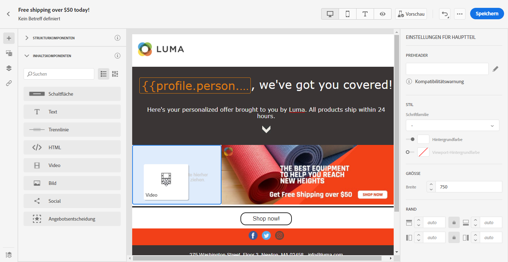
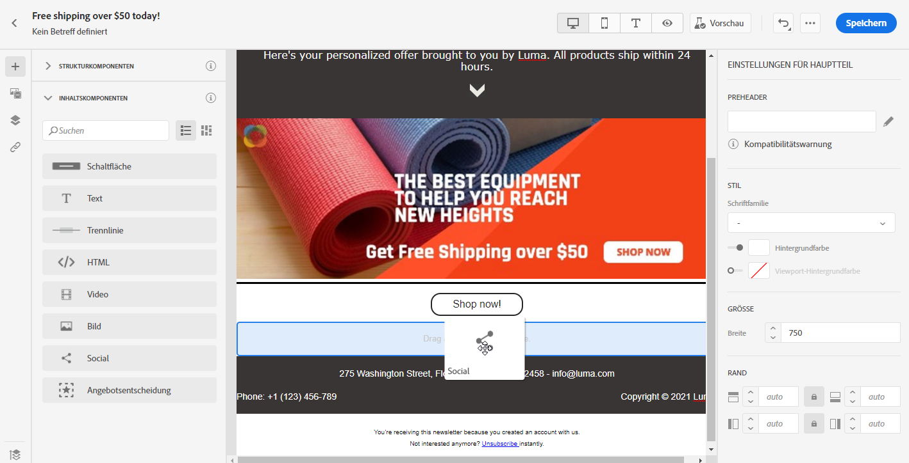
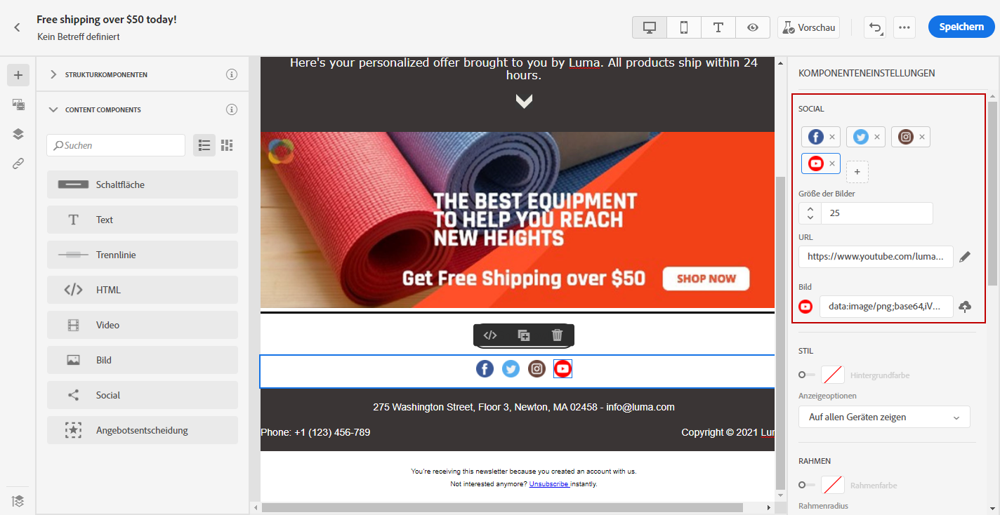

# Verwenden von Inhaltskomponenten von Email Designer {#content-components}

>[!CONTEXTUALHELP]
>id="ac_content_components_email"
>title="Über Inhaltskomponenten"
>abstract="Inhaltskomponenten sind leere Platzhalter für Inhalt, die Sie zum Erstellen des E-Mail-Layouts verwenden können."

>[!CONTEXTUALHELP]
>id="ac_content_components_landing_page"
>title="Über Inhaltskomponenten"
>abstract="Inhaltskomponenten sind leere Platzhalter für Inhalte, mit denen Sie das Layout einer Landingpage erstellen können."

>[!CONTEXTUALHELP]
>id="ac_content_components_fragment"
>title="Über Inhaltskomponenten"
>abstract="Inhaltskomponenten sind leere Platzhalter für Inhalte, die Sie zum Erstellen eines Fragment-Layouts verwenden können."

>[!CONTEXTUALHELP]
>id="ac_content_components_template"
>title="Über Inhaltskomponenten"
>abstract="Inhaltskomponenten sind leere Platzhalter für Inhalte, die Sie zum Erstellen eines Vorlagen-Layouts verwenden können."

Wenn Sie Ihren E-Mail-Inhalt von Grund auf neu erstellen, ermöglichen **[!UICONTROL Inhaltskomponenten]** die Personalisierung Ihrer E-Mail mit unbearbeiteten, leeren Komponenten, die Sie verwenden können, sobald sie in eine E-Mail eingefügt wurden.
Einer **[!UICONTROL Strukturkomponente]**, die das Layout Ihrer E-Mail definiert, können Sie so viele **[!UICONTROL Inhaltskomponenten]** hinzufügen, wie Sie benötigen.

## Schaltfläche {#buttons}

Verwenden Sie die Komponente **[!UICONTROL Schaltfläche]**, um mehrere Schaltflächen in Ihre E-Mail einzufügen und Ihre E-Mail-Audience auf eine andere Seite weiterzuleiten.

1. Ziehen Sie eine **[!UICONTROL Schaltfläche]** per Drag-and-Drop von den **[!UICONTROL Inhaltskomponenten]** in eine **[!UICONTROL Strukturkomponente]**.

   

1. Klicken Sie auf die neu hinzugefügte Schaltfläche, um den Text zu anzupassen und die **[!UICONTROL Komponenteneinstellungen]** im rechten Bereich von Email Designer bearbeiten zu können.

   

1. Fügen Sie im Feld **[!UICONTROL Link]** der **[!UICONTROL Komponenteneinstellungen]** die URL hinzu, zu der Ihre Audience beim Klick auf die Schaltfläche weitergeleitet werden soll.

1. Wählen Sie mit der Dropdown-Liste **[!UICONTROL Target]** aus, wie Ihre Audience umgeleitet werden soll:

   * **[!UICONTROL None]**: öffnet den Link in demselben Frame, in dem er angeklickt wurde (Standardwert).
   * **[!UICONTROL Blank]**: öffnet den Link in einem neuen Fenster oder auf einer neuen Registerkarte.
   * **[!UICONTROL Self]**: öffnet den Link in demselben Frame, in dem er angeklickt wurde.
   * **[!UICONTROL Parent]**: öffnet den Link im übergeordneten Frame.
   * **[!UICONTROL Top]**: öffnet den Link im gesamten Fenster.

   

1. Sie können die Schaltfläche nun weiter anpassen, indem Sie beispielsweise die Optionen **[!UICONTROL Stil]**, **[!UICONTROL Spanne]** und **[!UICONTROL Rahmen]** ändern.

## Text {#text}

Verwenden Sie die Komponente **[!UICONTROL Text]**, um Text in Ihre E-Mail einzufügen. Sie können die Farbe, den Stil und die Größe des Textes in den **[!UICONTROL Komponenteneinstellungen]** anpassen.

1. Ziehen Sie **[!UICONTROL Text]** per Drag-and-Drop von den **[!UICONTROL Inhaltskomponenten]** in eine **[!UICONTROL Strukturkomponente]**.

   

1. Klicken Sie auf die neu hinzugefügte Komponente, um den Text zu anzupassen und die **[!UICONTROL Komponenteneinstellungen]** im rechten Bereich von Email Designer bearbeiten zu können.

1. Ändern Sie den Text mit folgenden Optionen in der Symbolleiste:

   

   * **[!UICONTROL Textstil ändern]**: Anwendung von Fett, Kursiv, Unterstrichen oder Durchgestrichen auf den Text.
   * **Ausrichtung ändern**: Auswahl von linker, rechter, zentrierter oder Blocksatz-Ausrichtung für Ihren Text.
   * **[!UICONTROL Liste erstellen]**: Einfügen einer Liste mit Aufzählungszeichen oder Nummerierung.
   * **[!UICONTROL Überschrift festlegen]**: Definition von bis zu sechs Überschriftsebenen in Ihrem Text.
   * **Schriftgröße**: Auswahl der Schriftgröße des Textes in Pixel.
   * **[!UICONTROL Bild bearbeiten]**: Einfügen eines Bildes oder Assets in Ihre Textkomponente. [Weitere Informationen über Asset-Management.](assets-essentials.md)
   * **[!UICONTROL Quellcode anzeigen]**: Anzeigen des Quell-Codes Ihres Textes (keine Änderungen möglich).
   * **[!UICONTROL Duplizieren]**: Hinzufügen einer Kopie Ihrer Textkomponente.
   * **[!UICONTROL Löschen]**: Entfernen einer ausgewählten Textkomponente aus Ihrer E-Mail.
   * **[!UICONTROL Personalisierung hinzufügen]**: Einfügen von Personalisierungsfeldern zur Inhaltsanpassung auf der Basis von Profildaten. [Weitere Informationen über die Personalisierung von Inhalt](../personalization/personalize.md).
   * **[!UICONTROL Bedingten Inhalt aktivieren]**: Hinzufügen bedingter Inhalte, um den Inhalt der Komponente an die Zielprofile anzupassen. [Erfahren Sie mehr über dynamische Inhalte](../personalization/get-started-dynamic-content.md).

1. Passen Sie **[!UICONTROL Textfarbe]**, **[!UICONTROL Schriftfamilie]** und **[!UICONTROL Größe]** in den **[!UICONTROL Komponenteneinstellungen]** an.

   

## Trennlinie {#divider}

Verwenden Sie die Komponente **[!UICONTROL Trennlinie]**, um das Layout und den Inhalt Ihrer E-Mail durch eine Trennlinie zu strukturieren.
Sie können die Farbe, den Stil und die Größe der Trennlinie in den **[!UICONTROL Komponenteneinstellungen]** auswählen.

## HTML {#HTML}

Verwenden Sie **[!UICONTROL HTML]**, um die unterschiedlichen Teile Ihrer vorhandenen HTML-Datei zu kopieren und einzufügen. Damit können Sie kostenfrei modulare HTML-Komponenten erstellen.

Um die Kompatibilität von externem Inhalt mit Email Designer zu gewährleisten, empfiehlt Adobe, eine neue Nachricht zu erstellen und den Inhalt aus der existierenden E-Mail in Komponenten einzufügen.

1. Ziehen Sie **[!UICONTROL HTML]** per Drag-and-Drop von den **[!UICONTROL Inhaltskomponenten]** in eine **[!UICONTROL Strukturkomponente]**.

   

1. Klicken Sie auf die neu hinzugefügte Komponente und dann auf **[!UICONTROL Quellcode anzeigen]**, um Ihren HTML-Code hinzuzufügen.

   

1. Kopieren Sie den HTML-Code, den Sie Ihrer E-Mail hinzufügen möchten, und klicken Sie auf **[!UICONTROL Speichern]**.

1. Nun können Sie Ihren HTML-Code weiter anpassen, indem Sie die Parameter **[!UICONTROL Style]**, **[!UICONTROL Margin]** und **[!UICONTROL Border]** ändern oder einen Link hinzufügen, um Ihre Audience zu einem anderen Inhalt weiterzuleiten.

## Bild {#image}

Verwenden Sie die Komponente **[!UICONTROL Bild]**, um eine Bilddatei von Ihrem Computer in Ihre E-Mail einzufügen.

1. Ziehen Sie **[!UICONTROL Bild]** per Drag-and-Drop von den **[!UICONTROL Inhaltskomponenten]** in eine **[!UICONTROL Strukturkomponente]**.

   

1. Klicken Sie auf **[!UICONTROL Durchsuchen]**, um eine in Ihren Assets gespeicherte Bilddatei auszuwählen.

   Weitere Informationen zu [!DNL Assets Essentials] finden Sie in der [Dokumentation zu Adobe Experience Manager Assets Essentials](https://experienceleague.adobe.com/docs/experience-manager-assets-essentials/help/introduction.html?lang=de){target=&quot;_blank&quot;}.

1. Klicken Sie auf die neu hinzugefügten Komponenten, um ihre **[!UICONTROL Inhaltskomponenten]** zu konfigurieren und die **[!UICONTROL Komponenteneinstellungen]** im rechten Bereich von Email Designer zu bearbeiten.

1. Definieren Sie die Eigenschaften Ihres Bildes:

   * **[!UICONTROL Bildtitel]** definiert den Titel für das Bild.
   * Mit **[!UICONTROL Alt-Text]** legen Sie die Bildunterschrift fest. Dies entspricht dem HTML-Attribut „alt“.

   

1. Nun können Sie Ihr Bild weiter anpassen, indem Sie die Parameter **[!UICONTROL Style]**, **[!UICONTROL Margin]** und **[!UICONTROL Border]** ändern oder einen Link hinzufügen, um Ihre Audience zu einem anderen Inhalt weiterzuleiten.

## Video {#Video}

>[!CONTEXTUALHELP]
>id="ac_edition_video_email"
>title="Videoeinstellungen"
>abstract="Verwenden Sie diese Komponente, um ein Video in Ihre E-Mail einzufügen. Beachten Sie, dass Videos nicht auf allen E-Mail-Clients funktionieren. Wir empfehlen, ein Reservebild festzulegen."

>[!CONTEXTUALHELP]
>id="ac_edition_video_landing_page"
>title="Videoeinstellungen"
>abstract="Verwenden Sie diese Komponente, um zu Ihrer Landingpage ein Video hinzuzufügen. Beachten Sie, dass Videos nicht auf allen Nachrichten-Clients funktionieren. Wir empfehlen, ein Reservebild festzulegen."

>[!CONTEXTUALHELP]
>id="ac_edition_video_fragment"
>title="Videoeinstellungen"
>abstract="Verwenden Sie diese Komponente, um ein Video in Ihr Fragment einzufügen. Beachten Sie, dass Videos nicht auf allen Nachrichten-Clients funktionieren. Wir empfehlen, ein Reservebild festzulegen."

>[!CONTEXTUALHELP]
>id="ac_edition_video_template"
>title="Videoeinstellungen"
>abstract="Verwenden Sie diese Komponente, um ein Video in Ihre Vorlage einzufügen. Beachten Sie, dass Videos nicht auf allen Nachrichten-Clients funktionieren. Wir empfehlen, ein Reservebild festzulegen."

Verwenden Sie die Komponente **[!UICONTROL Video]**, um über einen URL-Link ein Video in Ihre E-Mail einzufügen.

1. Ziehen Sie **[!UICONTROL Video]** per Drag-and-Drop von den **[!UICONTROL Inhaltskomponenten]** in eine **[!UICONTROL Strukturkomponente]**.

   

1. Klicken Sie auf die neu hinzugefügten Komponenten, um ihre **[!UICONTROL Inhaltskomponenten]** zu konfigurieren und die **[!UICONTROL Komponenteneinstellungen]** im rechten Bereich von Email Designer zu bearbeiten.

1. Fügen Sie im Feld **[!UICONTROL Video-Link]** der **[!UICONTROL Komponenteneinstellungen]** Ihre Video-URL hinzu.

   

1. Sie können dem Video ein **[!UICONTROL Standbild]** hinzufügen, das angezeigt wird, bis Ihre Audience auf die Wiedergabe-Schaltfläche klickt.

1. Sie können Ihr Bild nun weiter anpassen, indem Sie beispielsweise die Optionen **[!UICONTROL Style]**, **[!UICONTROL Margin]** und **[!UICONTROL Border]** ändern.

## Social {#social}

Verwenden Sie die Komponente **[!UICONTROL Social]**, um Links zu Social-Media-Seiten in Ihre E-Mail einzufügen.

1. Ziehen Sie **[!UICONTROL Social]** per Drag-and-Drop von den **[!UICONTROL Inhaltskomponenten]** in eine **[!UICONTROL Strukturkomponente]**.

   

1. Klicken Sie auf die neu hinzugefügten Komponenten, um ihre **[!UICONTROL Inhaltskomponenten]** zu konfigurieren und die **[!UICONTROL Komponenteneinstellungen]** im rechten Bereich von Email Designer zu bearbeiten.

1. Im Feld **[!UICONTROL Social]** der **[!UICONTROL Komponenteneinstellungen]** können Sie auswählen, welche Social Media Sie hinzufügen oder entfernen möchten.

   

1. Bestimmen Sie die Größe der Symbole im Feld **[!UICONTROL Größe der Bilder]**.

1. Klicken Sie auf jedes Ihrer Social-Media-Symbole, um die **[!UICONTROL URL]** zu konfigurieren, zu der Ihre Audience weitergeleitet wird.

   

1. Bei Bedarf können Sie auch die Symbole der einzelnen Social Media im Feld **[!UICONTROL Bild]** ändern.

1. Sie können Ihre Social-Media-Symbole nun weiter anpassen, indem Sie beispielsweise die Optionen **[!UICONTROL Style]**, **[!UICONTROL Margin]** und **[!UICONTROL Border]** ändern.

## Angebotsentscheidung {#offer-decision}

Verwenden Sie die Komponente **[!UICONTROL Angebotsentscheidung]**, um Entscheidungen (früher Angebotsaktivitäten) in Ihre Nachrichten einzufügen. Entscheidungen nutzen Entscheidungs-Management, um das beste Angebot für Ihre Kunden auszuwählen.

Verwandte Themen:

* [Erste Schritte mit dem Entscheidungs-Management](../offers/get-started/starting-offer-decisioning.md)
* [Einfügen personalisierter Angebote in E-Mails](deliver-personalized-offers.md)
