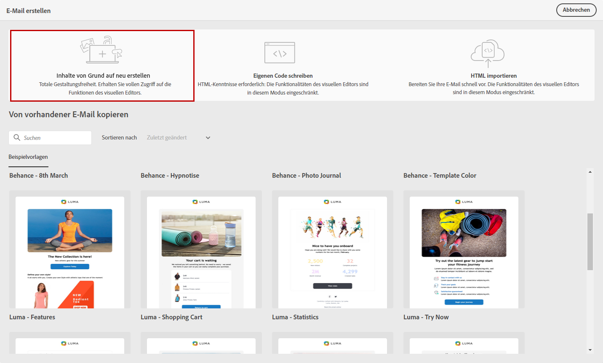
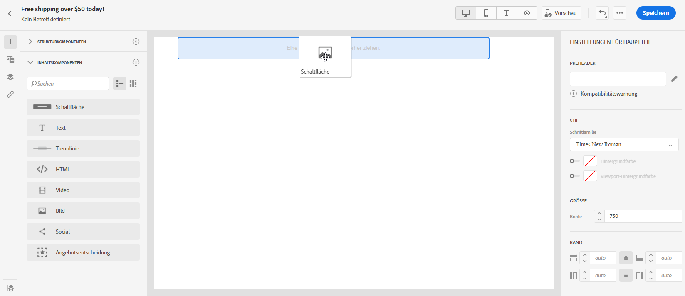
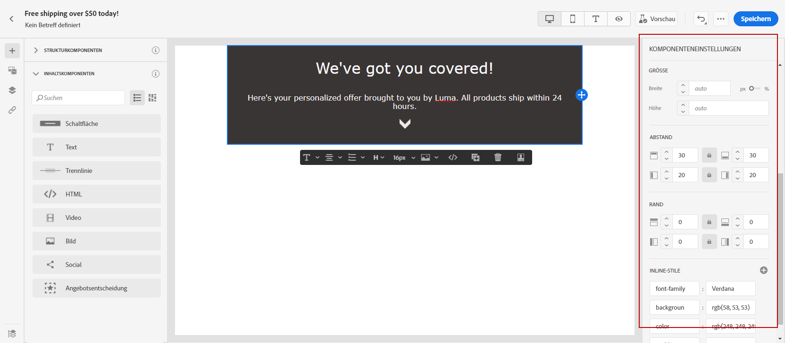
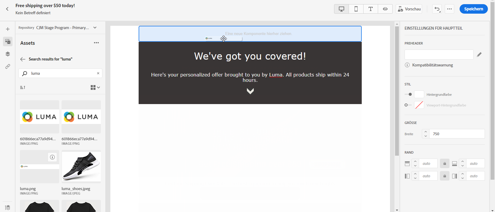
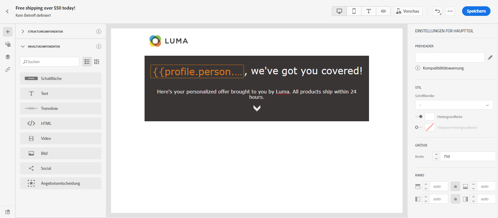
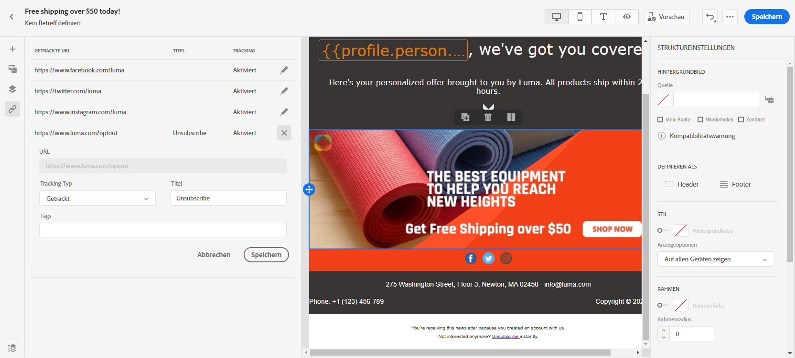
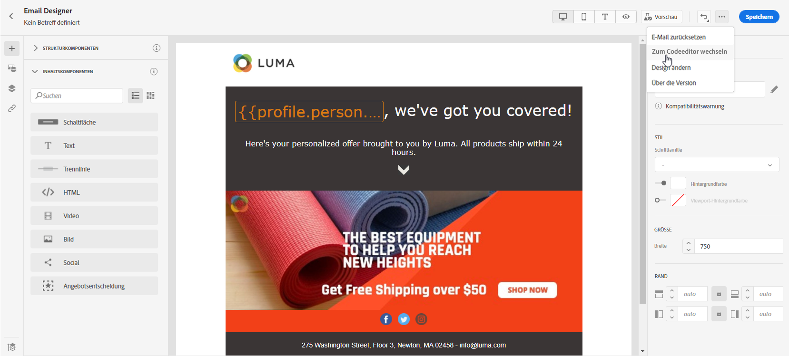
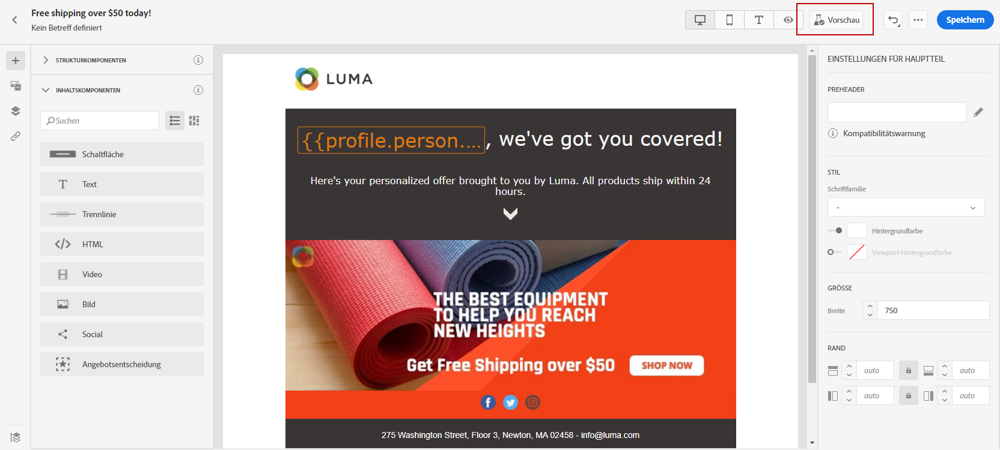

# Von Grund auf neu erstellen {#create-email-content}

>[!CONTEXTUALHELP]
>id="ac_structure_components"
>title="Über Strukturkomponenten"
>abstract="Strukturkomponenten definieren das Layout der E-Mail."

>[!CONTEXTUALHELP]
>id="ac_edition_columns"
>title="Definieren von E-Mail-Spalten"
>abstract="Mit Email Designer können Sie das Layout Ihrer E-Mail einfach definieren, indem Sie die Spaltenstruktur definieren."

Email Designer bietet eine einfache Möglichkeit, die Struktur Ihrer E-Mail zu bestimmen. Durch das Hinzufügen und Verschieben von strukturellen Elementen durch einfaches Drag &amp; Drop können Sie Ihrer E-Mail in Sekundenschnelle die gewünschte Form verleihen.

Um bei der Erstellung Ihrer E-Mail-Inhalte mit Email Designer zu beginnen, führen Sie die folgenden Schritte aus:

1. Wählen Sie auf der Startseite von Email Designer die Option **[!UICONTROL Erstellen von neuen Inhalten]** aus.

   

1. Das Layout Ihrer E-Mail und ihres Inhalts können Sie durch Ziehen und Ablegen von **[!UICONTROL Strukturkomponenten]** konfigurieren.

   >[!NOTE]
   >
   >Beachten Sie, dass das Stapeln von Spalten nicht mit allen E-Mail-Programmen kompatibel ist. Wenn dies nicht unterstützt wird, werden Spalten nicht gestapelt.
   >
   >Sobald die Komponenten in der E-Mail platziert sind, können sie nicht mehr verschoben oder entfernt werden, außer es befindet sich bereits eine Inhaltskomponente oder ein Fragment darin.

   

1. Fügen Sie beliebig viele **[!UICONTROL Strukturkomponenten]** hinzu.

   Wählen Sie die Komponente **[!UICONTROL n:n Spalte]** aus, um die Anzahl der Spalten zu definieren (3 bis 10). Sie können auch die Breite jeder Spalte ändern, indem Sie den Pfeil am unteren Rand einer jeden Spalte verschieben.

   >[!NOTE]
   >
   >Die Größe einer Spalte muss immer mindestens 10 % der Gesamtbreite der Strukturkomponente betragen. Sie können nur leere Spalten entfernen.

1. Aus der Dropdown-Liste **[!UICONTROL Inhaltskomponenten]** können Sie so viele **[!UICONTROL Inhaltskomponenten]** hinzufügen, wie Sie in Ihrer Strukturkomponente benötigen. [Weitere Informationen zu Inhaltskomponenten](content-components.md).

   

1. Jede Komponente kann mit dem Abschnitt **[!UICONTROL Komponenteneinstellungen]** weiter angepasst werden. Sie können beispielsweise Ihren Textstil, den Abstand oder den Rand Ihrer Komponente ändern. [Erfahren Sie mehr über Ausrichtung und Abstand](adjusting-vertical-alignment-and-padding.md).

   

1. Über die **[!UICONTROL Asset-Auswahl]** können Sie Ihrer E-Mail direkt Assets hinzufügen, die in der **[!UICONTROL Asset-Bibliothek]** gespeichert sind. [Weitere Informationen über Asset-Management.](assets-essentials.md)

   Doppelklicken Sie auf den Ordner, der Ihre Assets enthält, und ziehen Sie das Asset, das Sie Ihrer E-Mail hinzufügen möchten, per Drag-and-Drop hinein.

   

1. Fügen Sie Personalisierungsfelder hinzu, um den Inhalt aus Ihren Profildaten zu personalisieren. [Weitere Informationen über die Personalisierung von Inhalt](../personalization/personalize.md).

   

1. Überprüfen Sie auf der Registerkarte **[!UICONTROL Links]** im linken Bereich die Liste aller URLs Ihres Inhalts, die verfolgt werden sollen. Sie können bei Bedarf ihren **[!UICONTROL Tracking-Typ]**, **[!UICONTROL Label]** und **[!UICONTROL Tags]** ändern.

   

   >[!NOTE]
   >
   >Weitere Informationen zu Links und zum Nachrichten-Tracking finden Sie auf [dieser Seite](message-tracking.md).

1. Bei Bedarf können Sie zum Code-Editor wechseln, um Ihre E-Mail weiter zu personalisieren, indem Sie im erweiterten Menü auf **[!UICONTROL Zum Code-Editor wechseln]** klicken. Weitere Informationen zum Code-Editor finden Sie auf [dieser Seite](code-content.md#).

   >[!NOTE]
   >
   >Nach dem Wechsel zum Code-Editor können Sie den visuellen Designer für diese E-Mail nicht mehr verwenden.

   

1. Klicken Sie auf **[!UICONTROL Vorschau anzeigen]**, um Ihre gerenderte E-Mail zu überprüfen. Sie können zwischen der Desktop- oder der mobilen Ansicht wählen.

   Weiterführende Informationen zur Vorschau Ihrer E-Mail finden Sie auf [dieser Seite](preview.md).

   

1. Wenn Ihre E-Mail fertig ist, klicken Sie auf **[!UICONTROL Speichern und schließen]**.

Ihr E-Mail-Inhalt kann jetzt in einer Nachricht verwendet werden. [Erfahren Sie, wie Sie eine Nachricht senden](../messages/publish-manage-message.md).
