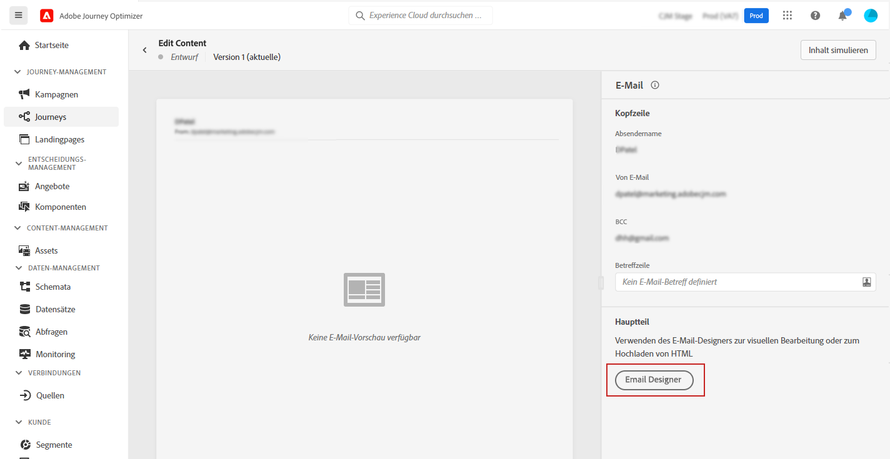
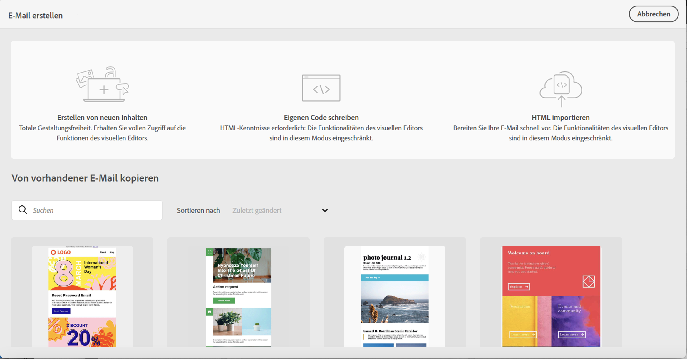

# Erste Schritte beim Gestalten von E-Mails {#get-started-content-design}

Sie können vorhandene Inhalte in [!DNL Journey Optimizer] importieren oder die Funktionen zur Inhaltserstellung nutzen:

* Sie können die **Funktionen zur E-Mail-Gestaltung** in [!DNL Journey Optimizer] verwenden, um responsive E-Mails zu erstellen bzw. zu importieren. [Weitere Informationen](../design/create-email-content.md)

* Nutzen Sie die Möglichkeiten von **Adobe Experience Manager Assets Essentials**, um Ihre E-Mails zu gestalten und um Ihre eigene Asset-Datenbank zu erstellen und verwalten. [Weitere Informationen](../design/assets-essentials.md)

* Suchen Sie **Adobe Stock-Fotos**, um Ihre Inhalte zu erstellen und Ihr E-Mail-Design zu verbessern. [Weitere Informationen](../design/stock.md)

* Verbessern Sie das Kundenerlebnis, indem Sie personalisierte und dynamische Nachrichten auf der Basis ihrer Kundenprofil-Attribute erstellen. Weitere Informationen zu [Personalisierung](../personalization/personalize.md) und [dynamischen Inhalten](../personalization/get-started-dynamic-content.md).

➡️ [Entdecken Sie diese Funktion im Video](#video)

Nachdem Sie [Ihre Nachricht erstellt](../messages/get-started-content.md) haben, können Sie mit der Erstellung Ihres E-Mail-Inhalts beginnen.

1. Wählen Sie in der neu erstellten Nachricht **[!UICONTROL Email Designer]** im Abschnitt **[!UICONTROL Textkörper]** aus.

   

1. Wählen Sie auf der Startseite von Email Designer unter den folgenden Optionen, wie Sie Ihre E-Mail gestalten möchten:

   * **Entwerfen Sie Ihre E-Mail von Grund auf** über die Benutzeroberfläche von Email Designer und nutzen Sie Bilder aus [Adobe Experience Manager Assets Essentials](assets-essentials.md). Erfahren Sie [in diesem Abschnitt](create-email-content.md), wie Sie E-Mail-Inhalt gestalten oder integrierte Vorlagen verwenden.

   * **Kopieren Sie aus einer vorhandener E-Mail** aus einer Liste von Beispielvorlagen.

   * **Codieren oder fügen Sie rohe HTML-Zeilen** direkt in Email Designer ein. Erfahren Sie [in diesem Abschnitt](code-content.md), wie Sie Ihren eigenen Inhalt codieren.

   * **Importieren Sie vorhandenen HTML-Inhalt** aus einer Datei oder einem .zip-Ordner. Erfahren Sie [in diesem Abschnitt](existing-content.md), wie Sie E-Mail-Inhalt importieren.

   

Diese Funktionen stehen beim Aufrufen von Email Designer im Bildschirm „Nachrichtenerstellung“ zur Verfügung. [Weitere Informationen zur Nachrichtenerstellung](../messages/get-started-content.md).

## Anleitungsvideo {#video}

Erfahren Sie, wie Sie mit dem Nachrichteneditor E-Mail-Inhalte erstellen.

>[!VIDEO](https://video.tv.adobe.com/v/334150?quality=12)