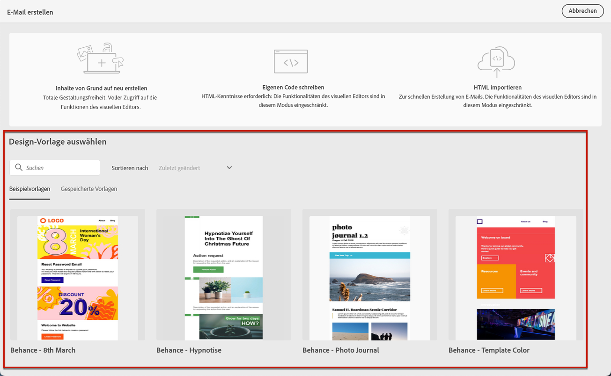
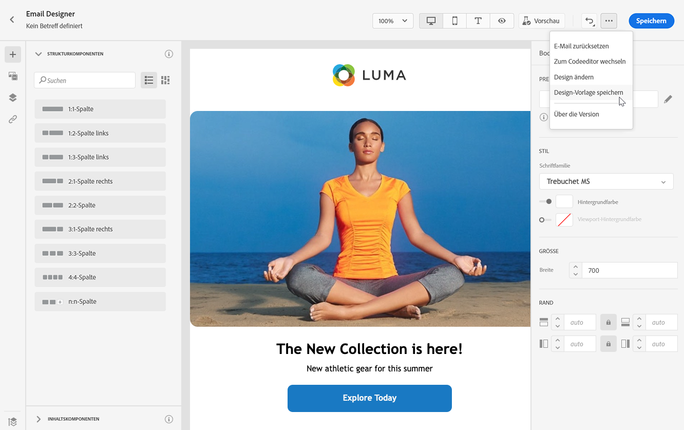
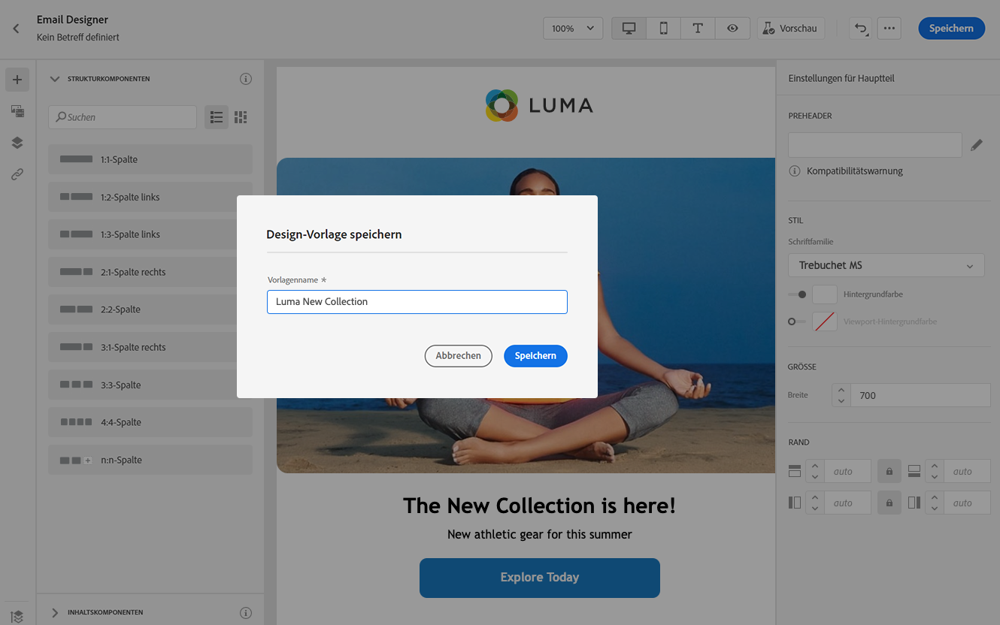
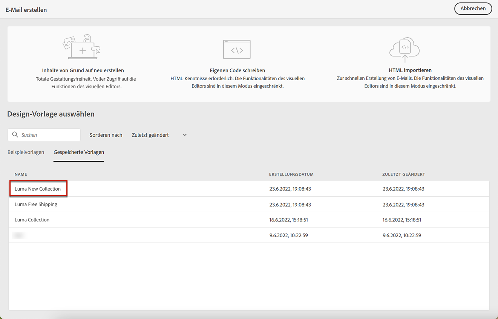
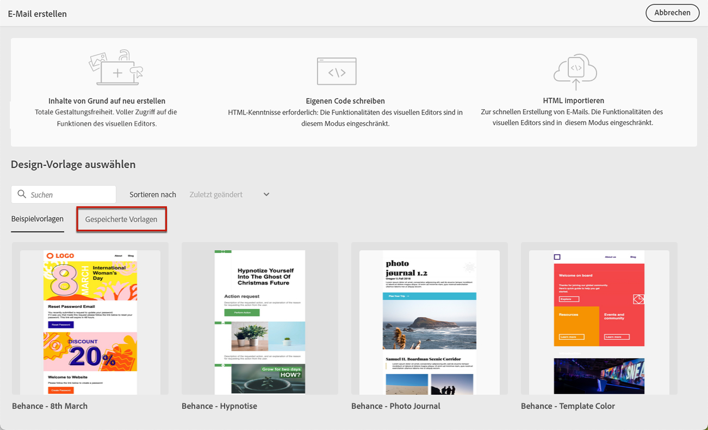
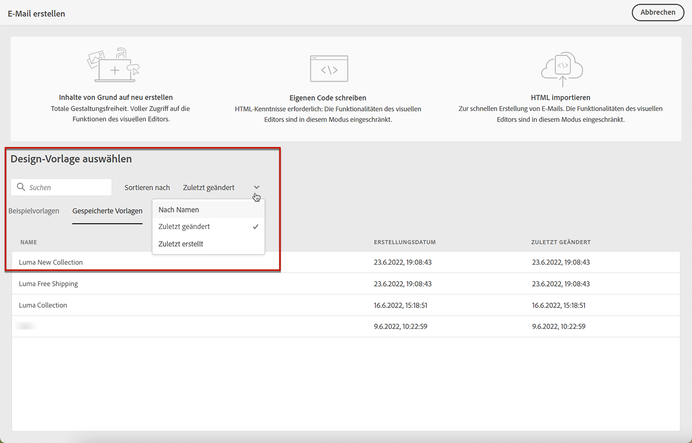
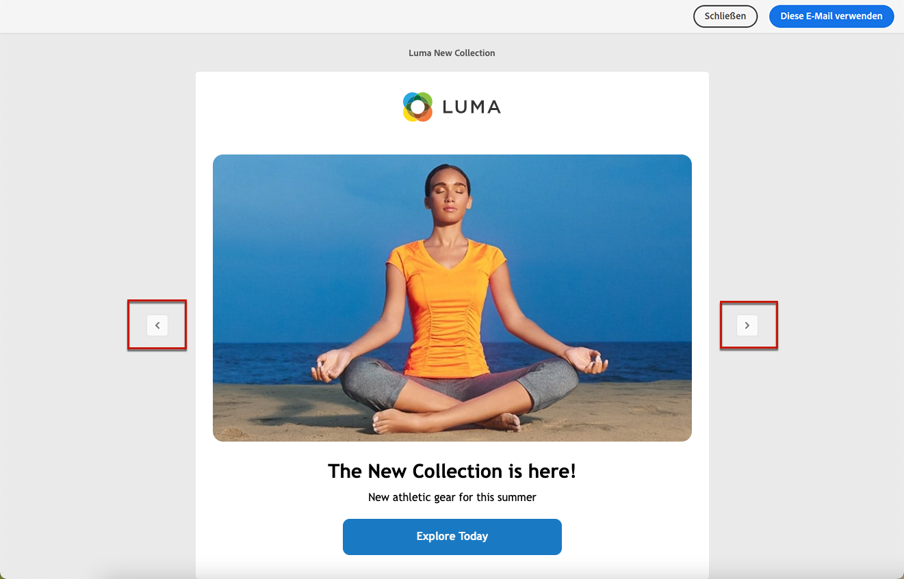

# Arbeiten mit E-Mail-Vorlagen {#email-templates}

Erfahren Sie im Abschnitt **[!UICONTROL Design-Vorlage auswählen]**, wie Sie Ihren Inhalt aus einer Vorlage erstellen.

Sie können aus folgenden Optionen wählen:
* 20 vordefinierte E-Mail-Vorlagen.
* Gespeicherte Vorlagen. [Weitere Informationen](#save-as-template)

## Als Vorlage speichern {#save-as-template}

>[!CONTEXTUALHELP]
>id="ajo_messages_depecrated_inventory"
>title="Hier erfahren Sie, wie Sie Ihre Nachrichten migrieren können"
>abstract="Seit dem 25. Juli 2022 wird das Nachrichtenmenü nicht mehr angezeigt. Nachrichten werden nun direkt von einer Journey aus verfasst. Wenn Sie Ihre alten Nachrichten in Journeys wiederverwenden möchten, müssen Sie sie als Vorlagen speichern."

Sobald Sie Ihren [E-Mail-Inhalt](design-emails.md) entworfen haben, können Sie ihn zur späteren Wiederverwendung speichern. Gehen Sie dazu wie folgt vor.

1. Klicken Sie oben rechts im Bildschirm auf das Symbol mit den Auslassungszeichen.

1. Wählen Sie aus dem Dropdown-Menü **[!UICONTROL Designvorlage speichern]** aus.

   

1. Fügen Sie dieser Vorlage einen Namen hinzu.

   

1. Klicken Sie auf **[!UICONTROL Speichern]**.

Wenn Sie das nächste Mal eine E-Mail erstellen, können Sie diese Vorlage verwenden, um Inhalte zu erstellen. [Weitere Informationen dazu](#use-saved-template)

## Verwenden einer gespeicherten Vorlage {#use-saved-template}

1. Öffnen Sie den [Email Designer](create-email-content.md).

1. Im Bildschirm **[!UICONTROL E-Mail erstellen]** ist standardmäßig die Registerkarte **[!UICONTROL Beispielvorlagen]** ausgewählt. Wählen Sie die Registerkarte **[!UICONTROL Gespeicherte Vorlagen]**.

   

1. Die Liste aller zuvor [gespeicherten Vorlagen](#save-as-template) wird angezeigt. Sie können sie nach **[!UICONTROL Name]**, **[!UICONTROL Zuletzt geändert]** und **[!UICONTROL Zuletzt erstellt]** sortieren.

   

1. Wählen Sie aus der Liste die gewünschte Vorlage aus.

1. Nach der Auswahl können Sie mithilfe der Rechts- und Linkspfeile zwischen allen gespeicherten Vorlagen wechseln.

   

1. Klicken Sie auf **[!UICONTROL Diese E-Mail verwenden]** oben rechts im Bildschirm.

1. Bearbeiten Sie die Inhalte nach Bedarf mit dem Email Designer.
