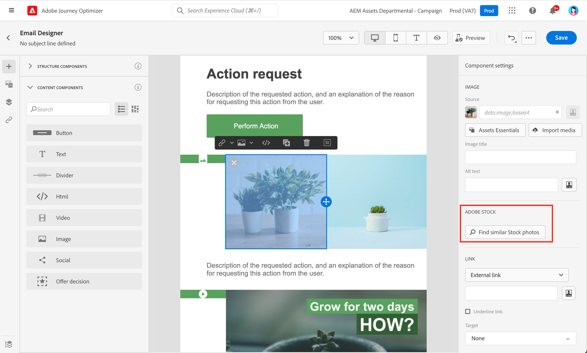
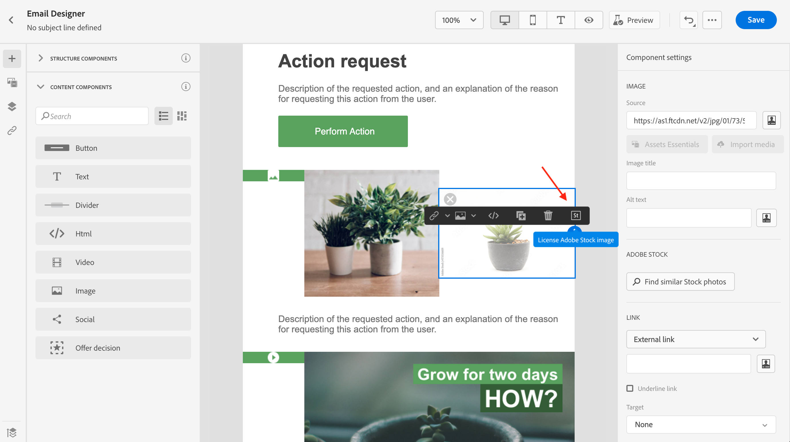
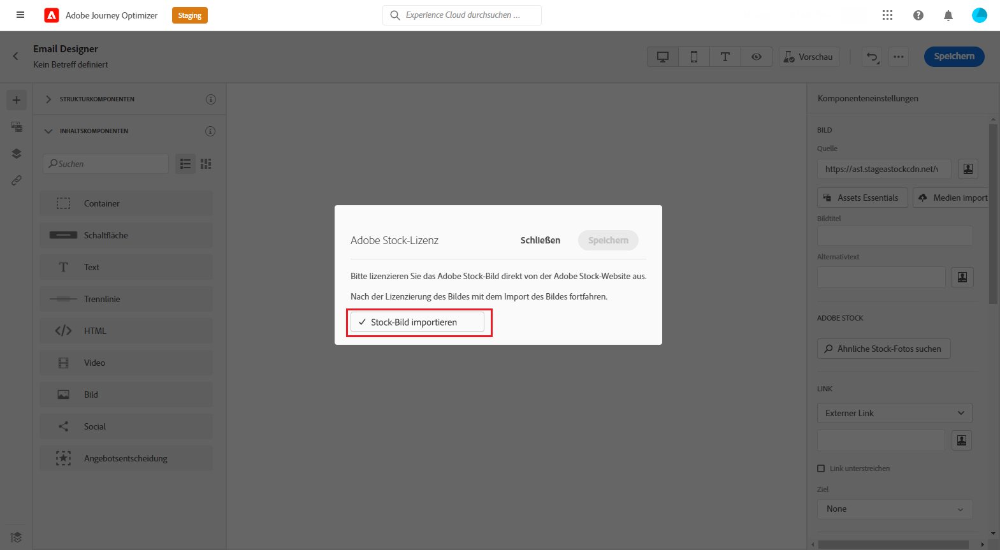

# Arbeiten mit [!DNL Adobe Stock] images {#stock}

## Erste Schritte mit [!DNL Adobe Stock] {#get-started-stock}

Die [!DNL Adobe Stock] und [!DNL Adobe Journey Optimizer] Das Integrations-Plug-in von Email Designer bietet Kunden eine einfache Möglichkeit, Bilder zur Verwendung bei der Nachrichtenbearbeitung zu navigieren, zu lizenzieren und zu speichern.

[Adobe Stock](https://helpx.adobe.com/stock/get-started.html){target=&quot;_blank&quot;} bietet Zugriff auf Millionen von hochwertigen, kuratierten, gebührenfreien Fotos, Videos, Illustrationen und Vektorgrafiken. Sie können ein Credit-Pack erwerben, um Assets zu lizenzieren, oder nur eine Standard- oder erweiterte Lizenz für das benötigte Asset erwerben. Adobe Stock bietet außerdem eine kostenlose Sammlung von Assets.

Mit [!DNL Adobe Journey Optimizer] können Sie Bilder direkt aus [!DNL Adobe Stock] in Ihre E-Mails hochladen und dem Assets-Ordner hinzufügen. Die **[!UICONTROL Ähnliches Bild suchen]** hilft Ihnen dabei, Bilder zu finden, die mit dem Inhalt, der Farbe und der Zusammensetzung des Assets übereinstimmen, das in Ihrem Versand verwendet wird.

## Berechtigungen{#stock-permissions}

Die **[!UICONTROL Adobe Stock-Fotos suchen]** -Option steht Benutzern mit Zugriff auf ein AEM Assets Essentials-Produktprofil zur Verfügung.

Weitere Informationen hierzu finden Sie unter [Wichtige Dokumentation zu Assets](https://experienceleague.adobe.com/docs/experience-manager-assets-essentials/help/get-started-admins/deploy-administer.html#add-users-to-essentials){target=&quot;_blank&quot;}.

## Einfügen eines Bildes aus [!DNL Adobe Stock] {#add-stock-image}

So fügen Sie Bilder von hinzu [!DNL Adobe Stock] Gehen Sie wie folgt vor:

1. Aus dem **[!UICONTROL Inhaltskomponenten]** im Email Designer-Bereich per Drag-and-Drop **Bild**.

1. Klicken Sie auf **[!UICONTROL Adobe Stock-Fotos suchen]** auf der linken Seite von Email Designer.

   

1. Durchsuchen Sie die Bibliothek oder geben Sie einen Begriff in das Suchfeld ein.

   

1. Wählen Sie das gewünschte Bild aus und klicken Sie auf **[!UICONTROL Speichern]**.

   Wenn das ausgewählte Bild nicht lizenziert ist, müssen Sie [Lizenz abrufen](#license-stock-image).

## Suchen nach ähnlichen Fotos {#similar-stock-image}

Sie können jedes vorhandene Bild in Ihrem E-Mail-Inhalt durch ein Foto aus [!DNL Adobe Stock]. Beachten Sie, dass diese Option für alle Bilder verfügbar ist: lizenzierte/nicht lizenzierte Stock-Bilder und -Bilder aus Ihrem Assets-Ordner.

Gehen Sie wie folgt vor, um ähnliche Fotos zu durchsuchen:

1. Wählen Sie das zu ersetzende Bild aus.
1. Klicken Sie auf **[!UICONTROL Ähnliche Stock-Fotos suchen]** Schaltfläche zum Anzeigen von Assets in [!DNL Adobe Stock] die mit Inhalt, Farbe und Komposition des Bildes übereinstimmen.

   

1. Wählen Sie das gewünschte Bild aus und klicken Sie auf **[!UICONTROL Speichern]**.

   

   Wenn das ausgewählte Bild nicht lizenziert ist, müssen Sie [Lizenz abrufen](#license-stock-image).

1. Passen Sie bei Bedarf Ihr Bild mit dem **[!UICONTROL Komponenteneinstellungen]** Menü. [Weitere Informationen zu Komponenteneinstellungen](content-components.md)

Nachdem die Nachricht erstellt und personalisiert wurde, können Sie diese veröffentlichen, um sie für die Ausführung verfügbar zu machen. [Weitere Informationen](../messages/publish-manage-message.md)

## Lizenz abrufen von [!DNL Adobe Stock] {#license-stock-image}

Wenn Ihr Bild bereits lizenziert ist, wird es durch das  Symbol. Ist dies nicht der Fall, müssen Sie die Lizenz erteilen.

Gehen Sie wie folgt vor, um Ihr Bild zu lizenzieren und herunterzuladen:

1. Wählen Sie sie aus und klicken Sie auf **[!UICONTROL Adobe Stock-Bild lizenzieren]** Symbol.

   

   Sie werden dann zu dem [!DNL Adobe Stock] Website zu, aber die Lizenz.

   

1. Aus dem [!DNL Adobe Stock] Website, müssen Sie Ihr Asset kaufen, um das Bild herunterladen und das Wasserzeichen entfernen zu können.

   Dieser Kauf hängt von Ihrem Adobe Stock-Abo oder -Abonnement ab. Beachten Sie, dass Sie bei mehreren Adobe Stock-Konten zur zuletzt verwendeten Stock-ID weitergeleitet werden. Stellen Sie in diesem Fall sicher, dass Sie sich beim richtigen Konto angemeldet haben, bevor Sie Ihr Asset lizenzieren.

   Weitere Informationen zu Adobe Stock-Plänen und -Preisen finden Sie unter [Adobe Stock-Dokumentation](https://stock.adobe.com/de/plans){target=&quot;_blank&quot;}.

   >[!WARNING]
   > Wenn eine E-Mail mit einem nicht lizenzierten Bild gesendet wird, behält das Bild das nicht lizenzierte Formular mit dem Wasserzeichen bei.

1. Sobald der Kauf abgeschlossen ist, können Sie zu Ihrer E-Mail in [!DNL Adobe Journey Optimizer] zurückkehren und **[!UICONTROL Stock-Bild importieren]** auswählen, um das lizenzierte Bild in Ihre Assets zu importieren.

   

1. Wählen Sie aus, in welchem Ordner Sie Ihr Asset speichern möchten. Weiterführende Informationen zu [!DNL Assets Essentials] finden Sie auf dieser [Seite](assets-essentials.md#get-started-assets-essentials).

### Verwandte Themen{#stock-related-topics}

* [E-Mail-Design in Journey Optimizer](design-emails.md)
* [Komponenteneinstellungen für den E-Mail-Entwurf](content-components.md)
* [Adobe Stock - Erste Schritte](https://helpx.adobe.com/stock/get-started.html){target=&quot;_blank&quot;}.

