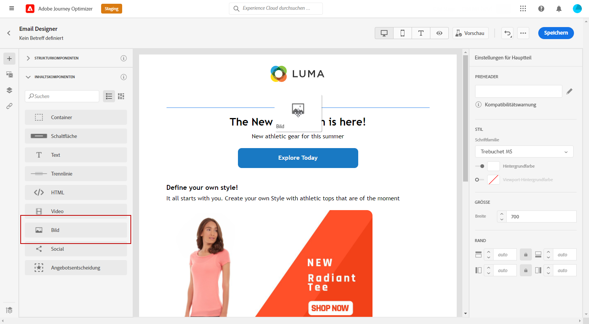
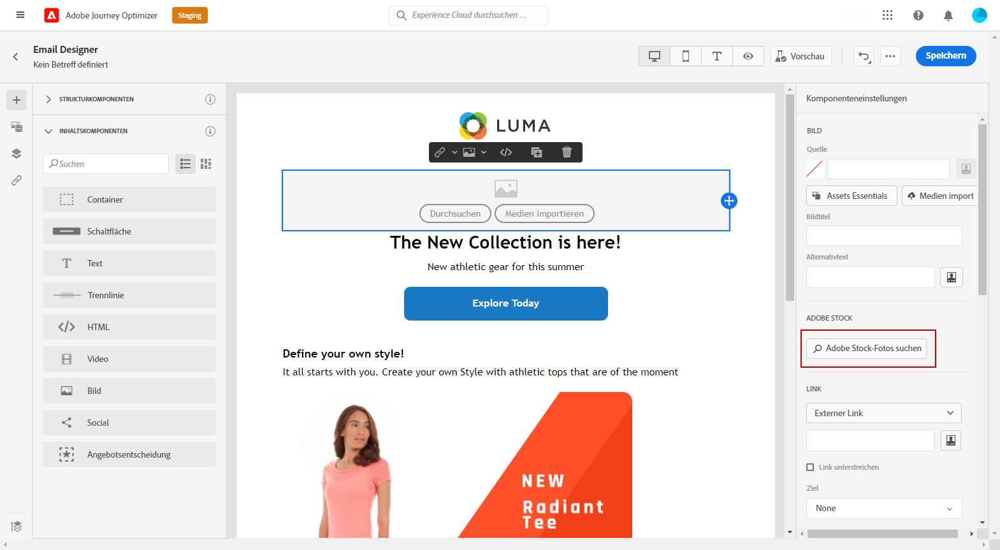
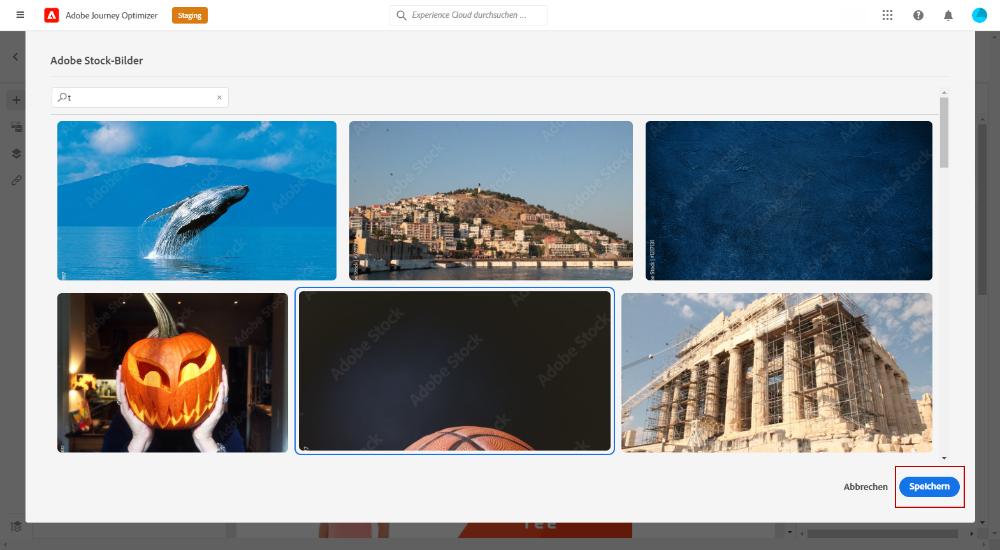
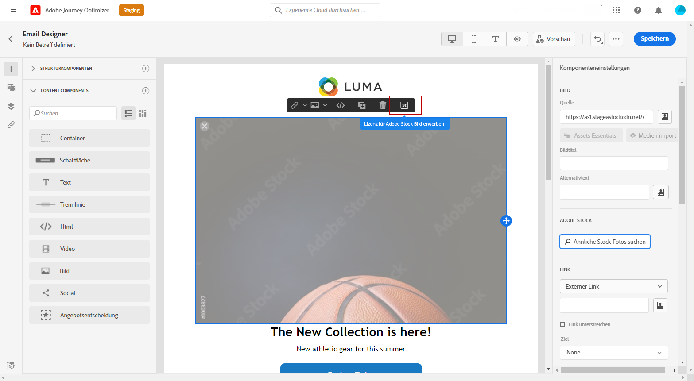
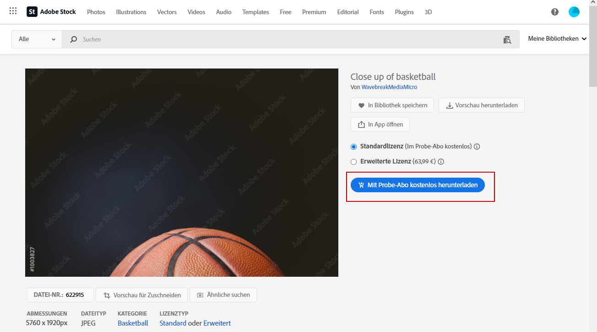
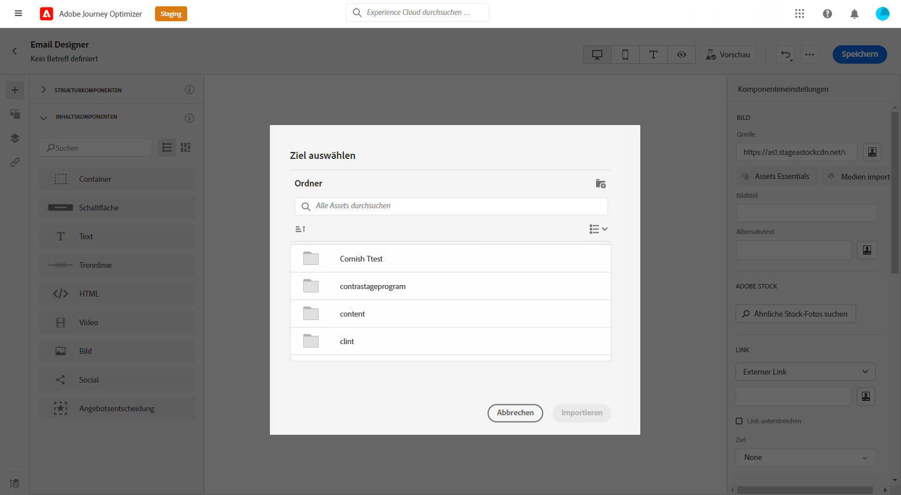
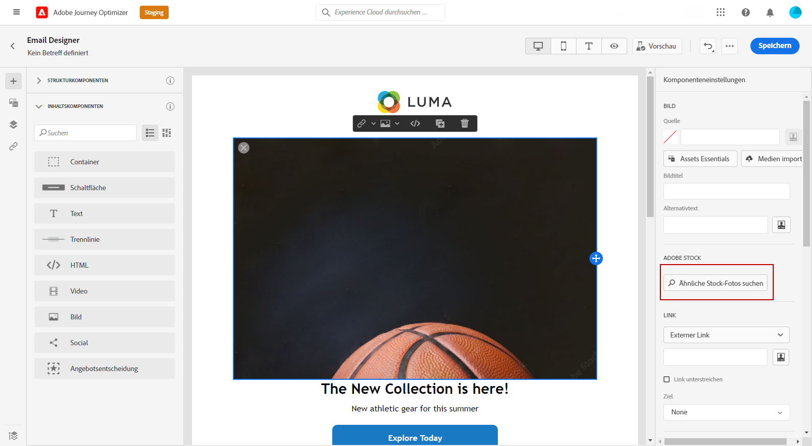
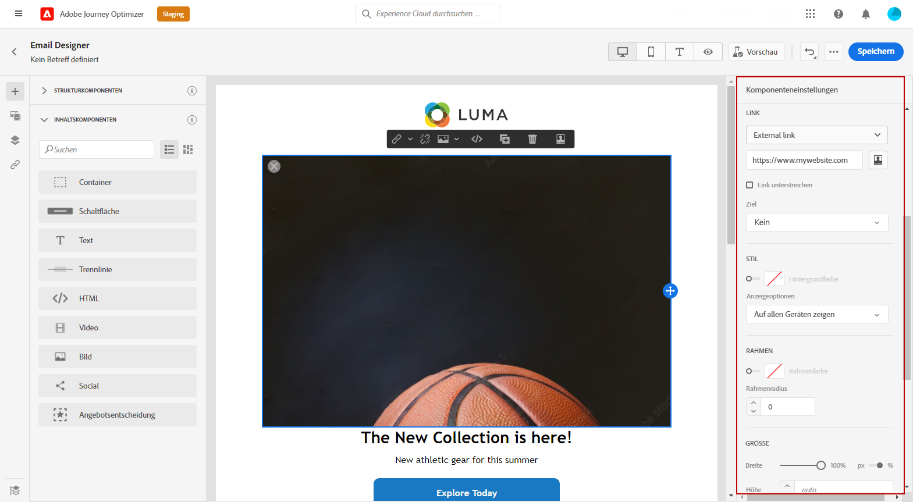

# Verwalten [!DNL Adobe Stock] images {#stock}

## Erste Schritte mit [!DNL Adobe Stock] {#get-started-stock}

>[!IMPORTANT]
>
> Die Verwendung der [!DNL Adobe Stock] -Integration ist derzeit nur für ausgewählte Benutzer in frühzeitigem Zugriff verfügbar. Wenn Sie diese Funktion nutzen möchten, wenden Sie sich an Ihren Adobe-Kundenbetreuer.

[!DNL Adobe Stock] bietet Zugriff auf Millionen von hochwertigen, kuratierten, gebührenfreien Fotos, Videos, Illustrationen und Vektorgrafiken. Sie können ein Kreditpaket erwerben, um Assets zu lizenzieren, oder nur eine Standard- oder Extended-Lizenz für das benötigte Asset erwerben. Adobe Stock bietet außerdem eine kostenlose Sammlung von Assets.

Weitere Informationen finden Sie unter [!DNL Adobe Stock], siehe [Adobe Stock - Erste Schritte](https://helpx.adobe.com/stock/get-started.html).

Mit [!DNL Adobe Journey Optimizer], können Sie Bilder direkt aus in Ihre E-Mails hochladen. [!DNL Adobe Stock] und fügen Sie es zum Ordner &quot;Assets&quot;hinzu. Die **[!UICONTROL Ähnliches Bild suchen]** hilft Ihnen dabei, Bilder zu finden, die mit dem Inhalt, der Farbe und der Zusammensetzung des Assets übereinstimmen, das in Ihrem Versand verwendet wird.
[Weitere Informationen zum Entwerfen von E-Mails](design-emails.md).

## Einfügen und Importieren [!DNL Adobe Stock] images {#add-stock-image}

Nachdem Sie Ihre E-Mail bearbeitet und personalisiert haben, können Sie Bilder aus [!DNL Adobe Stock] zu Ihrer Vorlage hinzufügen:

1. Ziehen und Ablegen eines Bildes **[!UICONTROL Inhaltskomponenten]** zu Ihrer E-Mail hinzufügen.

   

1. Aus dem **[!UICONTROL Komponenteneinstellungen]** Menü auswählen **[!UICONTROL Adobe Stock-Fotos suchen]**.

   

1. Durchsuchen Sie die Bibliothek oder geben Sie Ihren Suchbegriff in das Feld ein. Wählen Sie das ausgewählte Bild aus und klicken Sie auf **[!UICONTROL Speichern]**.

   

1. Um Ihr Bild zu lizenzieren und herunterzuladen, wählen Sie Ihr Bild aus **[!UICONTROL Inhaltskomponenten]** und klicken Sie auf **[!UICONTROL Adobe Stock-Bild lizenzieren]**. Sie werden zum [!DNL Adobe Stock] Website.

   >[!NOTE]
   > Wenn Ihr Bild bereits lizenziert ist, wird es durch das  Symbol. In diesem Fall können Sie mit Schritt 7 fortfahren.

   

1. Aus dem [!DNL Adobe Stock] Website, müssen Sie Ihr Asset kaufen, um das Bild herunterladen und das Wasserzeichen entfernen zu können.

   Dieser Kauf hängt von Ihrem Adobe Stock-Abonnement ab. Weiterführende Informationen hierzu finden Sie auf [dieser Seite](https://stock.adobe.com/plans).

   >[!WARNING]
   > Wenn eine E-Mail mit einem nicht lizenzierten Bild gesendet wird, behält das Bild das nicht lizenzierte Formular mit dem Wasserzeichen bei.

   

1. Sobald Ihr Kauf abgeschlossen ist, können Sie jetzt zu Ihrer E-Mail zurückkehren in [!DNL Adobe Journey Optimizer] und wählen Sie **[!UICONTROL Importieren von Lagerbildern]** , um das lizenzierte Bild in Ihre Assets zu importieren.

   

1. Wählen Sie aus, in welchem Ordner Ihr Asset gespeichert werden soll. Weiterführende Informationen zu [!DNL Assets Essentials] finden Sie auf dieser [Seite](assets-essentials.md#get-started-assets-essentials).

   

1. Nachdem Sie das Bild aus [!DNL Adobe Stock], verwenden Sie die **[!UICONTROL Ähnliche Stock-Fotos suchen]** -Option zum Suchen von Assets, die mit Inhalt, Farbe und Zusammensetzung eines Bildes übereinstimmen.

   Beachten Sie, dass diese Option für lizenzierte/nicht lizenzierte Stock-Bilder und Bilder aus Ihrem Assets-Ordner verfügbar ist.

   

1. Passen Sie Ihr Bild mit dem **[!UICONTROL Komponenteneinstellungen]** Menü. [Weitere Informationen zu Komponenteneinstellungen](content-components.md)

   

Nachdem die Nachricht erstellt und personalisiert wurde, können Sie diese veröffentlichen, um sie für die Ausführung verfügbar zu machen. [Weitere Informationen](../messages/publish-manage-message.md)
