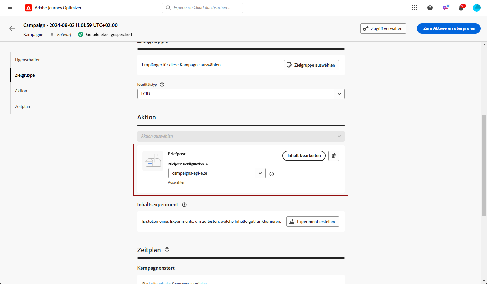
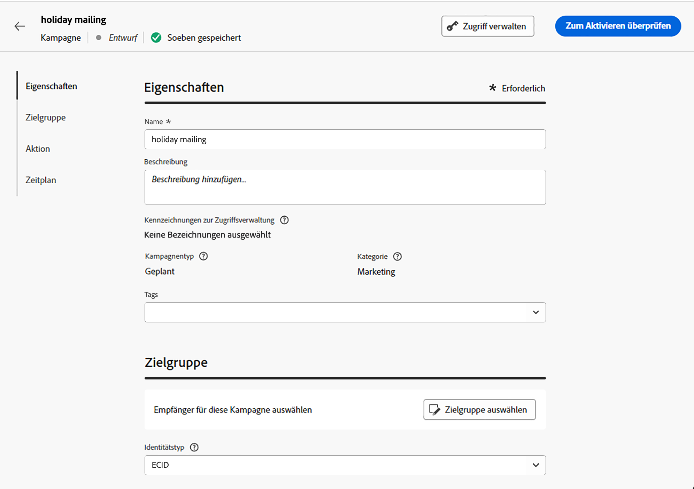
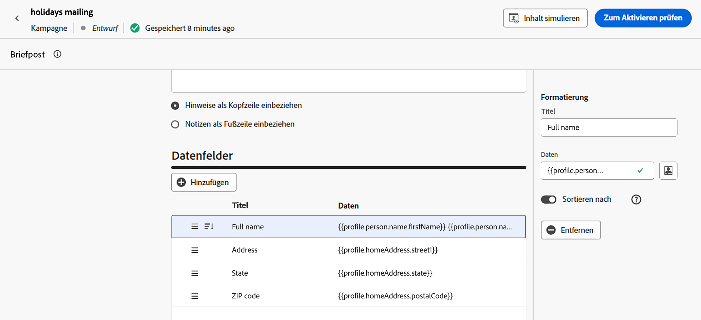

# Erstellen einer Briefpostnachricht {#create-direct}

>[!CONTEXTUALHELP]
>id="ajo_direct_mail"
>title="Erstellung von Briefpost"
>abstract="Erstellen Sie Briefpostnachrichten in geplanten Kampagnen und entwerfen Sie die Extraktionsdateien, die von Briefpostanbietern benötigt werden, um E-Mails an Ihre Kunden zu senden."

Um Briefpost-Nachrichten zu erstellen, erstellen Sie eine geplante Kampagne und konfigurieren Sie die Extraktionsdatei. Diese Datei wird von Briefpost-Dienstleistern benötigt, um E-Mails an Ihre Kunden zu senden.

>[!IMPORTANT]
>
>Bevor Sie eine Briefpost-Nachricht erstellen, stellen Sie sicher, dass Sie Folgendes konfiguriert haben:
>
>1. Eine [Dateirouting-Konfiguration](../direct-mail/direct-mail-configuration.md#file-routing-configuration), die den Server angibt, auf den die Extraktionsdatei hochgeladen und gespeichert werden soll,
>1. Eine [Oberfläche für Briefpostnachrichten](../direct-mail/direct-mail-configuration.md#direct-mail-surface), die auf die Datei-Routing-Konfiguration verweist.

## Erstellen einer Briefpost-Kampagne{#create-dm-campaign}

Gehen Sie wie folgt vor, um eine Briefpost-Kampagne zu erstellen:

1. Erstellen Sie eine neue geplante Kampagne und wählen Sie **[!UICONTROL Briefpost]** als Aktion.

1. Wählen Sie die **[!UICONTROL Briefpost-Oberfläche]** verwenden und auf **[!UICONTROL Erstellen]**. [Erfahren Sie, wie Sie eine Briefpost-Oberfläche erstellen](direct-mail-configuration.md#direct-mail-surface).

   {width="800" align="center"}

1. Im **[!UICONTROL Eigenschaften]** bearbeiten, bearbeiten Sie die **[!UICONTROL Titel]** und **[!UICONTROL Beschreibung]**.

1. Um Ihre Zielgruppe zu definieren, klicken Sie auf die Schaltfläche **[!UICONTROL Zielgruppe auswählen]** und wählen Sie aus den verfügbaren Adobe Experience Platform-Zielgruppen aus. [Weitere Informationen](../audience/about-audiences.md).

   >[!IMPORTANT]
   >
   >Derzeit ist die Zielgruppenauswahl auf 3 Millionen Profile beschränkt. Diese Einschränkung kann auf Anfrage an Ihren Kundenbetreuer aufgehoben werden.

1. Im **[!UICONTROL Identitäts-Namespace]** wählen Sie den entsprechenden Namespace aus, um Kontakte innerhalb der ausgewählten Zielgruppe zu identifizieren. [Weitere Informationen](../event/about-creating.md#select-the-namespace).

   {width="800" align="center"}

1. Kampagnen können für ein bestimmtes Datum geplant oder in regelmäßigen Abständen wiederholt werden. Erfahren Sie in [diesem Abschnitt](../campaigns/create-campaign.md#schedule), wie Sie den **[!UICONTROL Zeitplan]** der Kampagne konfigurieren können.

Jetzt können Sie mit der Konfiguration der Extraktionsdatei beginnen, die an Ihren Briefpost-Dienstleister gesendet werden soll.

## Extraktionsdatei konfigurieren {#extraction-file}

Die Extraktionsdatei wird von Briefpost-Dienstleistern benötigt, um E-Mails an Ihre Kunden zu senden. Gehen Sie wie folgt vor, um die Konfiguration der Extraktionsdatei zu definieren:

1. Klicken Sie im Konfigurationsbildschirm der Kampagne auf die Schaltfläche **[!UICONTROL Inhalt bearbeiten]** -Schaltfläche, um den Inhalt der Extraktionsdatei zu konfigurieren.

1. Passen Sie die Eigenschaften der Extraktionsdatei an:

   1. Geben Sie die gewünschte **[!UICONTROL Dateiname]** für die Extraktionsdatei.

   1. Optional können Sie die **[!UICONTROL Zeitstempel an den Dateinamen des Exports anhängen]** , wenn Sie dem angegebenen Dateinamen einen automatischen Zeitstempel hinzufügen möchten.

   1. Hin und wieder müssen Sie vielleicht Informationen am Beginn oder am Ende der Extraktionsdatei hinzufügen. Verwenden Sie dazu die **[!UICONTROL Hinweise]** und geben Sie an, ob die Notiz als Kopf- oder Fußzeile eingefügt werden soll.

      {width="800" align="center"}

1. Konfigurieren Sie die Spalten und die Informationen, die in der Extraktionsdatei angezeigt werden sollen:

   1. Klicken Sie auf **[!UICONTROL Hinzufügen]** -Schaltfläche, um eine neue Spalte zu erstellen.

   1. Die **[!UICONTROL Formatierung]** wird auf der rechten Seite angezeigt, sodass Sie die ausgewählte Spalte einrichten können. Geben Sie eine **[!UICONTROL Titel]** für die Spalte.

   1. Im **[!UICONTROL Daten]** Wählen Sie die Profilattribute aus, die mit dem [Ausdruckseditor](../personalization/personalization-build-expressions.md).

   1. Um die Extraktionsdatei mithilfe einer Spalte zu sortieren, wählen Sie die Spalte aus und schalten Sie die **[!UICONTROL Sortieren nach]** -Option. Die **[!UICONTROL Sortieren nach]** neben der Spaltenbeschriftung im **[!UICONTROL Datenfelder]** Abschnitt.

      {width="800" align="center"}

   1. Wiederholen Sie diese Schritte, um so viele Spalten hinzuzufügen, wie für Ihre Extraktionsdatei benötigt werden. Beachten Sie, dass Sie bis zu 50 Spalten hinzufügen können.

      Um die Position einer Spalte zu ändern, ziehen Sie sie an die gewünschte Position im **[!UICONTROL Datenfeld]** Abschnitt. Um eine Spalte zu löschen, wählen Sie sie aus und klicken Sie auf die Schaltfläche **[!UICONTROL Entfernen]** im **[!UICONTROL Formatierung]** -Bereich.

Jetzt können Sie Ihre Briefpost testen und an Ihre Audience senden. [Erfahren Sie, wie Sie Briefpost-Nachrichten testen und senden.](test-send-direct-mail.md)
