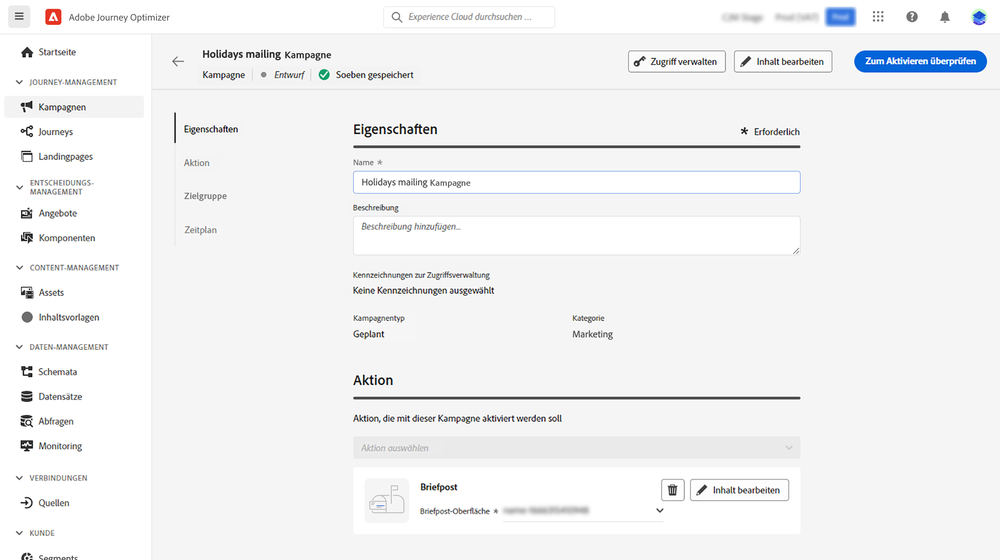
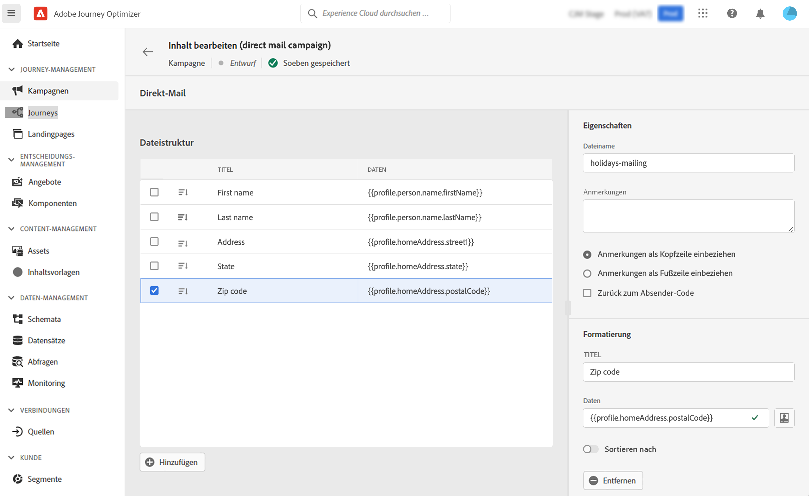

# Erstellen einer Briefpostnachricht {#create-direct}

>[!CONTEXTUALHELP]
>id="ajo_direct_mail"
>title="Erstellung von Briefpost"
>abstract="Erstellen Sie Briefpostnachrichten in geplanten Kampagnen und entwerfen Sie die Extraktionsdateien, die von Briefpostanbietern benötigt werden, um E-Mails an Ihre Kunden zu senden."

Briefpost ist ein Offline-Kanal, mit dem Sie die Extraktionsdateien personalisieren und generieren können, die Briefpostanbieter zum Senden von Nachrichten an Ihre Kunden benötigen.

Beim Erstellen einer Briefpost generiert Journey Optimizer eine Datei, die alle Zielgruppenprofile und die ausgewählten Daten enthält (z. B. Postanschrift, Profilattribute). Ihr Briefpostanbieter kann dann diese Datei abrufen und übernimmt den eigentlichen Versand.

Briefpostnachrichten können nur im Rahmen geplanter Kampagnen erstellt werden. Sie sind nicht für die Verwendung in API-basierten Kampagnen oder in Journeys verfügbar.

>[!IMPORTANT]
>
>Bevor Sie eine Briefpostnachricht senden, stellen Sie sicher, dass Sie Folgendes konfiguriert haben:
>
>1. Eine [Dateirouting-Konfiguration](../direct-mail/direct-mail-configuration.md#file-routing-configuration), die den Server angibt, auf den die Extraktionsdatei hochgeladen und gespeichert werden soll,
>1. Eine [Oberfläche für Briefpostnachrichten](../direct-mail/direct-mail-configuration.md#direct-mail-surface), die auf die Datei-Routing-Konfiguration verweist.

## Erstellen Ihrer Briefpostnachricht {#create}

Gehen Sie wie folgt vor, um eine Briefpostnachricht zu erstellen und zu senden:

1. Erstellen Sie eine neue geplante Kampagne, wählen Sie **[!UICONTROL Briefpost]** als Aktion aus und wählen Sie die zu verwendende Kanaloberfläche aus. [Erfahren Sie, wie Sie eine Briefpost-Oberfläche erstellen](../direct-mail/direct-mail-configuration.md#direct-mail-surface)

   

1. Klicken Sie auf **[!UICONTROL Erstellen]** und definieren Sie dann grundlegende Informationen zu Ihrer Kampagne (Name, Beschreibung). [Erfahren Sie, wie Sie eine Kampagne konfigurieren](../campaigns/create-campaign.md)

   

1. Klicken Sie auf die Schaltfläche **[!UICONTROL Inhalt bearbeiten]**, um die Extraktionsdatei zu konfigurieren, die an Ihren Briefpostanbieter gesendet werden soll.

1. Definieren Sie den Namen der Extraktionsdatei im Feld **[!UICONTROL Dateiname]**.

   Hin und wieder müssen Sie vielleicht Informationen am Beginn oder am Ende der Extraktionsdatei hinzufügen. Verwenden Sie dazu das Feld **[!UICONTROL Hinweise]** und geben Sie an, ob der Hinweis als Kopf- oder Fußzeile eingefügt werden soll.

   <!--Click on the button to the right of the Output file field and enter the desired label. You can use personalization fields, content blocks and dynamic text (see Defining content). For example, you can complete the label with the delivery ID or the extraction date.-->

   

1. Definieren Sie im linken Bereich die Informationen, die als Spalten in der Extraktionsdatei angezeigt werden sollen:

   1. Klicken Sie auf **[!UICONTROL Hinzufügen]**, um eine neue Spalte hinzuzufügen, und wählen Sie diese dann aus der Liste aus.

   1. Geben Sie im Abschnitt **[!UICONTROL Formatierung]** einen Titel für die Spalte an und definieren Sie dann mit dem [Ausdruckseditor](../personalization/personalization-build-expressions.md) die Profilattribute, die angezeigt werden sollen.

      

   1. Um die Extraktionsdatei mithilfe der ausgewählten Spalte zu sortieren, können Sie die Option **[!UICONTROL Sortieren nach]** einschalten. Das Symbol **[!UICONTROL Sortieren nach]** wird dann neben der Spaltenbeschriftung in der Dateistruktur angezeigt.

1. Wiederholen Sie diese Schritte, um so viele Spalten wie nötig hinzuzufügen, um Ihre Extraktionsdatei zu erstellen. Beachten Sie, dass Sie bis zu 50 Spalten hinzufügen können.

   

   Sie können eine Spalte jederzeit löschen, indem Sie sie auswählen und im Abschnitt **[!UICONTROL Formatierung]** auf die Schaltfläche **[!UICONTROL Entfernen]** klicken.

1. Sobald der Inhalt der Briefpost definiert worden ist, stellen Sie die Konfiguration Ihrer Kampagne fertig.

   Wenn die Kampagne startet, wird die Extraktionsdatei automatisch generiert und zu dem Server exportiert, der in Ihrer [Datei-Routing-Konfiguration](../direct-mail/direct-mail-configuration.md) festgelegt ist.
