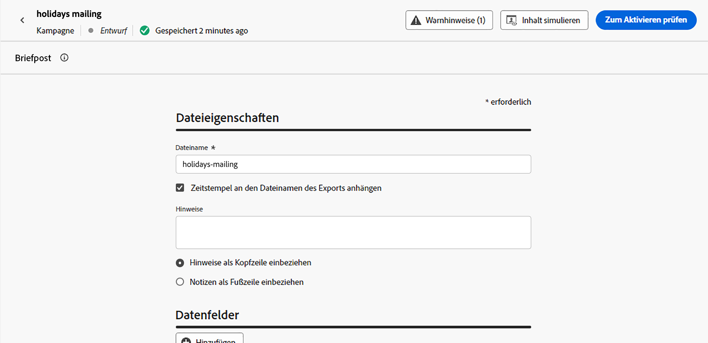

# Briefpost-Nachricht erstellen {#create-direct}

>[!CONTEXTUALHELP]
>id="ajo_direct_mail"
>title="Briefpost-Erstellung"
>abstract="Erstellen Sie Briefpost-Nachrichten in geplanten Kampagnen und entwerfen Sie die Extraktionsdateien, die von Briefpost-Dienstleistern benötigt werden, um E-Mails an Ihre Kunden zu senden."

Briefpost ist ein Offline-Kanal, mit dem Sie die Extraktionsdateien personalisieren und generieren können, die Briefpost-Dienstleister zum Senden von Nachrichten an Ihre Kunden benötigen.

Wenn Sie eine Briefpost erstellen, generiert Journey Optimizer eine Datei mit allen Zielgruppenprofilen und den ausgewählten Daten (z. B. Postanschrift, Profilattribute). Ihr Briefpost-Dienstleister kann dann diese Datei abrufen und übernimmt den eigentlichen Versand.

Briefpost-Nachrichten können nur im Rahmen geplanter Kampagnen erstellt werden. Sie sind nicht zur Verwendung in API-ausgelösten Kampagnen oder in Journeys verfügbar.

>[!IMPORTANT]
>
>Bevor Sie eine Briefpost senden, stellen Sie sicher, dass Sie Folgendes konfiguriert haben:
>
>1. A [Dateirouting-Konfiguration](../direct-mail/direct-mail-configuration.md#file-routing-configuration) , der den Server angibt, auf den die Extraktionsdatei hochgeladen und gespeichert werden soll,
>1. A [Oberfläche für Briefpost-Nachrichten](../direct-mail/direct-mail-configuration.md#direct-mail-surface) , die auf die Dateirouting-Konfiguration verweist.

## Briefpost-Nachricht erstellen {#create}

Gehen Sie wie folgt vor, um eine Briefpost-Nachricht zu erstellen und zu senden:

1. Erstellen Sie eine neue geplante Kampagne, wählen Sie **[!UICONTROL Direct mail]** und wählen Sie die zu verwendende Kanaloberfläche aus. [Erfahren Sie, wie Sie eine Oberfläche für Briefpost erstellen](../direct-mail/direct-mail-configuration.md#direct-mail-surface)

   

1. Klicken **[!UICONTROL Create]** Definieren Sie dann grundlegende Informationen zu Ihrer Kampagne (Name, Beschreibung). [Erfahren Sie, wie Sie eine Kampagne konfigurieren](../campaigns/create-campaign.md)

   

1. Klicken Sie auf **[!UICONTROL Edit content]** Schaltfläche zum Konfigurieren der Extraktionsdatei, die an Ihren Briefpost-Dienstleister gesendet werden soll.

1. Definieren Sie den Namen der Extraktionsdatei im **[!UICONTROL Filename]** -Feld.

   Manchmal müssen Sie Informationen am Anfang oder am Ende der Extraktionsdatei hinzufügen. Verwenden Sie dazu die **[!UICONTROL Notes]** und geben Sie an, ob die Notiz als Kopf- oder Fußzeile eingefügt werden soll.

   <!--Click on the button to the right of the Output file field and enter the desired label. You can use personalization fields, content blocks and dynamic text (see Defining content). For example, you can complete the label with the delivery ID or the extraction date.-->

   

1. Definieren Sie im linken Bereich die Informationen, die als Spalten in der Extraktionsdatei angezeigt werden sollen:

   1. Klicken Sie auf **[!UICONTROL Add]** um eine neue Spalte hinzuzufügen, und wählen Sie sie dann aus der Liste aus.

   1. Im **[!UICONTROL Formatting]** einen Titel für die Spalte angeben und dann die Profilattribute definieren, die mit der [Ausdruckseditor](../personalization/personalization-build-expressions.md).

      

   1. Um die Extraktionsdatei mithilfe der ausgewählten Spalte zu sortieren, können Sie die **[!UICONTROL Sort by]** aktiviert. Die **[!UICONTROL Sort By]** wird dann neben der Spaltenbeschriftung in der Dateistruktur angezeigt.

1. Wiederholen Sie diese Schritte, um so viele Spalten wie nötig hinzuzufügen, um Ihre Extraktionsdatei zu erstellen. Beachten Sie, dass Sie bis zu 50 Spalten hinzufügen können.

   

   Sie können eine Spalte jederzeit löschen, indem Sie sie auswählen und auf **[!UICONTROL Remove]** -Schaltfläche in der **[!UICONTROL Formatting]** Abschnitt.

1. Sobald der Inhalt der Briefpost definiert wurde, konfigurieren Sie Ihre Kampagne.

   Wenn die Kampagne gestartet wird, wird die Extraktionsdatei automatisch generiert und an den in Ihrer [Dateirouting-Konfiguration](../direct-mail/direct-mail-configuration.md).
