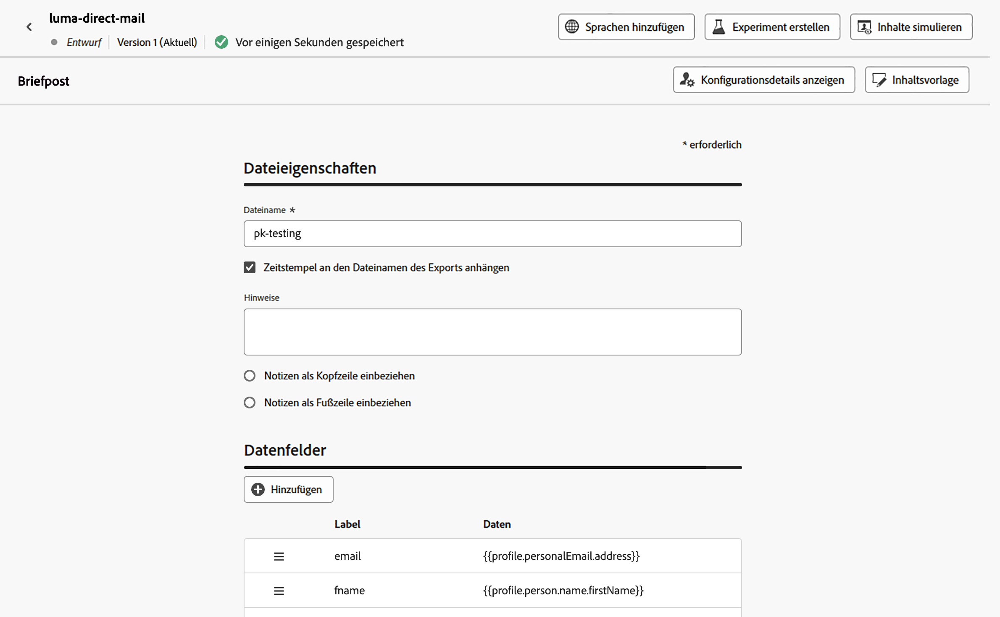

# Erstellen einer Briefpostnachricht {#create-direct}

>[!CONTEXTUALHELP]
>id="ajo_direct_mail"
>title="Erstellung von Briefpost"
>abstract="Erstellen Sie Briefpostnachrichten in geplanten Kampagnen und Journey und entwerfen Sie die Extraktionsdateien, die von Briefpostanbietern benötigt werden, um E-Mails an Ihre Kunden zu senden."

>[!CONTEXTUALHELP]
>id="ajo_journey_direct_mail"
>title="Endaktivität"
>abstract="Direkt-Mail ist ein Offline-Kanal, mit dem Sie die Extraktionsdateien personalisieren und generieren können, die Direkt-Mail-Drittanbieter zum Senden von Nachrichten an Ihre Kundinnen und Kunden benötigen."

Erstellen Sie zum Erstellen von Briefpostnachrichten eine geplante Kampagne oder eine Journey und konfigurieren Sie die Extraktionsdatei. Diese Datei wird von Briefpost-Dienstleistern benötigt, um E-Mails an Ihre Kundinnen bzw. Kunden zu senden.

>[!IMPORTANT]
>
>Bevor Sie eine Briefpostnachricht senden, stellen Sie sicher, dass Sie Folgendes konfiguriert haben:
>
>1. Eine [Dateirouting-Konfiguration](../direct-mail/direct-mail-configuration.md#file-routing-configuration), die den Server angibt, auf den die Extraktionsdatei hochgeladen und gespeichert werden soll,
>1. Eine [Konfiguration für Direkt-Mail-Nachrichten](../direct-mail/direct-mail-configuration.md#direct-mail-surface), die auf die Datei-Routing-Konfiguration verweist.

## Hinzufügen einer Briefpostnachricht {#create-dm-campaign}

Auf den folgenden Registerkarten erfahren Sie, wie Sie eine Briefpostnachricht zu einer Kampagne oder einer Journey hinzufügen.

>[!BEGINTABS]

>[!TAB Hinzufügen einer Briefpostnachricht zu einer Journey]

1. Öffnen Sie Ihre Journey und ziehen Sie eine Aktivität **[!UICONTROL Direkt-Mail]** per Drag-and-Drop aus dem Abschnitt **Aktionen** der Palette.

1. Geben Sie allgemeine Informationen (Label, Beschreibung, Kategorie) zu Ihrer Nachricht ein und wählen Sie dann die zu verwendende Konfiguration aus. Das Feld **[!UICONTROL Konfiguration]** ist standardmäßig vorab mit der letzten Konfiguration für den Kanal ausgefüllt, den die Benutzerin oder der Benutzer verwendet hat. Weitere Informationen zur Konfiguration einer Journey finden Sie auf [dieser Seite](../building-journeys/journey-gs.md).

1. Konfigurieren Sie die Extraktionsdatei, die an Ihren Direkt-Mail-Anbieter gesendet werden soll. Klicken Sie dazu auf die Schaltfläche **[!UICONTROL Inhalt bearbeiten]**.

   

1. Passen Sie die Eigenschaften der Extraktionsdatei an, z. B. den Dateinamen oder die anzuzeigenden Spalten. Weitere Informationen zum Konfigurieren der Eigenschaften der Extraktionsdatei finden Sie in diesem Abschnitt: [Erstellen einer Direkt-Mail-Nachricht](../direct-mail/create-direct-mail.md#extraction-file).

   

1. Sobald der Inhalt der Extraktionsdatei definiert wurde, können Sie Testprofile verwenden, um sie in der Vorschau anzuzeigen. Wenn Sie personalisierten Inhalt eingefügt haben, können Sie mithilfe von Testprofildaten überprüfen, wie dieser Inhalt in der Nachricht angezeigt wird.

   Klicken Sie dazu auf **[!UICONTROL Inhalt simulieren]** und fügen Sie dann ein Testprofil hinzu, um zu prüfen, wie die Extraktionsdatei unter Verwendung der Testprofildaten gerendert wird. Detaillierte Informationen zur Auswahl von Testprofilen und zur Vorschau Ihres Inhalts finden Sie im Abschnitt [Content-Management](../content-management/preview-test.md).

   {width="800" align="center"}

Wenn Ihre Push-Benachrichtigung bereit ist, schließen Sie zum Versenden die Konfiguration Ihrer [Journey](../building-journeys/journey-gs.md) ab.

>[!TAB Hinzufügen einer Briefpostnachricht zu einer Kampagne]

1. Rufen Sie das Menü **[!UICONTROL Kampagnen]** auf und klicken Sie auf **[!UICONTROL Kampagne erstellen]**.

1. Wählen Sie den Kampagnentyp **Geplant – Marketing** aus.

1. Bearbeiten Sie im Bereich **[!UICONTROL Eigenschaften]** den **[!UICONTROL Titel]** und die **[!UICONTROL Beschreibung]** Ihrer Kampagne.

1. Um Ihre Zielgruppe zu definieren, klicken Sie auf die Schaltfläche **[!UICONTROL Zielgruppe auswählen]** und wählen Sie aus den verfügbaren Adobe Experience Platform-Zielgruppen aus. [Weitere Informationen](../audience/about-audiences.md).

   >[!IMPORTANT]
   >
   >Derzeit ist die Zielgruppenauswahl auf 3 Millionen Profile beschränkt. Diese Einschränkung kann auf Anfrage von Ihrer Adobe-Support-Mitarbeitenden aufgehoben werden.

1. Wählen Sie im **[!UICONTROL Identity-Namespace]** den entsprechenden Namespace aus, um Kontakte innerhalb der ausgewählten Zielgruppe zu identifizieren. [Weitere Informationen](../event/about-creating.md#select-the-namespace).

1. Wählen Sie im Abschnitt **[!UICONTROL Aktionen]** die Option **[!UICONTROL Direkt-Mail]** aus.

1. Wählen Sie eine **[!UICONTROL Direkt-Mail-Konfiguration]** aus oder erstellen Sie eine neue Konfiguration. [Erfahren Sie, wie Sie eine Direkt-Mail-Konfiguration erstellen](direct-mail-configuration.md#direct-mail-surface).

   {width="800" align="center"}

   >[!AVAILABILITY]
   >
   >Briefpost unterstützt die **Holdout**-Funktion, unterstützt aber derzeit nicht **Behandlungen**. [Erfahren Sie, wie Sie mit Experimenten arbeiten](../content-management/get-started-experiment.md)

1. Kampagnen können für ein bestimmtes Datum geplant oder in regelmäßigen Abständen wiederholt werden. Erfahren Sie in [diesem Abschnitt](../campaigns/campaign-schedule.md), wie Sie den **[!UICONTROL Zeitplan]** der Kampagne konfigurieren können.

Jetzt können Sie mit der Konfiguration der Extraktionsdatei beginnen, die an Ihren Briefpost-Dienstleister gesendet werden soll.

## Konfigurieren der Extraktionsdatei {#extraction-file}

>[!CONTEXTUALHELP]
>id="ajo_direct_mail_data_fields"
>title="Datenfelder"
>abstract="Fügen Sie die Spalten und die Informationen hinzu, die in der Extraktionsdatei angezeigt werden sollen, die von Briefpostanbietern benötigt wird, um E-Mails an Ihre Kundinnen und Kunden zu senden, und konfigurieren Sie sie. Sie können bis zu 50 Spalten hinzufügen."

>[!CONTEXTUALHELP]
>id="ajo_direct_mail_formatting"
>title="Formatieren der Extraktionsdatei"
>abstract="Legen Sie mit dem Personalisierungseditor für jedes Feld ein Label und die Informationen fest, die angezeigt werden sollen.    Die Option <b>Sortieren nach</b> ermöglicht es Ihnen, die Spalten der Extraktionsdatei mithilfe des ausgewählten Feldes zu sortieren."

Die Extraktionsdatei wird von Briefpost-Dienstleistern benötigt, um E-Mails an Ihre Kundinnen bzw. Kunden zu senden. Gehen Sie wie folgt vor, um die Konfiguration der Extraktionsdatei zu definieren:

1. Klicken Sie zum Konfigurieren des Inhalts der Extraktionsdatei im Konfigurationsbildschirm der Kampagne auf die Schaltfläche **[!UICONTROL Inhalt bearbeiten]**.

1. Passen Sie die Eigenschaften der Extraktionsdatei an:

   1. Geben Sie in das Feld **[!UICONTROL Dateiname]** einen Namen für die Extraktionsdatei an. 

      >[!NOTE]
      >
      >Standardmäßig wird die Datei in das Stammverzeichnis des Servers geschrieben. Das Feld **[!UICONTROL Dateiname]** akzeptiert auch das Format „/Hier/Ihr/Pfad/Dateiname.csv“, wobei der angegebene Pfad dem Zielverzeichnis auf dem ausgewählten Server entspricht. <!--TBC if for SFTP and Azure only, or for all servers including S3-->

   1. Optional können Sie den **[!UICONTROL Zeitstempel an den Dateinamen des Exports anhängen]**, wenn Sie dem angegebenen Dateinamen einen automatischen Zeitstempel hinzufügen möchten.

   1. Hin und wieder müssen Sie vielleicht Informationen am Beginn oder am Ende der Extraktionsdatei hinzufügen. Verwenden Sie dazu das Feld **[!UICONTROL Hinweise]** und geben Sie an, ob der Hinweis als Kopf- oder Fußzeile eingefügt werden soll.

      {width="800" align="center"}

1. Konfigurieren Sie die Spalten und die Informationen, die in der Extraktionsdatei angezeigt werden sollen:

   1. Klicken Sie auf die Schaltfläche **[!UICONTROL Hinzufügen]**, um eine neue Spalte zu erstellen.

   1. Der Bereich **[!UICONTROL Formatierung]** wird auf der rechten Seite angezeigt, sodass Sie die ausgewählte Spalte einrichten können. Geben Sie ein **[!UICONTROL Label]** für die Spalte an.

   1. Wählen Sie im Feld **[!UICONTROL Daten]** mit dem [Personalisierungseditor](../personalization/personalization-build-expressions.md) die Profilattribute aus, die angezeigt werden sollen.

   1. Um die Extraktionsdatei mithilfe einer Spalte zu sortieren, wählen Sie die Spalte aus und schalten Sie die Option **[!UICONTROL Sortieren nach]** ein. Das Symbol **[!UICONTROL Sortieren nach]** wird neben dem Spalten-Label im Abschnitt **[!UICONTROL Datenfelder]** angezeigt.

      {width="800" align="center"}

   1. Wiederholen Sie diese Schritte, um so viele Spalten wie nötig hinzuzufügen, um Ihre Extraktionsdatei zu erstellen. Beachten Sie, dass Sie bis zu 50 Spalten hinzufügen können.

      Um die Position einer Spalte zu ändern, ziehen Sie sie an die gewünschte Position im Abschnitt **[!UICONTROL Datenfeld]**. Um eine Spalte zu löschen, wählen Sie sie aus und klicken Sie auf die Schaltfläche **[!UICONTROL Entfernen]** im Bereich **[!UICONTROL Formatierung]**.

Jetzt können Sie Ihre Briefpost-Nachricht testen und an Ihre Zielgruppe senden. [Erfahren Sie, wie Sie Briefpost-Nachrichten testen und senden.](test-send-direct-mail.md)
