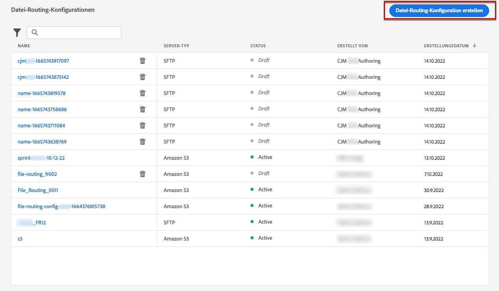

# Konfigurieren von Briefpost {#direct-mail-configuration}

[!DNL Journey Optimizer] ermöglicht es Ihnen, die von Briefpostanbietern benötigten Dateien zu personalisieren und zu generieren, um Briefe an Ihre Kunden zu senden.

Bei der [Erstellung von Briefpostnachrichten](../direct-mail/create-direct-mail.md) definieren Sie die Daten der anvisierten Audience, einschließlich der ausgewählten Kontaktinformationen (z. B. die Postanschrift). Es wird dann automatisch eine Datei mit diesen Daten generiert und auf einen Server exportiert, von dem aus Ihr Briefpostanbieter sie abrufen und die Nachricht versenden kann.

Bevor Sie diese Datei generieren können, müssen Sie Folgendes erstellen:

1. Eine [Datei-Routing-Konfiguration](#file-routing-configuration), in der angegeben wird, auf welchen Server die Datei exportiert wird.

1. Eine [Briefpost-Oberfläche](#direct-mail-surface), die auf die Datei-Routing-Konfiguration verweist.

>[!CAUTION]
>
>Wenn Sie keine Datei-Routing-Option konfiguriert haben, können Sie keine Briefpost-Oberfläche erstellen.

## Konfigurieren des Datei-Routings {#file-routing-configuration}

>[!CONTEXTUALHELP]
>id="ajo_dm_file_routing_details"
>title="Definieren der Datei-Routing-Konfiguration"
>abstract="Nach der Erstellung einer Briefpostnachricht wird die Datei mit den Daten der anvisierten Audience generiert und an einen Server exportiert. Sie müssen die Server-Details angeben, damit Ihr Briefpostanbieter auf diese Datei zugreifen und sie für den Versand von Briefpost verwenden kann."

<!--
>additional-url="https://experienceleague.adobe.com/docs/journey-optimizer/using/direct-mail/create-direct-mail.html" text="Create a direct mail message"-->

>[!CONTEXTUALHELP]
>id="ajo_dm_file_routing_details_header"
>title="Definieren der Datei-Routing-Konfiguration"
>abstract="Sie müssen definieren, wohin die Datei exportiert werden soll, damit Ihr Briefpostanbieter sie verwenden kann."

>[!CONTEXTUALHELP]
>id="ajo_dm_select_file_routing"
>title="Datei-Routing-Konfiguration"
>abstract="Wählen Sie die gewünschte Datei-Routing-Konfiguration aus, die festlegt, wohin die Datei exportiert wird, damit Ihr Briefpostanbieter sie verwenden kann."

>[!CONTEXTUALHELP]
>id="ajo_dm_file_routing_type"
>title="Auswählen des Server-Typs für Ihre Datei"
>abstract="Wählen Sie den Server-Typ aus, den Sie für den Export Ihrer Briefpostdateien verwenden möchten. Derzeit werden von Journey Optimizer nur Amazon S3 und SFTP unterstützt."

>[!CONTEXTUALHELP]
>id="ajo_dm_file_routing_aws_region"
>title="Auswählen der AWS-Region"
>abstract="Wählen Sie die geografische Region des AWS-Servers aus, auf den Sie Ihre Briefpostdateien exportieren möchten. In der Regel empfIehlt es sich, die Region auszuwählen, die dem Standort Ihres Briefpostanbieters am nächsten liegt."

Zum Versand einer Briefpostnachricht generiert [!DNL Journey Optimizer] die Datei mit den Daten der anvisierten Audience und exportiert sie auf einen Server.

Sie müssen die Server-Details angeben, damit Ihr Briefpostanbieter auf diese Datei zugreifen und sie für den Versand von Briefen verwenden kann.

Gehen Sie zur Konfiguration des Datei-Routings wie folgt vor:

1. Rufen Sie das Menü **[!UICONTROL Administration]** > **[!UICONTROL Kanäle]** > **[!UICONTROL Datei-Routing-Konfiguration]** > **[!UICONTROL Datei-Routing]** auf und klicken Sie auf **[!UICONTROL Routing-Konfiguration erstellen]**.

   

1. Legen Sie einen Namen für Ihre Konfiguration fest.

1. Wählen Sie den **[!UICONTROL Server-Typ]** aus, den Sie zum Exportieren der Briefpostdateien verwenden möchten.

   

   >[!NOTE]
   >
   >Derzeit werden in [!DNL Journey Optimizer] nur Amazon S3 und SFTP unterstützt.

1. Geben Sie die Details und Anmeldedaten für Ihren Server ein, z. B. Server-Adresse, Zugriffsschlüssel usw.

   

1. Wenn Sie **[!UICONTROL Amazon S3]** ausgewählt haben, müssen Sie die **[!UICONTROL AWS-Region]** auswählen, in der sich die Server-Infrastruktur befinden wird.

   

   >[!NOTE]
   >
   >AWS-Regionen sind geografische Gebiete, die AWS zum Hosten seiner Cloud-Infrastrukturen verwendet. In der Regel empfIehlt es sich, die Region auszuwählen, die dem Standort Ihres Briefpostanbieters am nächsten liegt.

1. Klicken Sie auf **[!UICONTROL Übermitteln]**. Die Datei-Routing-Konfiguration wird mit dem Status **[!UICONTROL Aktiv]** erstellt. Sie kann jetzt in einer [Briefpost-Oberfläche](#direct-mail-surface) verwendet werden.

   >[!NOTE]
   >
   >Sie können auch **[!UICONTROL Als Entwurf speichern]** auswählen, um die Datei-Routing-Konfiguration zu erstellen. Sie können sie jedoch erst dann auf einer Oberfläche auswählen, wenn sie **[!UICONTROL Aktiv]** ist.

## Erstellen einer Briefpost-Oberfläche {#direct-mail-surface}

>[!CONTEXTUALHELP]
>id="ajo_dm_surface_settings"
>title="Definieren der Briefpost-Einstellungen"
>abstract="Eine Briefpost-Oberfläche enthält die Formatierungseinstellungen der Datei, die die Daten der anvisierten Audience enthält und vom Briefpostanbieter verwendet wird. Sie müssen auch festlegen, wohin die Datei exportiert werden soll. Wählen Sie dazu die entsprechende Datei-Routing-Konfiguration aus."
>additional-url="https://experienceleague.adobe.com/docs/journey-optimizer/using/direct-mail/direct-mail-configuration.html?lang=de#file-routing-configuration" text="Konfigurieren des Datei-Routings"

<!--
>[!CONTEXTUALHELP]
>id="ajo_dm_surface_sort"
>title="Define the sort order"
>abstract="If you select this option, the sort will be by profile ID, ascending or descending. If you unselect it, the sorting configuration defined when creating the direct mail message within a journey or a campaign."-->

>[!CONTEXTUALHELP]
>id="ajo_dm_surface_split"
>title="Festlegen des Schwellenwerts zur Dateiaufspaltung"
>abstract="Für jede Datei, die Audience-Daten enthält, müssen Sie die maximale Anzahl von Datensätzen festlegen. Sie können eine beliebige Zahl zwischen 1 und 200.000 auswählen. Nachdem der festgelegte Schwellenwert erreicht wurde, wird eine neue Datei für die verbleibenden Datensätze erstellt."

Um über [!DNL Journey Optimizer] Briefpost senden zu können, müssen Sie eine Kanaloberfläche erstellen. Darin können Sie die Formatierungseinstellungen für die Datei festlegen, die vom Briefpostanbieter verwendet werden soll.

Eine Briefpost-Oberfläche muss auch die Datei-Routing-Konfiguration enthalten, die den Server definiert, auf den Ihre Briefpostdatei exportiert werden soll.

1. Erstellen einer Kanaloberfläche. [Weitere Informationen](../configuration/channel-surfaces.md)

1. Wählen Sie den Kanal **[!UICONTROL Briefpost]** aus.

   

1. Legen Sie die Briefpost-Einstellungen im entsprechenden Abschnitt der Kanaloberflächenkonfiguration fest.

   

   <!---->

1. Wählen Sie das Dateiformat aus: **[!UICONTROL CSV]** oder **[!UICONTROL Text mit Trennzeichen]**.

1. Wählen Sie abschließend die gewünschte **[!UICONTROL Datei-Routing-Konfiguration]** unter den von Ihnen erstellten Konfigurationen aus. Darin wird definiert, wohin die Datei für Ihren Briefpostanbieter exportiert wird.

   >[!CAUTION]
   >
   >Wenn Sie keine Datei-Routing-Option konfiguriert haben, können Sie keine Briefpost-Oberfläche erstellen. [Weitere Informationen](#file-routing-configuration)

   

   <!---->

1. Senden Sie die Briefpost-Oberfläche ab.

Sie können jetzt innerhalb einer Kampagne [Briefpostnachrichten erstellen](../direct-mail/create-direct-mail.md). Nach Beginn der Kampagne wird die Datei mit den Daten der ausgewählten Audience dann automatisch auf den von Ihnen definierten Server exportiert. Der Briefpostanbieter kann dann diese Datei abrufen und sie zum Versand der Briefpost verwenden.

>[!NOTE]
>
>Doppelte Zeilen werden automatisch entfernt.
>
>Wenn die Anzahl der Datensätze (d. h. Zeilen) für eine Datei mit Profildaten das Maximum überschreitet, wird automatisch eine weitere Datei für die verbleibenden Datensätze erstellt.

<!--
    In the **[!UICONTROL Insertion]** section, you can choose to automatically remove duplicate rows.

    Define the maximum number of records (i.e. rows) for each file containing profile data. After the specified threshold is reached, another file will be created for the remaining records.

    

    For example, if there are 100,000 records in the file and the threshold limit is set to 60,000, the records will be split into two files. The first file will contain 60,000 rows, and the second file will contain the remaining 40,000 rows.

    >[!NOTE]
    >
    >NOTE You can set any number between 1 and 200,000 records, meaning each file must contain at least 1 row and no more than 200,000 rows.

-->