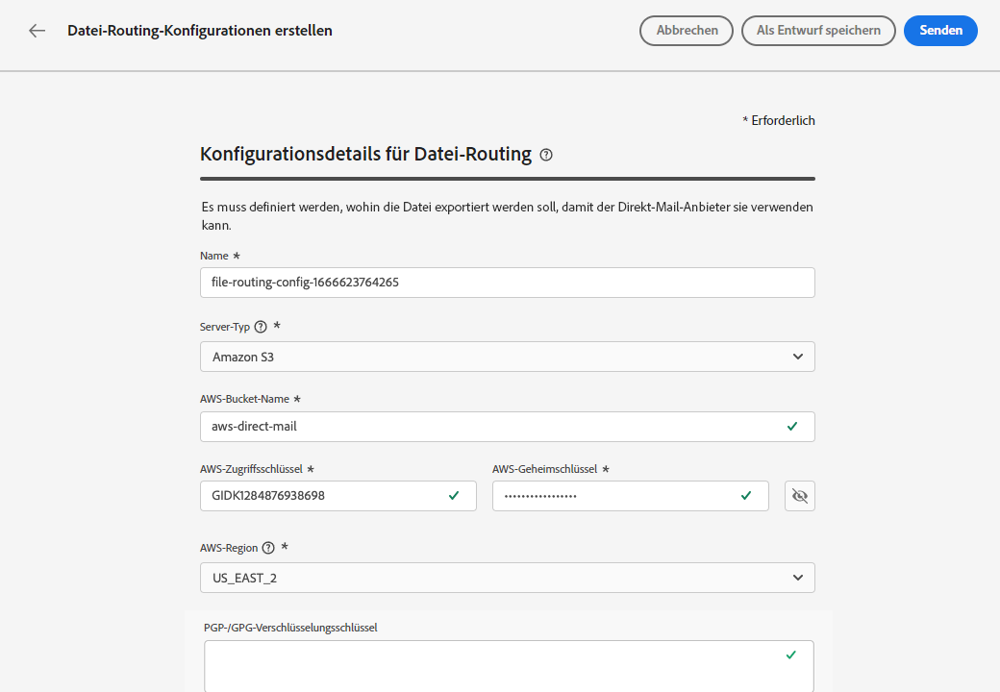
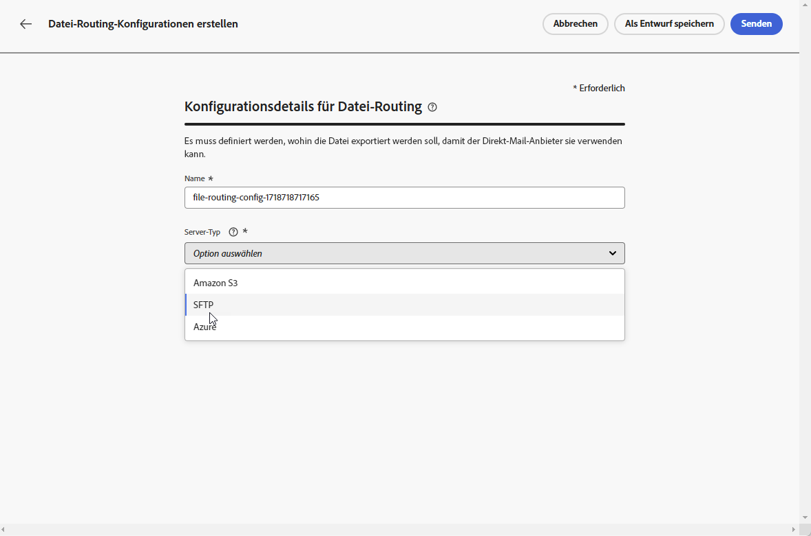
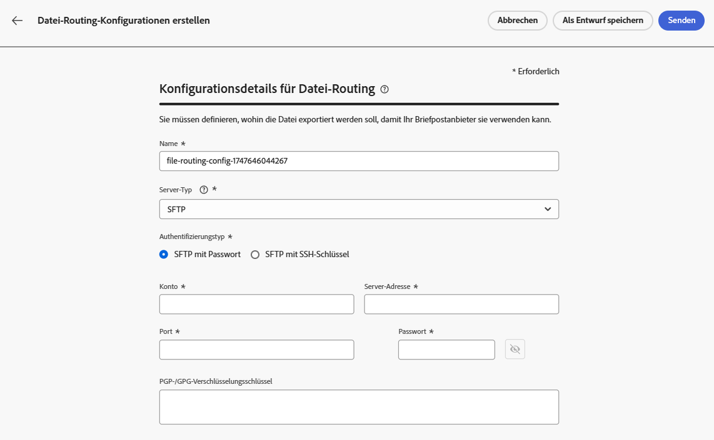
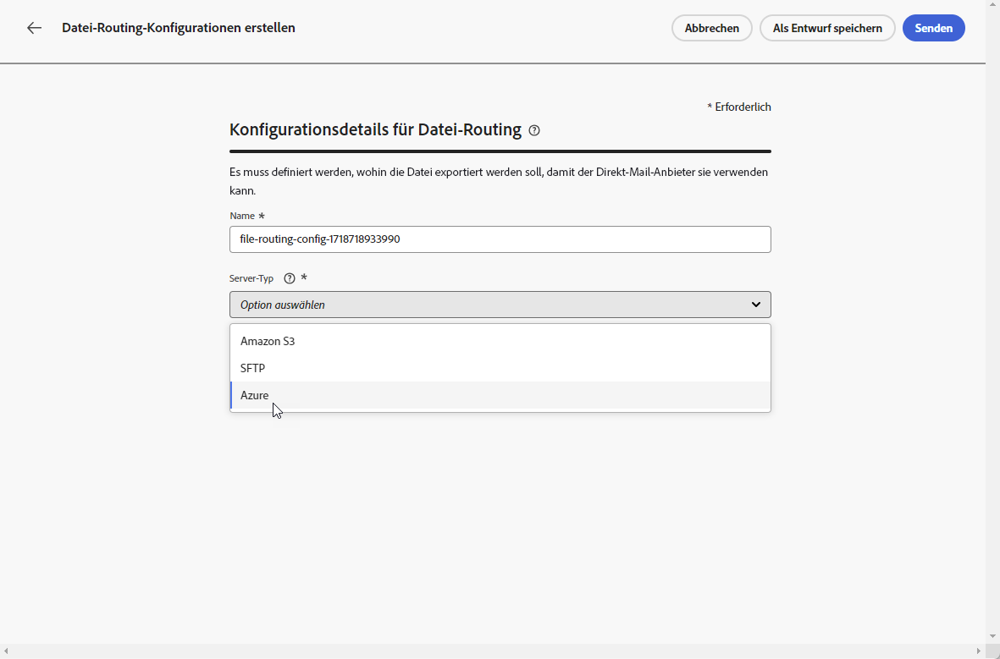
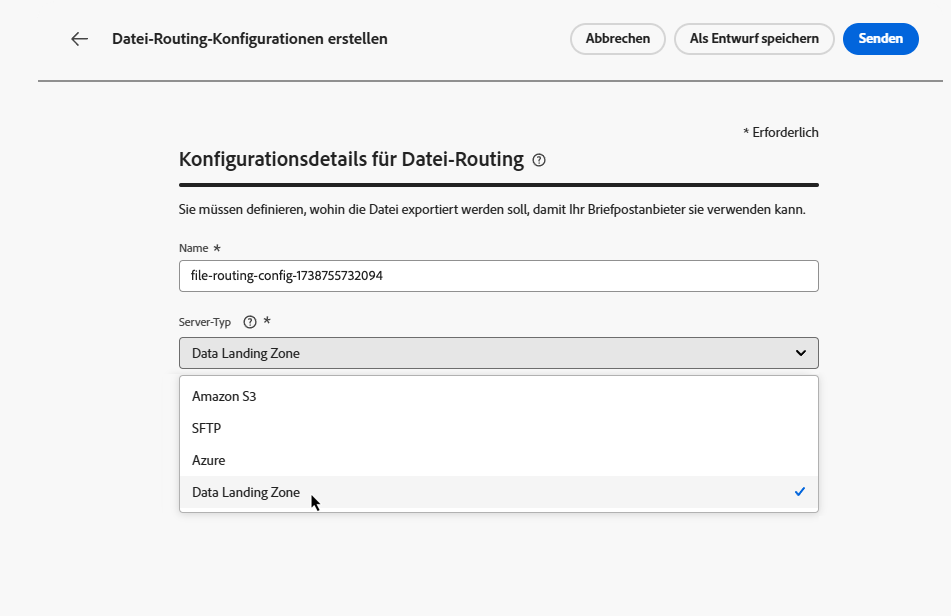
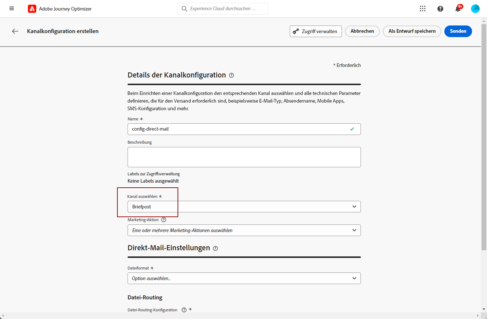

# Konfigurieren von Direkt-Mail {#direct-mail-configuration}

[!DNL Journey Optimizer] ermöglicht es Ihnen, die von Briefpostanbietern benötigten Dateien zu personalisieren und zu generieren, um Briefe an Ihre Kunden zu senden.

Bei der [Erstellung von Briefpostnachrichten](../direct-mail/create-direct-mail.md) definieren Sie die Daten der anvisierten Zielgruppe, einschließlich der ausgewählten Kontaktinformationen (z. B. die Postanschrift). Es wird dann automatisch eine Datei mit diesen Daten generiert und auf einen Server exportiert, von dem aus Ihr Briefpostanbieter sie abrufen und die Nachricht versenden kann.

Bevor Sie diese Datei generieren können, müssen Sie Folgendes erstellen:

1. Eine [Datei-Routing-Konfiguration](#file-routing-configuration), um den Server anzugeben, zu dem die Datei exportiert werden soll, und die Datei bei Bedarf zu verschlüsseln.

   >[!CAUTION]
   >
   >Zum Erstellen einer Datei-Routing-Konfiguration benötigen Sie die integrierte Berechtigung **[!DNL Manage file routing]**. [Weitere Informationen](../administration/ootb-product-profiles.md#content-library-manager).

1. Eine [Direkt-Mail-Konfiguration](#direct-mail-configuration), die auf die Datei-Routing-Konfiguration verweist. Wenn Sie keine Datei-Routing-Option konfiguriert haben, können Sie keine Direkt-Mail-Konfiguration erstellen.

## Konfigurieren des Datei-Routings {#file-routing-configuration}

>[!CONTEXTUALHELP]
>id="ajo_dm_file_routing_details"
>title="Definieren der Datei-Routing-Konfiguration"
>abstract="Nach der Erstellung einer Briefpostnachricht wird die Datei mit den Daten der anvisierten Zielgruppe generiert und an einen Server exportiert. Sie müssen die Server-Details angeben, damit Ihr Briefpostanbieter auf diese Datei zugreifen und sie für den Versand von Briefpost verwenden kann."
>additional-url="https://experienceleague.adobe.com/de/docs/journey-optimizer/using/channels/direct-mail/create-direct-mail" text="Erstellen einer Briefpostnachricht"

>[!CONTEXTUALHELP]
>id="ajo_dm_file_routing_details_header"
>title="Definieren der Datei-Routing-Konfiguration"
>abstract="Sie müssen definieren, wohin die Datei exportiert werden soll, damit Ihr Briefpostanbieter sie verwenden kann."

>[!CONTEXTUALHELP]
>id="ajo_dm_select_file_routing"
>title="Datei-Routing-Konfiguration"
>abstract="Wählen Sie die gewünschte Datei-Routing-Konfiguration aus, die festlegt, wohin die Datei exportiert wird, damit Ihr Briefpostanbieter sie verwenden kann."

>[!CONTEXTUALHELP]
>id="ajo_dm_file_routing_type"
>title="Auswählen des Server-Typs für Ihre Datei"
>abstract="Wählen Sie den Server-Typ aus, der für den Export Ihrer Briefpostdateien verwendet werden soll: Amazon S3, SFTP oder Azure."

>[!CONTEXTUALHELP]
>id="ajo_dm_file_routing_aws_region"
>title="Auswählen der AWS-Region"
>abstract="Wählen Sie die geografische Region des AWS-Servers aus, auf den Sie Ihre Briefpostdateien exportieren möchten. In der Regel empfIehlt es sich, die Region auszuwählen, die dem Standort Ihres Briefpostanbieters am nächsten liegt."

>[!NOTE]
>
>Derzeit werden Amazon S3, SFTP, Azure und die Data Landing Zone in [!DNL Journey Optimizer] unterstützt.

Zum Versand einer Briefpostnachricht generiert [!DNL Journey Optimizer] die Datei mit den Daten der anvisierten Zielgruppe und exportiert sie auf einen Server.

Sie müssen die Server-Details angeben, damit Ihr Briefpostanbieter auf diese Datei zugreifen und sie für den Versand von Briefen verwenden kann.

Gehen Sie zur Konfiguration des Datei-Routings wie folgt vor:

>[!BEGINTABS]

>[!TAB Amazon S3]

1. Rufen Sie das Menü **[!UICONTROL Administration]** > **[!UICONTROL Kanäle]** > **[!UICONTROL Direkt-Mail-Einstellungen]** > **[!UICONTROL Datei-Routing]** auf und klicken Sie auf **[!UICONTROL Routing-Konfiguration erstellen]**.

   {width="800" align="center"}

1. Legen Sie einen Namen für Ihre Konfiguration fest.

1. Wählen Sie **Amazon S3** als **[!UICONTROL Server-Typ]** zum Exportieren der Direkt-Mail-Dateien.

   {width="800" align="center"}

1. Geben Sie die Details und Anmeldedaten für Ihren Server ein.

   * **Name des AWS-Buckets**: Informationen dazu, wo Sie den Namen Ihres AWS-Buckets finden, erhalten Sie auf [dieser Seite](https://docs.aws.amazon.com/de_de/AmazonS3/latest/userguide/UsingBucket.html).

   * **AWS-Zugriffsschlüssel**: Informationen dazu, wo Sie die ID Ihres AWS-Zugangsschlüssels finden, erhalten Sie auf [dieser Seite](https://docs.aws.amazon.com/de_de/IAM/latest/UserGuide/security-creds.html#access-keys-and-secret-access-keys).

   * **Geheimer AWS-Schlüssel**: Informationen dazu, wo Sie Ihren geheimen AWS-Schlüssel finden, erhalten Sie auf [dieser Seite](https://aws.amazon.com/de/blogs/security/wheres-my-secret-access-key/).

   * **AWS-Region**: Wählen Sie die **[!UICONTROL AWS-Region]** in der sich die Server-Infrastruktur befinden wird. AWS-Regionen sind geografische Gebiete, die AWS zum Hosten seiner Cloud-Infrastrukturen verwendet. In der Regel empfIehlt es sich, die Region auszuwählen, die dem Standort Ihres Briefpostanbieters am nächsten liegt.

   {width="800" align="center"}

1. Um die Datei zu verschlüsseln, kopieren Sie den Verschlüsselungsschlüssel in das Feld **[!UICONTROL PGP/GPG-Verschlüsselungsschlüssel]**.

1. Klicken Sie auf **[!UICONTROL Übermitteln]**. Die Datei-Routing-Konfiguration wird mit dem Status **[!UICONTROL Aktiv]** erstellt. Sie kann jetzt in einer [Direkt-Mail-Konfiguration](#direct-mail-surface) verwendet werden.

   Sie können auch **[!UICONTROL Als Entwurf speichern]** auswählen, um die Datei-Routing-Konfiguration zu erstellen. Sie können sie jedoch erst dann in einer Konfiguration auswählen, wenn sie **[!UICONTROL aktiv]** ist.

>[!TAB SFTP]

1. Rufen Sie das Menü **[!UICONTROL Administration]** > **[!UICONTROL Kanäle]** > **[!UICONTROL Direkt-Mail-Einstellungen]** > **[!UICONTROL Datei-Routing]** auf und klicken Sie auf **[!UICONTROL Routing-Konfiguration erstellen]**.

   {width="800" align="center"}

1. Legen Sie einen Namen für Ihre Konfiguration fest.

1. Wählen Sie SFTP als **[!UICONTROL Server-Typ]** für den Export der Briefpostdateien aus.

   {width="800" align="center"}

1. Geben Sie die Details und Anmeldedaten für Ihren Server ein:

   * **Konto**: Der für die Verbindung zum SFTP-Server verwendete Kontoname.

   * **Server-Adresse**: URL des SFTP-Servers.

   * **Port**: Port-Nummer der FTP-Verbindung.

   * **Passwort**: Passwort, das für die Verbindung zum SFTP-Server verwendet wird.

   

   >[!NOTE]
   >
   >Um einen Pfad auf dem Server zum Speichern der Datei anzugeben, aktualisieren Sie den **[!UICONTROL Dateinamen]** der Direkt-Mail-Kampagne, um den gewünschten Pfad einzuschließen. [Weitere Informationen](create-direct-mail.md#extraction-file)

1. Um die Datei zu verschlüsseln, kopieren Sie den Verschlüsselungsschlüssel in das Feld **[!UICONTROL PGP/GPG-Verschlüsselungsschlüssel]**.

1. Klicken Sie auf **[!UICONTROL Übermitteln]**. Die Datei-Routing-Konfiguration wird mit dem Status **[!UICONTROL Aktiv]** erstellt. Sie kann jetzt in einer [Direkt-Mail-Konfiguration](#direct-mail-surface) verwendet werden.

   Sie können auch **[!UICONTROL Als Entwurf speichern]** auswählen, um die Datei-Routing-Konfiguration zu erstellen. Sie können sie jedoch erst dann in einer Konfiguration auswählen, wenn sie **[!UICONTROL aktiv]** ist.

>[!TAB Azure]

1. Rufen Sie das Menü **[!UICONTROL Administration]** > **[!UICONTROL Kanäle]** > **[!UICONTROL Direkt-Mail-Einstellungen]** > **[!UICONTROL Datei-Routing]** auf und klicken Sie auf **[!UICONTROL Routing-Konfiguration erstellen]**.

   {width="800" align="center"}

1. Legen Sie einen Namen für Ihre Konfiguration fest.

1. Wählen Sie Azure als **[!UICONTROL Server-Typ]** für den Export der Briefpostdateien aus.

   {width="800" align="center"}

1. Geben Sie die Details und Anmeldedaten für Ihren Server ein:

   * **Azure-Verbindungszeichenfolge**: Informationen dazu, wie Sie Ihre **Azure-Verbindungszeichenfolge** finden, erhalten Sie auf [dieser Seite](https://learn.microsoft.com/de-de/azure/storage/common/storage-configure-connection-string#configure-a-connection-string-for-an-azure-storage-account).

     Die **Azure-Verbindungszeichenfolge** sollte dem folgenden Format entsprechen:

     `DefaultEndpointsProtocol=[http|https];AccountName=myAccountName;AccountKey=myAccountKey`

   * **Container-Name**: Informationen dazu, wie Sie Ihren **Container-Namen** finden, erhalten Sie auf [dieser Seite](https://learn.microsoft.com/de-de/azure/storage/blobs/blob-containers-portal).

     Der **Container-Name** sollte nur den Namen des Containers ohne Schrägstriche enthalten. Um einen Pfad innerhalb des Containers zum Speichern der Datei anzugeben, aktualisieren Sie den **[!UICONTROL Dateinamen]** der Direkt-Mail-Kampagne, um den gewünschten Pfad einzuschließen. [Weitere Informationen](create-direct-mail.md#extraction-file)

1. Um die Datei zu verschlüsseln, kopieren Sie den Verschlüsselungsschlüssel in das Feld **[!UICONTROL PGP/GPG-Verschlüsselungsschlüssel]**.

1. Klicken Sie auf **[!UICONTROL Übermitteln]**. Die Datei-Routing-Konfiguration wird mit dem Status **[!UICONTROL Aktiv]** erstellt. Sie kann jetzt in einer [Direkt-Mail-Konfiguration](#direct-mail-surface) verwendet werden.

   Sie können auch **[!UICONTROL Als Entwurf speichern]** auswählen, um die Datei-Routing-Konfiguration zu erstellen. Sie können sie jedoch erst dann in einer Konfiguration auswählen, wenn sie **[!UICONTROL aktiv]** ist.

>[!TAB Data Landing Zone]

1. Rufen Sie das Menü **[!UICONTROL Administration]** > **[!UICONTROL Kanäle]** > **[!UICONTROL Direkt-Mail-Einstellungen]** > **[!UICONTROL Datei-Routing]** auf und klicken Sie auf **[!UICONTROL Routing-Konfiguration erstellen]**.

   {width="800" align="center"}

1. Legen Sie einen Namen für Ihre Konfiguration fest.

1. Wählen Sie als **[!UICONTROL -Typ die Data Landing Zone]**, um die Briefpostdateien zu exportieren.

   {width="800" align="center"}

1. Um die Datei zu verschlüsseln, kopieren Sie Ihren Verschlüsselungsschlüssel in das Feld **[!UICONTROL PGP/GPG-]**&quot;. <!--To find it, ...-->

   

1. Klicken Sie auf **[!UICONTROL Übermitteln]**. Die Datei-Routing-Konfiguration wird mit dem Status **[!UICONTROL Aktiv]** erstellt. Sie kann jetzt in einer [Direkt-Mail-Konfiguration](#direct-mail-surface) verwendet werden.

   Sie können auch **[!UICONTROL Als Entwurf speichern]** auswählen, um die Datei-Routing-Konfiguration zu erstellen. Sie können sie jedoch erst dann in einer Konfiguration auswählen, wenn sie **[!UICONTROL aktiv]** ist.

Weitere Informationen zur Data Landing Zone finden Sie in der Dokumentation zu [Adobe Experience Platform](https://experienceleague.adobe.com/en/docs/experience-platform/sources/connectors/cloud-storage/data-landing-zone){target="_blank"}.

>[!ENDTABS]

## Erstellen einer Direkt-Mail-Konfiguration {#direct-mail-surface}

>[!CONTEXTUALHELP]
>id="ajo_dm_surface_settings"
>title="Definieren der Direkt-Mail-Einstellungen"
>abstract="Eine Direkt-Mail-Konfiguration enthält die Formatierungseinstellungen der Datei, die die Daten der anvisierten Zielgruppe enthält und vom Direkt-Mail-Anbieter verwendet wird. Sie müssen auch festlegen, wohin die Datei exportiert werden soll. Wählen Sie dazu die entsprechende Datei-Routing-Konfiguration aus."
>additional-url="https://experienceleague.adobe.com/de/docs/journey-optimizer/using/channels/direct-mail/direct-mail-configuration#file-routing-configuration" text="Konfigurieren des Datei-Routings"

<!--
>[!CONTEXTUALHELP]
>id="ajo_dm_surface_sort"
>title="Define the sort order"
>abstract="If you select this option, the sort will be by profile ID, ascending or descending. If you unselect it, the sorting configuration defined when creating the direct mail message within a journey or a campaign."-->

>[!CONTEXTUALHELP]
>id="ajo_dm_surface_split"
>title="Festlegen des Schwellenwerts zur Dateiaufspaltung"
>abstract="Für jede Datei, die Zielgruppen-Daten enthält, müssen Sie die maximale Anzahl von Datensätzen festlegen. Sie können eine beliebige Zahl zwischen 1 und 200.000 auswählen. Nachdem der festgelegte Schwellenwert erreicht wurde, wird eine neue Datei für die verbleibenden Datensätze erstellt."

Um über [!DNL Journey Optimizer] Direkt-Mail senden zu können, müssen Sie eine Kanalkonfiguration erstellen. Darin können Sie die Formatierungseinstellungen für die Datei festlegen, die vom Direkt-Mail-Anbieter verwendet werden soll.

Eine Direkt-Mail-Konfiguration muss auch die Datei-Routing-Konfiguration enthalten, die den Server definiert, auf den Ihre Direkt-Mail-Datei exportiert werden soll.

1. Navigieren Sie in der linken Leiste zu **[!UICONTROL Administration]** > **[!UICONTROL Kanäle]** und wählen Sie **[!UICONTROL Allgemeine Einstellungen]** > **[!UICONTROL Kanalkonfigurationen]**. Klicken Sie auf die Schaltfläche **[!UICONTROL Kanalkonfiguration erstellen]**. [Weitere Informationen](../configuration/channel-surfaces.md)

   

1. Geben Sie einen Namen und eine Beschreibung (optional) für die Konfiguration ein und wählen Sie dann den zu konfigurierenden Kanal aus.

   >[!NOTE]
   >
   > Namen müssen mit einem Buchstaben (A–Z) beginnen. Ein Name darf nur alphanumerische Zeichen enthalten. Sie können auch die Zeichen Unterstrich `_`, Punkt `.` und Bindestrich `-` verwenden.

1. Um der Konfiguration benutzerdefinierte oder grundlegende Datennutzungskennzeichnungen zuzuweisen, können Sie **[!UICONTROL Zugriff verwalten]** auswählen. [Weitere Informationen zur Zugriffssteuerung auf Objektebene (OLAC)](../administration/object-based-access.md).

1. Wählen Sie den Kanal **[!UICONTROL Direkt-Mail]** aus.

   

1. Wählen Sie eine **[!UICONTROL Marketing-Aktion]** aus, um Einverständnisrichtlinien mit den Nachrichten zu verknüpfen, die diese Konfiguration verwenden. Es werden alle mit dieser Marketing-Aktion verknüpften Einverständnisrichtlinien genutzt, um die Voreinstellungen Ihrer Kundinnen und Kunden zu respektieren. [Weitere Informationen](../action/consent.md#surface-marketing-actions)

1. Legen Sie die Direkt-Mail-Einstellungen im entsprechenden Abschnitt der Kanalkonfiguration fest.

   {width="800" align="center"}

   <!---->

1. Wählen Sie das Dateiformat aus: **[!UICONTROL CSV]** oder **[!UICONTROL Text mit Trennzeichen]**.

1. Wenn Sie **[!UICONTROL Text mit Trennzeichen]** auswählen, definieren Sie das Spaltentrennzeichen Ihrer Wahl: Tabulator, Semikolon, senkrechter Strich oder kaufmännisches Und-Zeichen.

   

1. Wählen Sie abschließend die gewünschte **[!UICONTROL Datei-Routing-Konfiguration]** unter den von Ihnen erstellten Konfigurationen aus. Darin wird definiert, wohin die Datei für Ihren Direkt-Mail-Anbieter exportiert wird.

   >[!CAUTION]
   >
   >Wenn Sie keine Datei-Routing-Option konfiguriert haben, können Sie keine Direkt-Mail-Konfiguration erstellen. [Weitere Informationen](#file-routing-configuration)

   {width="800" align="center"}

   <!---->

1. Senden Sie die Direkt-Mail-Konfiguration ab.

Sie können jetzt innerhalb einer Kampagne [Briefpostnachrichten erstellen](../direct-mail/create-direct-mail.md). Nach Beginn der Kampagne wird die Datei mit den Daten der ausgewählten Zielgruppe dann automatisch auf den von Ihnen definierten Server exportiert. Der Briefpostanbieter kann dann diese Datei abrufen und sie zum Versand der Briefpost verwenden.

>[!NOTE]
>
>Duplizierte Zeilen, bei denen alle Werte in der Zeile identisch sind, werden automatisch aus der Datei entfernt.

<!--
    In the **[!UICONTROL Insertion]** section, you can choose to automatically remove duplicate rows.

    Define the maximum number of records (i.e. rows) for each file containing profile data. After the specified threshold is reached, another file will be created for the remaining records.

    

    For example, if there are 100,000 records in the file and the threshold limit is set to 60,000, the records will be split into two files. The first file will contain 60,000 rows, and the second file will contain the remaining 40,000 rows.

    >[!NOTE]
    >
    >NOTE You can set any number between 1 and 200,000 records, meaning each file must contain at least 1 row and no more than 200,000 rows.

-->