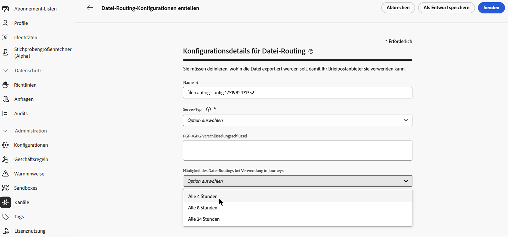
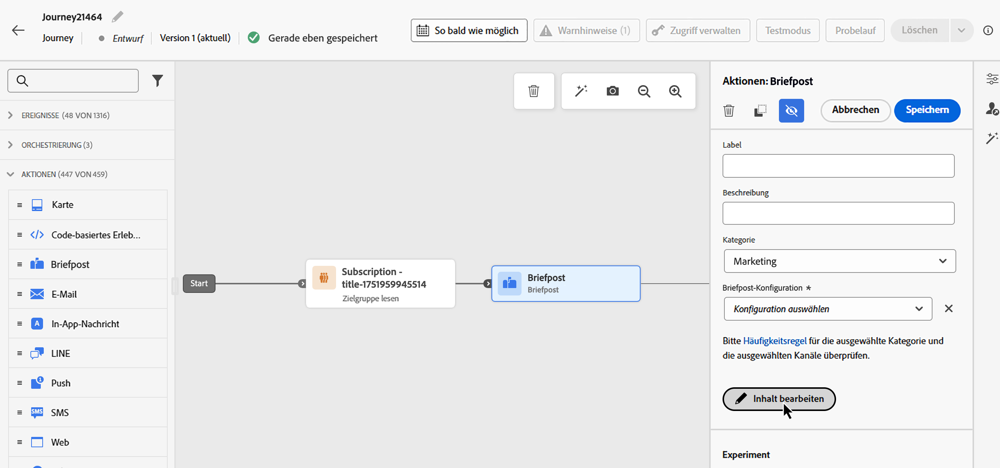

# Senden von Direkt-Mail-Nachrichten mit Journeys {#direct-mail-journeys}

>[!CONTEXTUALHELP]
>id="ajo_journey_direct_mail"
>title="Endaktivität"
>abstract="Direkt-Mail ist ein Offline-Kanal, mit dem Sie die Extraktionsdateien personalisieren und generieren können, die Direkt-Mail-Drittanbieter zum Senden von Nachrichten an Ihre Kundinnen und Kunden benötigen."

>[!AVAILABILITY]
>
>Diese Funktion ist nur für eine ausgewählte Gruppe von Organisationen verfügbar (eingeschränkte Verfügbarkeit). 

Direkt-Mail ist ein Offline-Kanal, mit dem Sie die Extraktionsdateien personalisieren und generieren können, die Direkt-Mail-Drittanbieter zum Senden von Nachrichten an Ihre Kundinnen und Kunden benötigen.

Bei der Erstellung einer Direkt-Mail-Nachricht generiert [!DNL Journey Optimizer] automatisch eine Datei, die alle Zielgruppenprofile und ausgewählten Daten enthält, z. B. Postanschriften und Profilattribute. Diese Datei wird an den Server Ihrer Wahl gesendet, sodass der von Ihnen gewählte Direkt-Mail-Anbieter darauf zugreifen kann, der den eigentlichen Mailing-Prozess für Sie übernimmt.

Sie müssen ggf. mit Ihrem ausgewählten Direkt-Mail-Drittanbieter zusammenarbeiten, um die erforderliche Zustimmung von Ihren Kundinnen und Kunden zu erhalten, damit diese Ihre Sendungen erhalten können. Die Nutzung von Mailing-Services unterliegt den zusätzlichen Bedingungen des jeweiligen Direkt-Mail-Drittanbieters.  Adobe hat keine Kontrolle über die Produkte von Drittanbietern und ist nicht für Ihre Nutzung dieser Produkte verantwortlich. Bei Problemen oder Fragen im Zusammenhang mit dem Versand Ihrer Direkt-Mail-Nachricht wenden Sie sich bitte an Ihren jeweiligen Direkt-Mail-Drittanbieter.

>[!NOTE]
>
>Auf dieser Seite wird der Prozess zum Erstellen und Senden von Direkt-Mail-Nachrichten mit Journeys beschrieben. Weiterführende Informationen zum Direkt-Mail-Kanal und zum Erstellen von Direkt-Mail-Kampagnen finden Sie in diesem Abschnitt: [Erste Schritte mit Direkt-Mail](../direct-mail/get-started-direct-mail.md).

## Erstellen einer Datei-Routing-Konfiguration

>[!CONTEXTUALHELP]
>id="ajo_dm_file_routing_frequency"
>title="Auswählen der AWS-Region"
>abstract="Wenn Ihre Datei-Routing-Konfiguration mit Journeys gesendet wird, können Sie die Häufigkeit festlegen, mit der die Datei an den Server gesendet wird."

Stellen Sie vor der Erstellung einer Direkt-Mail-Nachricht sicher, dass in Ihrer Datei-Routing-Konfiguration der Server angegeben ist, auf den die Extraktionsdatei hochgeladen und gespeichert werden soll. Gehen Sie dazu wie folgt vor:

1. Rufen Sie das Menü **[!UICONTROL Administration]** > **[!UICONTROL Kanäle]** > **[!UICONTROL Direkt-Mail-Einstellungen]** > **[!UICONTROL Datei-Routing]** auf und klicken Sie auf **[!UICONTROL Routing-Konfiguration erstellen]**.

1. Definieren Sie die Eigenschaften der Datei-Routing-Konfiguration, zum Beispiel den Namen und den Typ des zu verwendenden Servers. Detaillierte Informationen zum Einrichten einer Datei-Routing-Konfiguration finden Sie im Abschnitt [Direkt-Mail-Konfiguration](../direct-mail/direct-mail-configuration.md#file-routing-configuration).

   Wenn Ihre Datei-Routing-Konfiguration mit Journeys gesendet wird, können Sie die Häufigkeit festlegen, mit der die Datei an den Server gesendet wird.

   

1. Klicken Sie auf **[!UICONTROL Senden]**, um die Erstellung der Datei-Routing-Konfiguration zu bestätigen. Die Konfiguration wird mit dem Status **[!UICONTROL Aktiv]** erstellt. Sie kann jetzt in einer Direkt-Mail-Konfiguration referenziert werden.

## Erstellen einer Direkt-Mail-Konfiguration {#direct-mail-surface}

Eine Direkt-Mail-Konfiguration enthält die Formatierungseinstellungen der Datei, die die Daten der anvisierten Zielgruppe enthält und vom Direkt-Mail-Anbieter verwendet wird. Sie müssen auch festlegen, wohin die Datei exportiert werden soll. Wählen Sie dazu die entsprechende Datei-Routing-Konfiguration aus. Detaillierte Informationen zum Erstellen einer Direkt-Mail-Konfiguration finden Sie im Abschnitt [Direkt-Mail-Konfiguration](../direct-mail/direct-mail-configuration.md#file-routing-configuration).

Sobald Ihre Direkt-Mail-Konfiguration bereit ist, können Sie Ihrer Journey eine Direkt-Mail-Aktion hinzufügen.

## Hinzufügen einer Direkt-Mail-Aktion zu Ihrer Journey

Gehen Sie wie folgt vor, um einer Journey eine Direkt-Mail-Aktion hinzuzufügen:

1. Öffnen Sie Ihre Journey und ziehen Sie eine Aktivität **[!UICONTROL Direkt-Mail]** per Drag-and-Drop aus dem Abschnitt **Aktionen** der Palette.

1. Geben Sie allgemeine Informationen (Label, Beschreibung, Kategorie) zu Ihrer Nachricht ein und wählen Sie dann die zu verwendende Konfiguration aus. Das Feld **[!UICONTROL Konfiguration]** ist standardmäßig vorab mit der letzten Konfiguration für den Kanal ausgefüllt, den die Benutzerin oder der Benutzer verwendet hat. Weitere Informationen zur Konfiguration einer Journey finden Sie auf [dieser Seite](../building-journeys/journey-gs.md).

1. Konfigurieren Sie die Extraktionsdatei, die an Ihren Direkt-Mail-Anbieter gesendet werden soll. Klicken Sie dazu auf die Schaltfläche **[!UICONTROL Inhalt bearbeiten]**.

   

1. Passen Sie die Eigenschaften der Extraktionsdatei an, z. B. den Dateinamen oder die anzuzeigenden Spalten. Weitere Informationen zum Konfigurieren der Eigenschaften der Extraktionsdatei finden Sie in diesem Abschnitt: [Erstellen einer Direkt-Mail-Nachricht](../direct-mail/create-direct-mail.md#extraction-file).

   

1. Sobald der Inhalt der Extraktionsdatei definiert wurde, können Sie Testprofile verwenden, um sie in der Vorschau anzuzeigen. Wenn Sie personalisierten Inhalt eingefügt haben, können Sie mithilfe von Testprofildaten überprüfen, wie dieser Inhalt in der Nachricht angezeigt wird.

   Klicken Sie dazu auf **[!UICONTROL Inhalt simulieren]** und fügen Sie dann ein Testprofil hinzu, um zu prüfen, wie die Extraktionsdatei unter Verwendung der Testprofildaten gerendert wird. Detaillierte Informationen zur Auswahl von Testprofilen und zur Vorschau Ihres Inhalts finden Sie im Abschnitt [Content-Management](../content-management/preview-test.md).

   {width="800" align="center"}

Wenn Ihre Push-Benachrichtigung bereit ist, schließen Sie zum Versenden die Konfiguration Ihrer [Journey](../building-journeys/journey-gs.md) ab.
