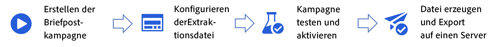

# Erste Schritte mit Briefpost {#create-direct}

>[!AVAILABILITY]
>
>Derzeit ist der Kanal „Briefpost“ nicht für Organisationen verfügbar, die das Zusatzangebot Adobe Healthcare Shield erworben haben.
>

Briefpost ist ein Offline-Kanal, mit dem Sie die Extraktionsdateien personalisieren und generieren können, die Briefpostanbieter zum Senden von Nachrichten an Ihre Kunden bzw. Kundinnen benötigen.

Bei der Erstellung einer Briefpost-Kampagne generiert Journey Optimizer automatisch eine Datei, die alle Zielgruppenprofile und ausgewählten Daten enthält, z. B. Postanschriften und Profilattribute. Diese Datei wird an den Server Ihrer Wahl gesendet, damit der von Ihnen ausgewählte Briefpost-Dienstleister Zugriff darauf hat, der den eigentlichen Versandprozess für Sie handhabt.

Die wichtigsten Schritte zum Senden von Briefpostnachrichten sind:

Briefpostnachrichten können nur im Rahmen geplanter Kampagnen erstellt werden. Sie sind nicht für die Verwendung in API-basierten Kampagnen oder in Journeys verfügbar.
