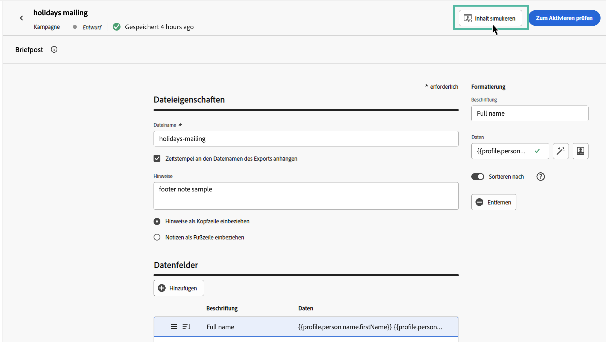
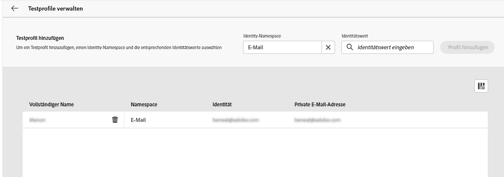
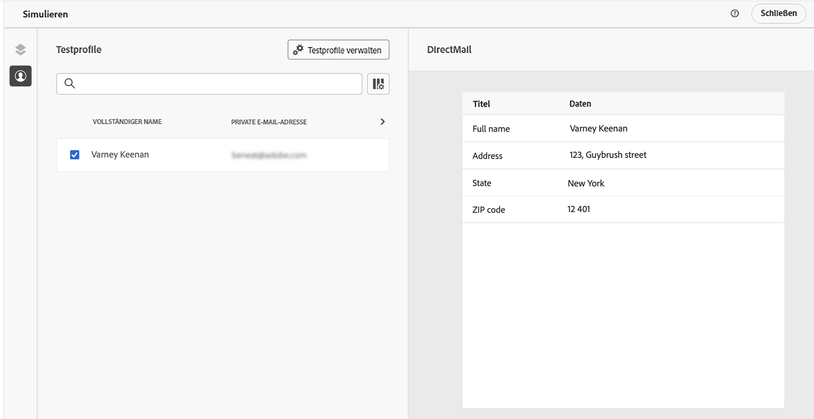
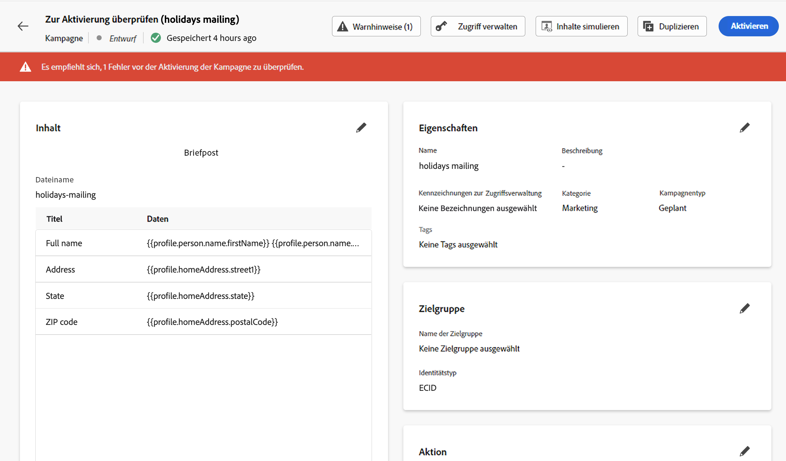

# Testen und Senden einer Briefpostnachricht {#direct-mail-test-send}

## Anzeigen der Extraktionsdatei in der Vorschau {#preview-dm}

Sobald der Inhalt der Extraktionsdatei definiert wurde, können Sie Testprofile verwenden, um sie in der Vorschau anzuzeigen. Wenn Sie personalisierten Inhalt eingefügt haben, können Sie mithilfe von Testprofildaten überprüfen, wie dieser Inhalt in der Nachricht angezeigt wird.

1. Klicken Sie im Konfigurationsbildschirm der Extraktionsdatei auf **[!UICONTROL Inhalt simulieren]**.

   {width="800" align="center"}

1. Klicken Sie auf **[!UICONTROL Testprofile verwalten]**, um ein Testprofil hinzuzufügen.

1. Suchen Sie Ihr Testprofil mit den Feldern **[!UICONTROL Identity-Namespace]** und **[!UICONTROL Identitätswert]**. Klicken Sie anschließend auf **[!UICONTROL Profil hinzufügen]**.

   {width="800" align="center"}

1. Nachdem Sie Ihr Testprofil ausgewählt haben, können Sie das Fenster **[!UICONTROL Testprofil hinzufügen]** schließen.

1. Im Fenster **Vorschau und Test** werden dem Inhalt der Extraktionsdatei Testprofildaten hinzugefügt, sodass Sie eine Vorschau sehen können, wie die Datei dargestellt werden wird.

   {width="800" align="center"}

Sobald der Inhalt der Datei versandbereit ist, schließen Sie den Simulationsbildschirm und klicken Sie auf die Schaltfläche **[!UICONTROL Zum Aktivieren überprüfen]**.

## Validieren und Aktivieren der Briefpost-Kampagne {#dm-validate}

Bevor Sie die Briefpost-Kampagne aktivieren, stellen Sie sicher, dass die Kampagne und die Extraktionsdatei ordnungsgemäß konfiguriert sind. Überprüfen Sie dazu die Warnhinweise im oberen Bereich des Editors. Einige davon sind einfache Warnungen, aber andere können Sie daran hindern, die Nachricht zu senden. Es gibt zwei Arten von Warnungen: Warnungen und Fehler.

* **Warnhinweise** geben Hinweise auf Empfehlungen und zeigen Best Practices. So wird beispielsweise eine Warnmeldung angezeigt, wenn Ihre SMS-Nachricht leer ist.

* **Fehler** verhindern, dass Sie die Kampagne veröffentlichen können, solange diese nicht behoben sind. Eine Fehlermeldung warnt Sie zum Beispiel, wenn die Betreffzeile fehlt.

{width="800" align="center"}

Wenn Ihre Briefpost-Kampagne fertig ist, klicken Sie auf die Schaltfläche **[!UICONTROL Aktivieren]**. Wenn die Kampagne startet, wird die Extraktionsdatei automatisch generiert und zu dem Server exportiert, der in Ihrer [Datei-Routing-Konfiguration](../direct-mail/direct-mail-configuration.md) festgelegt ist.

Nach dem Versand können Sie die Wirkung Ihrer Briefpost-Kampagne in den Kampagnenberichten messen. Weiterführende Informationen zum Reporting finden Sie in diesem Abschnitt.

## Verwalten des Einverständnisses für Briefpost {#dm-consent-management}

In [!DNL Journey Optimizer] wird das Einverständnis durch das [Einverständnisschema](https://experienceleague.adobe.com/docs/experience-platform/xdm/field-groups/profile/consents.html?lang=de){target="_blank"} von Experience Platform verarbeitet. Standardmäßig ist der Wert für das Einverständnisfeld leer, was als Einverständnis für den Empfang Ihrer Nachrichten gilt.

Wenn sich ein Profil vom Erhalt von Briefpost abgemeldet hat, wird in den entsprechenden Profilattributen der Wert für `consents.marketing.postalMail.val` auf `n` festgelegt und das entsprechende Profil von den folgenden Sendungen ausgeschlossen.

Um es erneut zu aktivieren, muss das Profilattribut wieder in `consents.marketing.postalMail.val` : `y` geändert werden.

Um die Attribute eines Profils zu verwalten, gehen Sie zu Experience Platform und greifen Sie auf das Profil zu, indem Sie einen Identity-Namespace und einen entsprechenden Identitätswert auswählen. Weitere Informationen finden Sie in der [Dokumentation zu Adobe Experience Platform](https://experienceleague.adobe.com/docs/experience-platform/profile/ui/user-guide.html?lang=de#getting-started){target="_blank"}.

In [diesem Abschnitt](../privacy/opt-out.md) erfahren Sie mehr über die Verwaltung von Opt-outs in Journey Optimizer.
