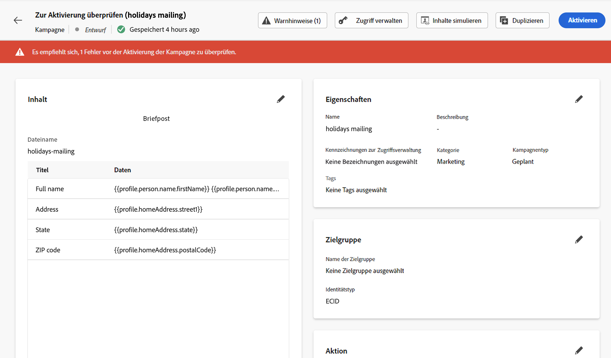

# Überprüfen und Senden einer Briefpostnachricht {#direct-mail-test-send}

Erfahren Sie, wie Sie eine Vorschau der Extraktionsdatei anzeigen, Ihre Briefpostkampagne oder Journey validieren und aktivieren und das Einverständnis mit Postsendungen in Journey Optimizer verwalten.

## Vorbereitung {#before-you-start}

Bevor Sie eine Briefpostnachricht testen und senden, erstellen [&#x200B; die Nachricht und konfigurieren Sie die Extraktionsdatei](create-direct-mail.md). Stellen Sie sicher, dass Sie auch [Konfiguration des Briefpostkanals](direct-mail-configuration.md) abgeschlossen haben.

## Anzeigen der Extraktionsdatei in der Vorschau {#preview-dm}

Nachdem der Inhalt der Extraktionsdatei definiert wurde, können Sie ihn mit einer der beiden Simulationsmethoden in der Vorschau anzeigen:

* Klicken Sie **[!UICONTROL Inhalt simulieren]**, um Inhaltsvarianten mit Beispieleingabedaten oder automatischer KI-Generierung zu testen. [Informationen zum Simulieren von Inhaltsvarianten](../test-approve/simulate-sample-input.md)
* Klicken Sie auf **[!UICONTROL Inhalt simulieren]** und wählen Sie dann **[!UICONTROL Inhalt simulieren (AEP-Profile)]** aus der Dropdown-Liste aus und fügen Sie ein Testprofil hinzu, um zu überprüfen, wie die Extraktionsdatei gerendert wird.

Detaillierte Informationen zur Vorschau und zum Test des Inhalts finden Sie im Abschnitt [Content-Management](../content-management/preview-test.md).

{width="800" align="center"}

Sobald der Inhalt der Datei versandbereit ist, schließen Sie den Simulationsbildschirm und klicken Sie auf die Schaltfläche **[!UICONTROL Zum Aktivieren überprüfen]**.

## Validieren und Aktivieren der Briefpost-Kampagne {#dm-validate}

>[!IMPORTANT]
>
> Wenn Ihre Kampagne einer Genehmigungsrichtlinie unterliegt, müssen Sie eine Genehmigung anfordern, um Ihre Direkt-Mail-Kampagne senden zu können. [Weitere Informationen](../test-approve/gs-approval.md)

Stellen Sie vor der Aktivierung der Briefpostkampagne sicher, dass die Kampagne oder der Journey und die Extraktionsdatei ordnungsgemäß konfiguriert sind. Überprüfen Sie dazu die Warnhinweise im oberen Bereich des Editors. Einige davon sind einfache Warnungen, aber andere können Sie daran hindern, die Nachricht zu senden. Es gibt zwei Arten von Warnungen: Warnungen und Fehler.

* **Warnhinweise** geben Hinweise auf Empfehlungen und zeigen Best Practices. So wird beispielsweise eine Warnmeldung angezeigt, wenn Ihre SMS-Nachricht leer ist.

* **Fehler** verhindern, dass Sie die Kampagne veröffentlichen können, solange diese nicht behoben sind. Eine Fehlermeldung warnt Sie zum Beispiel, wenn die Betreffzeile fehlt.

{width="800" align="center"}

Wenn Ihre Briefpostkampagne fertig ist, konfigurieren Sie Ihre [Journey](../building-journeys/journey-gs.md) oder [Kampagne](../campaigns/create-campaign.md), um sie zu versenden.

>[!NOTE]
>
>Die exportierte Datei endet standardmäßig mit einem Zeilenumbruch. Dadurch wird die Kompatibilität mit standardmäßigen Datenverarbeitungs-Tools sichergestellt.

Nach dem Versand können Sie die Wirkung Ihrer Briefpostkampagne oder Ihres Journey in den Berichten messen. Weiterführende Informationen zum Briefpost-Reporting finden Sie in den folgenden Abschnitten:
* [Direkt-Mail-Kampagnenbericht](../reports/campaign-global-report-cja-direct.md)
* [Direkt-Mail-Journey-Bericht](../reports/journey-global-report-cja-direct.md)

## Verwalten des Einverständnisses für Direkt-Mail {#dm-consent-management}

In [!DNL Journey Optimizer] wird das Einverständnis durch das [Einverständnisschema](https://experienceleague.adobe.com/docs/experience-platform/xdm/field-groups/profile/consents.html?lang=de){target="_blank"} von Experience Platform verarbeitet. Standardmäßig ist der Wert für das Einverständnisfeld leer und gilt als Einverständnis für den Empfang Ihrer Nachrichten.

Wenn sich ein Profil vom Erhalt von Briefpost abgemeldet hat, wird in den entsprechenden Profilattributen der Wert für `consents.marketing.postalMail.val` auf `n` festgelegt und das entsprechende Profil von den folgenden Sendungen ausgeschlossen.

Um es erneut zu aktivieren, muss das Profilattribut wieder in `consents.marketing.postalMail.val` : `y` geändert werden.

Um die Attribute eines Profils zu verwalten, gehen Sie zu Experience Platform und greifen Sie auf das Profil zu, indem Sie einen Identity-Namespace und einen entsprechenden Identitätswert auswählen. Weitere Informationen finden Sie in der [Dokumentation zu Adobe Experience Platform](https://experienceleague.adobe.com/docs/experience-platform/profile/ui/user-guide.html?lang=de#getting-started){target="_blank"}.

Weitere Informationen zur Verwaltung von Opt-outs in Journey Optimizer finden Sie in [diesem Abschnitt](../privacy/opt-out.md).

## Verwandte Themen {#related-topics}

* [Erste Schritte mit Direkt-Mail](get-started-direct-mail.md)
* [Erstellen einer Briefpostnachricht](create-direct-mail.md)
* [Konfigurieren des Briefpostkanals](direct-mail-configuration.md)
* [Vorschau und Testinhalt](../content-management/preview-test.md)

Häufige Fragen zu Briefpost finden Sie unter [Erste Schritte mit Briefpost](get-started-direct-mail.md).
