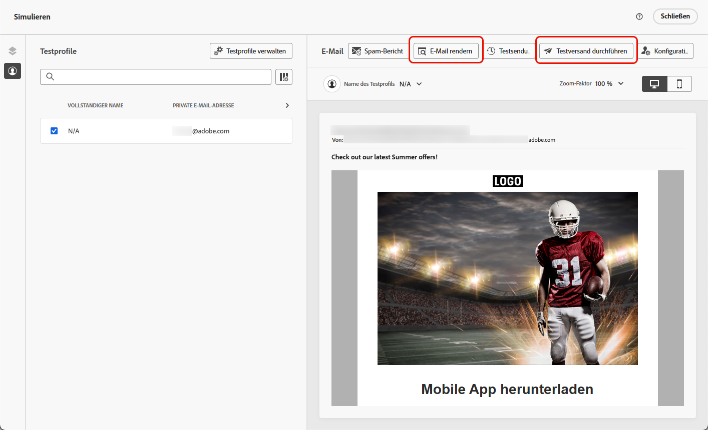

# Entwerfen barrierefreier Inhalte {#accessible-content}

>[!NOTE]
>
>Auf dieser Seite geht es darum, Ihre Inhalte für alle Ihre Empfängerinnen und Empfänger zugänglich zu machen, um sicherzustellen, dass Menschen mit Behinderungen Ihre mit [!DNL Journey Optimizer] entworfenen E-Mails und Landingpages lesen, verstehen und mit ihnen interagieren können.
>
>Die Barrierefreiheit der [!DNL Journey Optimizer] selbst wird in ([ Abschnitt) ](../start/accessibility.md).

Der [Europäische Rechtsakt zur Barrierefreiheit](https://eur-lex.europa.eu/legal-content/EN/TXT/?uri=CELEX%3A32019L0882){target="_blank"} ist eine Richtlinie, mit der der Binnenmarkt für barrierefreie Produkte und Dienstleistungen durch die Beseitigung von Hindernissen, die durch unterschiedliche nationale Vorschriften in den Mitgliedstaaten verursacht werden, verbessert werden soll.

Beim Erstellen von Inhalten für Ihre **E** Mails **und Landingpages** in [!DNL Journey Optimizer] können die auf dieser Seite aufgeführten Best Practices für die Barrierefreiheit für E-Mail-Marketing-Fachleute Ihnen bei der Einhaltung dieser Richtlinie helfen. Sie basieren auf den Web Content Accessibility Guidelines (WCAG) 2.1, Level AA.

Der European Accessibility Act (Europäischer Rechtsakt zur Barrierefreiheit) besagt, dass alle digitalen Kommunikationen, einschließlich E-Mails, Newsletter, PDFs und herunterladbare Inhalte, zugänglich sein sollten. Daher müssen Sie bestimmte Richtlinien befolgen, z. B. barrierefreie Schriftarten und lesbare Formate verwenden und alternativen Text für Bilder bereitstellen.

Mit [!DNL Journey Optimizer] [E-Mail-Designer](content-from-scratch.md), mit dem Marketing-Experten Inhalte sowohl für E-Mails als auch für Landingpages erstellen können, können Sie diese Richtlinien einfach befolgen. Die Best Practices für die Gestaltung barrierefreier Inhalte mit [!DNL Journey Optimizer] sind unten aufgeführt.

<!--You can adjust a number of styling parameters and attributes from the Email Designer **[!UICONTROL Styles]** pane.-->
 
## Textlesbarkeit sicherstellen {#text-readability}

Verwenden Sie die Registerkarte **[!UICONTROL Stile]** der Komponente **[!UICONTROL Text]**, um sicherzustellen, dass Ihr Text lesbar ist, z. B. mit einem ordnungsgemäßen Farbkontrast und einfachen Schriftarten. [Weitere Informationen](content-components.md#text)

{width="80%"}

Befolgen Sie für Schriftarten und Text die folgenden Richtlinien:

**Schriftartenauswahl**

* Verwenden Sie serifenlose Schriftarten wie Arial, Verdana, Tahoma, Helvetica oder Open Sans.
* Vermeiden Sie serifenlose, kursive oder dekorative Schriftarten in Textinhalten.
* Achten Sie auf einen eingeschränkten Schriftsatz, um Konsistenz und Fallback zu gewährleisten (z. B.: `font-family: Arial, Helvetica, sans-serif;`).

**Schriftgröße**

* Achten Sie auf eine Schriftgröße von mindestens 16 Pixel für den Textkörper.
* Verwenden Sie die richtige Hierarchie für Überschriften.

**Farbkontrast**

* Zwischen Text und Hintergrund ein Kontrastverhältnis von mindestens :1,5 % beibehalten.
* Achten Sie bei großem Text (≥24 Pixel oder fett 18 Pixel) auf einen Kontrast von mindestens 3 :1.
* Vermeiden Sie hellgrauen oder pastellfarbenen Text auf weißem Hintergrund.
* Verlassen Sie sich nicht allein auf Farbe, um Bedeutung zu vermitteln, sondern verwenden Sie stattdessen Unterstriche, Symbole usw.

**Barrierefreiheit von Text**

* Vermeiden Sie Text in Bildern.
* Verwenden Sie nicht alle Großbuchstaben im Textkörper.
* Stellen Sie sicher, dass Text bis zu 200 % gezoomt werden kann, ohne das Layout zu unterbrechen.

## Sicherstellen der visuellen Barrierefreiheit {#visual-accessibility}

Um sicherzustellen, dass Ihr Inhalt visuell zugänglich ist, befolgen Sie die folgenden Best Practices:

* Verwenden Sie für wichtige Informationen keine reinen Farbindikatoren.
* Verwenden Sie Textbeschriftungen oder Symbole, um Klarheit zu schaffen.
* Optimieren Sie Ihr Design für mobile und responsive Layouts und stellen Sie sicher, dass die Schaltflächen groß und ausreichend beabstandet sind.
* Regelmäßige Tests über Geräte und Bildschirmgrößen hinweg, um die Barrierefreiheit zu gewährleisten.

[!DNL Journey Optimizer] können Größe und Abstand der verschiedenen Elemente in Ihrem Inhalt mithilfe der Stilparameter und -attribute im Bereich E-Mail-Designer (Stile **[!UICONTROL weiter]** werden. [Weitere Informationen](get-started-email-style.md)

Sie können beispielsweise den [Hintergrund](backgrounds.md) aktualisieren oder die Ränder, den Abstand und die Ausrichtung ändern, um die visuelle Barrierefreiheit Ihrer Inhalte zu verbessern. [Weitere Informationen](alignment-and-padding.md)

{width="80%"}

Darüber hinaus können Sie mit der [!DNL Journey Optimizer] Email Designer das Design für verschiedene Geräte und Bildschirmgrößen in der Vorschau anzeigen und optimieren. Sie können jederzeit **[!UICONTROL Zur Live-Ansicht wechseln]** um zu überprüfen, wie Ihre Inhalte auf verschiedenen Gerätegrößen gerendert werden können.

{width="70%"}

>[!CAUTION]
>
>Die Live-Ansicht ist eine allgemeine Vorschau, die vergleicht, wie das Rendering über verschiedene Gerätegrößen hinweg aussehen könnte. Das endgültige Rendering kann je nach E-Mail-Client der Empfängerinnen und Empfänger variieren.

## Alternativtext für Bilder verwenden {#alt-text}

Verwenden Sie die **[!UICONTROL Bild]**-Komponente, um alternativen Text für Bilder bereitzustellen. [Weitere Informationen](content-components.md#image)

{width="90%"}

Befolgen Sie die folgenden Richtlinien für effektiven Alternativtext in digitalen Produkten:

* Beschreiben Sie den Zweck des Bildes kurz und kontextuell.
* Vermeiden Sie redundante Ausdrücke wie „Bild von …“ und verwenden Sie leeren Alternativtext für dekorative Bilder.
* Für Symbole mit Bedeutung geben Sie aussagekräftige Beschriftungen an und für komplexe Bilder verwenden Sie einen kurzen Alternativtext und an anderer Stelle eine längere Beschreibung.

## Lesbares Format verwenden {#readable-format}

Verwenden Sie die für E-Mail-Designer [Inhaltskomponenten](content-components.md) sowie die Optionen im Bereich **[!UICONTROL Stile]** , um Ihre Inhalte übersichtlich, logisch und präzise zu organisieren, sodass sie für alle zugänglich sind.

{width="1000%"}

* Verwenden Sie eine strukturierte, semantische HTML mit korrekten Überschriften, Absätzen, Listen und Tabellen.
* Stellen Sie sicher, dass der Inhalt einem logischen Fluss von links nach rechts, von oben nach unten folgt.
* Verwenden Sie eine klare, knappe Sprache.
* Bereitstellung alternativer Formate für PDFs und Infografiken.
* Lassen Sie die Textgröße und den Textfluss zu und stellen Sie sicher, dass die Typografie in allen Formaten mit angemessenem Farbkontrast lesbar ist.

## Sicherstellen der Lesbarkeit von Inhalten {#readability}

Um lesbar zu sein, müssen Ihre Inhalte klar, gut strukturiert und für alle verwendbar sein, auch für Menschen mit visuellen, kognitiven oder Leseschwächen und solche, die Hilfstechnologien verwenden. Einige Punkte, die beim Erstellen barrierefreier Inhalte zu beachten sind:

* Sätze mit höchstens 20 Wörtern beibehalten.
* Bearbeiten Sie Ihre Kopie, um direkt und auf den Punkt zu sein.
* Nutzen Sie eine aktive Stimme, um die Satzstruktur einfacher zu halten.
* Vermeiden Sie Slang, Jargon oder regionale Wörter, mit denen einige Leute möglicherweise nicht vertraut sind.

Um Ihre E-Mail-Lesbarkeit zu bewerten, können Sie den beliebten [Flesch Reading Ease Test](https://support.microsoft.com/en-us/office/get-your-document-s-readability-and-level-statistics-85b4969e-e80a-4777-8dd3-f7fc3c8b3fd2){target="_blank"} verwenden, der in Microsoft Word zu finden ist und berechnet, wie einfach Ihre Inhalte auf einer Skala von 0-100 zu lesen sind.

## Testen von Inhalten {#test}

Um die Barrierefreiheit Ihrer Inhalte zu überprüfen, können Sie die von [!DNL Journey Optimizer] bereitgestellten Testfunktionen verwenden. Sie sind nicht speziell dafür konzipiert, zu überprüfen, ob Ihre Inhalte vollständig zugänglich sind, aber sie können eine erste Ebene der Überprüfung bieten.

* Vorschau Ihres Inhalts mithilfe von Testprofilen. [Weitere Informationen](../content-management/preview.md)

* Verwenden Sie die Option [E-Mail-Rendering](../content-management/rendering.md), die Litmus nutzt, um Ihre Designs in wichtigen E-Mail-Clients (Apple Mail, Gmail, Outlook) zu simulieren und zu sehen, ob Text, Farben und Bilder Ihren Inhalt barrierefrei machen. <!--Litmus includes accessibility testing-->

* Führen Sie Testsendungen durch, um das Rendering Ihres Inhalts zu testen, bevor Sie ihn an Ihre echte Zielgruppe senden. [Weitere Informationen](../content-management/proofs.md)

{width="90%"}

Um konsistenter zu überprüfen, ob Ihre Inhalte zuverlässig zugänglich sind, wählen Sie bestimmte externe Tools aus, z. B.:

* Der [WebAim Kontrast Checker](https://webaim.org/resources/contrastchecker/){target="_blank"} und das [WAVE Web Accessibility Evaluation Tool](https://wave.webaim.org/){target="_blank"} um Kontrast und Compliance zu bewerten.

* Hilfstechnologien wie Bildschirmlesehilfen (z. B. [NVDA](https://www.nvaccess.org/download/){target="_blank"} oder [VoiceOver](https://support.apple.com/en-ie/guide/iphone/iph3e2e415f/ios){target="_blank"} auf iPhone), um E-Mails aus der Perspektive sehbehinderter Benutzender zu erleben.

## Dunklen Modus verwenden {#dark-mode}

<!--TO PUBLISH WHEN DARK MODE IS RELEASED-->

Der Dunkelmodus verbessert die visuelle Barrierefreiheit für Benutzende mit Lichtempfindlichkeit oder Sehbehinderungen, um das Seherlebnis zu verbessern.

{width="90%"}

Zu den Best Practices für die Erstellung von Inhalten im dunklen Modus gehören die Verwendung transparenter PNGs oder SVGs, das Festlegen geeigneter Meta-Tags und CSS sowie das Bereitstellen zugänglicher Fallback-Stile, wenn der dunkle Modus nicht unterstützt wird. Stellen Sie abschließend sicher, dass Ihre E-Mails im Dunkelmodus korrekt gerendert werden, indem Sie alle E-Mail-Inhalte und Benutzeroberflächenelemente sowohl im hellen als auch im dunklen Modus testen.

Detaillierte Best Practices für den Dunkelmodus, einschließlich Richtlinien zur Sicherstellung der Barrierefreiheit, finden Sie [diesem Abschnitt](dark-mode.md#best-practices). <!--KEEP dark mode accessibility best practices IN ONE SINGLE LOCATION - for now listed on the Dark mode page.-->

## Spezifische Attribute für barrierefreie E-Mails verwenden {#attributes}

### `lang` und `dir` Attribute

Fügen Sie beim Erstellen barrierefreier E-Mails die Attribute `lang` (Sprache) und `dir` (Textrichtung) in den Textkörper der E-Mail ein. Diese Attribute unterstützen Hilfstechnologien wie Bildschirmlesehilfen bei der Interpretation und Darstellung Ihrer Inhalte auf geeignete Weise.

* Das Attribut `lang` gibt die Sprache der E-Mail für Hilfstechnologien an und stellt sicher, dass Wörter korrekt ausgesprochen werden.

  +++Beispiele

  Beispiel für Englisch:

  ```
  <body lang="en">
  ```

  Beispiel für Französisch:

  ```
  <body lang="fr">
  ```

  +++

* Das `dir`-Attribut gibt die Textrichtung an. Die meisten Sprachen, einschließlich Englisch und Französisch, werden von links nach rechts (ltr) gelesen, während Sprachen wie Arabisch und Hebräisch von rechts nach links (rtl) gelesen werden.

  +++Beispiele

  Beispiel für Englisch (von links nach rechts):

  ```
  <body lang="en" dir="ltr">
  ```

  Beispiel für Arabisch (von rechts nach links):

  ```
  <body lang="ar" dir="rtl">
  ```

  +++

Bildschirmlesehilfen verwenden das `lang`-Attribut, um die korrekten Ausspracheregeln anzuwenden, während die Textrichtung sicherstellt, dass Inhalte für Sprachen mit von links nach rechts oder von rechts nach links fließen. Ohne diese Attribute kann es zu verwirrender Leserichtung oder falscher Aussprache kommen. Umschließen Sie daher Ihren E-Mail-Textkörper immer mit den entsprechenden `lang`- und `dir`.

>[!TIP]
>
>Wenn Ihre E-Mail mehrere Sprachen enthält, weisen Sie bestimmten Abschnitten (z. B. `<table>` oder `<td>`) die entsprechenden Sprachattribute zu, um sicherzustellen, dass jeder Teil korrekt gelesen wird.

### Layouttabellen und -`role="presentation"`

In HTML-E-Mails werden Tabellen häufig für das Layout verwendet. Standardmäßig behandeln Bildschirmlesehilfen jede `<table>` als Datentabelle und geben Zeilen, Spalten und Strukturen aus. Dies kann verwirrend sein, wenn die Tabelle nur zur Formatierung verwendet wird.

Fügen Sie Layouttabellen `role="presentation"` (oder `role="none"`) hinzu, um sicherzustellen, dass Hilfstechnologien ihre Struktur überspringen und sich nur auf den tatsächlichen Inhalt konzentrieren.

+++Beispiel - Layouttabelle (mit role=„presentation„): 

```
<table role="presentation" border="0" cellpadding="0" cellspacing="0" width="100%"> 

  <tr> 

    <td align="center"> 

      <h1>Hello World</h1> 

      <p>Welcome to our newsletter</p> 

    </td> 

  </tr> 

</table>
```

Die Bildschirmlesehilfen lesen:
„Hallo Welt. Willkommen zu unserem Newsletter.“ *(Zeilen, Spalten oder Tabellen werden nicht erwähnt.)*

+++

+++Beispiel - Datentabelle (ohne role=„presentation„): 

```
<table border="1" cellpadding="5" cellspacing="0"> 

  <tr> 

    <th scope="col">Name</th> 

    <th scope="col">Score</th> 

  </tr> 

  <tr> 

    <td>Alice</td> 

    <td>95</td> 

  </tr> 

  <tr> 

    <td>Bob</td> 

    <td>88</td> 

  </tr> 

</table> 
```

Die Bildschirmlesehilfen lesen:
„Tabelle mit 2 Spalten und 3 Zeilen.“

„Name, Alice.“

„Ergebnis, 95.“

„Name, Bob.“

„Score, 88.“

+++

>[!TIP]
>
>Verwenden Sie `role="presentation"` ausschließlich für Layouttabellen. Behalten Sie bei Datentabellen die semantische Struktur bei`<table>` damit Bildschirmlesehilfen Kopfzeilen und Beziehungen korrekt ausgeben können.

### Erkennbarer und beschreibender Text für Links

Bildschirmlesehilfen lesen Links mithilfe ihres Textes aus. Wenn ein Link nur mit „Hier klicken“ oder „Weitere Informationen“ beschriftet ist, kennen Benutzer von Hilfstechnologien das Ziel nicht.

Um die Barrierefreiheit zu gewährleisten, schreiben Sie beschreibenden Text, der die Zielgruppe oder Aktion klar angibt. Verwenden Sie den E-Mail-Designer[ um einen ](message-tracking.md#insert-links) zu Ihrem Inhalt hinzuzufügen und die Kennzeichnung zu bearbeiten, damit sie erkennbar (sichtbar) und beschreibend (klar zu Ihrem Zweck) ist. Vermeiden Sie vage Bezeichnungen wie „hier“ oder „mehr“.

{width="70%"}

+++Beispiel - Guter Link (beschreibend): 

```
<p>Learn more in the  

<a href="https://adobe.com/release-notes">August release notes</a>. 

</p>
```

Die Bildschirmlesehilfen lesen:
„Link, Versionshinweise August.“

+++

+++Beispiel: Ungültiger Link (nicht beschreibend): 

```
<p>Learn more about our new features.  

  <a href="https://adobe.com/release-notes">Click here</a>. 

</p>
```

Die Bildschirmlesehilfen lesen:
„Link, hier klicken.“ *(Bietet keinen Kontext außerhalb der Lesereihenfolge.)*

+++

<!--
>[!TIP]
>
>Always ensure link text is discernible (visible) and descriptive (clear about purpose). Avoid vague labels like 'here' or 'more'.-->

## Bereitstellen von Tastaturnavigation und Fokusunterstützung {#keyboard}

<!--for landing pages-->

Durch die Unterstützung der Tastaturnavigation und des Fokus können Benutzende, die keine Maus verwenden können, umfassend auf Inhalte zugreifen und mit ihnen interagieren. Außerdem wird die Benutzerfreundlichkeit verbessert, da alle Benutzer eine klare und konsistente Möglichkeit haben, sich durch Informationen zu bewegen.

* Aktivieren des Fokus über die Tastatur (Tabulatortaste/Pfeiltasten)

   * Stellen Sie sicher, dass alle interaktiven Elemente (z. B. Schaltflächen, Kontrollkästchen, Links) `tabindex="0"` sind, damit sie in der natürlichen Registerkartenreihenfolge enthalten sind.

   * Ermöglicht die Navigation mithilfe der Tabulatortaste und der Pfeiltasten (↑ ↓ ← →), wodurch das fokussierte Element sichtbar hervorgehoben werden soll.

* Benutzerdefinierter Fokusstil

   * Wenden Sie klare und unterscheidbare Stile an, um sich auf umsetzbare Elemente zu konzentrieren:

     +++Beispiel (CSS):

     ```
     [tabindex="0"] : focus { 
     
     outline: 2px solid #00AEEF;  /* Cyan border */ 
     
     background-color: #20CEFF;   /* Optional background */ 
     
     }
     ```

     +++

   * Stellen Sie sicher, dass die Fokusindikatoren den WCAG 2.2-Standards für das Erscheinungsbild des Fokus entsprechen, einschließlich:

      * Mindestfläche: 2 CSS Pixel dicke Kontur.

      * Kontrastverhältnis: ≥ 3:1 zwischen fokussiertem und unfokussiertem Zustand.

* Unterstützung der Tastaturaktivierung

   * Stellen Sie sicher, dass Kontrollkästchen und Schaltflächen auf die Eingabetaste und Leertaste reagieren.

   * Validieren Sie die Interaktion nur mit der Tastatur:

      * Eingabetaste oder Leertaste sollten Kontrollkästchen umschalten.

      * Die Schaltflächen „Eingabe“ oder „Leertaste“ sollten den Trigger aufweisen.
