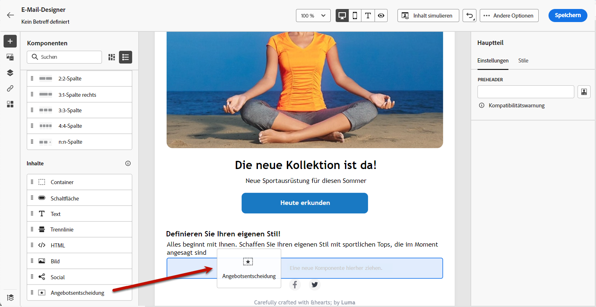
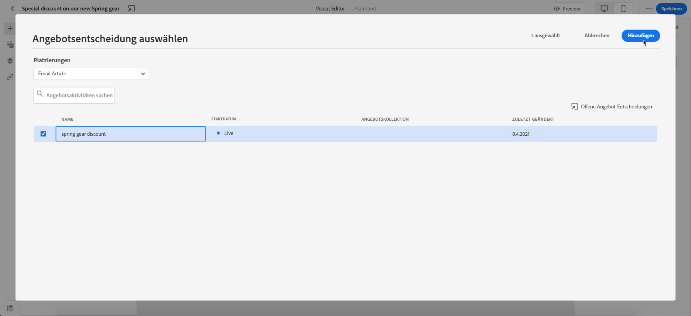
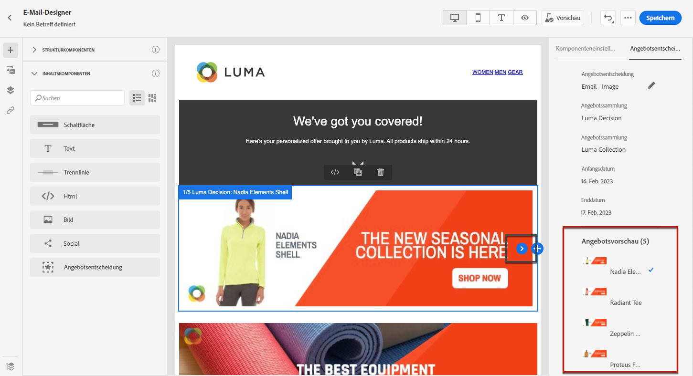
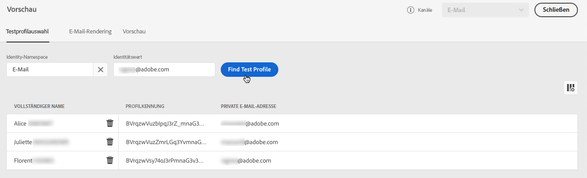
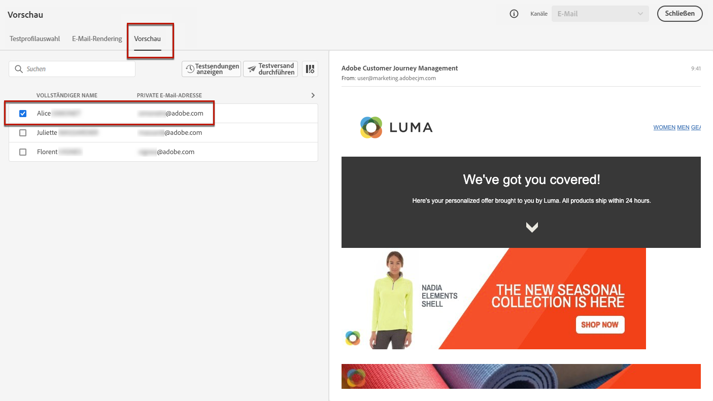

# Hinzufügen personalisierter Angebote {#deliver-personalized-offers}

Mit [!DNL Journey Optimizer] können Sie in E-Mails Entscheidungen einfügen, die die Entscheidungs-Management-Engine nutzen, um das jeweils beste Angebot für Ihre Kunden auszuwählen.

Sie können beispielsweise eine Entscheidung hinzufügen, die in Ihrer E-Mail ein besonderes Angebot mit Rabatten anzeigt, das je nach Treuestufe des Empfängers variiert.

>[!IMPORTANT]
>
>Wenn Änderungen an einer Angebotsentscheidung vorgenommen werden, die in einer Journey-Nachricht verwendet wird, müssen Sie die Veröffentlichung der Journey aufheben und sie dann erneut veröffentlichen.  Dadurch wird sichergestellt, dass die Änderungen in die Journey integriert werden und die Nachricht den neuesten Aktualisierungen entspricht.

* Weiterführende Informationen zur Erstellung und Verwaltung von Angeboten finden Sie in [diesem Abschnitt](../offers/get-started/starting-offer-decisioning.md).
* Ein **vollständiges Beispiel**, das zeigt, wie Angebote konfiguriert, in Entscheidungen verwendet und diese Entscheidungen in E-Mails eingesetzt werden, finden Sie in [diesem Abschnitt](../offers/offers-e2e.md#insert-decision-in-email).

➡️ [In diesem Video erfahren Sie, wie Sie Angebote als Personalisierung hinzufügen können](#video-offers).

## Einfügen einer Entscheidung in eine E-Mail {#insert-offers}

>[!CAUTION]
>
>Bevor Sie beginnen, müssen Sie [eine Angebotsentscheidung definieren](../offers/offer-activities/create-offer-activities.md).

Gehen Sie wie folgt vor, um eine Entscheidung in eine E-Mail-Nachricht einzufügen:

1. Erstellen Sie Ihre E-Mail und öffnen Sie dann E-Mail-Designer, um den Inhalt zu konfigurieren.

1. Fügen Sie die Inhaltskomponente **[!UICONTROL Angebotsentscheidung]** hinzu.

   

   In [diesem Abschnitt](content-components.md) erfahren Sie, wie Sie Inhaltskomponenten verwenden.

1. Die Registerkarte **[!UICONTROL Angebotsentscheidung]** wird in der rechten Palette angezeigt. Klicken Sie auf **[!UICONTROL Angebotsentscheidung auswählen]**:

   1. Wählen Sie im sich öffnenden Fenster die Platzierung aus, die den anzuzeigenden Angeboten entspricht.

      [Platzierungen sind Container, mit denen Ihre Angebote präsentiert werden. ](../offers/offer-library/creating-placements.md) In diesem Beispiel verwenden wir die Platzierung „E-Mail-Top-Bild“. Diese Platzierung wurde in der Angebotsbibliothek erstellt, um Angebote des Typs Bild oben am Anfang von Nachrichten anzuzeigen.

   1. Entscheidungen, die mit der ausgewählten Platzierung übereinstimmen, werden angezeigt. Wählen Sie die in der Inhaltskomponente zu verwendende Entscheidung aus und klicken Sie dann auf **[!UICONTROL Hinzufügen]**.

      >[!NOTE]
      >
      >Beachten Sie, dass nur Entscheidungen, die mit der ausgewählten Platzierung kompatibel sind, in der Liste angezeigt werden. In diesem Beispiel stimmt nur eine Angebotsaktivität mit der Platzierung „E-Mail-Top-Bild“ überein.

      

Die Entscheidung wird nun der Komponente hinzugefügt. Nachdem Sie die Änderungen gespeichert haben, können Ihre Angebote den entsprechenden Profilen angezeigt werden, wenn die Nachricht als Teil einer Journey gesendet wird.

>[!NOTE]
>
>Wenn Sie ein Angebot, ein Fallback-Angebot, eine Angebotssammlung oder eine Angebotsentscheidung aktualisieren, auf die direkt oder indirekt in einer Nachricht verwiesen wird, werden die Aktualisierungen automatisch in der entsprechenden Nachricht angezeigt.

## Angebotsvorschau in einer E-Mail {#preview-offers-in-email}

Sie können die verschiedenen Angebote, die Teil der Entscheidung sind, die der E-Mail hinzugefügt wurde, in der Vorschau anzeigen, indem Sie den Abschnitt **[!UICONTROL Angebote]** oder die Pfeile für die Inhaltskomponenten verwenden.

Gehen Sie wie folgt vor, um die verschiedenen Angebote anzuzeigen, die Teil der Entscheidung bei einem Kundenprofil sind.

>[!NOTE]
>
>Um Ihre Nachrichten in der Vorschau anzuzeigen, benötigen Sie Testprofile. Hier erfahren Sie, wie Sie ein [Testprofil erstellen](../segment/creating-test-profiles.md).

1. Wählen Sie die Testprofile aus, die für die Angebotsvorschau verwendet werden sollen:

   1. Klicken Sie auf die **[!UICONTROL Schaltfläche „Inhalt simulieren“]** und wählen Sie dann den Namespace, der zur Identifizierung von Testprofilen verwendet werden soll, aus dem **[!UICONTROL Identity-Namespace]**-Feld aus.

      >[!NOTE]
      >
      >In diesem Beispiel verwenden wir den Namespace **E-Mail**. Weitere Informationen zu den Identity-Namespaces der Adobe Experience Platform finden Sie [in diesem Abschnitt](../segment/get-started-identity.md).

   1. Geben Sie im Feld **[!UICONTROL Identitätswert]** den Wert ein, der das Testprofil identifiziert . Geben Sie in diesem Beispiel die E-Mail-Adresse eines Testprofils ein.

   <!--For example enter smith@adobe.com and click the **[!UICONTROL Add profile]** button.-->

   1. Fügen Sie weitere Profile hinzu, damit Sie je nach den Profildaten verschiedene Varianten der Nachricht testen können.

      

1. Klicken Sie auf **[!UICONTROL Vorschau]** zum Testen der Nachricht und zur Auswahl eines Testprofils. Das Angebot, das dem ausgewählten Profil (Frau) entspricht, wird angezeigt.

   

   Wählen Sie für jede Nachrichtenvariante weitere Testprofile aus, um die Vorschau des E-Mail-Inhalts anzuzeigen. Im Nachrichteninhalt wird nun das Angebot angezeigt, das dem ausgewählten Testprofil (jetzt ein Mann) entspricht.

Weitere Informationen zu den detaillierten Schritten zur Überprüfung der Nachrichtenvorschau finden Sie in [diesem Abschnitt](#preview-your-messages).

## Anleitungsvideo{#video-offers}

Erfahren Sie, wie Sie in [!DNL Journey Optimizer] eine Entscheidungs-Management-Komponente zu Nachrichten hinzufügen.

>[!VIDEO](https://video.tv.adobe.com/v/334088?quality=12)
