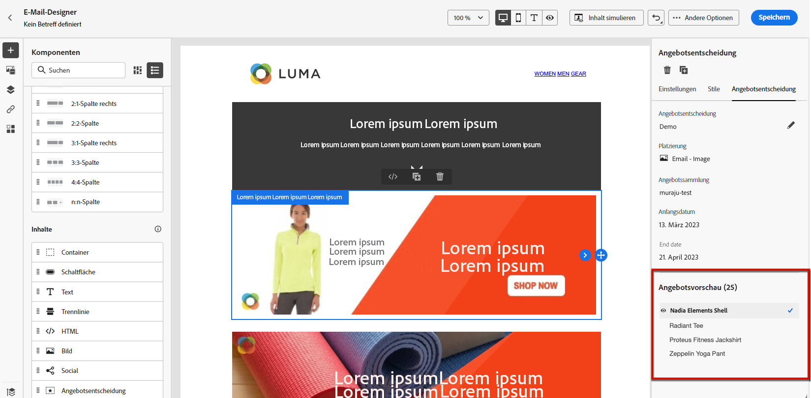

# Personalisierte Angebote hinzufügen {#deliver-personalized-offers}

In [!DNL Journey Optimizer] E-Mails können Sie Entscheidungen einfügen, die die Entscheidungsmanagement-Engine nutzen, um das beste Angebot für Ihre Kunden auszuwählen.

Sie können beispielsweise eine Entscheidung hinzufügen, die in Ihrer E-Mail ein spezielles Rabattangebot anzeigt, das je nach Treuestufe des Empfängers variiert.

Weitere Informationen zum Erstellen und Verwalten von Angeboten finden Sie unter [diesem Abschnitt](../offers/get-started/starting-offer-decisioning.md).

Für **Beispiel für vollständige End-to-End-Lösung** zeigen, wie Angebote konfiguriert, in einer Entscheidung verwendet und diese Entscheidung in einer E-Mail genutzt werden, Auschecken [diesem Abschnitt](../offers/offers-e2e.md#insert-decision-in-email).

➡️ [In diesem Video erfahren Sie, wie Sie Angebote als Personalisierung hinzufügen.](#video-offers)

## Einfügen einer Entscheidung in eine E-Mail {#insert-offers}

>[!CAUTION]
>
>Bevor Sie beginnen, müssen Sie [Angebotsentscheidung definieren](../offers/offer-activities/create-offer-activities.md).

Gehen Sie wie folgt vor, um eine Entscheidung in eine E-Mail-Nachricht einzufügen:

1. Erstellen Sie Ihre E-Mail und öffnen Sie dann Email Designer , um den Inhalt zu konfigurieren.

1. Hinzufügen einer **[!UICONTROL Offer decision]** Inhaltskomponente.

   

   Erfahren Sie, wie Sie Inhaltskomponenten in [diesem Abschnitt](content-components.md).

1. Die **[!UICONTROL Offer decision]** in der rechten Palette angezeigt. Klicken **[!UICONTROL Select Offer decision]**.

   

1. Wählen Sie im sich öffnenden Fenster die Platzierung aus, die den anzuzeigenden Angeboten entspricht.

   [Praktika](../offers/offer-library/creating-placements.md) sind Container, die zur Präsentation Ihrer Angebote verwendet werden. In diesem Beispiel verwenden wir die Platzierung &quot;Top-Bild der E-Mail&quot;. Diese Platzierung wurde in der Angebotsbibliothek erstellt, um Bildangebote anzuzeigen, die sich oben in Nachrichten befinden.

1. Entscheidungen, die mit der ausgewählten Platzierung übereinstimmen, werden angezeigt. Wählen Sie die Entscheidung aus, die in der Inhaltskomponente verwendet werden soll, und klicken Sie dann auf **[!UICONTROL Add]**.

   >[!NOTE]
   >
   >In der Liste werden nur Entscheidungen angezeigt, die mit der ausgewählten Platzierung kompatibel sind. In diesem Beispiel entspricht nur eine Angebotsaktivität der Platzierung &quot;Top-Bild der E-Mail&quot;.

   

Die Entscheidung wird nun der Komponente hinzugefügt.

Nachdem Sie Ihre Änderungen gespeichert haben, können Ihre Angebote beim Versand der Nachricht im Rahmen einer Journey den relevanten Profilen angezeigt werden.

>[!NOTE]
>
>Wenn Sie ein Angebot, ein Fallback-Angebot, eine Angebotskollektion oder eine Angebotsentscheidung aktualisieren, auf die direkt oder indirekt in der Nachricht verwiesen wird, werden die Aktualisierungen automatisch in der entsprechenden Nachricht widergespiegelt.

## Angebotsvorschau in einer E-Mail {#preview-offers-in-email}

Sie können die verschiedenen Angebote, die Teil der Entscheidung sind, die der E-Mail hinzugefügt wurde, mithilfe der **[!UICONTROL Offers]** oder den Pfeilen der Inhaltskomponenten.

Gehen Sie wie folgt vor, um die verschiedenen Angebote anzuzeigen, die Teil der Entscheidung mit einem Kundenprofil sind.

1. Klicken **[!UICONTROL Preview]**.

   

   >[!NOTE]
   >
   >Sie benötigen Testprofile, um eine Vorschau Ihrer Nachrichten anzeigen zu können. Erfahren Sie, wie Sie [Testprofile erstellen](../segment/creating-test-profiles.md).

1. Um den Namespace auszuwählen, der zur Identifizierung von Testprofilen verwendet werden soll, wählen Sie **[!UICONTROL Email]** von **[!UICONTROL Identity namespace]** -Feld.

   >[!NOTE]
   >
   >In diesem Beispiel verwenden wir die **Email** Namespace. Weitere Informationen zu Adobe Experience Platform-Identitäts-Namespaces [in diesem Abschnitt](../segment/get-started-identity.md).

1. Wählen Sie in der Liste der Identitäts-Namespaces die Option **[!UICONTROL Email]** und klicken Sie auf **[!UICONTROL Select]**.

1. Im **[!UICONTROL Identity value]** geben Sie den Wert ein, um das Testprofil zu identifizieren. Geben Sie in diesem Beispiel die E-Mail-Adresse eines Testprofils ein.

   <!--For example enter smith@adobe.com and click the **[!UICONTROL Add profile]** button.-->

1. Fügen Sie weitere Profile hinzu, damit Sie je nach den Profildaten verschiedene Varianten der Nachricht testen können.

   

1. Klicken Sie auf **[!UICONTROL Preview]** zum Testen Ihrer Nachricht.

1. Wählen Sie ein Testprofil aus. Das Angebot, das dem ausgewählten Profil (Frau) entspricht, wird angezeigt.

   

1. Wählen Sie weitere Testprofile aus, um den E-Mail-Inhalt für jede Variante Ihrer Nachricht in der Vorschau anzuzeigen. Im Nachrichteninhalt wird nun das Angebot angezeigt, das dem ausgewählten Testprofil (jetzt ein Mann) entspricht.

   

Erfahren Sie mehr über die detaillierten Schritte zur Überprüfung der Nachrichtenvorschau unter [diesem Abschnitt](#preview-your-messages).

## Anleitungsvideo{#video-offers}

Erfahren Sie, wie Sie Nachrichten in eine Entscheidungsverwaltungskomponente hinzufügen. [!DNL Journey Optimizer].

>[!VIDEO](https://video.tv.adobe.com/v/334088?quality=12)

