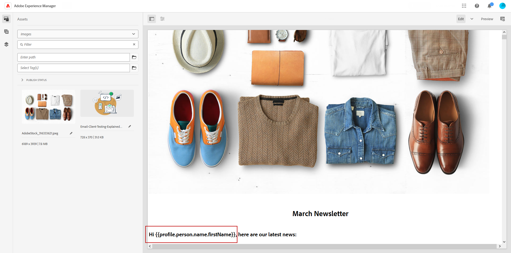
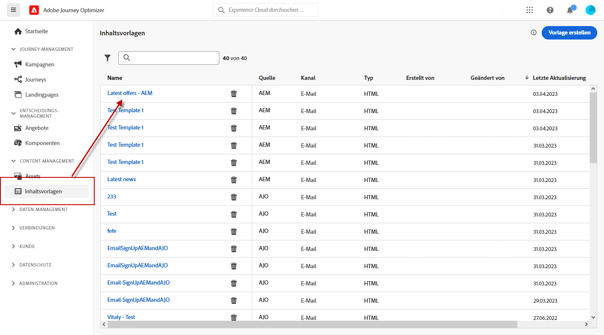
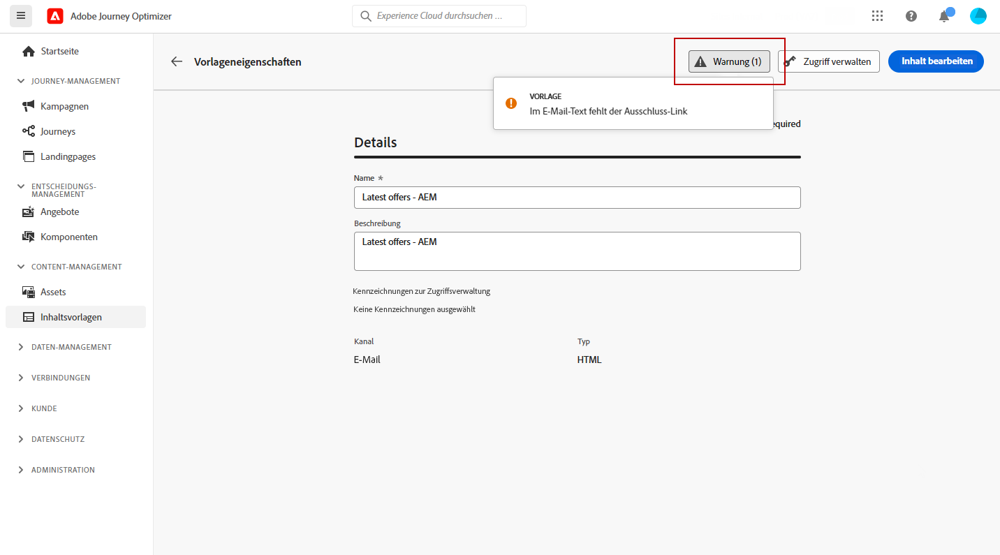
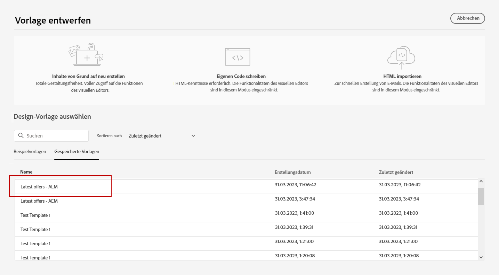
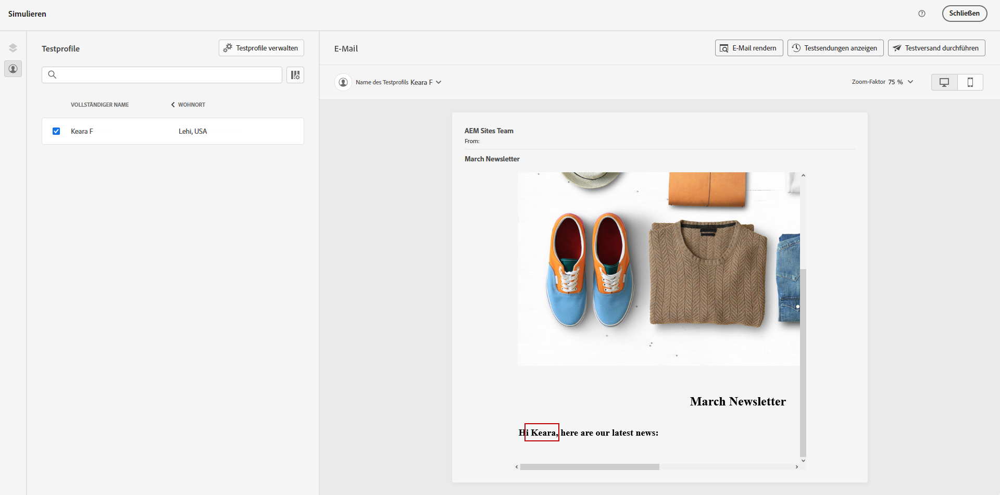

# Arbeiten mit Adobe Experience Manager-Vorlagen {#aem-templates}

>[!AVAILABILITY]
>
>Die Integration mit Adobe Experience Manager ist derzeit nur für ausgewählte Benutzerinnen und Benutzer als Beta-Version verfügbar.
> Beta-Benutzerinnen und -Benutzer können [dieses Formular](https://forms.office.com/pages/responsepage.aspx?id=Wht7-jR7h0OUrtLBeN7O4Wf0cbVTQ3tCpW_unE-w8-JUN1FaNlAzNkhPSUdaSkJXVFRCNTRJNVRFSy4u){target="_blank"} verwenden, um Feedback zu geben.

Mit Adobe Journey Optimizer können Sie über Adobe Experience Manager Sites benutzerdefinierte, auf sie zugeschnittene Nachrichten erstellen. Erstellen Sie zunächst Ihre Vorlagen mithilfe der Inhaltsquellen von Adobe Experience Manager und senden Sie sie dann an Adobe Journey Optimizer. Nach der Freigabe können Sie im E-Mail-Designer von Adobe Journey Optimizer auf diese Vorlagen zugreifen, um die Erstellung und den Versand von Nachrichten an Ihre gewünschte Audience zu vereinfachen.

## Voraussetzungen {#prerequisites}

Bevor Sie mit der Verwendung dieser Funktion beginnen, stellen Sie sicher, dass Sie die folgenden Anforderungen erfüllen:

* **Experience Manager-Einstellungen**

   Diese Funktion ist verfügbar mit [Adobe Experience Manager as a Cloud Service](https://experienceleague.adobe.com/docs/experience-manager-cloud-service/content/overview/introduction.html?lang=de){target="_blank"}.

   Im Rahmen des Beta-Programms wird die Konfiguration von Cloud Services durch Adobe in Adobe Experience Manager durchgeführt, um eine Verbindung mit Adobe Journey Optimizer herzustellen.

* **Berechtigungen**

   Zum Erstellen, Bearbeiten und Löschen von Inhaltsvorlagen in Adobe Journey Optimizer benötigen Sie die Berechtigung **[!DNL Manage Library Items]**, die im **[!DNL Content Library Manager]**-Produktprofil enthalten ist. [Weitere Informationen](../administration/ootb-product-profiles.md#content-library-manager)

## Leitlinien und Einschränkungen{#aem-templates-limitations}

Um Ihre Nutzung von Adobe Experience Manager mit Adobe Journey Optimizer weiter zu optimieren, sollten Sie die folgenden zusätzlichen Leitlinien und Einschränkungen beachten:

* Die Journey Optimizer-Syntax ist erforderlich, damit die Personalisierung in der Experience Manager-Vorlage wirksam ist. [Weitere Informationen](../personalization/personalization-syntax.md)

* Der Massenexport von Vorlagen wird derzeit nicht unterstützt, Vorlagen müssen einzeln exportiert werden.

* Die Synchronisierung zwischen Experience Manager und Journey Optimizer ist derzeit nicht verfügbar. Wenn Änderungen an einer Experience Manager-Vorlage vorgenommen werden, nachdem sie an Journey Optimizer gesendet wurde, muss die Benutzerin bzw. der Benutzer die Vorlage erneut exportieren und erneut an Journey Optimizer senden.

## Senden einer Vorlage an Journey Optimizer{#aem-templates-send}

Gehen Sie wie folgt vor, um eine Adobe Experience Manager-Vorlage nach Adobe Journey Optimizer zu exportieren:

1. Wählen Sie auf Ihrer Adobe Experience Manager-Homepage aus. **[!UICONTROL Ausgehendes Marketing]**.

   

1. In Ihrer Inhaltsbibliothek können Sie zuvor konfigurierte Vorlagen verwenden oder von Grund auf neu eine erstellen. [Weitere Informationen](https://experienceleague.adobe.com/docs/experience-manager-65/authoring/authoring/managing-pages.html?lang=de#creating-a-new-page)

1. Indem Sie die Journey Optimizer-Personalisierungssyntax in Ihre Vorlage integrieren, können Sie deren Anpassungsfunktionen erweitern. [Weitere Informationen](../personalization/personalization-syntax.md)

   

1. Wählen Sie die Vorlage aus, die Sie nach Journey Optimizer exportieren möchten, und klicken Sie im Menü „Erweitert“ auf **[!UICONTROL Senden an]**.

   

1. Geben Sie den **[!UICONTROL Namen]** der Inhaltsvorlage ein und wählen Sie die Zielgruppen-**[!UICONTROL Sandbox]** aus.

   

1. Wenn Sie auf **[!UICONTROL Senden]** geklickt haben, startet der Exportvorgang. Nach Abschluss des Exports wird in der Benutzeroberfläche die folgende Nachricht angezeigt: „Vorlage ‚XX‘ wurde erfolgreich an AJO gesendet“.

Die Vorlage wird den Adobe Journey Optimizer-Inhaltsvorlagen der ausgewählten Sandbox hinzugefügt.

## Verwenden und Personalisieren einer Adobe Experience Manager-Vorlage{#aem-templates-perso}

Sobald die Experience Manager-Vorlage in Journey Optimizer als Inhaltsvorlage verfügbar ist, können Sie den für die E-Mail erforderlichen Inhalt, einschließlich Personalisierung, identifizieren und integrieren.

1. Greifen Sie in Journey Optimizer über das Menü **[!UICONTROL Inhaltsvorlage]** auf Ihre importierte Vorlage zu.

   

1. Mit einem Klick auf die Schaltfläche **[!UICONTROL Warnhinweis]** können Sie schnell überprüfen, ob wichtige Einstellungen fehlen. Dadurch wird sichergestellt, dass Ihre Nachrichten ordnungsgemäß konfiguriert sind und potenzielle Fehler oder Probleme vermieden werden.

   

1. Klicken Sie im Fenster **[!UICONTROL Vorlageneigenschaften]** auf die Schaltfläche **[!UICONTROL Zugriff verwalten]**, um Ihrer Vorlage benutzerdefinierte oder zentrale Datennutzungskennzeichnungen zuzuweisen. [Weitere Informationen zur Zugriffssteuerung auf Objektebene (OLAC)](../administration/object-based-access.md)

1. Um Ihre Experience Manager-Vorlage weiter zu personalisieren und benutzerdefinierte Personalisierung zu Ihrem Inhalt hinzuzufügen, klicken Sie auf **[!UICONTROL Inhalt bearbeiten]**. Auf diese Weise können Sie einfach Änderungen vornehmen und die Vorlage an Ihre spezifischen Anforderungen anpassen. [Weitere Informationen](get-started-email-design.md)

   >[!NOTE]
   >
   > Wenn Sie Ihre Vorlage bearbeiten und personalisieren möchten, können Sie nur den Kompatibilitätsmodus verwenden.

1. Wenn Ihre Inhaltsvorlage fertig ist, [testen und validieren Sie sie](content-templates.md#test-template).

1. Sobald Ihr Inhalt definiert wurde, können Sie ihn bei der Erstellung einer neuen E-Mail verwenden, indem Sie die Sammlung **[!UICONTROL Gespeicherte Vorlagen]** durchsuchen. Wählen Sie anschließend **[!UICONTROL Diese Vorlage verwenden]** aus.

   

1. Jetzt können Sie Ihren Inhalt bearbeiten und personalisieren. Weitere Informationen zur Konfiguration der Journey finden Sie auf dieser [Seite](content-from-scratch.md).

   

1. Wenn Sie Ihrer Experience Manager-Vorlage personalisierten Inhalt hinzugefügt haben, klicken Sie auf **[!UICONTROL Inhalt simulieren]**, um mithilfe von Testprofilen eine Vorschau des Nachrichteninhalts anzuzeigen.

[Weitere Informationen zu Vorschau und Testprofilen](../email/preview.md)

   

1. Bei der Anzeige der Nachrichtenvorschau werden alle personalisierten Elemente automatisch durch die entsprechenden Daten aus dem ausgewählten Testprofil ersetzt.

   Bei Bedarf können weitere Testprofile mit der Schaltfläche **[!UICONTROL Testprofile verwalten]** hinzugefügt werden.

   

Wenn Ihre E-Mail bereit ist, schließen Sie die Konfiguration Ihrer [Journey](../building-journeys/journey-gs.md) oder [Kampagne](../campaigns/create-campaign.md) ab und aktivieren Sie diese, um die Nachricht zu senden.
