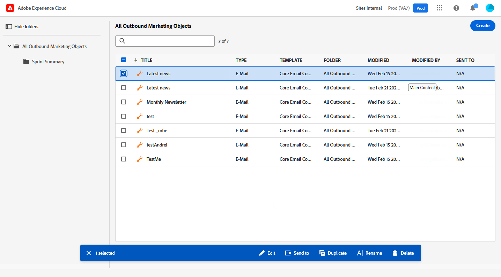

# Arbeiten mit Adobe Experience Manager-Vorlagen {#aem-templates}

>[!AVAILABILITY]
>
>Die Integration mit Adobe Experience Manager ist derzeit als Beta-Version verfügbar, sodass nur ausgewählte Benutzer ausgewählt werden können.
> Als Beta-Benutzer verwenden Sie [dieses Formulars](https://forms.office.com/pages/responsepage.aspx?id=Wht7-jR7h0OUrtLBeN7O4Wf0cbVTQ3tCpW_unE-w8-JUN1FaNlAzNkhPSUdaSkJXVFRCNTRJNVRFSy4u){target="_blank"} um Feedback zu teilen.

Mit Adobe Journey Optimizer können Sie über Adobe Experience Manager-Sites benutzerdefinierte, auf sie zugeschnittene Nachrichten erstellen. Erstellen Sie zunächst Ihre Vorlagen mithilfe der Inhaltsquellen von Adobe Experience Manager und senden Sie sie dann an Adobe Journey Optimizer. Nach der Freigabe können Sie in Adobe Journey Optimizers E-Mail-Designer auf diese Vorlagen zugreifen, um die Erstellung und den Versand von Nachrichten an Ihre gewünschte Audience zu vereinfachen.

## Voraussetzungen {#prerequisites}

Bevor Sie mit der Verwendung dieser Funktion beginnen, stellen Sie sicher, dass Sie die folgenden Anforderungen erfüllen:

* **Experience Manager-Einstellungen**

   Diese Funktion ist ab Adobe Experience Manager 6.5.14 verfügbar. Sie müssen in Ihrer Managed Services-Autorenumgebung eine Verbindung zu Adobe Experience Manager Sites herstellen.

   Im Rahmen des Betaprogramms wurde die Konfiguration der Cloud Service von Adobe in Adobe Experience Manager durchgeführt, um eine Verbindung mit Adobe Journey Optimizer herzustellen.

* **Berechtigungen**

   Um Inhaltsvorlagen in Adobe Journey Optimizer zu erstellen, zu bearbeiten und zu löschen, benötigen Sie die **[!DNL Manage Library Items]** in der **[!DNL Content Library Manager]** Produktprofil. [Weitere Informationen](../administration/ootb-product-profiles.md#content-library-manager)

## Leitplanken und Einschränkungen{#aem-templates-limitations}

Um Ihre Nutzung von Adobe Experience Manager mit Adobe Journey Optimizer weiter zu optimieren, sollten Sie die folgenden zusätzlichen Limits und Einschränkungen beachten:

* Die Experience Manager-Vorlage darf keine Personalisierung enthalten. Die Personalisierung sollte nur in Journey Optimizer durchgeführt werden.

* Der Export von Massenvorlagen wird derzeit nicht unterstützt, Vorlagen müssen einzeln exportiert werden.

* Die Synchronisierung zwischen Experience Manager und Journey Optimizer ist derzeit nicht verfügbar. Wenn Änderungen an einer Experience Manager-Vorlage vorgenommen werden, nachdem sie an Journey Optimizer gesendet wurde, muss der  die Vorlage erneut exportieren und erneut an Journey Optimizer senden.

## Vorlage an Journey Optimizer senden{#aem-templates-send}

Gehen Sie wie folgt vor, um eine Adobe Experience Manager-Vorlage in Adobe Journey Optimizer zu exportieren:

1. Wählen Sie auf Ihrer Adobe Experience Manager-Homepage die **[!UICONTROL Ausgehendes Marketing]**.

   

1. Rufen Sie Ihre Inhaltsbibliothek auf und wählen Sie die Vorlage aus, die Sie nach Journey Optimizer exportieren möchten.

   Sie können auch eine neue Seite von Grund auf neu erstellen. [Weitere Informationen](https://experienceleague.adobe.com/docs/experience-manager-65/authoring/authoring/managing-pages.html?lang=en#creating-a-new-page)

   

1. Wählen Sie nach Auswahl der Vorlage die Option **[!UICONTROL Senden an]** aus dem erweiterten Menü.

   

1. Geben Sie die **[!UICONTROL Name]** der Inhaltsvorlage aus und wählen Sie die Zielgruppe aus **[!UICONTROL Sandbox]**.

   

1. Nachdem Sie auf die **[!UICONTROL Senden]** -Schaltfläche, wird der Exportvorgang gestartet. Nach Abschluss des Exports wird in der Benutzeroberfläche die folgende Meldung angezeigt: &quot;Vorlage &quot;XX&quot;wurde erfolgreich an AJO gesendet&quot;.

Die Vorlage wird den Adobe Journey Optimizer-Inhaltsvorlagen der ausgewählten Sandbox hinzugefügt.

## Adobe Experience Manager-Vorlage verwenden und personalisieren{#aem-templates-perso}

Sobald die Experience Manager-Vorlage in Journey Optimizer als Inhaltsvorlage verfügbar ist, können Sie den für die E-Mail erforderlichen , einschließlich Personalisierung, identifizieren und integrieren.

1. In Journey Optimizer aus dem **[!UICONTROL Inhaltsvorlage]** auf Ihre importierte Vorlage zugreifen.

   

1. Durch Klicken auf **[!UICONTROL Warnhinweis]** -Schaltfläche können Sie schnell überprüfen, ob wichtige Einstellungen fehlen. Dadurch wird sichergestellt, dass Ihre Nachrichten ordnungsgemäß konfiguriert sind und potenzielle Fehler oder Probleme vermieden werden.

   

1. Klicken Sie im Fenster Vorlageneigenschaften auf die Schaltfläche **[!UICONTROL Zugriff verwalten]** -Schaltfläche, um Ihrer Vorlage benutzerdefinierte oder zentrale Datennutzungsbezeichnungen zuzuweisen. [Weitere Informationen zur Zugriffssteuerung auf Objektebene (OLAC)](../administration/object-based-access.md)

1. Um Ihre AEM-Vorlage weiter zu personalisieren und benutzerdefinierte Personalisierung zu Ihrem Inhalt hinzuzufügen, klicken Sie auf **[!UICONTROL Inhalt bearbeiten]**. Auf diese Weise können Sie einfach Änderungen vornehmen und die Vorlage an Ihre spezifischen Anforderungen anpassen. [Weitere Informationen](get-started-email-design.md)

   >[!NOTE]
   >
   > Wenn Sie Ihre Vorlage bearbeiten und personalisieren möchten, können Sie nur den Kompatibilitätsmodus verwenden.

1. Wenn Ihre Inhaltsvorlage fertig ist, [Testen und Validieren](content-templates.md#test-template).

1. Sobald Ihr Inhalt definiert wurde, können Sie ihn bei der Erstellung einer neuen E-Mail verwenden, indem Sie die **[!UICONTROL Gespeicherte Vorlagen]** -Sammlung. Wählen Sie anschließend **[!UICONTROL Verwenden Sie diese Vorlage]**.

   Erfahren Sie, wie Sie einen E-Mail-Inhalt bearbeiten und personalisieren in [diesem Abschnitt](content-from-scratch.md).

   

Wenn Ihre E-Mail bereit ist, schließen Sie die Konfiguration Ihrer [Journey](../building-journeys/journey-gs.md) oder [Kampagne](../campaigns/create-campaign.md) ab und aktivieren Sie diese, um die Nachricht zu senden.
