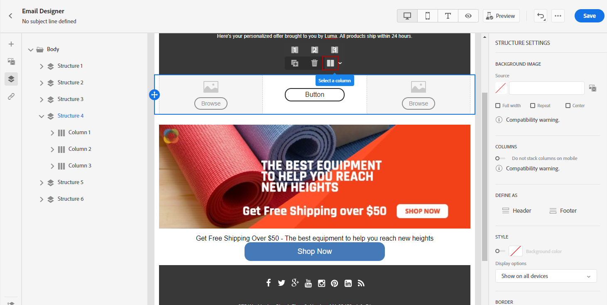
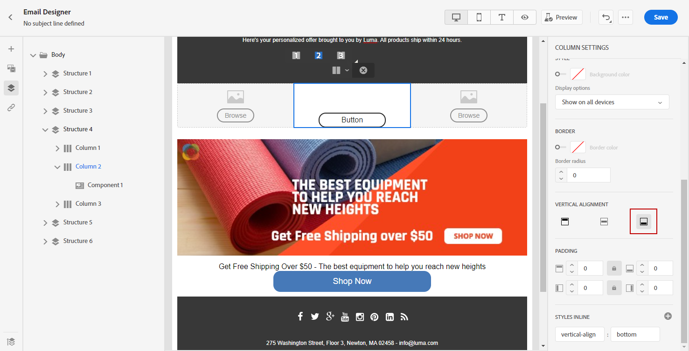
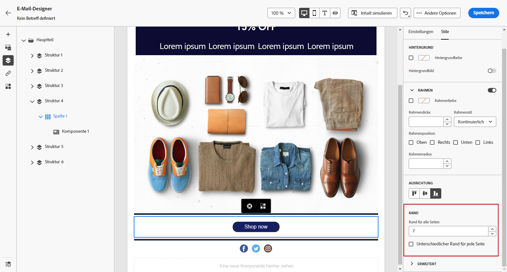

# Anpassen der vertikalen Ausrichtung und des Abstands {#alignment-and-padding}

>[!BEGINSHADEBOX]

**Auf dieser Seite** Erfahren Sie, wie Sie die senkrechte Ausrichtung und den Abstand von Spalten und Strukturen in der E-Mail-Designer anpassen, einschließlich der Behebung des restlichen Fragmentabstands für das korrekte Rendering auf Mobilgeräten.

>[!ENDSHADEBOX]

In diesem Beispiel passen wir den Abstand und die senkrechte Ausrichtung innerhalb einer Strukturkomponente an, die aus drei Spalten besteht.

1. Wählen Sie eine Strukturkomponente direkt in der E-Mail oder über den **[!UICONTROL Navigationsbaum]** im linken Menü aus.

1. Wählen Sie in der Symbolleiste mit der Option **[!UICONTROL Spalte auswählen]** die gewünschte Spalte aus. Sie können sie auch im Strukturbaum auswählen.

   Die bearbeitbaren Parameter für diese Spalte werden im Menü **[!UICONTROL Stile]** angezeigt.

   

1. Wählen Sie unter **[!UICONTROL Ausrichtung]** die Option **[!UICONTROL Oben]**, **[!UICONTROL Zentriert]** oder **[!UICONTROL Unten]** aus.

   

1. Legen Sie unter **[!UICONTROL Abstand]** den Abstand für alle Seiten fest.

   Wählen Sie **[!UICONTROL Unterschiedliche Abstände für jede Seite]** aus, wenn Sie eine Feinabstimmung für den Abstand vornehmen möchten. Klicken Sie auf das Sperrsymbol, um die Synchronisierung aufzuheben.

   

1. Gehen Sie analog mit den anderen Ausrichtungs- und Abstandseinstellungen der Spalten vor.

1. Speichern Sie Ihre Änderungen.

>[!TIP]
>
>Achten Sie beim Entwerfen von E-Mail-Inhalt für Gmail auf Android-Geräten darauf, dass für Bilder und Trennelemente Spaltenabstände und keine großen, festen Ränder verwendet werden. Gmail auf Android rendert übergroße Bilder und Ränder häufig falsch, was zu Layout-Überlauf oder reduzierten Trennlinien führt. Verwenden Sie eine kleinere Bildbreite oder spaltenbasierte Abstände, um eine konsistente Anzeige zu erreichen.

## Verwalten der Abstände von Fragmenten mit Breadcrumb-Navigation {#fragment-padding-breadcrumb}

Beim Arbeiten mit [Fragmenten](../content-management/fragments.md) im E-Mail-Designer kann es vorkommen, dass der ausgeblendete oder verbleibende Abstand das Rendering auf Mobilgeräten anders beeinflusst als auf dem Desktop. Dies geschieht besonders häufig, wenn Fragmente entsperrt wurden oder [die Vererbung unterbrochen wurde](use-visual-fragments.md#break-inheritance), da übrig gebliebene Formatierungen in den zugrunde liegenden Spalten- oder Textkomponenten verbleiben können.

So identifizieren und bearbeiten Sie verbleibende Abstände in Fragmenten:

1. Verwenden Sie den **[!UICONTROL Navigationsbaum]** oder klicken Sie direkt auf Elemente im Editor, um jede übergeordnete Struktur oder Spalte innerhalb Ihres Fragments auszuwählen. Auf diese Weise können Sie ausgeblendete Abstände oder Ränder finden, die speziell für Mobilgeräte gelten.

1. Nachdem Sie das Element im Breadcrumb ausgewählt haben, navigieren Sie auf der rechten Seite zur Registerkarte **[!UICONTROL Stile]**.

1. Überprüfen Sie die Einstellungen für **[!UICONTROL Abstände]** und entfernen Sie die Abstände nach Bedarf oder passen Sie sie an, um eine korrekte Ausrichtung auf Mobilgeräten zu erreichen.

1. Wenn bei der Wiederverwendung von Fragmenten weiterhin Ausrichtungsprobleme auftreten, wiederholen Sie diesen Vorgang für andere Spalten oder Textkomponenten innerhalb des Fragments.

>[!NOTE]
>
>Dieses Verhalten tritt in der Regel auf, wenn Fragmente wiederholt eingefügt und entfernt werden, da sich Stilregeln akkumulieren können. Überprüfen Sie die Abstandswerte immer mithilfe der Breadcrumb-Navigation, insbesondere für Mobilgeräte.