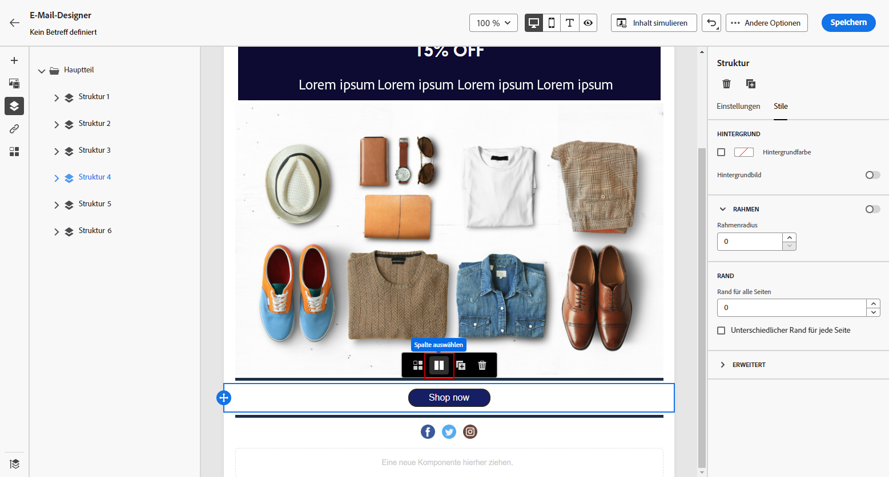

# Anpassen der vertikalen Ausrichtung und des Abstands {#alignment-and-padding}

In diesem Beispiel passen wir den Abstand und die senkrechte Ausrichtung innerhalb einer Strukturkomponente an, die aus drei Spalten besteht.

1. Wählen Sie die Strukturkomponente direkt in der E-Mail oder mithilfe der **[!UICONTROL Navigation tree]** im Menü links.

   

1. Klicken Sie in der Symbolleiste auf **[!UICONTROL Select a column]** und wählen Sie die, die Sie bearbeiten möchten. Sie können sie auch im Strukturbaum auswählen.

   Die bearbeitbaren Parameter für diese Spalte werden im **[!UICONTROL Column settings]** Menü.

   

1. under **[!UICONTROL Vertical alignment]** auswählen **[!UICONTROL Bottom]**.

   Die Inhaltskomponente wird an den unteren Rand der Spalte verschoben.

   

1. under **[!UICONTROL Padding]**, definieren Sie den oberen Abstand innerhalb der Spalte. Klicken Sie auf das Schlosssymbol, um die Synchronisation mit dem unteren Abstand aufzuheben.

   Definieren Sie den linken und rechten Abstand für diese Spalte.

   

1. Gehen Sie analog vor, um die Ausrichtung und den Abstand der anderen Spalten anzupassen.

1. Speichern Sie Ihre Änderungen.
