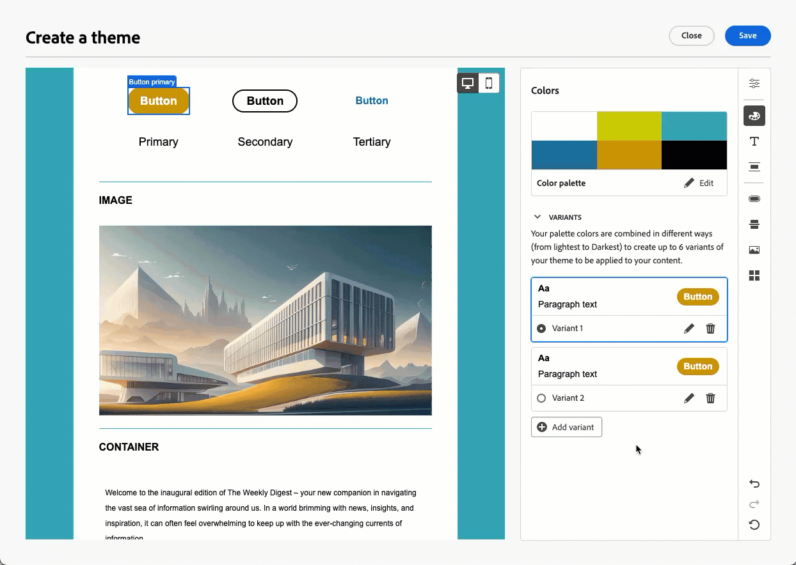

# Anwenden von Designs auf Ihren E-Mail-Inhalt {#apply-email-themes}

>[!CONTEXTUALHELP]
>id="ajo_use_theme"
>title="Anwenden eines Designs auf Ihre E-Mail"
>abstract="Wählen Sie ein Design für Ihre E-Mail aus, um schnell einen bestimmten Stil anzuwenden, der zu Ihrer Marke und Ihrem Design passt."

<!--This documentation provides a comprehensive guide to using themes to streamline your email creation process. With the ability to define reusable themes and leverage pre-designed modules, marketers can create professional, brand-aligned emails faster and with less effort.-->

>[!AVAILABILITY]
>
>Diese Funktion befindet sich derzeit in der Beta-Version und steht nur der Beta-Kundschaft zur Verfügung. Wenden Sie sich an den Adobe-Support, um am Beta-Programm teilzunehmen.

Mit Designs können technisch nicht versierte Benutzende wiederverwendbare Inhalte erstellen, die zu einer bestimmten Marke und Designsprache passen, indem sie zusätzlich zu den Standardvorlagen benutzerdefinierte Stile hinzufügen<!-- to achieve brand specific results-->.

Diese Funktion ermöglicht es Marketing-Fachleuten, visuell ansprechende, markenkonsistente E-Mails schneller und mit weniger Aufwand zu nutzen und gleichzeitig erweiterte Anpassungsoptionen für individuelle Design-Anforderungen bereitzustellen.

<!--What is the Enhanced Email Authoring Experience?

This feature introduces two key components to simplify and enhance email creation:

* **Theme Management System**: A centralized system for creating, customizing, and applying reusable themes to emails. Themes ensure consistent styling across campaigns and eliminate the need for repetitive manual styling.

* **Modules**: Pre-designed, reusable content blocks that abstract common email elements (e.g., titles, descriptions, images, and links). Modules are built using customizable low-level components, offering flexibility while maintaining design standards.

Key Benefits:

- **Consistency**: Ensure all emails align with your brand's design guidelines.
- **Efficiency**: Save time by reusing themes and modules across campaigns.
- **Customization**: Add custom CSS and mobile-specific styles for advanced designs.
- **Scalability**: Eliminate repetitive styling tasks, enabling faster email creation.-->

## Leitlinien und Einschränkungen {#themes-guardrails}

* Wenn Sie eine E-Mail von Grund auf neu erstellen, können Sie die Erstellung Ihres Inhalts mit einem Design beginnen, um schnell einen bestimmten Stil anzuwenden, der zu Ihrer Marke und Ihrem Design passt.

  Wenn Sie den Modus „Manuelle Formatierung“ wählen, können Sie keine Designs anwenden, es sei denn, Sie setzen Ihre E-Mail zurück.

* [Fragmente](../content-management/fragments.md) sind zwischen dem Modus „Designs verwenden“ und dem Modus „Manuelle Formatierung“ nicht kreuzkompatibel.

  Um ein Fragment in einem Inhalt verwenden zu können, auf den ein Design angewendet wird, muss dieses Fragment im Modus „Designs verwenden“ erstellt werden.

* Wenn Sie einen in HTML erstellten Inhalt verwenden, befinden Sie sich im [Kompatibilitätsmodus](existing-content.md) und können keine Designs auf diesen Inhalt anwenden.

  Um alle Funktionen von E-Mail-Designer, einschließlich Designs, vollständig nutzen zu können, müssen Sie entweder einen neuen Inhalt im Modus „Designs verwenden“ erstellen oder Ihren importierten HTML-Inhalt konvertieren. [Weitere Informationen](existing-content.md)

<!--If using a content created in Manual Styling mode or HTML, you cannot apply themes to this content. You must create a new content in Use Themes mode.

If you apply a theme to a content using a [fragment](../content-management/fragments.md) created in Manual Styling mode, the rendering may not be optimal.-->

## Erstellen eines Designs {#create-and-edit-themes}

Gehen Sie wie folgt vor, um ein Design zu definieren, das Sie in künftigen E-Mail-Inhalten nutzen können.

1. Erstellen Sie zunächst eine neue [Inhaltsvorlage](../content-management/create-content-templates.md).

1. Wählen Sie die Option **[!UICONTROL Designs erstellen oder bearbeiten]** aus.

   

1. Sie können entweder das Standarddesign auswählen oder eine Adobe- oder benutzerdefinierte Vorlage verwenden. Wählen Sie in diesem Beispiel das Standarddesign aus und klicken Sie auf **[!UICONTROL Erstellen]**.

   

1. Beginnen Sie auf der Registerkarte **[!UICONTROL Allgemeine Einstellungen]** mit der Definition Ihres Designs, indem Sie ihm einen bestimmten Namen für Ihre Marke geben. Sie können die Standardbreite für Ihre E-Mails anpassen und auch das aktuelle Design exportieren, um [es über Sandboxes hinweg freizugeben](../configuration/copy-objects-to-sandbox.md).

   <!---->

1. Verwenden Sie die Leiste auf der rechten Seite, um durch die verschiedenen Registerkarten zu navigieren und Ihre Designeinstellungen zu aktualisieren.

   

1. Führen Sie folgende Schritte auf der Registerkarte **[!UICONTROL Farben]** aus:

   * Verwenden Sie die Schaltfläche **[!UICONTROL Bearbeiten]**, um eine **[!UICONTROL Farbpalette]** mit Standardfarben für Ihre Marke einzurichten. Wählen Sie eine **[!UICONTROL Voreinstellung]** aus, um schnell ein Farbschema zu erstellen oder jede Farbe Ihres Designs individuell anzupassen. Sie können auch eine Kombination aus beidem verwenden.

     

   * Klicken Sie auf **[!UICONTROL Variante hinzufügen]**, um mehrere Farbvarianten zu erstellen, z. B. den hellen und dunklen Modus, wobei jede Variante über eine eigene Farbpalette und Steuerelemente für Nuancen verfügt.

     

   * Klicken Sie für jede Variante auf das Symbol „Bearbeiten“, um ein einzelnes Element zu bearbeiten. Sie können die von Ihnen erstellte Standardpalette oder beliebige benutzerdefinierte Farben verwenden.

     

1. In den **[!UICONTROL Texteinstellungen]** können Sie die globale Schriftart festlegen, die Sie für Ihr gesamtes Design verwenden möchten. Für eine detailliertere Steuerung können Sie auch jede Überschrift und jeden Absatztyp bearbeiten, um die Schriftart, die Größe, den Stil usw. anzupassen.

   

1. Wählen Sie auf der Registerkarte **[!UICONTROL Abstand]** ein einzelnes Element aus der Liste aus, um es mit dem richtigen Abstand zwischen den verschiedenen Komponenten einzufügen.

   <!---->

1. Mit den anderen Registerkarten auf der rechten Seite können Sie jedes Schaltflächenelement, jede Trennlinie, zusätzliche Bildformatierungen und den Abstand des Raster-Layouts für dieses Design separat verwalten.

   <!---->

1. Klicken Sie auf **[!UICONTROL Speichern]**, um dieses Design für die zukünftige Verwendung zu speichern.

## Anwenden von Designs auf eine E-Mail {#apply-themes}

Gehen Sie wie folgt vor, um standardmäßige oder benutzerdefinierte Stil-Designs auf eine E-Mail anzuwenden.

1. Fügen Sie in [!DNL Journey Optimizer] [eine E-Mail-](create-email.md)Aktion zu einer Journey oder Kampagne hinzu und [bearbeiten Sie Ihren E-Mail-Text](get-started-email-design.md#key-steps).

1. Sie können eine der folgenden Aktionen auswählen:

   * Wählen Sie eine integrierte [E-Mail-Vorlage](use-email-templates.md) aus, um E-Mail-Designer zu öffnen. Es wird automatisch ein für jede Vorlage spezifisches Standard-Design angewendet.

   * Entwerfen Sie einen [neuen Inhalt von Grund auf](content-from-scratch.md) und wählen Sie **[!UICONTROL Design]s verwenden**, um mit einem vordefinierten Stil-Design zu beginnen.

     

     >[!CAUTION]
     >
     >Wenn Sie den Modus „Manuelle Formatierung“ wählen, können Sie keine Designs anwenden, es sei denn, Sie setzen Ihre E-Mail zurück.
     >
     >Um ein [Fragment](../content-management/fragments.md) im Modus „Designs verwenden“ zu verwenden, muss dieses Fragment selbst im Modus „Designs verwenden“ erstellt worden sein.

1. Klicken Sie im E-Mail-Designer in der rechten Leiste auf die Schaltfläche **[!UICONTROL Designs]**. Es wird das Standard-Design oder das Design der Vorlage angezeigt. Sie können zwischen den beiden Farbvarianten für dieses Design wechseln.

   

1. Klicken Sie auf den Pfeil neben dem aktuell verwendeten Design. Die Liste der verfügbaren benutzerdefinierten und Adobe-Designs wird angezeigt.

   

1. Klicken Sie auf **[!UICONTROL Benutzerdefinierte Designs]** und wählen Sie das von Ihnen erstellte Design aus.

   

1. Klicken Sie auf einen Bereich außerhalb der Dropdown-Liste. Das neu ausgewählte benutzerdefinierte Design wendet seine Stile automatisch auf alle E-Mail-Komponenten an. Sie können zwischen den beiden Farbvarianten wechseln.

1. Wenn eine Komponente ausgewählt wird, können Sie ihren Stil immer noch über das entsprechende Symbol entsperren.

   

Sie können jederzeit zwischen Designs wechseln. Der E-Mail-Inhalt bleibt unverändert, aber die Stile werden aktualisiert, um das neue Design widerzuspiegeln.

<!--
>[!NOTE]
> - Themes apply styles globally. Ensure your theme is finalized before applying it to multiple emails.
> - Switching themes may override custom styles applied to individual components.

>[!CAUTION]
> - When using fragments, the email's theme will override the fragment's styles. A warning will be displayed in the editor if there is a conflict.

## Example Use Cases {#example-use-cases}

### 1. Creating a New Theme
- A marketer creates a theme with their brand's colors, fonts, and button styles.
- The theme is saved and reused across multiple email campaigns.

### 2. Switching Themes
- A marketer applies a holiday-themed design to an existing email by switching to a pre-designed holiday theme.-->
