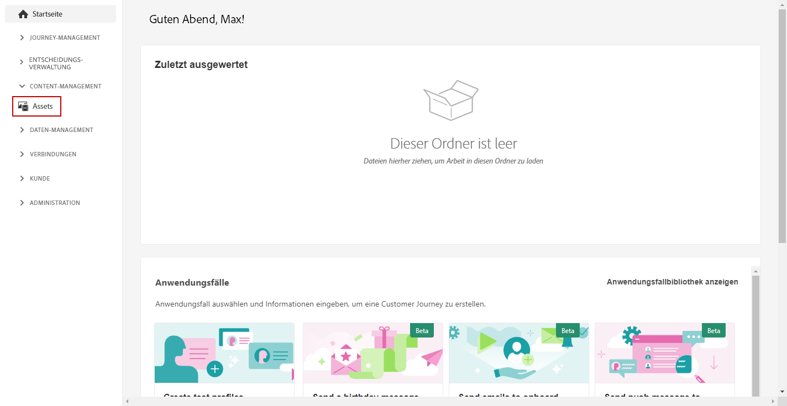
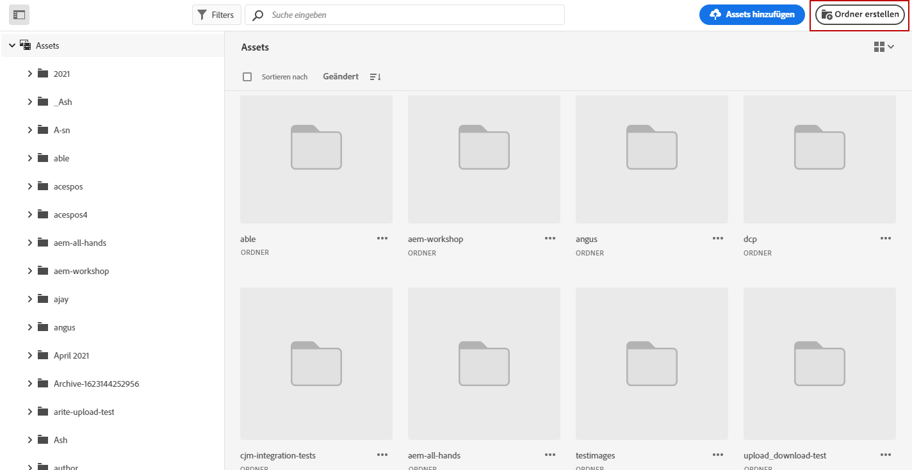
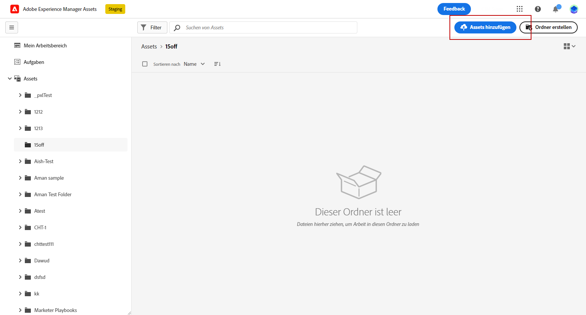
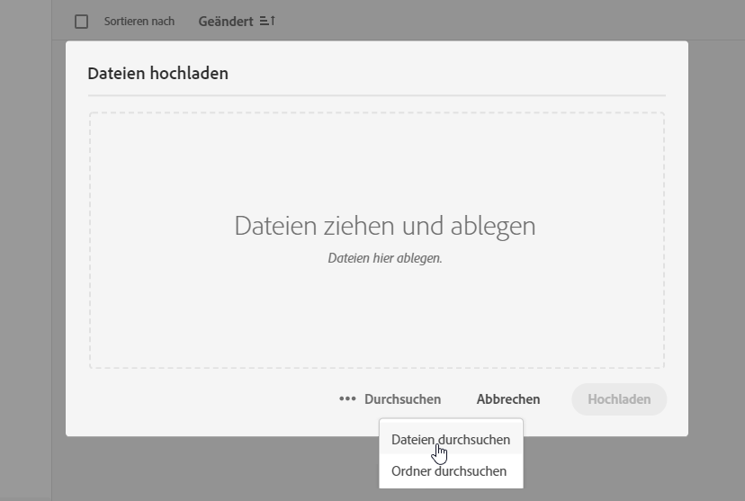
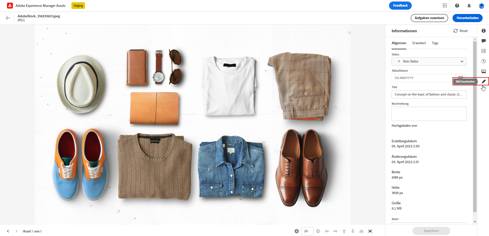
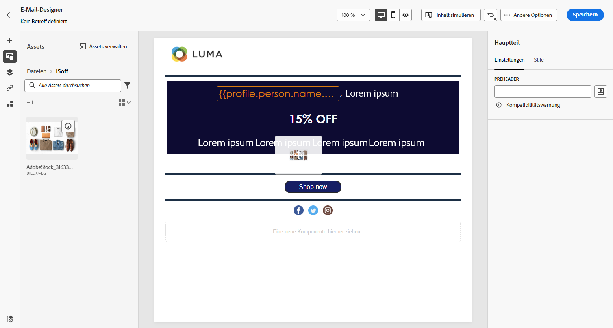
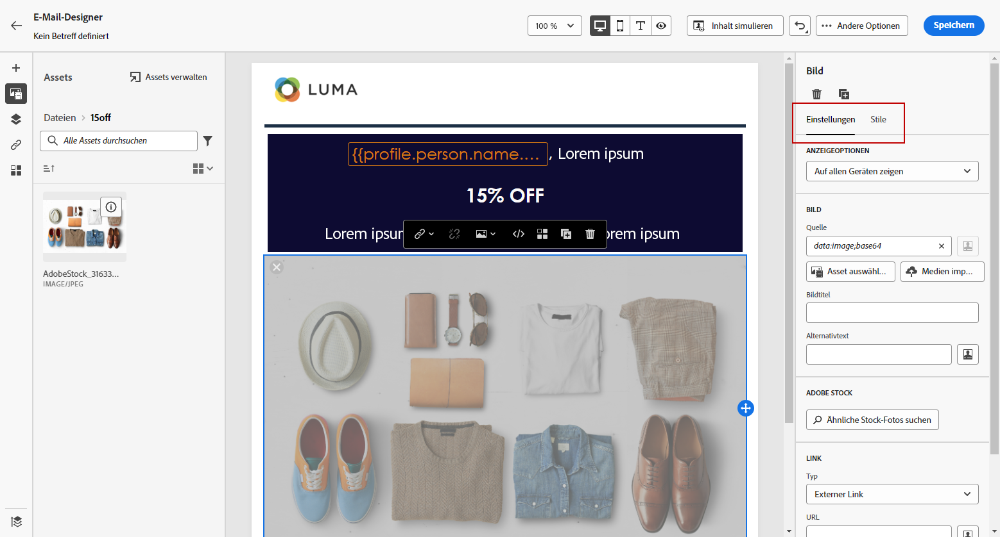

# Erstellen und Verwalten von Assets  durch [!DNL Assets Essentials]{#experience-manager-assets}

## Erste Schritte mit [!DNL Assets Essentials] {#get-started-assets-essentials}

Zusammenführen von Marketing- und Kreativ-Workflows mithilfe von [!DNL Adobe Experience Manager Assets Essentials]. Nutzen Sie [!DNL Assets Essentials], das nativ mit [!DNL Adobe Journey Optimizer] integriert ist, um digitale Assets zu speichern, zu verwalten, zu erkunden und weiterzugeben. Es bietet ein zentrales Repository für Assets, die Sie für Ihre Nachrichten verwenden können.

[!DNL Adobe Experience Manager Assets Essentials] ist ein kollaborativer und zentralisierter Asset-Arbeitsbereich, der Ihr Kreativsystem erweitert und digitale Assets für die Bereitstellung von Erlebnissen zusammenfasst. Sie können genehmigte Produktions-Assets einfach organisieren, markieren und suchen, um die Markenkonsistenz über alle Teams hinweg sicherzustellen. Das intuitive Benutzererlebnis ermöglicht Ihnen, sofort auf [!DNL Assets Essentials] zuzugreifen, um Assets in Ihren Adobe Creative- und Experience Cloud-Apps gemeinsam zu nutzen.

Weitere Informationen finden Sie in der [Dokumentation zu Adobe Experience Manager Assets Essentials](https://experienceleague.adobe.com/docs/experience-manager-assets-essentials/help/introduction.html?lang=de){target=&quot;_blank&quot;}.

[!DNL Adobe Experience Manager Assets Essentials] kann direkt von [!DNL Adobe Journey Optimizer] aus über den Abschnitt **[!UICONTROL Assets]** im linken Menü aufgerufen werden. Sie können auch auf Assets und Ordner zugreifen, während Sie [einen E-Mail-Inhalt entwerfen](get-started-email-design.md).

## Voraussetzungen{#assets-prerequisites}

Bevor Sie [!DNL Adobe Experience Manager Assets Essentials] verwenden können, müssen Sie Benutzer zu den Produktprofilen **Assets Essentials Consumer Users** oder/und **Assets Essentials Users** hinzufügen. Weitere Informationen finden Sie in der [Dokumentation zu Assets Essentials](https://experienceleague.adobe.com/docs/experience-manager-assets-essentials/help/deploy-administer.html?lang=de){target=&quot;_blank&quot;}.

>[!NOTE]
>Für Journey Optimizer-Produkte, die vor dem 6. Januar 2022 erworben wurden, müssen Sie [!DNL Adobe Experience Manager Assets Essentials] für Ihre Organisation bereitstellen. Weitere Informationen finden Sie im Abschnitt [Bereitstellen von Assets Essentials](https://experienceleague.adobe.com/docs/experience-manager-assets-essentials/help/deploy-administer.html?lang=de){target=&quot;_blank&quot;}.

## Hochladen und Hinzufügen von Assets{#add-asset}

Zum Importieren von Dateien in [!DNL Assets Essentials] müssen Sie zunächst den Ordner suchen oder erstellen, in dem sie gespeichert werden. Danach können Sie diese Dateien in Ihren E-Mail-Inhalt einfügen.

Weitere Informationen zum Hochladen von Assets finden Sie in der [Dokumentation zu Adobe Experience Manager Assets Essentials](https://experienceleague.adobe.com/docs/experience-manager-assets-essentials/help/add-delete.html?lang=de){target=&quot;_blank&quot;}.

1. Wählen Sie auf der [!DNL Adobe Journey Optimizer] Startseite unter dem Menü **[!UICONTROL Content-Management]** die Registerkarte **[!UICONTROL Assets]**, um auf [!DNL Assets Essentials] zuzugreifen.

   

1. Doppelklicken Sie im mittleren Bereich oder in der Baumansicht auf einen Ordner, um ihn zu öffnen.

   Sie können auch auf **[!UICONTROL Ordner erstellen]** klicken, um einen neuen Ordner zu erstellen.

   

1. Klicken Sie im ausgewählten oder erstellten Ordner auf **[!UICONTROL Assets hinzufügen]**, um ein neues Asset in Ihren Ordner hochzuladen.

   

1. Von **[!UICONTROL Dateien hochladen]** aus klicken Sie auf **[!UICONTROL Durchsuchen]** und wählen Sie aus, ob Sie **[!UICONTROL Dateien durchsuchen]** oder **[!UICONTROL Ordner durchsuchen]** möchten.

   

1. Wählen Sie die Datei aus, die Sie hochladen möchten. Wenn Sie fertig sind, klicken Sie auf **[!UICONTROL Hochladen]**.

   Weitere Informationen zum Verwalten von Assets finden Sie auf [dieser Seite](https://experienceleague.adobe.com/docs/experience-manager-assets-essentials/help/manage-organize.html?lang=de).

1. Nach dem Hochladen von Assets können Sie sie mithilfe vom E-Mail-Designer in eine Ihrer Nachrichten einfügen.

   Ihr Asset kann auch mit dem Modus **Bearbeiten** von [!DNL Assets Essentials] weiter bearbeitet werden. [Weitere Informationen](https://experienceleague.adobe.com/docs/experience-manager-assets-essentials/help/edit-images.html?lang=de){target=&quot;_blank&quot;}.

   

1. Wählen Sie in [!DNL Adobe Journey Optimizer] im linken Bereich von E-Mail-Designer die Option **[!UICONTROL Asset-Auswahl]**.

   

1. Wählen Sie Ihren **[!UICONTROL Assets]**-Ordner aus. Sie können auch in der Suchleiste nach Ihrem Asset oder Ordner suchen.

1. Ziehen Sie Ihr Asset in den E-Mail-Inhalt.

   

1. Sie können Ihre Assets weiter anpassen, z. B. indem Sie einen externen Link oder einen Text mit den **[!UICONTROL Komponenteneinstellungen]** hinzufügen. [Weitere Informationen zu Komponenteneinstellungen](content-components.md)

   

   <!--
    After adding your asset to your email, use the **[!UICONTROL Find similar Stock photos]** option to locate Stock photos that match the content, color, and composition of your image. [Learn more about Adobe Stock](stock.md).

    Note that this option is available for licensed/unlicensed Stock images and images from your Assets folder. 

    
    -->