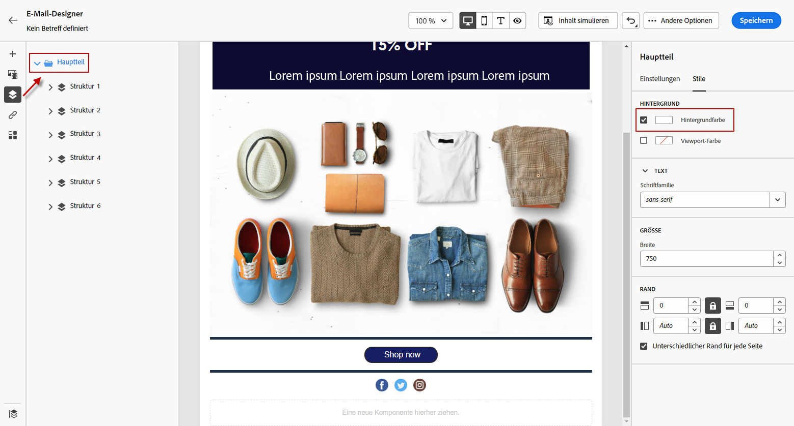
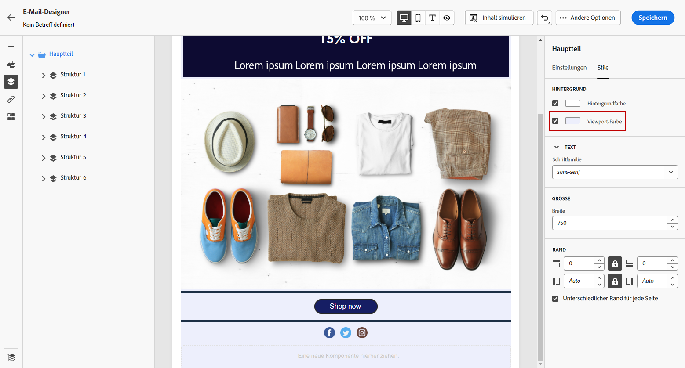
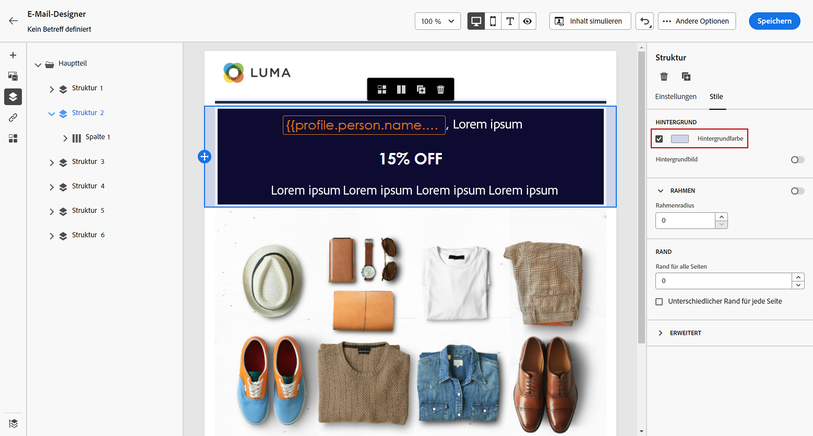
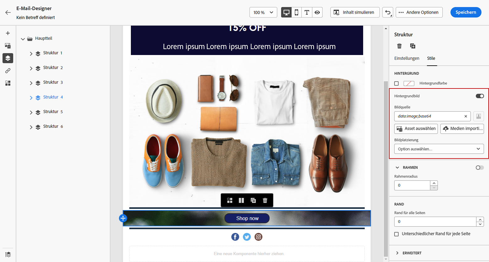
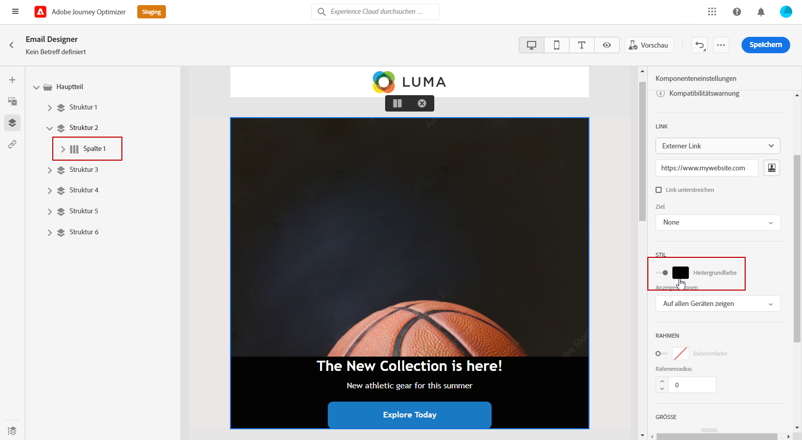

# E-Mail-Hintergrund personalisieren {#backgrounds}

>[!CONTEXTUALHELP]
>id="ac_edition_backgroundimage"
>title="Hintergrundeinstellungen"
>abstract="Sie können die Hintergrundfarbe oder das Hintergrundbild für Ihren Inhalt personalisieren. Beachten Sie, dass Hintergrundbilder nicht von allen E-Mail-Clients unterstützt werden."

Wenn es darum geht, mit Email Designer Hintergründe festzulegen, empfiehlt Adobe Folgendes:

1. Wenden Sie bei Bedarf eine Hintergrundfarbe auf den Text Ihrer E-Mail an.
1. Legen Sie für gewöhnlich Hintergrundfarben auf Spaltenebene fest.
1. Versuchen Sie, keine Hintergrundfarben für Bild- oder Textkomponenten zu verwenden, da diese schwer zu verwalten sind.

Im Folgenden finden Sie die verfügbaren Hintergrundeinstellungen, die Sie verwenden können.

* Legen Sie eine **[!UICONTROL Background color]** für die gesamte E-Mail. Wählen Sie in der linken Palette in der Navigationsstruktur die Einstellungen für den Hauptteil aus.

   

* Legen Sie dieselbe Hintergrundfarbe für alle Strukturkomponenten fest, indem Sie **[!UICONTROL Viewport background color]**. Mit dieser Option können Sie eine andere Einstellung als die Hintergrundfarbe auswählen.

   

* Legen Sie für jede Strukturkomponente eine andere Hintergrundfarbe fest. Wählen Sie in der linken Palette eine Struktur im Navigationsbaum aus, auf die Sie zugreifen können, um nur eine bestimmte Hintergrundfarbe auf diese Struktur anzuwenden.

   Achten Sie darauf, keine Viewport-Hintergrundfarbe festzulegen, da dadurch die Struktur-Hintergrundfarben ausgeblendet werden können.

   

* Legen Sie eine **[!UICONTROL Background image]** für den Inhalt einer Strukturkomponente.

   >[!NOTE]
   >
   >Einige E-Mail-Programme unterstützen keine Hintergrundbilder. Wenn diese Option nicht unterstützt wird, wird stattdessen die Zeilenhintergrundfarbe verwendet. Wählen Sie eine geeignete Fallback-Hintergrundfarbe aus, falls das Bild nicht angezeigt werden kann.

   

* Legen Sie eine Hintergrundfarbe auf Spaltenebene fest.

   >[!NOTE]
   >
   >Dies ist der häufigste Anwendungsfall. Adobe empfiehlt, Hintergrundfarben auf Spaltenebene festzulegen, da dies mehr Flexibilität bei der Bearbeitung des gesamten E-Mail-Inhalts ermöglicht.

   Sie können auch ein Hintergrundbild auf Spaltenebene festlegen, dies wird jedoch nur selten verwendet.

   
