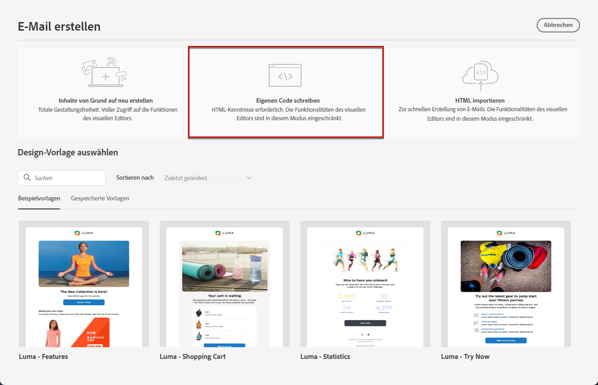
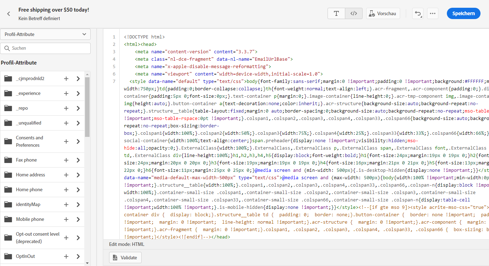
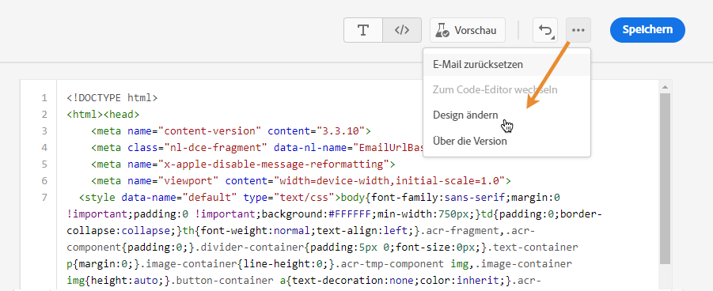
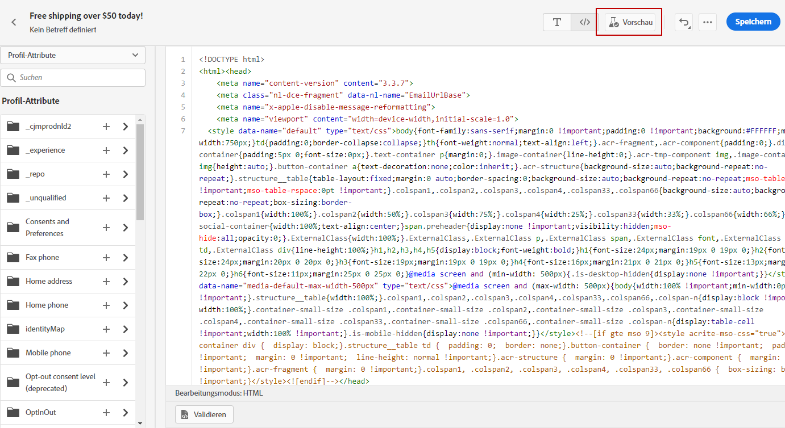

# Codieren Ihres eigenen Inhalts {#code-content}

**[!UICONTROL Eigenen Code schreiben]** ermöglicht das Schreiben oder Einfügen von unbearbeitetem HTML, um E-Mail-Inhalte direkt in die [!DNL Journey Optimizer] E-Mail-Designer zu erstellen. Verwenden Sie diesen Modus, wenn Sie Markup vollständig steuern oder vorhandene HTML importieren möchten.

Sie müssen über HTML-Kenntnisse verfügen. Sobald Sie diesen Modus ausgewählt haben, bleiben Sie im Code-Editor - Sie können nicht zum Visual Editor wechseln.

➡️ [Funktion im Video kennenlernen](#video)

>[!NOTE]
>
>**[!UICONTROL Eigenen Code erstellen]** ist nicht dasselbe wie der erweiterte HTML-Editor in Inhaltsvorlagen. Mit dem erweiterten HTML-Editor können Sie jederzeit zwischen der HTML-Ansicht und der visuellen (Desktop-)Ansicht wechseln - nicht zwischen dem Code-Editor. [Weitere Informationen zum erweiterten HTML-Editor](../content-management/email-template-expert-mode.md).

## Verwenden des Code-Editors {#use-code-editor}

Gehen Sie wie folgt vor, um E-Mail-Inhalte mit dem Code-Editor zu erstellen oder zu bearbeiten.

1. Wählen Sie auf der Startseite [E-Mail](get-started-email-design.md)Designer&quot; die Option **[!UICONTROL Eigenen Code schreiben]**.

   

1. Geben Sie Ihren HTML-Roh-Code ein oder fügen Sie ihn ein.

1. Verwenden Sie den linken Bereich, um die Personalisierungsfunktionen von [!DNL Journey Optimizer] anzuwenden. [Weitere Informationen](../personalization/personalize.md)

   

   >[!NOTE]
   >
   >Der Personalisierungseditor im E-Mail-Designer weist im Vergleich zu Journey-Ausdrücken einige Funktionseinschränkungen auf. [Weitere Informationen zu Funktionseinschränkungen für Datum/Uhrzeit](#date-time-limitations)

1. Wenn Sie den E-Mail-Designer öffnen möchten, um Ihre E-Mail von einem neuen Design aus zu beginnen, wählen Sie **[!UICONTROL Design ändern]** aus dem Optionen-Menü aus.

   

   >[!NOTE]
   >
   >Dadurch wird die ausgewählte Vorlage im E-Mail-Designer geöffnet. Dort können Sie entweder das Design Ihrer E-Mail abschließen oder mit der Option **[!UICONTROL Zum Code-Editor wechseln]** zurück zum Code-Editor gehen.

1. Klicken Sie auf die Schaltfläche **[!UICONTROL Vorschau]**, um den Nachrichtenentwurf und die Personalisierung mithilfe von Testprofilen zu überprüfen. [Weitere Informationen](../content-management/preview-test.md)

   

1. Wenn Ihr Code fertig ist, klicken Sie auf **[!UICONTROL Speichern]** und kehren Sie dann zurück zum Bildschirm „Nachrichtenerstellung“, um die Nachricht fertigzustellen.

   

>[!CAUTION]
>
>Bilder von [Adobe Experience Manager Assets](../integrations/assets.md) können nicht referenziert werden, wenn Sie die Methode Eigene codieren verwenden. Speichern Sie Bilder, auf die im HTML-Code verwiesen wird, an einem öffentlichen Speicherort.

## Funktionseinschränkungen für Datum und Uhrzeit {#date-time-limitations}

Bei Verwendung der Personalisierung im E-Mail-Designer-Code-Editor ist die Funktion `now()` für dynamische Datumsberechnungen nicht verfügbar.

>[!IMPORTANT]
>
>Die Funktion `now()` wird in der Ausdruckssprache des E-Mail-Builders **nicht unterstützt**. `now()` ist zwar in Journey-Bedingungen verfügbar, kann jedoch nicht in E-Mail-Inhalten oder im Code-Editor verwendet werden.

**Verfügbare Alternativen:**

Verwenden Sie die folgenden Funktionen, um mit dem aktuellen Datum und der aktuellen Uhrzeit in der E-Mail-Personalisierung zu arbeiten:

* **`getCurrentZonedDateTime()`** – Gibt das aktuelle Datum und die aktuelle Uhrzeit mit Zeitzoneninformationen zurück. Dies ist die empfohlene Alternative zu `now()`.

  Beispiel: `` gibt `2024-12-06T17:22:02.281067+05:30[Asia/Kolkata]` zurück

* **`currentTimeInMillis()`** – Gibt die aktuelle Zeit in Epoch-Millisekunden zurück.

  Beispiel: ``

**Empfohlene Problemumgehungen:**

Wenn Sie in Ihrem E-Mail-Inhalt Datumsberechnungen durchführen müssen:

* **Vorberechnen von Datumsfeldern** – Berechnen Sie die erforderlichen Datumswerte in Ihrer Daten-Pipeline oder in den Profilattributen, bevor Sie die E-Mail senden, und verweisen Sie dann in Ihrer Personalisierung auf diese vorberechneten Werte.

  Beispiel: ``

* **Verwenden von Funktionen zur Datumsbearbeitung** – Verwenden Sie [Datum/Zeit-Funktionen](../personalization/functions/dates.md) wie `dayOfYear()` oder `diffInDays()` mit Datumswerten aus Profilattributen.

  Beispiel: ``

* **Verwenden berechneter Attribute** – Erstellen Sie [berechnete Attribute](../audience/computed-attributes.md), die komplexe Datumsberechnungen durchführen und die Ergebnisse als Profilattribute verfügbar machen.

Unter [Datums- und Uhrzeitfunktionen](../personalization/functions/dates.md) finden Sie eine vollständige Liste der unterstützten Funktionen.
