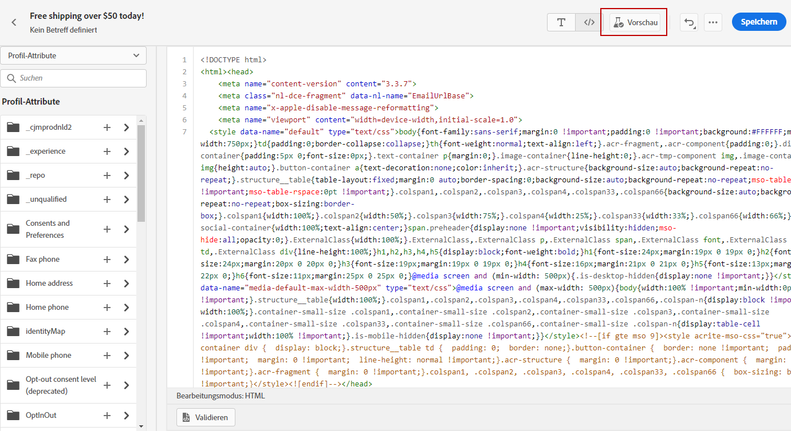

# Code Ihres eigenen Inhalts {#code-content}

Verwenden Sie die **[!UICONTROL Code your own]** -Modus, um rohen HTML-Code zu importieren und/oder Ihren E-Mail-Inhalt zu kodieren. Diese Methode erfordert HTML-Kenntnisse.

➡️ [Funktion im Video kennenlernen](#video)

>[!CAUTION]
>
> Bilder aus [Grundlagen zu Adobe Experience Manager Assets](assets-essentials.md) kann bei Verwendung dieser Methode nicht referenziert werden. Die in Ihrem HTML-Code referenzierten Bilder müssen an einem öffentlichen Speicherort gespeichert werden.

1. Wählen Sie auf der Startseite von Email Designer die Option **[!UICONTROL Code your own]**.

   

1. Geben Sie Ihren rohen HTML-Code ein oder fügen Sie ihn ein.

1. Verwenden Sie den linken Bereich, um [!DNL Journey Optimizer] Personalisierungsfunktionen. [Weitere Infos](../personalization/personalize.md)

   

1. Wenn Sie Email Designer öffnen möchten, um Ihre E-Mail von einem neuen Entwurf aus zu starten, wählen Sie **[!UICONTROL Change your design]** aus dem Menü &quot;Optionen&quot;aus.

   

1. Klicken Sie auf **[!UICONTROL Preview]** -Schaltfläche, um den Nachrichtenentwurf und die Personalisierung mithilfe von Testprofilen zu überprüfen. [Weitere Infos](preview.md)

   

1. Sobald Ihr Code fertig ist, klicken Sie auf **[!UICONTROL Save]** Gehen Sie dann zurück zum Bildschirm zur Nachrichtenerstellung , um die Nachricht abzuschließen.

   
