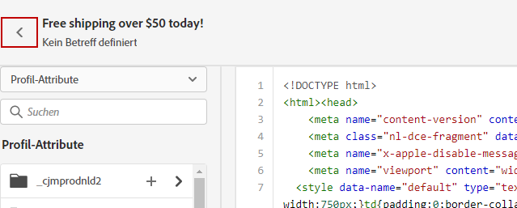

# Programmieren von eigenem Inhalt {#code-content}

Verwenden Sie den Modus **[!UICONTROL Eigenen Code schreiben]**, um Roh-HTML zu importieren und/oder Ihren E-Mail-Inhalt zu codieren. Diese Methode setzt HTML-Kenntnisse voraus.

➡️ [Entdecken Sie diese Funktion im Video](#video)

>[!CAUTION]
>
> Bilder von [Adobe Experience Manager Assets](../content-management/assets.md) können bei dieser Methode nicht referenziert werden. Die Bilder, auf die im HTML-Code verwiesen wird, müssen an einem öffentlichen Speicherort abrufbar sein.

1. Wählen Sie auf der Startseite des E-Mail-Designers die Option **[!UICONTROL Eigenen Code erstellen]**.

   

1. Geben Sie Ihren HTML-Roh-Code ein oder fügen Sie ihn ein.

1. Verwenden Sie den linken Bereich, um die Personalisierungsfunktionen von [!DNL Journey Optimizer] anzuwenden. [Weitere Informationen](../personalization/personalize.md)

   

1. Wenn Sie den E-Mail-Designer öffnen möchten, um Ihre E-Mail von einem neuen Design aus zu beginnen, wählen Sie **[!UICONTROL Design ändern]** aus dem Optionen-Menü aus.

   

   >[!NOTE]
   >
   >Dadurch wird die ausgewählte Vorlage im E-Mail-Designer geöffnet. Dort können Sie entweder das Design Ihrer E-Mail abschließen oder mit der Option **[!UICONTROL Zum Code-Editor wechseln]** zurück zum Code-Editor gehen.

1. Klicken Sie auf die Schaltfläche **[!UICONTROL Vorschau]**, um den Nachrichtenentwurf und die Personalisierung mithilfe von Testprofilen zu überprüfen. [Weitere Informationen](../content-management/preview-test.md)

   

1. Wenn Ihr Code fertig ist, klicken Sie auf **[!UICONTROL Speichern]** und kehren Sie dann zurück zum Bildschirm „Nachrichtenerstellung“, um die Nachricht fertigzustellen.

   
