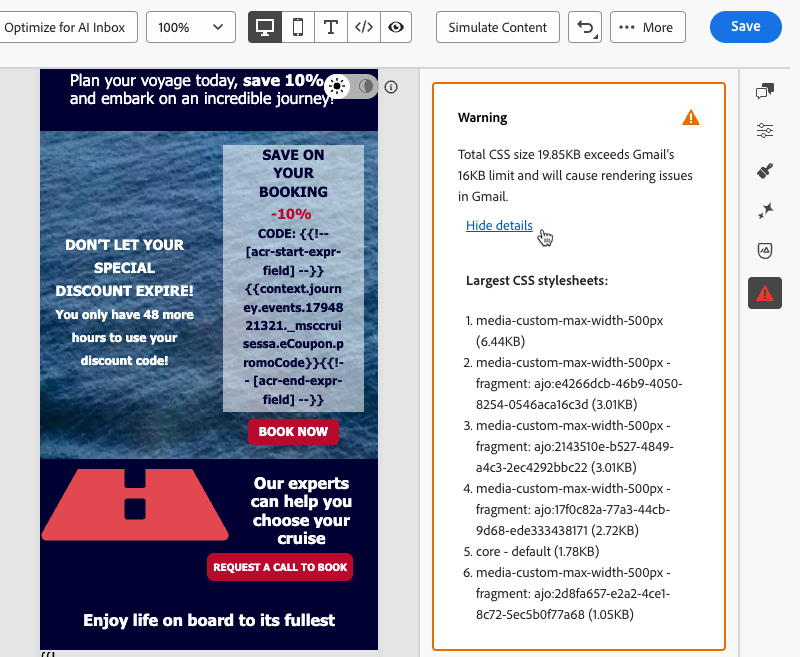

# Inhaltsprüfung in der E-Mail-Designer {#content-check}

>[!CONTEXTUALHELP]
>id="ajo_email_content_check"
>title="Validieren des E-Mail-Inhalts"
>abstract="Inhaltsprüfungen erkennen vor dem Versand automatisch HTML- und CSS-Probleme in Ihrer E-Mail. Sie kennzeichnen nicht unterstützte Tags, leere divS und Größenbeschränkungen, die das Rendering in Gmail oder Microsoft Outlook unterbrechen können. Probleme werden als Fehler, Warnungen oder informative Hinweise angezeigt, mit kontextuellen Details und Fehlerbehebungen mit einem Klick, sofern verfügbar."

[!DNL Journey Optimizer] umfasst eine automatisierte technische Validierung direkt in der E-Mail-Designer, mit der Sie HTML- und CSS-Probleme vor dem Versand erfassen können.

Ergebnisse werden als Fehler, Warnungen oder informative Hinweise im Authoring-Bedienfeld angezeigt, mit kontextuellen Details und Fehlerbehebungen mit einem Klick, sofern verfügbar, sodass Probleme gelöst werden können, ohne den E-Mail-Designer zu verlassen.

## Zugreifen auf Inhaltsprüfungen {#access-content-checks}

Inhaltsprüfungen sind in der E-Mail-Designer immer verfügbar. Um sie anzuzeigen, klicken Sie auf das Symbol Probleme in der rechten Leiste, um den Bereich **[!UICONTROL Inhaltsprüfung]** zu öffnen. Alle erkannten Probleme werden dort aufgelistet.

>[!NOTE]
>
>Prüfungen werden automatisch für den aktuellen Status Ihrer E-Mail und nach jeder Bearbeitung ausgeführt. [Weitere Informationen](#recalculation)

Prüfungen werden mit drei Schweregraden angezeigt:

| Schweregrad | Farbe | Beschreibung |
|---|---|---|
| **Fehler** | Rot | Ein kritisches Problem, das zu Versand- oder Rendering-Fehlern führt. Vor dem Senden auflösen. |
| **Warnung** | Orange | Ein potenzielles Problem, das sich auf das Rendering in bestimmten E-Mail-Clients auswirken kann. Wird zur Überprüfung und Lösung empfohlen. |
| **Info** | Blau | Hinweis zu einer Bedingung, die den Versand nicht blockiert, aber die langfristige Wartbarkeit Ihres Inhalts beeinträchtigen kann. |

Wenn keine Probleme erkannt werden, wird im Fenster **Keine Probleme erkannt** angezeigt und das entsprechende Symbol ist grün.

Je nach Problem können Sie mehr Kontext anzeigen, eine Fehlerbehebung mit einem Klick anwenden oder Ihre E-Mail speichern, um ein Prüfergebnis zu aktualisieren.

* Klicken Sie bei einem festgestellten Problem auf die Schaltfläche **[!UICONTROL Details anzeigen]**, um mehr Kontext anzuzeigen. Klicken Sie auf **[!UICONTROL Details ausblenden]**, um sie zu reduzieren.
  {width="80%"}
* Ebenso können Sie auf die Schaltfläche **[!UICONTROL Fehlerbehebung anzeigen]** klicken und eine Fehlerbehebung mit einem Klick anwenden, sofern verfügbar. Wenn die Fehlerbehebung nicht automatisch angewendet werden kann, wird eine Meldung angezeigt, und Sie müssen das Problem manuell beheben.
  {width="80%"}

### Neuberechnung der Schecks {#recalculation}

Die meisten Prüfungen - z. B. nicht unterstützte HTML-Elemente, leere DivS und die HTML-Größe - werden bei jeder Bearbeitung Ihrer E-Mail neu berechnet, sodass sie immer Ihren aktuellen Inhalt widerspiegeln.

Andere Prüfungen, wie die CSS-Größe, werden aus dem serialisierten Inhalt - der Version Ihrer E-Mail, wie sie geladen oder gespeichert wird - berechnet, nicht aus dem Live-Bearbeitungsstatus in der E-Mail-Designer. In diesem Fall kann sich der gespeicherte Inhalt geringfügig von dem unterscheiden, was Sie beim Bearbeiten sehen. Wenn Sie Änderungen ohne Speichern vornehmen, wird ein **[!UICONTROL Veraltungsprüfung]**-Etikett angezeigt, das anzeigt, dass das Ergebnis möglicherweise nicht mehr korrekt ist. Speichern Sie Ihre E-Mail, um die Berechnung zu aktualisieren.

{width="100%"}

## Beheben erkannter Probleme {#fix-issues}

In den folgenden Tabellen sind alle möglichen Nachrichten und die jeweils empfohlene Aktion aufgeführt. Erweitern Sie die Kategorie, die der Nachricht entspricht, die Sie im Bereich **[!UICONTROL Inhaltsprüfung]** sehen.

+++ Nicht unterstützte HTML-Elemente

| Nachricht | Schweregrad | Vorgehensweise |
|---|---|---|
| Ihr Inhalt enthält ein `<script>`-Tag, das in keinem E-Mail-System unterstützt wird. Entfernen Sie sie, um Versand- und Rendering-Probleme zu vermeiden. | Fehler | Suchen Sie alle Tags `<script>` HTML-Inhalten und entfernen Sie sie. |
| Ihr Inhalt enthält ein `<base>`-Tag, das zu Problemen bei der Link- und Ressourcenauflösung in der E-Mail-Designer führen kann. Um das Problem zu beheben, müssen Sie es entfernen. | Fehler | Entfernen Sie das `<base>`-Tag aus Ihrer HTML. |
| Ihr Inhalt enthält ein HTML-Meta-Tag mit Aktualisierung, das in der E-Mail-Designer nicht unterstützt wird. Entfernen Sie sie, um unerwartetes Verhalten zu verhindern. | Warnung | Entfernen Sie das Meta-Aktualisierungs-Tag aus Ihrer HTML. |
| Ihr Inhalt enthält leere DIV-Dateien, was zu Layout-Problemen in Microsoft Outlook (MSO) führen kann. Um dies zu beheben, entfernen Sie die leeren div-Elemente und verwenden Sie stattdessen den Abstand von gleichrangigen Elementen. | Warnung | Löschen Sie die leeren `
` und passen Sie den Abstand oder Rand auf den umgebenden Elementen an, um den Abstand beizubehalten. |

+++

+++ CSS-Probleme

| Nachricht | Schweregrad | Vorgehensweise |
|---|---|---|
| Die CSS-Gesamtgröße überschreitet die Beschränkung von Gmail auf 16 KB und führt zu Rendering-Problemen in Gmail. | Fehler | Verwenden Sie **[!UICONTROL Korrektur anwenden]** um nicht verwendete CSS-Regeln automatisch zu entfernen oder Ihre Stile manuell zu vereinfachen. |
| Die CSS-Gesamtgröße liegt nahe an der Beschränkung von 16 KB von Gmail und kann Rendering-Probleme verursachen, wenn mehr CSS hinzugefügt wird. | Warnung | Verwenden Sie **[!UICONTROL Fehlerbehebung anwenden]** um nicht verwendete CSS-Regeln zu entfernen oder Stile zu reduzieren, bevor Sie weitere Inhalte hinzufügen. |
| Die CSS-Gesamtgröße für dieses Fragment überschreitet 3 KB. Wenn Sie dies mit anderen Fragmenten kombinieren, kann dies dazu führen, dass die gesamte E-Mail-CSS das Limit von Gmail von 16 KB überschreitet, und Rendering-Probleme verursachen. | Warnung | Vereinfachen Sie das CSS in diesem Fragment, um das kombinierte E-Mail-CSS unter 16 KB zu halten. |
| Inhalt enthält nicht verwendete CSS-Regeln. Dies kann zu Rendering-Problemen in Gmail führen. | Warnung | Verwenden Sie **[!UICONTROL Fehlerbehebung anwenden]** um automatisch CSS-Regeln zu entfernen, die auf Elemente verweisen, die nicht mehr in der E-Mail vorhanden sind. |

<!--
| Message | Severity | What to do |
|---|---|---|
| Your content has modifications to the system-generated default CSS. These changes may be overridden by future Email Designer updates. To preserve your styles, add them using the Custom CSS feature instead. | Info | Move your custom styles to [Custom CSS](custom-css.md) to ensure they are preserved across Email Designer updates. |
-->

+++

+++ HTML-Größe

| Nachricht | Schweregrad | Vorgehensweise |
|---|---|---|
| Die geschätzte Größe von HTML überschreitet das von Gmail festgelegte Limit von 100 KB und führt zu Rendering-Problemen in Gmail. Die tatsächliche HTML-Größe kann zum Versandzeitpunkt unterschiedlich sein. | Fehler | E-Mail-Inhalte reduzieren - Entfernen Sie unnötige Elemente, vereinfachen Sie die Struktur oder teilen Sie Inhalte auf mehrere Sendungen auf. |
| Die geschätzte Größe von HTML liegt nahe am Gmail-Limit von 100 KB und kann Rendering-Probleme verursachen, wenn weitere HTML hinzugefügt werden. Die tatsächliche HTML-Größe kann zum Versandzeitpunkt unterschiedlich sein. | Warnung | Vereinfachen Sie Inhalte, bevor Sie weitere hinzufügen. E-Mails, die das Gmail-Limit überschreiten, werden für Empfänger abgeschnitten. |
| Die geschätzte Größe des HTML für dieses Fragment überschreitet 20 KB. Wenn Sie dies mit anderen Fragmenten kombinieren, kann dies dazu führen, dass die Gesamtzahl der E-Mail-HTML das 100-KB-Limit von Gmail überschreitet, was zu Rendering-Problemen führen kann. Die tatsächliche HTML-Größe kann zum Versandzeitpunkt unterschiedlich sein. | Warnung | Verringern Sie die HTML in diesem Fragment, um die kombinierte E-Mail-Größe unter dem 100-KB-Limit von Gmail zu halten. |

+++

## Über HTML und die CSS-Größe {#size-estimation}

Die Werte für die HTML- und CSS-Größe **Schätzungen werden zum Zeitpunkt der Erstellung berechnet** und können von der tatsächlichen Empfängergröße abweichen, z. B. wenn Ihre E-Mail bedingte Blöcke verwendet (nur eine Verzweigung pro Empfänger wird gerendert) oder wenn die HTML-Minimierung zum Zeitpunkt des Versands aktiviert ist.

Größenwarnungen sind proaktive Signale, die Ihnen helfen, Inhalte vor dem Versand zu optimieren, und keine harten Blöcke.
